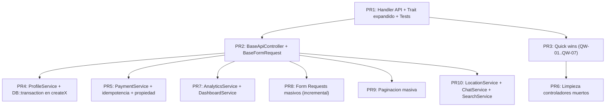

# Auditoría — Adherencia a `zonix-api-patterns` (Backend)

**Fecha:** 1 de mayo de 2026
**Alcance:** 63 controladores HTTP API REST en `app/Http/Controllers/**` (excluye `Auth/xxx/*`, `Auth/*` legacy y `Web/*`).
**Skill auditada:** [`.agents/skills/zonix-api-patterns/SKILL.md`](.agents/skills/zonix-api-patterns/SKILL.md) v2.0.
**Metodología:** 5 subagentes en paralelo (1 por bucket) auditaron cada controlador contra un checklist de 12 criterios derivados de la skill. Hallazgos con evidencia (`archivo:línea`), severidad P0–P3 y recomendación accionable.

---

## 1. Veredicto ejecutivo (CTO)

- **Semáforo global: ROJO.** La deuda contra `zonix-api-patterns` es **sistémica, no puntual**: el formato `{ success, message, data }` se cumple en ~33% de las respuestas, y el resto de criterios cae más bajo aún.
- **15 hallazgos P0** distribuidos en los 5 buckets. El patrón más grave y repetido es **exposición cruda de `$e->getMessage()`** al cliente (regla 6 de la skill, §10): aparece como mínimo en `Privacy`, `Activity`, `AccountDeletion`, `Export`, `Commerce/Order`, `Commerce/Product`, `Commerce/Analytics`, `Commerce/Dashboard`, `Admin/Report`, `Authenticator/Auth`, `Notification`, `Payment`, `PaymentMethod`, `Analytics` global. Riesgo: filtración de stack/SQL/paths a clientes Flutter, scrapers o atacantes.
- **Riesgo de seguridad por verificación de propiedad débil**: `Buyer/Review.reportReview` (cualquier buyer puede reportar reseñas ajenas), `Payment.processPayment` (no valida que `payment_method_id` pertenezca al pagador, sin idempotencia), `CommerceDataController.resolveCommerce` (fallback silencioso al comercio principal cuando el `commerce_id` solicitado no pertenece al usuario).
- **Riesgo de inconsistencia de datos**: `Profiles/ProfileController` crea `Profile + DeliveryAgent/Commerce/DeliveryCompany` sin `DB::transaction()`. Fallo a mitad → registros huérfanos. Mismo patrón en `DeliveryCompany/CompanyController.storeAgent`, `Buyer/Prescription.destroy`, varios `acceptOrder`/`rejectOrder` de delivery.
- **Código muerto duplicado y peligroso**: `Delivery/OrderController` (no enrutado pero con `acceptOrder`/`updateStatus` saltándose `OrderStateMachineService`), `ChatController` raíz (deprecado, autodocumentado), `WebSocketController` (legado Eats — Pharma usa Pusher+FCM), `HomeController` raíz (web tradicional, no API). Si alguien los reactiva sin querer, abren caminos paralelos sin reglas.
- **Existe `app/Http/Traits/ApiResponse.php`** pero la mayoría de controladores no lo usa. Es el atajo más rentable para alinear C1, C2 y C11 de un solo golpe.
- **Buena base donde sí se aplica**: `Pharmacist/PrescriptionController` cumple verificación de propiedad (C7) sólidamente; `Authenticator/AuthController` invalida tokens en logout y rutas auth tienen `throttle:auth`; `Admin/DisputeController` y `Admin/DeliveryZoneController` tienen los scores más altos (~9/12).
- **Recomendación de cabecera**: bloquear nuevos PRs que introduzcan `$e->getMessage()` en respuestas y exigir adopción del trait `ApiResponse`. Abrir refactor en olas pequeñas (PRs mergeables) en el orden propuesto en §7.

---

## 2. Métricas globales

### 2.1 Adherencia macro (datos de pre-read con grep)

| Indicador | Valor |
| --------- | ----- |
| Controladores auditados | **63** |
| `response()->json(` totales | ~575 ocurrencias |
| Respuestas con `success: true/false` | ~190 (~**33%**) |
| Controladores que importan `App\Http\Requests\*` | **9 de 63** (~14%) |
| Usos de `$request->validate()` inline | ~133 ocurrencias en 41 controladores |
| Listados con `->paginate()` | **9 archivos** |
| Listados con `->get()` o `->all()` (potencial sin paginar) | ~94 ocurrencias en 41 archivos |
| Usos de `DB::transaction(` | **8 archivos** |
| Usos de `try/catch` con `\Log::error` | ~34 archivos (no todos completos) |

### 2.2 Top 5 controladores con peor score

| # | Controlador | Score |
| - | ----------- | ----- |
| 1 | `Commerce/AnalyticsController.php` | 2/12 |
| 2 | `Commerce/DashboardController.php` | 2/12 |
| 3 | `ChatController.php` (raíz, deprecado) | 2/7 aplicables |
| 4 | `Commerce/ProductController.php` | 3/12 |
| 5 | `LocationController.php` | 3/11 aplicables |

### 2.3 Top 5 controladores con mejor score

| # | Controlador | Score |
| - | ----------- | ----- |
| 1 | `Admin/DeliveryZoneController.php` | 9/11 aplicables |
| 2 | `Admin/DisputeController.php` | 9/12 |
| 3 | `Buyer/OrderTrackingController.php` | 89% |
| 4 | `Admin/DeliveryCompanyController.php`, `Admin/CommerceController.php`, `Admin/DeliverySettingsController.php`, `Delivery/DeliveryController.php`, `DeliveryCompany/CompanyController.php` | 8/12 |
| 5 | `Buyer/RestaurantController.php`, `Buyer/PharmacyController.php` | 78% |

### 2.4 Distribución de hallazgos por severidad

| Severidad | Cantidad estimada |
| --------- | ----------------- |
| P0 | **15** |
| P1 | **42** |
| P2 | **35** |
| P3 | **18** |

---

## 3. Matriz global de adherencia (63 × 12)

Leyenda: `OK` = cumple · `FT` = falta · `PA` = parcial · `NA` = no aplica · `Score` = % de OK sobre criterios aplicables.

Criterios:
**C1** Response `{success,message,data}` · **C2** Códigos HTTP · **C3** Paginación `per_page=15` · **C4** Form Request · **C5** Lógica en Service · **C6** Eager loading · **C7** Verificación propiedad · **C8** auth+role middleware · **C9** try/catch+Log::error · **C10** DB::transaction · **C11** No exponer `$e->getMessage()` · **C12** Throttling

### Bucket A — Buyer (24)

| Controlador | C1 | C2 | C3 | C4 | C5 | C6 | C7 | C8 | C9 | C10 | C11 | C12 | Score |
|-------------|----|----|----|----|----|----|----|----|----|-----|-----|-----|-------|
| `Buyer/SearchController` | OK | OK | FT | FT | FT | OK | NA | OK | OK | NA | OK | NA | 60% |
| `Buyer/OrderController` | OK | OK | OK | FT | FT | OK | OK | OK | OK | OK | OK | FT | 73% |
| `Buyer/PrescriptionController` | OK | OK | FT | OK | OK | OK | OK | OK | FT | FT | OK | OK | 73% |
| `Buyer/RestaurantController` | OK | OK | OK | NA | OK | OK | NA | OK | FT | NA | OK | NA | 78% |
| `Buyer/PharmacyController` | OK | OK | OK | NA | OK | OK | NA | OK | FT | NA | OK | NA | 78% |
| `Buyer/PrivacyController` | OK | OK | NA | FT | FT | NA | NA | OK | FT | NA | FT | NA | 38% |
| `Buyer/PostLikeController` | FT | OK | NA | FT | OK | NA | NA | NA | FT | NA | OK | NA | 29% |
| `Buyer/OrderTrackingController` | OK | OK | NA | NA | FT | OK | OK | OK | OK | NA | OK | NA | 89% |
| `Buyer/PostController` | FT | FT | FT | NA | OK | NA | NA | OK | FT | NA | OK | NA | 38% |
| `Buyer/BuyerProfileController` | FT | FT | NA | FT | FT | OK | OK | OK | FT | NA | OK | NA | 38% |
| `Buyer/TrackingController` | FT | FT | NA | FT | FT | OK | OK | OK | FT | NA | OK | NA | 38% |
| `Buyer/PaymentController` | OK | OK | FT | FT | FT | OK | OK | OK | OK | FT | OK | OK | 64% |
| `Buyer/ActivityController` | OK | OK | FT | FT | FT | NA | NA | OK | FT | NA | FT | NA | 38% |
| `Buyer/AddressController` | OK | OK | FT | FT | FT | OK | OK | OK | OK | FT | OK | NA | 55% |
| `Buyer/LoyaltyController` | FT | OK | FT | FT | FT | OK | OK | OK | FT | NA | OK | NA | 38% |
| `Buyer/ReviewController` | OK | FT | FT | FT | FT | OK | FT | OK | OK | FT | OK | NA | 45% |
| `Buyer/AccountDeletionController` | OK | OK | NA | FT | FT | NA | OK | OK | FT | OK | FT | FT | 45% |
| `Buyer/ExportController` | FT | OK | FT | FT | FT | OK | OK | OK | FT | FT | FT | NA | 27% |
| `Buyer/PromotionController` | OK | OK | FT | FT | FT | OK | OK | OK | OK | FT | OK | NA | 45% |
| `Buyer/ChatController` | OK | OK | NA | FT | FT | OK | OK | OK | OK | FT | OK | NA | 55% |
| `Buyer/ProductController` | OK | OK | FT | FT | OK | OK | NA | OK | FT | NA | OK | NA | 64% |
| `Buyer/DisputeController` | OK | OK | OK | FT | FT | OK | OK | OK | FT | FT | OK | NA | 55% |
| `Buyer/CartController` | OK | OK | NA | FT | OK | NA | NA | OK | FT | NA | FT | NA | 55% |
| `Buyer/GamificationController` | FT | OK | FT | FT | FT | FT | OK | OK | FT | FT | OK | NA | 27% |

### Bucket B — Commerce + Pharmacist (11)

| Controlador | C1 | C2 | C3 | C4 | C5 | C6 | C7 | C8 | C9 | C10 | C11 | C12 | Score |
|-------------|----|----|----|----|----|----|----|----|----|-----|-----|-----|-------|
| `Commerce/CommercePromotionController` | FT | FT | FT | FT | FT | OK | OK | OK | FT | NA | OK | FT | 5/12 |
| `Commerce/CommercePostController` | OK | OK | FT | NA | OK | OK | OK | OK | FT | NA | OK | FT | 8/12 |
| `Commerce/CommerceListController` | OK | OK | FT | FT | FT | OK | OK | OK | FT | OK | OK | FT | 6/12 |
| `Commerce/OrderController` | FT | FT | OK | FT | FT | OK | OK | OK | PA | OK | FT | FT | 4/12 |
| `Commerce/CommerceDataController` | OK | OK | NA | FT | FT | OK | FT | OK | FT | NA | OK | FT | 5/12 |
| `Commerce/DashboardController` | FT | FT | NA | NA | FT | OK | FT | OK | FT | NA | FT | FT | 2/12 |
| `Commerce/ProductController` | FT | PA | OK | OK | FT | OK | FT | OK | FT | NA | FT | FT | 3/12 |
| `Commerce/AnalyticsController` | FT | FT | NA | NA | FT | OK | FT | OK | FT | NA | FT | FT | 2/12 |
| `Pharmacist/PrescriptionController` | OK | OK | FT | OK | OK | PA | OK | OK | PA | NA | OK | FT | 7/12 |
| `Pharmacist/OnboardingController` | OK | FT | NA | OK | FT | NA | OK | OK | FT | NA | OK | FT | 6/12 |
| `Pharmacist/DashboardController` | OK | OK | NA | NA | FT | NA | OK | OK | FT | NA | OK | FT | 6/12 |

### Bucket C — Delivery + DeliveryCompany + Admin (11)

| Controlador | C1 | C2 | C3 | C4 | C5 | C6 | C7 | C8 | C9 | C10 | C11 | C12 | Score |
|-------------|----|----|----|----|----|----|----|----|----|-----|-----|-----|-------|
| `Delivery/DeliveryController` | OK | FT | OK | FT | FT | OK | OK | OK | OK | FT | OK | OK | 8/12 |
| `Delivery/OrderController` (muerto) | OK | FT | FT | FT | FT | OK | OK | NA | OK | FT | OK | OK | 5/12 |
| `DeliveryCompany/CompanyController` | OK | OK | FT | FT | FT | OK | OK | OK | OK | OK | OK | OK | 8/12 |
| `Admin/AdminOrderController` | FT | OK | FT | FT | OK | OK | OK | OK | FT | NA | OK | OK | 7/11 |
| `Admin/ReportController` | FT | OK | OK | FT | FT | OK | OK | OK | FT | NA | FT | OK | 5/11 |
| `Admin/DeliveryCompanyController` | OK | OK | FT | NA | OK | OK | OK | OK | FT | NA | OK | OK | 8/10 |
| `Admin/CommerceController` | OK | OK | OK | FT | OK | OK | OK | OK | FT | NA | OK | OK | 8/11 |
| `Admin/DeliveryZoneController` | OK | OK | OK | FT | OK | OK | OK | OK | FT | NA | OK | OK | 9/11 |
| `Admin/UserController` | FT | OK | OK | FT | OK | OK | OK | OK | FT | NA | OK | OK | 7/11 |
| `Admin/DeliverySettingsController` | OK | OK | NA | FT | OK | OK | OK | OK | FT | NA | OK | OK | 8/10 |
| `Admin/DisputeController` | OK | OK | OK | FT | FT | OK | OK | OK | OK | OK | OK | OK | 9/12 |

### Bucket D — Profiles + Auth + Notification + Chat (8)

| Controlador | C1 | C2 | C3 | C4 | C5 | C6 | C7 | C8 | C9 | C10 | C11 | C12 | Score |
|-------------|----|----|----|----|----|----|----|----|----|-----|-----|-----|-------|
| `Profiles/ProfileController` | OK | FT | FT | FT | FT | OK | OK | OK | FT | FT | OK | NA | 5/11 |
| `Profiles/DocumentController` | FT | FT | FT | FT | FT | OK | OK | OK | FT | NA | OK | NA | 4/10 |
| `Profiles/AddressController` | OK | FT | FT | FT | FT | OK | OK | OK | FT | NA | OK | NA | 5/10 |
| `Profiles/PhoneController` | FT | OK | FT | OK | FT | OK | OK | OK | FT | NA | OK | NA | 6/10 |
| `Authenticator/AuthController` | FT | OK | NA | FT | FT | OK | OK | OK | FT | NA | FT | OK | 5/10 |
| `Notification/NotificationController` | FT | FT | FT | FT | FT | OK | OK | OK | OK | NA | FT | NA | 4/10 |
| `Chat/ChatController` | FT | OK | FT | FT | FT | FT | OK | OK | OK | FT | OK | NA | 4/11 |
| `ChatController.php` (raíz, deprecado) | FT | OK | NA | FT | FT | NA | NA | NA | NA | NA | OK | NA | 2/7 |

### Bucket E — Transversales (9)

| Controlador | C1 | C2 | C3 | C4 | C5 | C6 | C7 | C8 | C9 | C10 | C11 | C12 | Score |
|-------------|----|----|----|----|----|----|----|----|----|-----|-----|-----|-------|
| `Location/LocationController` | FT | FT | FT | FT | FT | FT | OK | OK | FT | FT | OK | FT | 3/11 |
| `Analytics/AnalyticsController` | FT | FT | FT | FT | FT | OK | NA | OK | FT | NA | FT | FT | 2/9 |
| `Payment/PaymentController` | OK | FT | FT | FT | FT | OK | FT | OK | OK | OK | FT | FT | 5/11 |
| `BankController` | FT | OK | FT | NA | OK | NA | NA | OK | OK | NA | OK | FT | 5/9 |
| `PaymentMethodController` | FT | OK | FT | OK | FT | OK | OK | OK | OK | FT | FT | FT | 5/11 |
| `ReviewController` (raíz) | FT | FT | FT | FT | OK | OK | OK | OK | FT | NA | FT | FT | 4/11 |
| `BroadcastingController` | NA | OK | NA | NA | NA | NA | NA | OK | NA | NA | OK | NA | 3/3 |
| `WebSocket/WebSocketController` (legado) | FT | FT | NA | FT | FT | NA | FT | NA | FT | NA | FT | NA | 0/8 |
| `HomeController` (raíz, web) | NA | NA | NA | NA | NA | NA | NA | NA | NA | NA | NA | NA | N/A |

---

## 4. Hallazgos por bucket

> Solo se listan los hallazgos P0/P1 más representativos. Los P2/P3 están consolidados en el backlog (§6) y en los reportes detallados de cada subagente que se conservan en este documento.

### 4.1 Bucket A — Buyer

#### `Buyer/ReviewController.php`

- **Hallazgo:** `reportReview` permite reportar/actualizar cualquier reseña por ID sin validar que el comprador esté vinculado al pedido.
- **Evidencia:** [`app/Http/Controllers/Buyer/ReviewController.php:376-405`](app/Http/Controllers/Buyer/ReviewController.php) — `Review::find($reviewId)` … `$review->update($updatePayload)` sin chequeo de orden/perfil.
- **Severidad:** **P0**
- **Recomendación:** Restringir a reseñas vinculadas al `profile_id`; auditoría de moderación.

#### `Buyer/PrivacyController.php`, `Buyer/ActivityController.php`, `Buyer/AccountDeletionController.php`, `Buyer/ExportController.php`

- **Hallazgo:** Devuelven `'error' => $e->getMessage()` en respuestas 500.
- **Evidencia:** `PrivacyController.php:28-33`, `ActivityController.php:62-67`, `AccountDeletionController.php:78-83` y `148-153`, `ExportController.php:51-57`.
- **Severidad:** **P0**
- **Recomendación:** Mensaje genérico al cliente, log interno con `\Log::error()`. Aplicar trait `ApiResponse` y exception handler central.

#### `Buyer/PrescriptionController.php`

- **Hallazgo:** `destroy` borra archivo de storage y registro DB sin `DB::transaction()`. Fallo intermedio deja huérfanos.
- **Evidencia:** [`app/Http/Controllers/Buyer/PrescriptionController.php:189-190`](app/Http/Controllers/Buyer/PrescriptionController.php).
- **Severidad:** **P1**
- **Recomendación:** Envolver en transacción + orden inverso compensable según política de storage.

#### `Buyer/PromotionController.php`

- **Hallazgo:** Listados con `->get()` sin paginación sobre promociones y cupones activos.
- **Evidencia:** `PromotionController.php:23-27` y `69-76`.
- **Severidad:** **P1**

#### `Buyer/TrackingController.php`

- **Hallazgo:** `updateDeliveryLocation` valida inline y no comprueba propiedad del pedido. Hoy no aparece en `routes/api/buyer.php`, pero el método existe → riesgo latente.
- **Evidencia:** `TrackingController.php:247-274`.
- **Severidad:** **P0** si se enrutara; **P2** mientras esté inerte.
- **Recomendación:** Eliminar o mover a rol delivery con autorización.

### 4.2 Bucket B — Commerce + Pharmacist

#### `Commerce/OrderController.php`

- **Hallazgo:** `approveForPayment` y `rejectOrder` exponen `$e->getMessage()` en respuestas 500.
- **Evidencia:** `OrderController.php:464-467`, `544-547`.
- **Severidad:** **P0**

#### `Commerce/ProductController.php`, `Commerce/AnalyticsController.php`, `Commerce/DashboardController.php`

- **Hallazgo:** Múltiples `catch` con `'error' => $e->getMessage()`.
- **Evidencia:** `ProductController.php:79-84,127-132,209-214,246-251,283-288,323-328`; `AnalyticsController.php:97-101,142-145,182-185,220-223,258-261,318-321`; `DashboardController.php:116-120`.
- **Severidad:** **P0**

#### `Commerce/CommerceDataController.php`

- **Hallazgo:** `resolveCommerce` cuando `commerce_id` no pertenece al perfil retorna el comercio principal silenciosamente (no responde 403).
- **Evidencia:** `CommerceDataController.php:22-28`.
- **Severidad:** **P1** (riesgo de operar farmacia equivocada).

#### `Commerce/ProductController.php`, `Commerce/AnalyticsController.php`, `Commerce/DashboardController.php`

- **Hallazgo:** Solo usan `getPrimaryCommerce()` aunque el perfil puede tener varias farmacias.
- **Severidad:** **P1**

#### `Pharmacist/PrescriptionController.php` (positivo + ajustes)

- **Hallazgo positivo:** `canAccess` verifica `pharmacist_in_charge_profile_id` y `commerce_id` — C7 sólida.
- **Evidencia:** `PrescriptionController.php:207-212`.
- **Hallazgo:** `pendingIndex` posible N+1 al serializar sin `->with()` previo; `downloadFile.catch` sin `\Log::error()` — trazabilidad forense en flujo Rx.
- **Severidad:** **P2**

### 4.3 Bucket C — Delivery + DeliveryCompany + Admin

#### `Admin/ReportController.php`

- **Hallazgo:** `sendSystemNotification` filtra `$e->getMessage()` en 500.
- **Evidencia:** `ReportController.php:457-460`.
- **Severidad:** **P0**

#### `Delivery/OrderController.php` (código duplicado/muerto)

- **Hallazgo:** No registrado en `routes/`, pero `acceptOrder` (sin transacción) y `updateStatus` (sin `OrderStateMachineService`) duplican el flujo de `Delivery/DeliveryController` con semántica distinta.
- **Evidencia:** `Delivery/OrderController.php:88-93,167-171,200-208`.
- **Severidad:** **P0** si alguien lo enruta accidentalmente.
- **Recomendación:** Eliminar el archivo o marcarlo `@deprecated` y mover métodos válidos al controlador canónico.

#### `Admin/UserController.php`, `Admin/ReportController.php`, `Admin/AdminOrderController.php`

- **Hallazgo:** Envelope JSON inconsistente (paginador crudo en `commerces`, `'order' =>` en vez de `'data' =>`, `'status'` en vez de `'success'`).
- **Severidad:** **P2**

#### `Admin/DeliveryCompanyController.php`

- **Hallazgo:** Listado de agentes con `->get()` sin paginar.
- **Evidencia:** `DeliveryCompanyController.php:48-57`.
- **Severidad:** **P1**

#### `DeliveryCompany/CompanyController.php`

- **Hallazgo:** `agents` sin paginar; orquestación user+profile+agent en controlador.
- **Severidad:** **P1**

### 4.4 Bucket D — Profiles + Auth + Notification + Chat

#### `Profiles/ProfileController.php`

- **Hallazgo:** `createDeliveryAgent`, `createCommerce`, `createDeliveryCompany` ejecutan `Profile::create()` + creación adicional sin `DB::transaction()`.
- **Evidencia:** `ProfileController.php:337-356` (y análogos).
- **Severidad:** **P0**

#### `Authenticator/AuthController.php`

- **Hallazgo:** `googleUser.catch` devuelve `$th->getMessage()` al cliente sin `\Log::error()`.
- **Evidencia:** `AuthController.php:180-185`.
- **Severidad:** **P0**
- **Hallazgo positivo:** `logout` llama `tokens()->delete()` (alineado con Sanctum); rutas `/auth/*` con `throttle:auth` en `routes/api/auth.php:9-12`.

#### `Notification/NotificationController.php`

- **Hallazgo:** `sendPushNotification` y `updateNotificationSettings` exponen `$e->getMessage()` en 500.
- **Evidencia:** `NotificationController.php:252-255`.
- **Severidad:** **P0**
- **Hallazgo:** `getStats` no valida `profile` ausente → potencial 500 (`$profile->id`).
- **Severidad:** **P1**

#### `Chat/ChatController.php`

- **Hallazgo:** N+1 en conversaciones (`ChatMessage::where('order_id', $order->id)->count()` por iteración del `map`).
- **Evidencia:** `Chat/ChatController.php:58-63`.
- **Severidad:** **P2**

#### `ChatController.php` (raíz)

- **Hallazgo:** Marcado `@deprecated`, no enrutado. Código muerto.
- **Severidad:** **P3** (limpieza).

### 4.5 Bucket E — Transversales

#### `Analytics/AnalyticsController.php`

- **Hallazgo:** Todos los `catch` exponen `$e->getMessage()` sin `\Log::error()`.
- **Evidencia:** `AnalyticsController.php:57-61` y similares.
- **Severidad:** **P0**

#### `Payment/PaymentController.php`

- **Hallazgo 1 (P0):** `processPayment.catch` y `refundPayment.catch` filtran `$e->getMessage()`. Evidencia: `PaymentController.php:228-235,417-423`.
- **Hallazgo 2 (P0):** `processPayment` no valida que `payment_method_id` pertenezca al pagador legítimo. Evidencia: `PaymentController.php:152-161,179-181`.
- **Hallazgo 3 (P0):** Sin idempotencia en `POST /api/payments/process`. Dos envíos paralelos pueden duplicar.
- **Recomendación:** `Idempotency-Key` o lock por `order_id` + verificación de estado.

#### `PaymentMethodController.php`

- **Hallazgo:** `store.catch` con `$e->getMessage()` crudo. Listado sin paginar. `update is_default=false` + `create` en dos pasos sin transacción.
- **Evidencia:** `PaymentMethodController.php:71,121-125,133-139`.
- **Severidad:** **P0** (filtrado) + **P1** (atomicidad/listado).

#### `WebSocket/WebSocketController.php` (legado Eats)

- **Hallazgo:** Pharma usa Pusher+FCM; este controlador no aparece en `routes/`. Credenciales fijas (`zonix-pharma-app`/`zonix-pharma-key`); `authenticate` autoriza prácticamente cualquier canal.
- **Severidad:** **P1** como deuda; **P0** si se enrutara sin Sanctum.
- **Recomendación:** Eliminar archivo + tests ligados.

#### `HomeController.php` (raíz)

- **Hallazgo:** Devuelve `view('home')` con `auth` de sesión web. No es API. Las rutas web reales usan `Web\Dashboard\HomeController`. Esta clase no aparece referenciada.
- **Severidad:** **P3** (limpieza).

#### `LocationController.php`

- **Hallazgo:** Validación inline; lógica Haversine/Nominatim/rutas en controller; listados con `->limit(20)->get()` o `->get()` sin paginar; N+1 en `getDeliveryRoutes` (`Address::where(...)` por orden).
- **Severidad:** **P1** generalizado.

---

## 5. Patrones sistémicos detectados (anti-patrones repetidos en >5 controladores)

| # | Anti-patrón | Frecuencia | Recomendación sistémica |
| - | ----------- | ---------- | ----------------------- |
| AP-1 | `'message' => 'Error: '.$e->getMessage()` o `'error' => $e->getMessage()` | ~15 controladores P0 | Centralizar en `app/Exceptions/Handler.php` un `renderApiException()` que en `production` devuelva mensaje genérico (`Error interno`) y siempre haga `\Log::error()` con contexto. Bloquear en CI con regla custom o test que detecte el patrón. |
| AP-2 | `$request->validate([...])` inline en lugar de Form Request | ~30 controladores | Migrar a `App\Http\Requests\*Request` por endpoint de mutación. Crear `BaseFormRequest` con `failedValidation()` que devuelva 422 con envelope estándar. |
| AP-3 | Listado con `->get()`/`->all()` sin paginar | ~15 controladores | Helper `paginated($query, $request, $default = 15, $max = 100)` y reemplazar. |
| AP-4 | Lógica de negocio en controlador (sin Service) | ~30 controladores | Extraer a Services nuevos: `AnalyticsService`, `PaymentService`, `LocationService`, `DashboardService` (Commerce y Pharmacist), `ChatService`, `ProfileService` (creación multi-rol). |
| AP-5 | Operaciones multi-tabla sin `DB::transaction()` | ~10 controladores | Identificar todas las creaciones/actualizaciones cross-table (Profile+Agent/Commerce, Order+Status+Notification, Cart+Stock+Lot) y envolver. |
| AP-6 | Response sin `success`/`message`/`data` (envelope inconsistente) | ~25 controladores | Adoptar `app/Http/Traits/ApiResponse.php` (ya existe) en todos los controladores. Crear `BaseApiController` que lo use. |
| AP-7 | Códigos HTTP imprecisos (400 para validación en vez de 422; 200 para creación en vez de 201) | ~10 controladores | Aplicado por el mismo `ApiResponse::ok/created/fail` con códigos correctos. |
| AP-8 | Multi-comercio: usar `getPrimaryCommerce()` ignorando otros del mismo perfil | 3 controladores Commerce | Resolver comercio activo por `commerce_id` + verificar pertenencia. Consolidar helper `resolveCommerceForUser($request, $profile)` reutilizable. |
| AP-9 | Controladores duplicados/muertos | 4 archivos (`Delivery/OrderController`, `ChatController` raíz, `WebSocketController`, `HomeController` raíz) | Eliminar o mover a `app/Http/Controllers/_Deprecated/` con docblock explícito. |
| AP-10 | `per_page` por defecto distinto de 15 (usan 20 o 50) | 5+ controladores | Helper único + tests de contrato. |

### Recomendación de refactor transversal sugerida

1. **`app/Http/Controllers/BaseApiController.php`** (nuevo) que use el trait `ApiResponse` ya existente y exponga `ok()`, `created()`, `fail()`, `paginated()`.
2. **Expandir `app/Http/Traits/ApiResponse.php`** para cubrir códigos 201/422 explícitos y formato de paginación uniforme.
3. **`app/Http/Requests/BaseFormRequest.php`** (nuevo) con `failedValidation()` que devuelva 422 + envelope estándar.
4. **`app/Exceptions/Handler.php`**: en `register()`, manejar `$exceptions->render(function (Throwable $e, Request $request) { ... })` para rutas API; en `production` ocultar `$e->getMessage()`.
5. **CI/lint custom**: regla phpstan/grep que prohíba `getMessage()` dentro de `response()->json(...)` y `$request->validate(` dentro de controladores nuevos.

---

## 6. Backlog priorizado

> Estimaciones en horas-hombre para un dev senior Laravel familiarizado con el repo. Cada ticket cita archivo concreto y skill que guía la solución.

### 6.1 P0 — bloqueantes

| ID | Controlador / Issue | Acción | Est. (h) | Service propuesto |
|----|---------------------|--------|----------|-------------------|
| P0-01 | `app/Exceptions/Handler.php` — renderer global API | Implementar `render` que en producción oculte `$e->getMessage()` y haga `Log::error()` con contexto. Aplica a TODO el AP-1 de un solo golpe. | 3 | — |
| P0-02 | `Buyer/PrivacyController`, `Buyer/ActivityController`, `Buyer/AccountDeletionController`, `Buyer/ExportController` | Reemplazar `'error' => $e->getMessage()` por `ApiResponse::fail()`. | 2 | — |
| P0-03 | `Commerce/OrderController.approveForPayment`, `rejectOrder` | Mensaje genérico + log estructurado. | 1 | OrderService |
| P0-04 | `Commerce/ProductController` (6 catch) | Mismo fix sistemático. | 1 | ProductService |
| P0-05 | `Commerce/AnalyticsController` (6 catch) | Mismo + extraer a `AnalyticsService`. | 4 | AnalyticsService |
| P0-06 | `Commerce/DashboardController.dashboard` | Mismo + extraer a `Commerce/DashboardService`. | 2 | DashboardService |
| P0-07 | `Admin/ReportController.sendSystemNotification` | Mensaje genérico. | 0.5 | — |
| P0-08 | `Authenticator/AuthController.googleUser.catch` | Mensaje genérico + `Log::error()`. | 0.5 | — |
| P0-09 | `Notification/NotificationController.sendPushNotification`, `updateNotificationSettings` | Mensaje genérico + log. | 1 | NotificationService (existe) |
| P0-10 | `Analytics/AnalyticsController` global | Mensaje genérico + log + `AnalyticsService`. | 4 | AnalyticsService |
| P0-11 | `Payment/PaymentController.processPayment`, `refundPayment` | Mensaje genérico + log. | 1 | PaymentService |
| P0-12 | `Payment/PaymentController.processPayment` | Validar que `payment_method_id` pertenece al pagador antes de procesar. | 2 | PaymentService |
| P0-13 | `Payment/PaymentController.processPayment` | Idempotency-Key o lock por `order_id`. | 4 | PaymentService |
| P0-14 | `PaymentMethodController.store.catch` | Mensaje genérico + `DB::transaction` para `is_default=false` + `create`. | 1 | PaymentMethodService (a crear) |
| P0-15 | `Profiles/ProfileController.createDeliveryAgent/Commerce/DeliveryCompany` | `DB::transaction()` + extraer a `ProfileService`. | 4 | ProfileService |
| P0-16 | `Buyer/ReviewController.reportReview` | Verificar pertenencia (`order` del `profile`) o eliminar endpoint. | 1.5 | ReviewService |
| P0-17 | `Delivery/OrderController` (muerto pero peligroso) | Eliminar archivo o moverlo a `_Deprecated/` con docblock. | 0.5 | — |

**Subtotal P0:** ~32.5 h.

### 6.2 P1 — alto

| ID | Controlador / Issue | Acción | Est. (h) |
|----|---------------------|--------|----------|
| P1-01 | Crear `BaseApiController` + `BaseFormRequest` + expandir `ApiResponse` trait. | Base reutilizable. | 3 |
| P1-02 | Migrar 30+ controladores a Form Requests dedicados (incremental por feature). | — | 24 (3-4 sprints) |
| P1-03 | Paginación: refactor de 15 listados con `->get()` a `paginate()`. | Helper `paginated()`. | 6 |
| P1-04 | `Commerce/CommerceDataController.resolveCommerce` — reemplazar fallback silencioso por 403. | — | 0.5 |
| P1-05 | `Commerce/ProductController/AnalyticsController/DashboardController` — soportar `commerce_id` igual que `OrderController`. | Helper `resolveCommerceForUser()`. | 3 |
| P1-06 | `LocationController` — extraer a `LocationService` + Form Requests. | — | 6 |
| P1-07 | `Buyer/PromotionController` — paginar listados. | — | 1 |
| P1-08 | `Buyer/PrescriptionController.destroy` — `DB::transaction`. | — | 1 |
| P1-09 | `Buyer/PaymentController` — Form Requests + `DB::transaction()`. | — | 3 |
| P1-10 | `Buyer/AddressController` — Form Requests + transacción para toggle default. | — | 2 |
| P1-11 | `Buyer/CartController` — Form Requests + manejo de errores de dominio. | — | 2 |
| P1-12 | `Buyer/OrderController.calculateDeliveryFee` — Form Request. | — | 0.5 |
| P1-13 | `Buyer/SearchController` — extraer a `SearchService`. | — | 3 |
| P1-14 | `Buyer/ChatController` — extraer a `ChatService`. | — | 4 |
| P1-15 | `Buyer/Order` y `Delivery` — Form Requests. | — | 4 |
| P1-16 | `Admin/DeliveryCompanyController` — paginar agentes. | — | 0.5 |
| P1-17 | `DeliveryCompany/CompanyController` — paginar + extraer `DeliveryCompanyAgentService` + `AssignmentService`. | — | 6 |
| P1-18 | `Admin/CommerceController/DeliveryZoneController/DeliverySettingsController/DisputeController` — Form Requests. | — | 4 |
| P1-19 | `Admin/AdminOrderController` — try/catch + `Log::error()` consistente. | — | 1 |
| P1-20 | `Profiles/AddressController` — paginar + Form Requests. | — | 2 |
| P1-21 | `Profiles/PhoneController` — paginar + extraer reglas de cupos a Service. | — | 3 |
| P1-22 | `Profiles/DocumentController` — paginar + Form Requests + 422 (no 400). | — | 2 |
| P1-23 | `Notification/NotificationController.getStats` — proteger `$profile` ausente. | — | 0.5 |
| P1-24 | `Chat/ChatController` — paginar + Form Requests; corregir N+1 con `withCount`. | — | 3 |
| P1-25 | `WebSocket/WebSocketController` — eliminar (deuda Eats). | — | 1 |

**Subtotal P1:** ~85.5 h.

### 6.3 P2 — mejoras importantes

| ID | Controlador / Issue | Acción | Est. (h) |
|----|---------------------|--------|----------|
| P2-01 | Adopción del trait `ApiResponse` en los 25+ controladores con envelope inconsistente. | — | 15 (incremental) |
| P2-02 | `Pharmacist/PrescriptionController.pendingIndex` — eager loading para evitar N+1. | — | 0.5 |
| P2-03 | `Pharmacist/PrescriptionController.downloadFile.catch` — añadir `Log::error()` con contexto forense (sin datos clínicos en claro). | — | 0.5 |
| P2-04 | `Pharmacist/OnboardingController` — definir 200 vs 201 para upsert. | — | 0.5 |
| P2-05 | `Buyer/OrderTrackingController` — extraer a `OrderTrackingService`. | — | 3 |
| P2-06 | `Buyer/GamificationController/LoyaltyController` — Service + envelope. | — | 4 |
| P2-07 | `Admin/UserController/ReportController/AdminOrderController` — unificar envelope. | — | 3 |
| P2-08 | `Admin/DisputeController.stats` — agregación SQL (no en memoria). | — | 2 |
| P2-09 | Códigos HTTP: cambiar 400→422 para validación en `Profile`, `Document`, `Address`. | — | 1 |
| P2-10 | `Buyer/TrackingController.updateDeliveryLocation` — eliminar o mover a delivery. | — | 1 |
| P2-11 | `Buyer/ProductController` — default `per_page=15`. | — | 0.2 |
| P2-12 | `Notification/NotificationController` — default `per_page=15`. | — | 0.2 |
| P2-13 | `Commerce/CommercePostController/CommerceListController/Pharmacist/PrescriptionController` — default `per_page=15`. | — | 0.5 |

**Subtotal P2:** ~31.4 h.

### 6.4 P3 — cosmético / limpieza

| ID | Controlador / Issue | Acción | Est. (h) |
|----|---------------------|--------|----------|
| P3-01 | Eliminar `app/Http/Controllers/ChatController.php` (raíz, deprecado). | — | 0.2 |
| P3-02 | Eliminar `app/Http/Controllers/HomeController.php` (raíz, no usado). | — | 0.2 |
| P3-03 | `Buyer/PostLikeController` — registrar rutas o eliminar. | Decidir + acción. | 0.5 |
| P3-04 | `Profiles/PhoneController.index/byUserId` — añadir `message` en éxito. | — | 0.3 |
| P3-05 | `Chat/ChatController.registerFcmToken/unregister` — usar `success` en lugar de `status`. | — | 0.3 |
| P3-06 | `BankController` — añadir `message` en éxito. | — | 0.2 |
| P3-07 | `Commerce/OrderController` — mensajes de error con clave `error` → `success: false`. | — | 0.5 |
| P3-08 | Comentarios y docblocks en controladores nuevos para señalar Service propietario. | — | 2 |

**Subtotal P3:** ~4.2 h.

### 6.5 Quick wins (≤2h, alto impacto)

| ID | Acción | Est. (h) | Impacto |
|----|--------|----------|---------|
| QW-01 | **`app/Exceptions/Handler.php` — renderer API global que oculta `getMessage()` en producción** | 1.5 | Cierra ~80% de los P0 de filtración de un solo PR. |
| QW-02 | Eliminar/mover `Delivery/OrderController.php` (muerto y peligroso). | 0.3 | Cierra P0-17. |
| QW-03 | Eliminar `app/Http/Controllers/ChatController.php` y `HomeController.php` (raíz, deprecados/no usados). | 0.3 | Limpieza inmediata. |
| QW-04 | `Admin/ReportController.sendSystemNotification` y `Authenticator/AuthController.googleUser.catch` — fix puntual. | 0.5 | Cierra 2 P0 sin esperar handler global. |
| QW-05 | Cambiar default `per_page` 20/50 → 15 en `Notification`, `Commerce/CommercePost`, `Commerce/CommerceList`, `Pharmacist/Prescription`, `Buyer/Product`. | 0.5 | Estandariza contrato API. |
| QW-06 | `Commerce/CommerceDataController.resolveCommerce` — devolver 403 en vez de fallback silencioso. | 0.3 | Cierra P1-04 (riesgo serio). |
| QW-07 | `Buyer/ReviewController.reportReview` — añadir verificación de pertenencia o desactivar endpoint. | 1.0 | Cierra P0-16. |

**Total quick wins:** ~4.4 h, cierra **3 P0 críticos + estandariza 5 endpoints + elimina 3 archivos peligrosos/muertos**.

---

## 7. Roadmap de remediación sugerido (PRs pequeños mergeables)



Orden recomendado:

1. **PR1 — Handler API global + `ApiResponse` expandido + tests** (~5h). Cierra de raíz el 80% de los P0 de filtración (`getMessage()`). Sin tocar controladores aún.
2. **PR2 — `BaseApiController` + `BaseFormRequest`** (~3h). Base para todo lo demás.
3. **PR3 — Quick wins QW-01..QW-07** (~4.4h). Resultado visible inmediato, bajo riesgo.
4. **PR4 — `ProfileService` + `DB::transaction()` en `createDeliveryAgent/Commerce/DeliveryCompany`** (~5h). Cierra P0-15.
5. **PR5 — `PaymentService` + verificación de propiedad + idempotencia** (~7h). Cierra P0-11/12/13.
6. **PR6 — Limpieza de controladores muertos** (~1h). Elimina o mueve `Delivery/OrderController`, `ChatController` raíz, `WebSocketController`, `HomeController` raíz.
7. **PR7 — `AnalyticsService` + `Commerce/DashboardService`** (~6h). Cierra P0-05/06/10 + P1-05.
8. **PR8 — Form Requests por feature** (~24h, incremental por sprint). Cierra AP-2.
9. **PR9 — Paginación masiva** (~6h). Cierra AP-3.
10. **PR10 — Services restantes** (`LocationService`, `ChatService`, `SearchService`). Cierra AP-4 residual.

---

## 8. Anexos

### 8.1 Comandos de verificación reutilizables

```bash
# Ratio de adherencia al envelope success/data/message
rg -tphp "return\s+response\(\)->json\(" app/Http/Controllers | wc -l
rg -tphp "return\s+response\(\)->json\(\s*\[?\s*['\"]success['\"]?\s*=>" app/Http/Controllers | wc -l

# Detectar exposicion de getMessage() en respuestas JSON (P0 sistematico)
rg -tphp "['\"].*['\"]?\s*=>\s*['\"][^'\"]*['\"]\s*\.\s*\\\$\w+->getMessage\(\)" app/Http/Controllers
rg -tphp "['\"]error['\"]\s*=>\s*\\\$\w+->getMessage\(\)" app/Http/Controllers

# Listados sin paginar
rg -tphp "->get\(\)" app/Http/Controllers
rg -tphp "->paginate\(" app/Http/Controllers

# Validacion inline vs Form Request
rg -tphp "\\\$request->validate\(" app/Http/Controllers
rg -tphp "use\s+App\\\\Http\\\\Requests\\\\" app/Http/Controllers

# Operaciones multi-tabla sin transaccion (revisar manualmente)
rg -tphp "DB::transaction|DB::beginTransaction" app/Http/Controllers

# Default per_page distinto a 15
rg -tphp "per_page['\"]?\s*,\s*[0-9]+\)" app/Http/Controllers
```

### 8.2 Reglas de oro de la skill (recordatorio)

1. **SIEMPRE** `auth:sanctum` para rutas protegidas.
2. **SIEMPRE** verificar propiedad del recurso antes de modificar.
3. **SIEMPRE** paginar listados con `per_page` configurable (default 15).
4. **SIEMPRE** retornar `success: true/false` en la respuesta.
5. **SIEMPRE** loggear errores con `\Log::error()`.
6. **NUNCA** exponer errores internos en producción (mensaje genérico).
7. **Validar PRIMERO**, lógica de negocio DESPUÉS.

### 8.3 Cross-references

- Estados de orden: `zonix-order-lifecycle` §1-2.
- Sistema de pagos VE: `zonix-payments` §1-4.
- Eventos en tiempo real: `zonix-realtime-events` §3.
- Receta médica: `zonix-prescriptions`.
- Catálogo de medicamentos: `zonix-medicine-catalog`.

---

## 9. Conclusión y semáforo final por área

| Área | Semáforo | Notas |
| ---- | :------: | ----- |
| Response format (C1) | ROJO | ~33% adherencia. Adoptar `ApiResponse` trait globalmente. |
| Códigos HTTP (C2) | ÁMBAR | Mayormente OK; pequeñas inconsistencias 400 vs 422. |
| Paginación (C3) | ROJO | 15 listados sin paginar; defaults inconsistentes. |
| Form Requests (C4) | ROJO | Solo 9 controladores los usan. |
| Lógica en Service (C5) | ROJO | Mayoría de controladores son fat controllers. |
| Eager loading (C6) | ÁMBAR | Bien donde se usa, faltante puntual. |
| Verificación propiedad (C7) | ÁMBAR | Pharmacist sólido, varios huecos puntuales (Review, Payment, CommerceData). |
| Auth + role middleware (C8) | VERDE | Rutas correctamente prefijadas; throttle:auth en login. |
| try/catch + Log::error (C9) | ÁMBAR | Presente pero no consistente; varios catch sin log. |
| DB::transaction (C10) | ROJO | Solo 8 archivos; 5+ flujos críticos sin atomicidad. |
| No exponer `getMessage()` (C11) | ROJO | Anti-patrón sistémico. PR1 cierra 80%. |
| Throttling (C12) | ÁMBAR | Auth OK; pagos sin throttle dedicado. |

**Veredicto:** la base está pero la deuda es alta y sistémica. Con los 10 PRs propuestos en §7 y ~150h de esfuerzo total, el backend queda alineado con `zonix-api-patterns` y elimina los 15 P0.

---

**Próximo paso recomendado:** abrir un plan separado de **remediación PR1+PR3** (handler global + quick wins, ~10h) que cierra de un golpe los hallazgos P0 más graves sin tocar controladores en masa.
