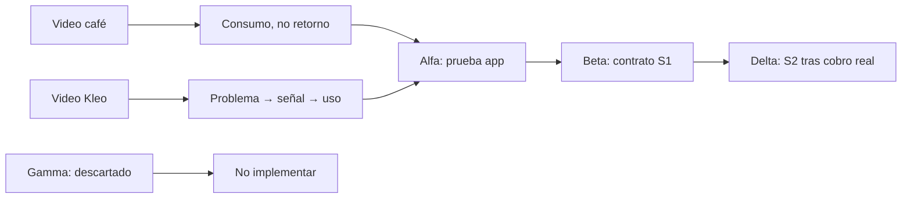
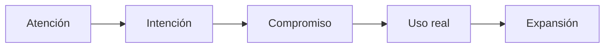
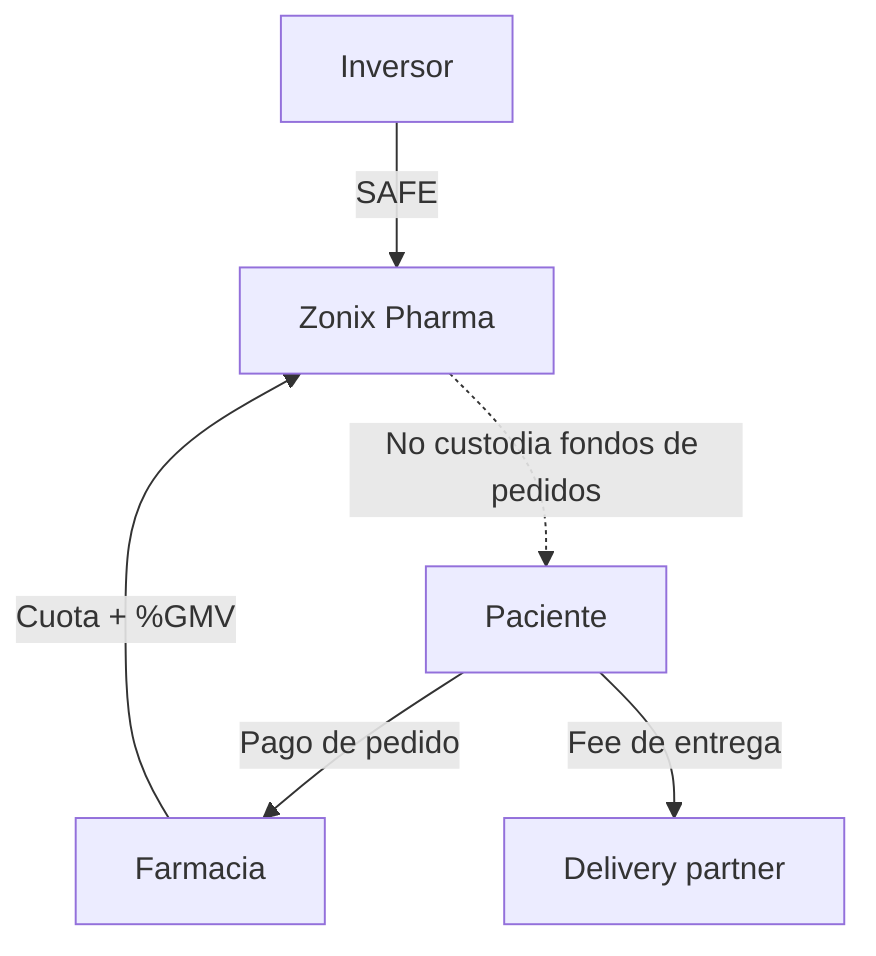
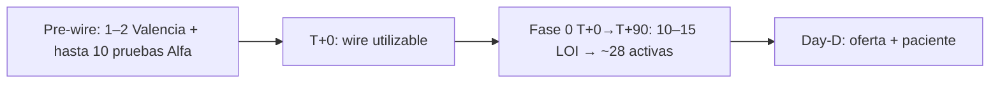
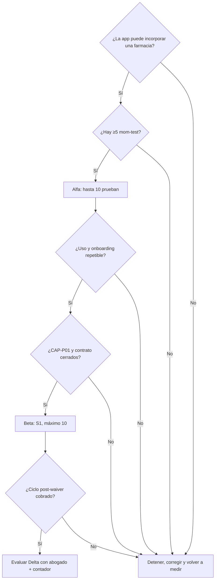

# Plan unificado de captación — inversionistas, farmacias y socios

> **ARCHIVO — no hub.** Canon vigente: ask **USD 237.412** @ cap **USD 1.582.747** (~15%). Ver [`../README.md`](../README.md). **No uses las cifras de este archivo.**

> **Versión:** 1.0 unificada — 21 agosto 2026.  
> **Uso:** documento interno del founder; no incluir por defecto en el zip de primera reunión.  
> **Alcance:** fuente canónica única para el plan operativo, la evidencia útil de los videos Café + Kleo y la decisión Alfa/Beta/Gamma/Delta.  
> **Canon financiero:** **SUPERSEDIDO** — rige Captación operativa (15% @ 1.582.747).  
> **No es dictamen legal, contable ni fiscal.** SAFE, prepago, contratos y equity requieren abogado/contador según cada gate.

## Respuesta ejecutiva

Los dos videos aportan mecanismos útiles, pero **no un modelo para copiar literalmente**:

- **Café (Facebook):** separar membresía de consumo, inversión y fondos de pedidos; limitar cohortes por capacidad; no prometer retornos.
- **Kleo (Instagram):** hablar primero del problema, capturar una señal cualificada, aprender con una cohorte pequeña y ampliar solo después del uso real.

La secuencia recomendada para Zonix es:

1. **Alfa ahora:** hasta 10 farmacias prueban la app antes del wire; no es waiver, contrato ni waitlist de pacientes.
2. **Beta después del uso:** un subconjunto entra al programa comercial S1 con contrato y waiver canónico.
3. **Delta solo después de cobro real:** el prepago anual S2 continúa no aprobado hasta superar todos los gates.
4. **Gamma descartado:** lifetime, cap 800k, exclusividad y un sprint de cuatro semanas mezclan cliente, inversor y operación.



La captación se ejecuta mediante **cuatro carriles independientes**:

1. inversionistas financieros;
2. farmacias cliente;
3. socios estratégicos;
4. socios operativos y advisors.

Cada carril tiene un intercambio, contrato, embudo y caja distintos. Si una misma contraparte ocupa dos carriles —por ejemplo, una farmacia que también invierte— firma instrumentos separados y no recibe datos, exclusividad o condiciones comerciales privilegiadas por aportar capital.

### Cómo leer este documento

| Bloque | Responde |
|---|---|
| §1–§3 | Qué no cambia y qué evidencia de los videos sí es válida |
| §4–§7 | Cómo captar en cada carril sin mezclar contratos ni caja |
| §8 | Cuándo ocurre cada fase: pre-wire, T+0, Fase 0 y Day-D |
| §9 | Qué significan S0, S1 y S2 |
| §10 | Qué son Alfa, Beta, Gamma y Delta y cuál se recomienda |
| §11–§14 | Cómo medir, decidir, incorporar evidencia y actuar |
| Anexos | Cálculos, fuentes, correcciones y descartes que sustentan el plan |

## 1. Reglas no negociables

1. **Ask no significa recaudado.** Solo existe capital recibido cuando hay instrumento firmado, condiciones de cierre satisfechas y wire confirmado en cuenta de empresa/escrow.
2. **Cliente no significa inversor.** Una farmacia paga por plataforma y servicios; no recibe dividendos, profit share, equity ni promesa de recuperar su cuota.
3. **Socio comercial no significa accionista.** Un partner delivery opera bajo contrato/SLA; no obtiene equity por usar la plataforma.
4. **Rol operativo no significa cofundador.** Co-CEO es hoy un rótulo operativo. Cualquier equity futuro requiere cap table, vesting y revisión legal.
5. **Tres universos separados:** SAFE, ingresos/prepagos B2B y fondos de pedidos. Significa contratos y ledgers diferenciados; no obliga por sí solo a tres cuentas bancarias. En el piloto, los fondos de pedidos **nunca entran en Zonix**: el paciente paga directo a farmacia y `delivery_company`.
6. **Caja cobrada no es revenue ni capital libre.** Un prepago puede crear una obligación de servicio y reconocimiento diferido.
7. **Sin retornos prometidos.** No usar “recuperas tu inversión”, renta garantizada, revenue share o múltiplos en una oferta a clientes.
8. **Sin escasez falsa.** El límite de una cohorte debe responder a capacidad de onboarding, soporte y operación.
9. **Sin cambiar pricing desde una investigación.** Toda modificación de 45/60/70 + 8/7/5 o del waiver exige decisión founder, prueba WTP y reproyección.
10. **Sin contacto automático.** Este plan prepara embudos y materiales; ningún agente contacta inversores, farmacias o aliados sin aprobación explícita.

## 2. Registro y normalización de evidencia

### 2.1 Protocolo para cada aporte nuevo

Todo informe, video, libro, conversación o salida de otra IA entra con un ID y se clasifica:

| Estado | Significado | Efecto |
|---|---|---|
| `MANTENER` | Compatible con fuentes/canon y útil para Zonix | Puede entrar al plan |
| `CORREGIR` | Tiene una idea útil, pero cifra, alcance o etiqueta es imprecisa | Entra solo la versión corregida |
| `DESCARTAR` | Contradice el modelo, la regulación o la evidencia | No se incorpora |
| `PENDIENTE HUMANO` | Requiere founder, abogado, contador, asesor regulatorio o dato de campo | No se presenta como decisión |

Para ser citable, el aporte debe incluir:

- texto completo, no solo resumen;
- URLs directas y fecha de consulta;
- fuente primaria cuando exista;
- fórmula y supuestos para cada cálculo;
- jurisdicción;
- diferencias entre hecho, cálculo e inferencia.

Si faltan URLs, el aporte sirve como **pista de investigación**, no como fuente externa del data room.

### 2.2 Fuentes normalizadas en esta versión

#### EXT-001 — Primera respuesta de Gemini pegada en chat

**MANTENER**

- La membresía con créditos/servicios es distinta de un instrumento con profit share.
- Los USD 2M del caso no son automáticamente revenue o beneficio.
- La adaptación Zonix debe separar SAFE, contrato B2B y fondos de pedidos.

**CORREGIR**

- “Security inequívoco” → **riesgo de ser tratado como contrato de inversión**, según hechos, promoción y jurisdicción.
- “Fraude” → una oferta no registrada no prueba por sí sola fraude; no usar esa etiqueta sin hechos adicionales.
- “Ponzi por TIR alta” → una rentabilidad extrema es una alerta, no prueba el uso de dinero nuevo para pagar participantes anteriores.
- TIR `[-10k,+10k,+15k,+25k]` → **~119,9%**, no ~122%, y solo aplica si todos son flujos monetarios.
- “Técnicamente quebrado” → los supuestos pueden mostrar un **déficit de liquidez**, no insolvencia jurídica automática.
- “USD 35k compra 8%” → el relato presenta una garantía reembolsable y una promesa de equity; la relación entre ambas no está demostrada.
- “SAFE USD 237.412 recaudado” → es **ask/meta**, no dinero recibido.

**DESCARTAR**

- 50 farmacias × USD 1.500/año.
- 0% de comisión GMV.
- Profit share o recuperación de cuota para farmacias.
- Etiquetas concluyentes de fraude, Ponzi o quiebra.

#### EXT-002 — Deep Research Gemini en DOCX, aportado el 20 agosto 2026

Archivo local aportado por el founder: `Forense financiero independiente de una adquisición financiada por clientes.docx`. No está versionado en el repo.

**MANTENER**

- Taxonomía híbrida: customer-funded acquisition + membresía prepaga + transición operativa + componentes separados de equity/inversión.
- Diferencia entre LBO, seller financing, earnout y crowdfunding de recompensas.
- IFRS 15: prepago por servicios futuros puede ser contract liability.
- El significant financing component y la clasificación IAS 32 dependen del contrato; no son automáticos.
- P10/P50/P90 no deben fabricarse sin distribución probabilística.
- La membresía comercial, la inversión y el equity de operadores deben separarse.
- La cohorte Zonix se limita al canon de máximo 10 farmacias y el prepago anual queda para después de validar servicio.

**CORREGIR**

- **Puente de caja del reel:** el DOCX resta dos veces USD 175k al tratar como una misma partida el depósito del comprador y las garantías reembolsables de operadores. La custodia permite afirmar:
  - caja de clientes que excede el precio total: 2M − 1,75M = **250k**;
  - depósito del comprador ya aplicado al precio: **175k**;
  - caja física después de cobrar membresías y pagar el saldo: 2M − 1,575M = **425k**;
  - garantías de operadores: `35k × N` agregan caja y un pasivo igual; si se segregan, su efecto neto es cero.  
  Los 250k son el exceso de caja **de clientes** sobre el precio; no son la caja posterior a devolver garantías. Ninguna cifra es “profit” o caja libre.
- La tabla del DOCX nombra tiers `Basic/Growth/Pro`; el canon Zonix es **Basic/Pro/Enterprise**.
- El 8% por operador no se valorará contra el precio del activo hasta conocer vesting, trabajo, derechos y contrato.
- Las ventajas “analytics avanzado”, posicionamiento preferente o price lock son posibilidades, no beneficios aprobados ni necesariamente construidos.

**PENDIENTE HUMANO**

- El DOCX exportó citas como marcadores `turn...`, no como URLs utilizables. Solicitar lista de enlaces antes de reutilizar sus cifras externas.
- Abogado: análisis SAFE, oferta de valores, publicidad y contratos.
- Contador: IFRS/NIIF aplicable, impuestos, reconocimiento y reserva.

#### EXT-003 — Informe forense en dos partes (20 agosto 2026)

Archivos locales del founder, no versionados: `forensic_report_part1.md` (§1–6.4) y `forensic_report_part2.md` (§7–14). Parte 2 trae bibliografía; varias URLs son homepages o el índice SEC, no el filing puntual (`CAP-P08`).

**MANTENER**

- Taxonomía híbrida; no es LBO, seller financing, earnout ni reward crowdfunding; no es Ponzi automático.
- Caja cobrada ≠ revenue; IFRS 15; asignar el precio entre prestaciones reales (créditos vs acceso).
- Si hay obligación de entregar efectivo por “parte de ganancias”, se bifurca a IAS 32; no es performance obligation.
- Howey, Edwards, Forman, Flyfish 2024 y SUNAVAL/SUNDDE como **riesgo**, no como sentencia.
- Comparables de consumo puro (Starbucks stored value, Costco, Soho House, Smoke & Mirrors): el modelo de membresía funciona **sin** profit share.
- Via/Mullins: el float de clientes financia operación, no capex. Zonix no usa pedidos/pacientes como capital.
- Bell Inn: una comunidad puede financiar una compra solo con cooperativa formal; no es vehículo Zonix.
- Versión “legítima” del caso café: membresía sin retorno + SHA/vesting + deferred revenue. Alinea con S2 (sigue no aprobado).
- Checklist para un eventual prepago: abogado, contador, reembolso, unit economics. Encaja en `CAP-P03` / `CAP-P04` / `CAP-P05`.

**CORREGIR**

- IRR ≈122% y obligaciones 12M → TIR **~119,9%** y **10M** si todo fuera cash; no volver a sumar el crédito del año 1.
- “35k = 8% → 437,5k”: la garantía es reembolsable; no está demostrado que compre equity.
- Puente 250k + garantías = 425k: mismo doble conteo de EXT-002. Canon: 250k = 2M − 1,75M; 425k = 2M − 1,575M.
- Howey 4/4 “cumple” y “sin profit share → no security”: demasiado limpio. Howey mira también la promoción.
- Starbucks **1.781,2M FY2024** vs forense JARVIS **1.751,7M FY2025**: no mezclar años.
- Cupo 10–15 farmacias → canon **máximo 10**.
- Descuento 10–15% y reserva ≥30% del prepago: no están en el pack; `CAP-P03` / `CAP-P04`.
- “Triple cuenta bancaria absoluta”: Zonix exige tres **universos** (contratos + ledgers). En el piloto el paciente no paga a Zonix. Tres cuentas son opcionales.
- P10/P50/P90 de la parte 1: no publicar.
- Providencia SUNAVAL 025/2025: pista no verificada.

**DESCARTAR**

- Profit share, retornos 10/15/25k, option fee de 30 días, 8% + depósito a operadores como oferta Zonix.
- Community shares / Reg CF / Reg D / Reg A+ como camino de la ronda actual (el instrumento es SAFE Lean).
- Copiar 6,67 cierres/día o 67–133 prospectos/día al embudo B2B.
- Tesis “compré el tráfico, no la cafetería”.

#### INT-001 — Forense JARVIS del reel

Fuente consolidada: [Anexo A — evidencia del video Café](#anexo-a--evidencia-del-video-café).

Uso aprobado: taxonomía, modelo numérico, fuentes y límites de adaptación. No usarlo como prueba de que el negocio del reel existió.

#### EXT-004 — Video Kleo / método de pre-lanzamiento (20 agosto 2026)

**Fuente visual:** [reel de @nivedan.ai](https://www.instagram.com/reels/DYHjRnHPZLB/) (`#ad`, `#MiroPartner`), MP4 local y ASR faster-whisper. Es un anuncio corto de Miro que relata el caso Kleo; **no** es una auditoría de sus ingresos.

**Método útil, sin cifras ajenas:**

| Fase | Mecanismo | Adaptación Zonix |
|---|---|---|
| 1 | Contenido de problema, no pitch | Hablar de quiebres B2B confirmados por mom-test |
| 2 | Señal de interés identificable | Formulario inbound de evaluación/prueba, no waitlist paciente |
| 3 | Cohorte chica que se pueda atender | Alfa: hasta 10 prueban la app; Beta: solo después del uso |
| 4 | Segunda tanda tras aprender | Escalar post-wire si el onboarding es repetible |



**Hechos y claims que no deben mezclarse:**

- El audio afirma 12.000 inscritos, 500 personas a USD 59, una segunda tanda a USD 79 y USD 61.000/mes antes del lanzamiento público.
- El dashboard visual muestra USD 61.910; es un claim del caso, no un estado financiero auditado.
- `500 × 59 = 29.500`; `500 × 79 = 39.500`; juntas serían **69.000**, no 61.000 ni 62.000.
- Las fuentes más cercanas al equipo describen **USD 59/mes** con descuento bloqueado, no un pago único lifetime. Si fuera pago único, sería caja one-shot y tampoco MRR.
- Un snapshot con unas 400 personas en la segunda tanda podría aproximar 61,1k; por eso la discrepancia no demuestra fraude, pero impide usar 61k como benchmark.
- Kleo no partió de cero: Kleo 1.0 reportó ~60–70k usuarios; Jake tenía ~180k seguidores y Lara ~300k. Esa distribución no existe hoy en el beachhead Zonix.
- Waitlist reportada 10–20k+, rebuild ~4 semanas y 53 días/3 meses son relojes de fuentes distintas; no se trasladan a la Fase 0 T+90.

**Los seis playbooks no son las cuatro fases del reel.** El podcast Rob Hoffman + Greg Isenberg trata seis estrategias distintas: Waitlist (Kleo/Mentions), Wave Surfer (TrustMRR), Language (Teachizy), AI Search (Tally), Signal (LocalRank) y High-ticket Ads (MailScale). Para captación piloto Zonix solo se conserva el orden de señales del primero; los otros cinco no se implementan como método.

**MANTENER**

- problema → señal cualificada → cohorte atendible → aprendizaje → expansión;
- unidad de aprendizaje = farmacia, no usuario SaaS;
- contenido B2B + mom-test + formulario inbound fuera de la app;
- log de incidencias y gate de no ampliar mientras se repitan fallos críticos;
- evidencia E3–E5 para el pitch, sin convertir farmacias en inversionistas.

**CORREGIR**

- escasez → capacidad real, no FOMO;
- «segunda tanda más cara» → menú 45/60/70 vigente, sin cambios por el video;
- 50+ llamadas SaaS → visitas/minutas proporcionales a un beachhead de hasta 10;
- pre-launch → acceso limitado con uso real, no «producto inexistente».

**DESCARTAR**

- 61k, 12k, 500, 59/79/99 como metas Zonix;
- lifetime, CTA «comenta LAUNCH», tablero Miro como prueba y waitlist masiva de pacientes;
- Rolling SAFE, cap 800k, exclusividad logística y calendario de cuatro semanas;
- feature waitlist en Flutter/Laravel o reutilizar `SubscriberController` para farmacias.

## 3. Canon que no cambia por este experimento

| Concepto | Estado vigente |
|---|---|
| Etapa | Pre-seed / pre-revenue; piloto Valencia |
| Capital | **Ask USD 237.412**, todavía no recaudado |
| Instrumento | SAFE post-money cap **USD 1.582.747** `[PENDIENTE abogado VE]` |
| Equity de referencia | **~15% al convertir si aplica el cap** |
| Fase 0 | T+0→T+90; T+0 ocurre tras condiciones de cierre + wire liberado/utilizable |
| Pricing farmacia | Basic **45 + 8%**, Pro **60 + 7%**, Enterprise **70 + 5%** |
| Waiver | Cuota fija USD 0, meses 1–2, máximo 10 farmacias; GMV se mide |
| Pagos paciente | Directo a farmacia y empresa delivery; no pasan por Zonix |
| Última milla | Partner `delivery_company`; sin flota Zonix |

**Ambigüedad a cerrar:** el contrato y la proyección deben decir expresamente si durante el waiver se cobra o no el componente `%GMV`. Hasta cerrar `CAP-P01`, no prometer una interpretación distinta a una contraparte.

### 3.1 Tres universos de dinero



| Universo | Instrumento | ¿Entra en caja Zonix? | Prohibición principal |
|---|---|---|---|
| Capital | SAFE | Sí, solo tras cierre + wire liberado | No decir «recaudado» ante interés |
| Ingreso B2B | Contrato farmacia | Sí, según cuota/%GMV y reconocimiento | No prometer retorno/equity |
| Pedidos | Pago paciente | No en el piloto | No usar patient float como capital |

## 4. Carril A — inversionistas financieros

### 4.1 Resultado buscado

Cerrar el ask pre-seed para financiar Fase 0 y 12 meses post-Day-D sin disfrazar clientes o partners como inversionistas.

### 4.2 Intercambio

| Parte | Aporta | Recibe |
|---|---|---|
| Inversor | Capital y, si se acuerda, experiencia/referencias | Derechos del SAFE y reporting; no retorno garantizado |
| Zonix | Instrumento, información verificable y ejecución | Capital sujeto a cierre |

**Instrumento:** SAFE separado de todo contrato comercial. Adaptación, enforceability, escrow/tranches y derechos adicionales: `[PENDIENTE abogado]`. La **PIIA firmada + inventario de activos** es condición suspensiva del desembolso según [ESTRUCTURA_LEGAL_Y_EQUITY.md](ESTRUCTURA_LEGAL_Y_EQUITY.md) §1.5; no se rebaja a una recomendación opcional.

### 4.3 Gate antes de outreach intensivo

- demo de producto 3–5 minutos;
- 1–2 early adopters con nivel de evidencia explícito (§4.3.1);
- P0 de due diligence founder;
- data room mínimo coherente;
- cifras v4 sin claims de tracción inventados;
- lista de candidato y tesis de encaje.

#### 4.3.1 Escalera de evidencia de mercado

| Nivel | Evidencia | Cómo se declara |
|---|---|---|
| E0 | Entrevista mom-test documentada | Discovery; no early adopter |
| E1 | LOI o compromiso claro con próxima fecha | Early adopter comprometido, todavía no activo |
| E2 | Contrato firmado | Cliente contratado, no necesariamente activado |
| E3 | Catálogo/usuarios/farmacéutico activos | Farmacia activada |
| E4 | Primera orden real completada/pagada | Uso real |
| E5 | Repetición o primera factura Zonix cobrada | Tracción comercial inicial |

Para outreach exploratorio a ángeles puede mostrarse E1 con disclosure. Para declarar “producto en mercado” o recontactar fondos que exigen tracción, el gate es **E3 + señal E4/E5**, no entrevista ni demo.

### 4.4 Embudo y definiciones

| Etapa | Evidencia mínima |
|---|---|
| Candidato | Nombre, tipo, tesis, geografía, ticket y fuente |
| Cualificado | Encaje con etapa/sector/jurisdicción confirmado |
| Introducción | Warm intro o contacto autorizado registrado |
| Respuesta | Respuesta humana explícita |
| Reunión | Fecha y asistentes confirmados |
| Data room | Acceso otorgado y documentos enviados registrados |
| Due diligence | Preguntas/material solicitado |
| Términos | Propuesta escrita; no compromiso verbal |
| SAFE firmado | Documento firmado por partes |
| Condiciones de cierre | PIIA/inventario IP y demás condiciones suspensivas satisfechas |
| Escrow/tranche | Fondos depositados, pero todavía no necesariamente utilizables |
| Wire liberado | Caja utilizable conciliada según cierre/tranche aprobado; recién aquí existe T+0 |

### 4.5 Métricas

- candidatos nuevos y cualificados;
- tasa de respuesta por canal;
- reuniones realizadas;
- avance a data room/DD/términos;
- monto indicado como interés, compromiso firmado y wire — **tres campos separados**;
- días por etapa;
- razón de rechazo.

No fijar tasas de conversión objetivo hasta medir el primer ciclo.

### 4.6 Riesgos

- decir “recaudado” ante interés verbal;
- ofrecer retornos o payback como garantía;
- aceptar exclusividad/MFN comercial, datos o veto a cambio de capital;
- dar acceso a datos de pacientes;
- iniciar Fase 0 antes del wire;
- presentar una farmacia/inversor corporativo como validación de mercado sin uso real.

## 5. Carril B — farmacias cliente

### 5.1 Resultado buscado

Validar problema, willingness to pay, activación y retención con farmacias independientes/medianas del beachhead.

### 5.2 Intercambio

| Farmacia aporta | Zonix aporta |
|---|---|
| Catálogo, farmacéutico colegiado, operación, feedback y pago contractual | Plataforma, onboarding, visibilidad, flujo Rx, soporte y coordinación logística |

**Instrumento:** carta de intención para discovery/planificación; después contrato marco anual con cobro mensual conforme al canon.

### 5.3 Programa “Farmacias Fundadoras”

Es un **nombre de cohorte piloto**, no una inversión.

Beneficios inicialmente permitidos:

- prioridad de agenda para onboarding;
- capacitación directa;
- canal de feedback con founder/equipo;
- participación en sesiones de co-diseño;
- medición y reporte de resultados del piloto;
- caso de estudio solo con consentimiento.

No prometer como disponible:

- posicionamiento preferente en búsqueda;
- analytics que no existan en producto;
- exclusividad territorial;
- lock indefinido de precio;
- retorno, dividendos, equity o participación en ganancias;
- analogías de inversión (Flyfish, TIR, “recuperas lo que pagaste”).

Analogía interna permitida: membresía de **consumo** (Costco / Smoke & Mirrors). El límite de 10 fundadoras es capacidad de onboarding y soporte, no escasez de marketing.

### 5.4 Embudo

Usar el funnel y sus referencias en [PROPUESTA_VALOR_CLIENTE_B2B.md](PROPUESTA_VALOR_CLIENTE_B2B.md) §6, pero separar **benchmark orientativo** de dato real:

1. prospecto identificado;
2. entrevista mom-test;
3. demo;
4. reacción documentada a pricing;
5. carta de intención;
6. contrato;
7. onboarding iniciado;
8. catálogo activo;
9. primera orden completada;
10. primera factura pagada;
11. retención/renovación.

### 5.5 Métricas

- farmacias por etapa;
- días visita→LOI→contrato→activación;
- objeciones y razón de pérdida;
- activación de catálogo;
- primera orden;
- GMV completado;
- ingreso Zonix;
- soporte por farmacia;
- churn/retención;
- adopción de waiver y conversión a pago.

Tráfico, firmas y catálogo cargado no sustituyen “farmacia activa + pedido + pago”.

## 6. Carril C — socios estratégicos

### 6.1 Prioridad piloto

El partner estratégico operativo prioritario es `delivery_company`. Una farmacia ancla sigue siendo **cliente del carril B**, aunque aporte referencias o co-diseño. Droguerías/distribuidores permanecen en roadmap hasta validar el piloto.

### 6.2 Intercambio delivery

| Partner aporta | Zonix aporta |
|---|---|
| Cobertura, agentes, SLA, seguros/evidencia y ejecución de última milla | Flujo de órdenes, asignación/tracking, dashboard y facturación contractual |

**Instrumentos provisionales:** LOI → contrato comercial no exclusivo + SLA/KYC/seguros según aplique. “Concesión” y DPA no se presuponen: dependen del mapa de responsabilidades, datos tratados y revisión jurídica VE `[PENDIENTE abogado]`.

### 6.3 Embudo

1. candidato;
2. reunión;
3. validación de cobertura/capacidad;
4. LOI;
5. KYC y documentación;
6. prueba operativa;
7. contrato;
8. agentes activos;
9. operación medida.

### 6.4 Métricas

- empresas y agentes por etapa;
- cobertura;
- entregas completadas;
- tiempo e incidentes;
- cumplimiento SLA;
- concentración por partner;
- costo/fee real;
- NPS post-entrega.

### 6.5 Guardrails

- no exclusividad en piloto;
- partner #2 en pipeline y pickup como fallback;
- no acceso libre a datos de salud;
- inversión del partner, si existe, va por carril A con instrumento separado;
- no otorgar equity por una LOI o promesa de volumen.

## 7. Carril D — socios operativos, cofundadores y advisors

### 7.1 Resultado buscado

Reducir dependencia del founder mediante capacidad ejecutora real, sin regalar equity por títulos o contactos prometidos.

### 7.2 Clasificación

| Perfil | Relación inicial |
|---|---|
| Co-CEO / CEO operativo | Rol operativo bajo contrato; no cofundador automático |
| Equipo Sales/CS/Dev | Contrato y compensación del presupuesto |
| Advisor | Entregables/introducciones verificables; sin equity en piloto por defecto |
| Cofundador futuro | Acuerdo founder, dedicación, PI, vesting y cap table `[PENDIENTE abogado]` |

Cada relación usa su propio instrumento:

- personal/contractor: contrato laboral o de servicios según realidad de subordinación;
- advisor: advisor agreement con entregables, confidencialidad, PI y acceso acotado;
- cofundador: founder agreement, dedicación, gobierno, PI, vesting y salida.

Una “prueba” no autoriza trabajo gratuito ni acceso informal a datos; debe definir alcance, remuneración, PI y confidencialidad.

### 7.3 Embudo

1. necesidad/scorecard;
2. candidato;
3. entrevista;
4. referencias;
5. prueba acotada o entregable;
6. contrato;
7. hitos 30/60/90;
8. revisión de continuidad.

Para advisors, medir introducciones aceptadas, reuniones obtenidas y resultado; “tener contactos” no es un entregable.

### 7.4 Equity

El canon de [ESTRUCTURA_LEGAL_Y_EQUITY.md](ESTRUCTURA_LEGAL_Y_EQUITY.md) indica **sin options en piloto** para freelances. Cualquier excepción debe:

- demostrar necesidad que no puede cubrirse con contrato;
- definir dedicación y propiedad intelectual;
- usar vesting/cliff;
- recalcular cap table fully diluted;
- evitar grants por anticipado;
- obtener revisión legal y aprobación founder.

## 8. Calendario integrado

### 8.1 Dos relojes que no se mezclan



- **Reloj pre-wire:** demo, mom-test, 1–2 evidencias para raise y hasta 10 pruebas controladas de app. Prueba no significa waiver ni WTP.
- **Reloj financiado:** después de T+0, Fase 0 construye oferta y operación hasta ~28 activas / ~35 firmadas al Day-D conforme a [PLAN_LANZAMIENTO_COMERCIAL.md](PLAN_LANZAMIENTO_COMERCIAL.md).
- Beta puede comenzar tras uso real, pero la cohorte S1 de máximo 10 no se convierte en tope comercial permanente.

### Antes del wire

- cerrar demo y evidencia de early adopters;
- completar P0 de due diligence;
- construir pipeline inversor;
- hacer discovery farmacia sin presentar hipótesis como tracción;
- identificar partner delivery;
- preparar scorecards de roles.

No contratar el equipo completo ni ejecutar gasto Fase 0 como si el ask estuviera en caja.

### T+0

Firma del SAFE o depósito bloqueado en escrow **no** activan por sí solos T+0. T+0 existe cuando se cumplen las condiciones suspensivas —incluida PIIA— y hay caja utilizable liberada para el tramo aprobado. Un cierre parcial solo activa Fase 0 si el founder aprueba una reproyección que demuestre suficiencia del tramo; no se ejecuta el presupuesto completo con caja incompleta.

### T+0–T+30

- carril A: confirmación, reporting de 30 días;
- carril B: pipeline e interés cualificado;
- carril C: shortlist y negociación partner;
- carril D: selección/onboarding equipo;
- legal/empresa/HQ/tech según Fase 0.

### T+30–T+60

- carril B: LOI, contratos, catálogo y capacitación;
- carril C: LOI/contrato, KYC y prueba;
- carril D: customer development;
- producto: smoke y preparación Day-D.

### T+60–T+90

- activar farmacias y catálogo;
- probar delivery;
- cerrar gates de pricing, operación y compliance;
- reportar evidencia, no vanity metrics.

### M1+

- medir órdenes, GMV, ingreso, margen, soporte y retención;
- convertir waiver a pago;
- evaluar —no lanzar automáticamente— el escenario de prepago anual;
- escalar demanda paciente solo con oferta operativa.

## 9. Escenarios de financiación por clientes

### S0 — Base vigente

Cobro mensual 45/60/70 + 8/7/5% GMV. Es el único escenario del pitch central.

### S1 — Cohorte fundadora con waiver

- máximo 10 farmacias;
- cuota fija USD 0 en meses 1–2;
- GMV medido;
- salida y conversión a contrato conforme al documento B2B;
- componente `%GMV` durante waiver: `CAP-P01 [PENDIENTE]`.

No se presenta como capital levantado. Es promoción/acquisición de cliente.

### S2 — Prepago anual por servicio

Estado: **`[PROPUESTA — NO APROBADA]`**.

No sustituye el pricing ni entra al modelo hasta superar gates.

Si algún día se aprueba, el precio anual se **asigna** a prestaciones distintas (onboarding, panel, soporte), no a un blob único. No entra descuento 10–15% ni reserva fija 30% hasta `CAP-P03` / `CAP-P04`. El prepago no diluye el cap SAFE de USD 1.582.747.

Variables:

```text
N                  = farmacias elegibles (canon: máximo 10, no 15)
P                  = precio anual validado
cash_collected     = N × P
contract_liability = importe asignado a servicios no satisfechos
monthly_revenue    = importe reconocido conforme se presta el servicio
fulfillment_cost   = soporte + onboarding + infraestructura + beneficios
reserve_required   = refunds esperados + fulfillment pendiente + contingencia
cash_usable        = cash_collected − reserve_required − impuestos aplicables
```

### 9.1 Gates antes de modelar precio

- ≥5 entrevistas mom-test documentadas;
- ≥3 reacciones de pricing documentadas;
- contrato mensual usado en operación real;
- al menos 30 días de utilización/GMV/soporte para la cohorte candidata;
- al menos un ciclo **post-waiver** facturado y cobrado; uso gratuito por sí solo no prueba WTP;
- margen de contribución observado y capacidad de cumplimiento;
- definición exacta de prestaciones y capacidad;
- política de cancelación/refund;
- análisis contador de reconocimiento e impuestos;
- revisión legal de contrato/publicidad;
- reproyección P&L/caja aprobada por founder.

### 9.2 Stress mínimo

Modelar sin llamar P10/P50/P90 hasta tener datos:

- adopción;
- renovación;
- cancelación/refund;
- costo de soporte;
- costo de onboarding;
- descuentos/precio;
- utilización;
- churn;
- GMV;
- retraso de prestación;
- concentración de caja.

Salida obligatoria por escenario:

- caja cobrada;
- pasivo/obligación pendiente;
- reserva;
- revenue reconocido;
- margen de contribución;
- cash usable;
- impacto en runway;
- riesgo contractual;
- decisión `GO / NO-GO / MÁS DATOS`.

### 9.3 Prohibiciones

- profit share;
- retorno fijo o variable para cliente;
- “recuperas la cuota”;
- vender el prepago como inversión;
- usar dinero de pacientes;
- reconocer todo el prepago como revenue del mes;
- lanzar sin reserva/refund/capacidad.

## 10. Planes comparables y decisión recomendada

### 10.1 Plan Alfa — prueba de producto pre-wire

**Encaje:** fases 1–2 de Kleo + membresía de consumo del caso Café + las 10 farmacias como **prueba de app**, no como contrato ni waiver.

**Pasos**

1. Ejecutar ≥5 mom-test reales antes de publicar contenido de «problemas de farmacia».
2. Usar una CTA inbound: «evaluación / prueba de la app», con formulario fuera de Flutter/Laravel.
3. Cualificar decisor, sede Valencia, catálogo y farmacéutico antes de contar un lead.
4. Permitir que hasta 10 farmacias prueben catálogo, flujo Rx y pedido controlado.
5. Registrar incidencias por farmacia y no ampliar mientras se repitan fallos críticos.
6. Convertir a Beta solo las que usen de verdad; probar no demuestra WTP.
7. Usar evidencia E3–E5 en carril A; no usar un formulario público de ronda.
8. Probar un `delivery_company` con SLA no exclusivo.

**Criterios de parada**

- el formulario atrae pacientes/curiosos, no decisores B2B;
- el abandono del formulario exige simplificarlo;
- el contenido genera atención pero cero interés cualificado;
- los mismos fallos de onboarding se repiten en varias farmacias;
- no existe OK explícito del founder para outreach outbound;
- el producto todavía no puede incorporar una farmacia con seguridad.

**Código:** ninguno. `SubscriberController` es una lista de email web/paciente y no se amplía para este flujo.

### 10.2 Plan Beta — Fundadoras S1 después del uso

**Encaje:** fases 3–4 recortadas de Kleo + cohorte Café limitada por capacidad, sin retorno.

**Pasos**

1. Un subconjunto de Alfa que ya usó la app firma contrato marco.
2. Aplicar el waiver canónico: cuota fija USD 0 durante meses 1–2, máximo 10; `%GMV` sujeto a `CAP-P01`.
3. Ofrecer white-glove acotado: visitas, capacitación, minutas y canal de feedback; no soporte 24/7.
4. Medir catálogo activo, primera orden, GMV, soporte, conversión a pago y retención.
5. No ampliar S1 por encima de 10; la expansión hacia ~28 pertenece al reloj post-wire.
6. Mantener S2/lifetime fuera. Si una farmacia invierte, firma un SAFE separado.

**Criterios de parada**

- no comunicar el waiver mientras `%GMV` siga ambiguo;
- onboarding no repetible;
- presentar S1 como capital levantado;
- usar FOMO como «quedan tres cupos»;
- prometer lock indefinido, analytics inexistente o posicionamiento preferente.

### 10.3 Plan Gamma — control negativo, no elegir

| Propuesta | Por qué se rechaza |
|---|---|
| USD 45 de por vida | Lock indefinido; contradice waiver 0×2 |
| Segunda cohorte a USD 60 por «subida» | 60 ya es Pro; un video no cambia el menú |
| Rolling SAFE cap 1.582.747→800k | Otro instrumento; el ask vigente no está recaudado |
| Exclusividad logística | Viola guardrail del piloto |
| 10 firmas = fondear SAFE | Cliente ≠ inversor; T+0 exige wire |
| Posts/DM automáticos en cuatro semanas | Viola §1.10 |
| White-glove 24/7 | No existe capacidad financiada |

Un «sí» genérico no rehabilita Gamma. Cualquier outreach requiere un plan nuevo, pipeline real (`CAP-P06`) y OK explícito.

### 10.4 Plan Delta — S2 prepago anual futuro

Delta es el escenario §9 S2: membresía de consumo cobrada por adelantado y asignada a servicios reales. **No es opción ahora.**

Solo se reabre después de Beta cuando existan: uso real, ciclo post-waiver cobrado, margen observado, política de refund, contador, abogado y reproyección founder. No diluye el cap SAFE ni convierte clientes en inversionistas.

### 10.5 Matriz de elección

| Criterio | Alfa | Beta | Gamma | Delta |
|---|---|---|---|---|
| Encaje con canon | Alto | Alto si cierra `CAP-P01` | Nulo | Alto después de gates |
| Encaje con «10 prueban» | Alto | Es contrato, no prueba | Mezcla SAFE | Nulo ahora |
| Prueba WTP | No | Parcial: waiver ≠ cobro | No | Sí, con cobro |
| Exige wire | No | No para las 10 S1 | Finge T+0 | No |
| Riesgo legal | Bajo si inbound | Medio por copy contractual | Alto | Alto sin asesoría |
| Código app | No | No | No | No |
| ¿Elegible ahora? | **Sí** | **Después de uso** | **No** | **No** |



**Decisión recomendada:** Alfa ahora → Beta después del uso. Delta permanece como hipótesis post-cobro. Gamma queda cerrado.

## 11. Dashboard semanal del plan

| Carril | Métricas leading | Métrica de resultado |
|---|---|---|
| A Inversión | cualificados, respuestas, reuniones, DD | SAFE firmado / condiciones cerradas / wire liberado |
| B Farmacias | entrevistas, demos, LOI, contratos, onboarding | activas + orden + pago + retención |
| C Partners | candidatos, LOI, KYC, pruebas | SLA operativo y entregas |
| D Operación | candidatos, referencias, trials, contratos | hitos 30/60/90 |

Cada número debe guardar fecha, fuente y dueño. No sumar stages incompatibles.

### 11.1 Fuentes de verdad del pipeline

| Carril | Fuente operativa |
|---|---|
| A Inversión | `docs/Inversionistas/` + CRM comparativo |
| B Farmacias | `VOLCADO_RESPUESTAS_CUESTIONARIO.md` §6 / CRM Sales |
| C Delivery | `VOLCADO_RESPUESTAS_CUESTIONARIO.md` §7 + REGISTRO P1-10 |
| D Equipo/advisors | `VOLCADO_RESPUESTAS_CUESTIONARIO.md` §5 |

Cada registro debe tener:

```text
id | contraparte | carril | etapa | dueño | próxima acción
fecha límite | evidencia/enlace | fecha última actualización | estado
```

Regla de unicidad: una contraparte puede aparecer en dos carriles solo con dos registros e instrumentos explícitos. Las métricas de etapa usan conteo de contrapartes únicas dentro de una ventana semanal; no se suman acumulados históricos como pipeline activo.

## 12. Registro de decisiones

| ID | Decisión | Estado | Cierre / próxima revisión |
|---|---|---|---|
| CAP-D01 | Mantener SAFE separado del contrato comercial | `DECIDIDO` | No reabrir sin nueva estructura legal |
| CAP-D02 | Ask 237.412/cap 1.582.747 es meta, no recaudado | `DECIDIDO` | Cambia solo con decisión financiera versionada |
| CAP-D03 | Cuatro carriles con instrumentos/ledgers separados | `DECIDIDO` | Revisar al añadir un nuevo tipo de contraparte |
| CAP-D04 | Farmacias fundadoras = clientes, no inversionistas | `DECIDIDO` | No reabrir |
| CAP-D05 | Sin profit share/retorno/equity para clientes | `DECIDIDO` | No reabrir |
| CAP-D06 | Sin patient float; Zonix no es PSP | `DECIDIDO` | No reabrir en piloto |
| CAP-D07 | No equity para freelancers/advisors en piloto por defecto | `DECIDIDO` | Excepción exige §7.4 |
| CAP-D08 | Copy B2B = consumo; analogía Costco/Smoke & Mirrors, no Flyfish | `DECIDIDO` | EXT-003 |
| CAP-D09 | De Kleo se adopta el orden de señales, no cifras/pricing/waitlist | `DECIDIDO` | EXT-004 |
| CAP-D10 | Gamma (lifetime, cap 800k, exclusividad, sprint 4 semanas) | `RECHAZADO` | No reabrir con un OK genérico |
| CAP-R01 | 50 farmacias × 1.500 y 0% comisión | `RECHAZADO` | Solo nueva hipótesis con WTP + FP&A |
| CAP-R02 | Etiquetar fraude/Ponzi/quiebra sin prueba | `RECHAZADO` | No reabrir sin hechos |
| CAP-P01 | Precisar cobro de %GMV durante waiver | `PENDIENTE founder + FP&A + contrato` | Antes de comunicar oferta |
| CAP-P02 | Obtener URLs directas del DOCX Gemini | `PENDIENTE investigación` | Antes de citarlo externamente |
| CAP-P03 | Aprobar o descartar prepago anual después de datos | `PENDIENTE post-validación` | Después de primer cobro post-waiver |
| CAP-P04 | Tratamiento contable/fiscal de eventual prepago | `PENDIENTE contador` | Antes de modelar/lanzar S2 |
| CAP-P05 | Plantillas SAFE/contratos/vesting | `PENDIENTE abogado` | Antes de firma |
| CAP-P06 | Primer pipeline real por carril | `PENDIENTE founder/equipo` | Fecha objetivo por definir |
| CAP-P07 | Alinear umbrales de cambio de tier con bandas 2.001/5.001 | `PENDIENTE founder + FP&A` | Antes del contrato final |
| CAP-P08 | Verificar URLs de EXT-003 (Flyfish 34-101072, 10-K Starbucks, SUNAVAL/SUNDDE) antes de citarlas fuera | `PENDIENTE investigación` | Antes de data room o pitch externo |
| CAP-P09 | Autorizar ejecución de Alfa→Beta y el primer contacto real | `PENDIENTE founder` | Antes de outreach; este documento no contacta |

## 13. Cómo incorporar la próxima investigación

Cuando el founder entregue otra salida:

1. asignar ID `EXT-00N`;
2. conservar el texto íntegro fuera del data room;
3. extraer afirmaciones y cálculos;
4. contrastar contra fuentes primarias y pack v4;
5. clasificar `MANTENER/CORREGIR/DESCARTAR/PENDIENTE HUMANO`;
6. identificar qué carril y decisión afecta;
7. actualizar solo las secciones afectadas;
8. registrar nueva versión y fecha;
9. no ejecutar outreach, pricing o contratos sin gate humano.

## 14. Próximas acciones concretas

### 14.1 Decisiones founder todavía abiertas

1. ¿Las 10 de Alfa son solo prueba de producto o las que cumplan gates pasan después a S1/Beta?
2. ¿La CTA de inversor será siempre mensaje privado a candidatos del CRM? Un formulario público requiere revisión legal previa.
3. ¿Dónde vivirá el formulario B2B —Typeform, hoja o WhatsApp inbound— y quién lo cualificará semanalmente?
4. ¿Quién tiene autoridad para retrasar Beta, expansión o Day-D si el onboarding no es repetible?
5. ¿Existen ya ≥5 mom-test documentados para sustentar el contenido de problemas o la Fase 1 debe esperar?
6. ¿Se autoriza `CAP-P09`: Alfa, Beta o Alfa→Beta y el primer contacto real?

### 14.2 Acciones condicionadas a esas decisiones

1. Founder confirma `CAP-P09`: Alfa, Beta o Alfa→Beta; hasta entonces no hay contacto.
2. Completar evidencia P0, demo y capacidad de onboarding antes de Alfa.
3. Ejecutar ≥5 mom-test B2B y registrar objeciones/WTP.
4. Cargar candidatos reales en los cuatro embudos sin confundir interés con compromiso.
5. Identificar partner delivery #1 y fallback no exclusivo.
6. Cerrar `CAP-P01` antes de comunicar el waiver de Beta.
7. Mantener S2/Delta fuera del pitch hasta superar §9.1.
8. Solicitar/normalizar URLs directas pendientes (`CAP-P02`, `CAP-P08`) antes de citarlas fuera.

---

**Fuentes internas principales:** [README del pack](README.md) · [Plan lanzamiento](PLAN_LANZAMIENTO_COMERCIAL.md) · [Propuesta B2B](PROPUESTA_VALOR_CLIENTE_B2B.md) · [Tercer lado](PROPUESTA_VALOR_TERCER_LADO.md) · [Estructura legal](ESTRUCTURA_LEGAL_Y_EQUITY.md) · [Plan métodos de pago](PLAN_METODOS_PAGO.md) · anexos de evidencia de este documento.

---

## Anexo A — Evidencia del video Café

### A.1 Identificación y límite

| Campo | Valor |
|---|---|
| URL | [Facebook reel 2087986695439858](https://www.facebook.com/reel/2087986695439858) |
| Fecha del análisis | 20 agosto 2026 |
| Naturaleza | Pieza narrativa/ficción usada como caso; no prueba de una transacción real |
| ASR | Whisper `base` ES |
| SHA-256 video | `6bdd358d9c79fcdb7613dfda0ac538d8f280e0ffcd4565eb1125931079ecb3f6` |
| SHA-256 audio | `866940b74a118fe5fb1ba586d9dd625447f59ac7aa9a484fc676b6d26352c6da` |

El arco combina **opción operativa + equity/garantías + red + membresías prepagadas + revenue sharing**. Su idea válida es financiar crecimiento con clientes; su error es presentar caja condicionada como capital libre.

### A.2 Cadena narrativa

| Fase | Claim del reel | Lectura técnica |
|---|---|---|
| Negociación | Ask 1,5M; oferta 1,75M cash | Compra de activo, no LBO |
| Control temporal | Depósito 175k + 30 días; se pierde si no cierra | Opción de facto / earnest money con operación |
| Equipo | 8% a operadores + 35k de garantía reembolsable al año | Equity compensation + garantía; no demuestra compra de equity |
| Membresía | 200 contratos × 10k = 2M | Customer-funded / prepago con obligación de servicio |
| Beneficio | crédito 10k y pagos/valor 15k + 25k | La ambigüedad consumo-retorno activa riesgo financiero |
| Cierre narrativo | «Dejar de vender café» | Monetiza membresía/red; no prueba unit economics del local |

**Lo que no es:** no hay deuda senior o repago con EBITDA para llamarlo LBO; no hay seller financing ni earnout demostrados; no es Ponzi por definición; no es crowdfunding de recompensas puro si existe profit share.

### A.3 Fuentes y usos corregidos

```text
Precio acordado                         = 1.750.000
Depósito propio ya aplicado             =   175.000
Saldo a pagar                           = 1.575.000
Membresías cobradas                     = 2.000.000
Caja física tras pagar el saldo         =   425.000
Exceso de caja de clientes sobre precio =   250.000
```

Los 425k se explican por 250k de exceso aportado por clientes + 175k de capital propio ya aplicado. No se deben restar las garantías como si fueran ese depósito:

```text
Caja con garantías      = 425.000 + (35.000 × N)
Pasivo por devolverlas  =           − (35.000 × N)
Efecto neto segregado   = 0
```

Ninguna de esas cifras es automáticamente revenue, profit o caja libre. Los 2M obligan a entregar créditos/servicios, operar, pagar impuestos y cubrir refunds.

### A.4 Stress de cumplimiento

Si las 200 membresías dan 2M nominales de consumo, el colchón de 425k soporta como máximo **21,25%** de costo incremental antes de opex fijo, impuestos, eventos, profit share y devoluciones:

```text
425.000 / 2.000.000 = 21,25%
```

Matriz de redención — solo costo variable de créditos; excluye opex, impuestos, eventos, profit share y garantías, por lo que favorece al esquema:

| Redención / costo incremental | 20% | 30% | 40% |
|---|---:|---:|---:|
| 60% | +185k | +65k | −55k |
| 80% | +105k | −55k | −215k |
| 100% | +25k | −175k | −375k |

Con costo incremental de 30%, la redención máxima que soporta el colchón es 70,83%; exigiría al menos **29,17% de breakage** solo para llegar a saldo cero, todavía antes de opex:

```text
Breakage mínimo = 1 − (425.000 / (2.000.000 × 0,30)) = 29,17%
```

El breakage puede ayudar solo con historial y tratamiento contable; no se inventa como margen. Un escenario S2 Zonix debe reportar caja cobrada, pasivo contractual, reserva, revenue reconocido, margen y cash usable por separado.

El reloj de 30 días tampoco se traslada al B2B Zonix: vender 200 membresías exigiría 6,7 cierres por día calendario o 10 por día laboral; con conversión de 10% serían 2.000 prospectos y con 5%, 4.000. Son cálculos del lore, no metas del piloto.

### A.5 Equity y retorno

- Si 35k compraran 8%, la valoración post-money implícita sería 437,5k; contradice el precio de 1,75M.
- El diálogo presenta los 35k como reembolsables: funcionan más como garantía/préstamo temporal, mientras el 8% sería compensación.
- Sin vesting, cliff, recompra y límite de pool, cuatro o cinco operadores podrían diluir 32–40% y conservar derecho a reembolso.
- Para flujos `[-10k, +10k, +15k, +25k]`, la TIR aproximada es **119,9% anual**, no 122%.
- Los pagos nominales acumulados de 200 miembros serían **10M**, no 12M, si el primer 10k es el crédito inicial y no se vuelve a sumar.
- Una TIR extrema es una alerta; no prueba fraude o Ponzi.

| Operadores | Equity prometido | Garantías reembolsables |
|---:|---:|---:|
| 1 | 8% | 35k |
| 4 | 32% | 140k |
| 5 | 40% | 175k |
| 10 | 80% | 350k |

### A.6 Contabilidad y regulación

- [IFRS 15 §106](https://www.ifrs.org/content/dam/ifrs/publications/html-standards/english/2025/issued/ifrs15.html): un pago recibido antes de transferir bienes/servicios se presenta como **contract liability**.
- El breakage se reconoce conforme al patrón de uso o cuando sea remoto que el cliente ejerza el saldo.
- Una obligación de entregar efectivo/profit share puede ser pasivo financiero bajo IAS 32 según contrato.
- Howey/Edwards/Forman y [Flyfish Club — SEC](https://www.sec.gov/enforcement-litigation/administrative-proceedings/33-11305-s) muestran riesgo cuando se vende expectativa de beneficio; no son dictamen automático para Venezuela.
- SUNAVAL/SUNDDE y un abogado venezolano deben revisar oferta pública, publicidad y participación en ganancias (`CAP-P05`, `CAP-P08`).

### A.7 Comparables que sí enseñan algo

| Comparable | Qué valida | Qué no valida |
|---|---|---|
| [Customer-Funded Business — LBS](https://www.london.edu/news/the-customer-funded-business) | Pay-in-advance, suscripción y escasez operativa | Retornos garantizados |
| [Starbucks FY2025 10-K](https://www.sec.gov/Archives/edgar/data/829224/000082922425000114/sbux-20250928.htm) | Float + deferred revenue (USD 1.751,7M) | Profit share |
| [Costco FY2025](https://investor.costco.com/news/news-details/2025/Costco-Wholesale-Corporation-Reports-Fourth-Quarter-and-Fiscal-Year-2025-Operating-Results/default.aspx) | Membresía de consumo recurrente | Crédito total reembolsable |
| [Smoke & Mirrors](https://slshotels.com/es/dubai/restaurants-and-bars/smoke-and-mirrors/membership/) | Prepago F&B sin retorno | Financiar públicamente una adquisición |
| [Bell Inn Bath](https://thebellinnbath.co.uk/shares/) | Comunidad financia con cooperativa formal | Camuflar equity como membresía |
| Flyfish Club | Riesgo de comercializar membresías con upside | Validación del modelo |

**Aplicación Zonix:** consumo, servicios reales, cohortes por capacidad y reconocimiento diferido. **Fuera:** profit share, recuperación de cuota, garantía 35k, 8% a operadores, fondos de pacientes y retorno 10/15/25k.

---

## Anexo B — Evidencia del video Kleo

### B.1 Identificación

| Campo | Valor |
|---|---|
| Reel | [Instagram DYHjRnHPZLB](https://www.instagram.com/reels/DYHjRnHPZLB/) |
| Autor de la pieza | @nivedan.ai; no Rob Hoffman |
| Naturaleza | Anuncio Miro / lead magnet (`#ad`, `#MiroPartner`) |
| Duración | ~1:26 |
| Método narrado | Cuatro fases de waitlist/cohorte |
| B-roll | Tablero con seis playbooks; no es el contenido literal del audio |

### B.2 Claims y reconciliación

| Claim | Corrección / límite |
|---|---|
| 61k MRR / 53 días | Claim del founder; otras fuentes dicen 62k / 3 meses |
| 12k waitlist | Fuentes del equipo varían 10–20k+ |
| 500 × USD 59 | 29,5k; compatible con «~30k en 4 días» |
| segunda tanda 500 × USD 79 | 39,5k; total teórico 69k |
| USD 59 lifetime | Fuentes cercanas describen USD 59 **por mes** con precio bloqueado |
| «antes de existir» | Kleo 1.0 ya reportaba ~60–70k usuarios |
| crecimiento orgánico desde cero | Jake ~180k y Lara ~300k seguidores; distribución previa |

El caso sirve como **mecanismo de aprendizaje**, no como benchmark de ventas, tiempo o pricing. Pre-launch significa acceso restringido mientras se vende/usa, no ausencia de producto o ingresos.

### B.3 Fuentes y límites

- Reel/ASR: fuente de las cuatro fases; no de los seis playbooks.
- Podcast Rob Hoffman + Greg Isenberg (`youtu.be/rO3dIBMXD2g`): claims del equipo y catálogo de seis estrategias; no auditoría.
- Indie Hackers / Cam Trew: audiencia previa, Kleo 1.0, USD 59/mes y reloj de tres meses; URL exacta pendiente de normalización.
- Modash: fecha/duración/métricas del reel; no demuestra eficacia.
- Goal Group, HeyCatch, HN repost y Justia Ley de Medicamentos: no usar como prueba externa del método.

### B.4 Decisión Zonix

**Adoptado:** problema B2B → señal cualificada → hasta 10 pruebas → uso medido → Beta si es repetible.  
**No adoptado:** waitlist paciente, FOMO, lifetime, subida automática de precios, 61k, seis playbooks, ads high-ticket, formulario público de SAFE y cualquier feature waitlist.

---

## Anexo C — Trazabilidad de la consolidación

Este documento absorbió y reemplaza:

1. plan comparativo Alfa/Beta/Gamma/Delta del 20 agosto 2026;
2. forense del método Kleo / EXT-004;
3. forense del reel Café / INT-001 y contrastes EXT-001–003;
4. visor visual Café + Kleo del 21 agosto 2026.

Se conservaron las decisiones, cifras, fórmulas, límites de fuentes y guardrails. Se eliminaron narración duplicada, prompts de investigación, listados de archivos temporales, transcripción extensa y descripciones audiovisuales sin efecto sobre el plan.

**Regla de precedencia:** si una cifra externa contradice el canon del encabezado o [README.md](README.md), rige el pack vigente hasta decisión founder versionada.
