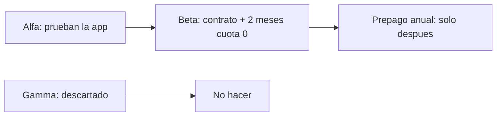

# Qué hacer ahora — captación stakeholders

> **Para qué sirve:** saber **qué hacer esta semana** sin ahogarte en jerga.  
> **Si una palabra no la entiendes:** abre el [`GLOSARIO.md`](GLOSARIO.md).  
> **Cifras fijas:** pedimos **USD 237.412** (aún no están en la cuenta) · techo SAFE **USD 1.582.747** · menú farmacia **45 / 60 / 70 + % sobre ventas en app**.  
> **Nadie contacta** a farmacias ni inversores hasta que tú digas que sí (`CAP-P09` en el glosario).

---

## Historia de esta semana (tú eres el founder)

Imagina tres conversaciones distintas — **nunca las mezcles en la misma charla**:

1. **María**, dueña de una farmacia en El Socorro: quiere ver si la app le sirve.  
   → Eso es **probar** (Alfa), no pedirle plata de inversión ni “ser socia de la empresa”.

2. **María otra vez**, dos semanas después, ya usó la app y no se cayó el onboarding:  
   → Ahí puedes hablar de **contrato** y dos meses de cuota fija en cero (Beta / “fundadora”). Sigue siendo **cliente**.

3. **Un inversor** (puede ser Gabriel u otro) que pone los **237.412**:  
   → Eso es un **SAFE** (papel de inversión). Si Gabriel solo te presenta farmacias, es **aliado**, no inversor — otro rol, otro documento.

Si en una sola reunión ofreces “prueba la app y te doy % de Zonix”, rompiste el modelo.

---

## Lee en este orden (~15 minutos)

1. [`GLOSARIO.md`](GLOSARIO.md) — 5 min (solo los términos que no conozcas).  
2. [`04_COMPARATIVA_TRES_METODOS.md`](04_COMPARATIVA_TRES_METODOS.md) — 5 min (cuál método para qué).  
3. **Un solo** plan, según lo que necesites ahora:  
   - Farmacias / cupos → [`PLAN_CROWDPHARMA.md`](../metodo_crowdpharma/PLAN_CROWDPHARMA.md)  
   - Probar con 10 antes de cobrar fuerte → [`PLAN_ALFA_BETA.md`](../metodo_cafe_kleo/PLAN_ALFA_BETA.md)  
   - Capital → [`PLAN_SAFE_GABRIEL.md`](../metodo_safe_gabriel/PLAN_SAFE_GABRIEL.md)

Cada `PLAN_*` ya trae **controles críticos + criterios de parada + KPI/checklist**. Ejecuta desde ese MD; no improvises reglas fuera del método.

No leas las carpetas `evidencia/` primero (son el “por qué”; no el “qué hago”).

---

## Secuencia recomendada (en cristiano)

1. **Ahora — Alfa:** hasta 10 farmacias **prueban** la app (antes de que el inversor haya transferido el dinero). No es contrato de fundadora ni waitlist de pacientes.  
2. **Después — Beta:** solo las que **sí usaron** pasan a contrato con dos meses de cuota fija en cero (máximo 10).  
3. **Más adelante — prepago anual:** solo cuando ya hayas cobrado de verdad. Hoy **no**.  
4. **Nunca — Gamma:** paquetes raros (pago de por vida, exclusividad, mezclar inversor con cliente). Ya está descartado.

---

## Tres tipos de gente (carriles)

| Quién | Qué firma | Qué recibe |
|---|---|---|
| Inversor | SAFE | Derecho futuro a % de la empresa |
| Farmacia | Contrato / piloto | Uso de la plataforma |
| Delivery / partner | Contrato + reglas de servicio | Órdenes / prueba operativa |
| Equipo / advisor | Contrato de trabajo o servicios | Pago acordado (no acciones por defecto) |

Detalle: [`02_CARRILES.md`](02_CARRILES.md). Misma persona en dos roles = **dos papeles**.

---

## Tres frases que nunca digas

- «Ya recaudamos 237 mil» (solo es verdad con transferencia hecha).  
- «Pagas el cupo y recuperas la inversión / eres socio» (cliente ≠ inversor).  
- «Quedan 3 cupos» solo para asustar (el límite de 10 es porque no puedes soportar más).

---

## Matriz rápida: qué hacer ahora

| Tema | Decisión | Prioridad |
|---|---|---|
| Alfa (≤10 prueban app) | Ejecutar **después** de `CAP-P09` | Muy alta |
| Beta / Fundadora | Solo tras uso real + `CAP-P01` | Muy alta |
| Prepago anual (S2) / Delta | **No** todavía | Alta |
| Gamma | Descartado | — |
| SAFE canon (cap 1.582.747 / ~15%) | Pack vigente (`CAP-P12`) | Alta |
| Data room / one-pager | Preparar **antes** de outreach intensivo | Muy alta |
| Cupos CrowdPharma | Adquisición B2B, no equity | Alta |

## Criterios de éxito (puedes responderlos sin el DOCX)

1. **Capital** → método SAFE (**~15%** @ 1.582.747).  
2. **10 farmacias esta semana** → Alfa.  
3. **Cupo ≠ equity.**  
4. **Qué compran los 237.412** → Fase 0 + burn + reserva + hitos ([`07_QUE_COMPRA_EL_ASK.md`](07_QUE_COMPRA_EL_ASK.md)).  
5. **Data room** → mapa a Lanzamiento ([`08_MAPA_DATA_ROOM.md`](08_MAPA_DATA_ROOM.md)).  
6. **Tesis / riesgos** → [`09_INVESTOR_CASE.md`](09_INVESTOR_CASE.md) · [`10_RIESGOS_Y_CONTROLES.md`](10_RIESGOS_Y_CONTROLES.md).

---

## Tu próximo paso concreto (hoy)

1. Decide si autorizas el **primer contacto real** (pregunta `CAP-P09` en [`06_DECISIONES_ABIERTAS.md`](06_DECISIONES_ABIERTAS.md)).  
2. Si sí a farmacias: prepara demo + formulario **fuera** de la app + al menos 5 conversaciones de problema real (mom-test).  
3. No prometas Beta/Fundadora hasta aclarar si en los 2 meses gratis también se cobra el % sobre ventas (`CAP-P01`).  
4. Si hablas de capital: usa el SAFE del pack (**cap 1.582.747 / ~15%**). Abre con hitos, no con “vendo el 15%” ([`PLAN_SAFE` §4.2](../metodo_safe_gabriel/PLAN_SAFE_GABRIEL.md)).  
5. Revisa qué compra el ask ([`07`](07_QUE_COMPRA_EL_ASK.md)), Investor Case ([`09`](09_INVESTOR_CASE.md)) y data room ([`08`](08_MAPA_DATA_ROOM.md)) **antes** de armar un pitch.

---

## Dónde profundizar

| Si necesitas… | Abre |
|---|---|
| Diccionario de esta carpeta | [`GLOSARIO.md`](GLOSARIO.md) |
| Comparar los 3 métodos | [`04_COMPARATIVA_TRES_METODOS.md`](04_COMPARATIVA_TRES_METODOS.md) |
| Reglas y cifras que no cambian | [`01_REGLAS_Y_CANON.md`](01_REGLAS_Y_CANON.md) |
| Cómo cobrar S0 / S1 / S2 | [`03_ESCENARIOS_S0_S1_S2.md`](03_ESCENARIOS_S0_S1_S2.md) |
| Qué compra el ask 237.412 | [`07_QUE_COMPRA_EL_ASK.md`](07_QUE_COMPRA_EL_ASK.md) |
| Tesis e historia (pitch) | [`09_INVESTOR_CASE.md`](09_INVESTOR_CASE.md) |
| Riesgos y controles | [`10_RIESGOS_Y_CONTROLES.md`](10_RIESGOS_Y_CONTROLES.md) |
| Mapa data room → Lanzamiento | [`08_MAPA_DATA_ROOM.md`](08_MAPA_DATA_ROOM.md) |
| Prueba con 10 farmacias | [`PLAN_ALFA_BETA.md`](../metodo_cafe_kleo/PLAN_ALFA_BETA.md) |
| Oferta de cupos B2B | [`PLAN_CROWDPHARMA.md`](../metodo_crowdpharma/PLAN_CROWDPHARMA.md) |
| Pedir el capital SAFE | [`PLAN_SAFE_GABRIEL.md`](../metodo_safe_gabriel/PLAN_SAFE_GABRIEL.md) |
| Calendario y métricas | [`05_CALENDARIO_Y_DASHBOARD.md`](05_CALENDARIO_Y_DASHBOARD.md) |

Índice de la carpeta: [`../README.md`](../README.md).
