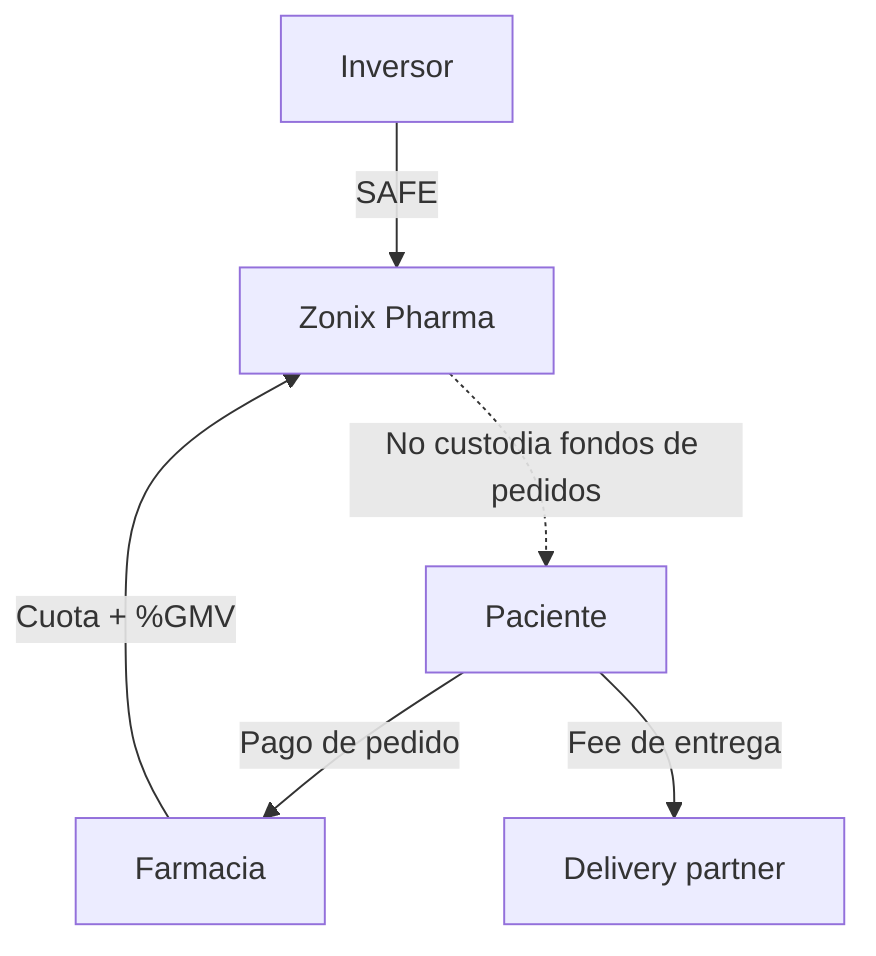

# Reglas y canon — captación stakeholders

> **Para qué sirve:** ancla de lo que **no cambia** por experimentos Café/Kleo.  
> **No es:** plan Alfa/Beta ni forense.  
> Fuente histórica: monolito v1.0 §1 y §3.

## 1. Reglas no negociables

1. **Ask no significa recaudado.** Solo existe capital recibido cuando hay instrumento firmado, condiciones de cierre satisfechas y wire confirmado en cuenta de empresa/escrow.  
2. **Cliente no significa inversor.** Una farmacia paga por plataforma y servicios; no recibe dividendos, profit share, equity ni promesa de recuperar su cuota.  
3. **Socio comercial no significa accionista.** Un partner delivery opera bajo contrato/SLA; no obtiene equity por usar la plataforma.  
4. **Rol operativo no significa cofundador.** Co-CEO es hoy un rótulo operativo. Cualquier equity futuro requiere cap table, vesting y revisión legal.  
5. **Tres universos separados:** SAFE, ingresos/prepagos B2B y fondos de pedidos. Significa contratos y ledgers diferenciados; no obliga por sí solo a tres cuentas bancarias. En el piloto, los fondos de pedidos **nunca entran en Zonix**: el paciente paga directo a farmacia y `delivery_company`.  
6. **Caja cobrada no es revenue ni capital libre.** Un prepago puede crear una obligación de servicio y reconocimiento diferido.  
7. **Sin retornos prometidos.** No usar “recuperas tu inversión”, renta garantizada, revenue share o múltiplos en una oferta a clientes.  
8. **Sin escasez falsa.** El límite de una cohorte debe responder a capacidad de onboarding, soporte y operación.  
9. **Sin cambiar pricing desde una investigación.** Toda modificación de 45/60/70 + 8/7/5 o del waiver exige decisión founder, prueba WTP y reproyección.  
10. **Sin contacto automático.** Este material prepara embudos; ningún agente contacta inversores, farmacias o aliados sin aprobación explícita.

## 2. Canon que no cambia por este experimento

| Concepto | Estado vigente |
|---|---|
| Etapa | Pre-seed / pre-revenue; piloto Valencia |
| Capital | **Ask USD 237.412**, todavía no recaudado |
| Instrumento | SAFE post-money cap **USD 1.582.747** `[PENDIENTE abogado VE]` |
| Equity de referencia | **~15% al convertir si aplica el cap** (`237.412 / 1.582.747`) |
| Fase 0 | T+0→T+90; T+0 ocurre tras condiciones de cierre + wire liberado/utilizable |
| Pricing farmacia | Basic **45 + 8%**, Pro **60 + 7%**, Enterprise **70 + 5%** |
| Waiver | Cuota fija USD 0, meses 1–2, máximo 10 farmacias; GMV se mide |
| Pagos paciente | Directo a farmacia y empresa delivery; no pasan por Zonix |
| Última milla | Partner `delivery_company`; sin flota Zonix |

**Ambigüedad a cerrar:** el contrato y la proyección deben decir expresamente si durante el waiver se cobra o no el componente `%GMV`. Hasta cerrar `CAP-P01`, no prometer una interpretación distinta a una contraparte. Ver [`06_DECISIONES_ABIERTAS.md`](06_DECISIONES_ABIERTAS.md).

## 3. Tres universos de dinero

| Universo | Instrumento | ¿Entra en caja Zonix? | Prohibición principal |
|---|---|---|---|
| Capital | SAFE | Sí, solo tras cierre + wire liberado | No decir «recaudado» ante interés |
| Ingreso B2B | Contrato farmacia | Sí, según cuota/%GMV y reconocimiento | No prometer retorno/equity |
| Pedidos | Pago paciente | No en el piloto | No usar patient float como capital |

## Ver también

- Escenarios de cobro: [`03_ESCENARIOS_S0_S1_S2.md`](03_ESCENARIOS_S0_S1_S2.md)  
- Pack legal: [`../../Lanzamiento/ESTRUCTURA_LEGAL_Y_EQUITY.md`](../../Lanzamiento/ESTRUCTURA_LEGAL_Y_EQUITY.md)  
- Índice: [`../README.md`](../README.md)
