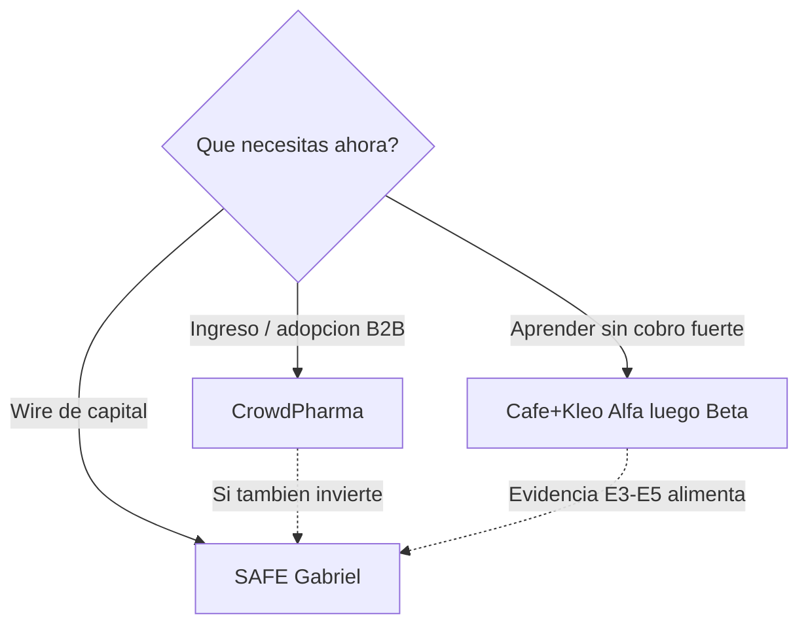

# Comparativa de los 3 métodos de captación

> **Para qué sirve:** ver lado a lado CrowdPharma, Café+Kleo y SAFE Gabriel — pros, contras, similitudes y diferencias — para elegir **uno** por pitch.  
> **No es:** playbook de ejecución de cada método. La ejecución (controles críticos, parada, KPI, FAQ, checklist) está **dentro** de cada `PLAN_*`: CrowdPharma **v1.1**, Alfa/Beta **v1.1**, SAFE **v1.3**.  
> **Canon:** ask SAFE **USD 237.412** (no recaudado) · cap **USD 1.582.747** · equity ref. **~15%** · pricing **45/60/70 + 8/7/5% GMV**.  
> **Sin contacto** hasta `CAP-P09`. SAFE vigente: **15% @ USD 1.582.747** (`CAP-P12` DECIDIDO).

## Lead

Las tres propuestas **no compiten por el mismo cheque**. Cubren problemas distintos:

| Necesidad | Método |
|---|---|
| Compromiso económico de farmacia/socio (ingreso B2B) | **CrowdPharma** |
| Aprender con cohorte chica antes de cobrar (experimento) | **Café+Kleo (Alfa→Beta)** |
| Cerrar capital Lean con inversor (SAFE) | **SAFE Gabriel** |

Mezclar ofertas en el mismo pitch (cupo + equity, o “prueba gratis pero ya eres socio”) rompe el modelo.

---

## 1. Vista de una página

| | CrowdPharma | Café+Kleo (Alfa→Beta) | SAFE Gabriel |
|---|---|---|---|
| **Carril** | B (farmacia) / C (delivery) | B (y C en prueba) | **A** (inversor) |
| **Contraparte** | Farmacia / socio delivery | Farmacia (cohorte ≤10) | Inversor / vehículo |
| **Instrumento** | Piloto, contrato, (futuro) prepago S2 | Alfa = prueba app; Beta = S1 + waiver | SAFE post-money |
| **Qué recibe la contraparte** | Plataforma, onboarding, cupo, soporte | Uso real (Alfa); waiver/contrato (Beta) | Derecho a equity al convertir |
| **Qué no recibe** | Equity, profit share, “recuperas la cuota” | Equity por probar; lifetime/Gamma | Beneficios de cliente “por invertir” |
| **Tipo de dinero** | Ingreso / prepago B2B | Casi cero en Alfa; B2B en Beta | **Capital** (ask 237.412) |
| **Estado** | Propuesta operativa (plan **v1.1**) | Alfa elegible ahora; Beta post-uso; Gamma rechazado (plan **v1.1**) | Canon SAFE **15%** @ 1.582.747 (plan **v1.3**) |
| **Plan** | [`PLAN_CROWDPHARMA.md`](../metodo_crowdpharma/PLAN_CROWDPHARMA.md) | [`PLAN_ALFA_BETA.md`](../metodo_cafe_kleo/PLAN_ALFA_BETA.md) | [`PLAN_SAFE_GABRIEL.md`](../metodo_safe_gabriel/PLAN_SAFE_GABRIEL.md) |

---

## 2. En qué se parecen

| Tema | Los tres |
|---|---|
| Ask Lean | 237.412 es **meta**, no “ya recaudado” |
| Roles | Cliente ≠ inversor; misma persona = **dos instrumentos** |
| Contacto | Sin outreach automático; hace falta `CAP-P09` |
| Pricing menú | No cambian 45/60/70 + %GMV desde un experimento |
| Gates | Criterios de parada / checklist antes de escalar |
| Escasez | Límites por **capacidad** (soporte, onboarding), no FOMO falso |
| Canon pack | No reescriben ESTRUCTURA/BRIEF sin decisión founder versionada |
| Uso | Documentos **internos**; no van al zip inversor por defecto |
| Anti-claims | No prometen retorno garantizado ni valuación “certificada” de mercado |

---

## 3. En qué no se parecen

| Dimensión | CrowdPharma | Café+Kleo | SAFE Gabriel |
|---|---|---|---|
| **Problema que resuelve** | Conseguir compromiso de pago/uso B2B | Validar producto y WTP con poco riesgo | Fondear Fase 0 + burn |
| **Origen de evidencia** | CrowdFarming → adopción de cupo | Videos Café + Kleo | Term Sheet SAFE 15% v2 |
| **Timing típico** | Tras señal cualificada / hacia S1 | Alfa **pre-wire**; Beta tras uso | Tras data room + gates legales; wire = T+0 |
| **Dilución founder** | No | No | Sí (**~15%** si aplica el cap) |
| **Ledger** | Ingreso B2B | Uso / contrato | Capital SAFE |
| **Éxito se mide por** | Cupos adoptados, uso, renovación | Mom-test, uso real, conversión a Beta | Wire + SAFE firmado |
| **Relación con Day-D** | Alimenta pipeline comercial | Reduce riesgo de vender humo | Condiciona T+0 (capital usable) |
| **Gabriel / Morr** | Puede dar **intros** a farmacias | Idem (discovery) | Solo si el rol es **inversor** (pack aliado ≠ SAFE) |

---

## 4. Pros y contras

### CrowdPharma

**Pros**

- Alinea caja B2B con capacidad real (customer-funded).  
- Copy de consumo claro (servicio, no retorno).  
- Escalable a Semilla → Fundadora → (futuro) Anual con gates.  
- No diluye equity.

**Contras**

- No sustituye el ask SAFE: no financia burn solo.  
- Exige plantillas legales/contables antes de cobro serio (`CAP-P01`, abogado).  
- Riesgo de confusión si alguien pide “ser socio” por pagar el cupo.  
- S2/Anual sigue no aprobado hasta datos reales.

### Café+Kleo (Alfa→Beta)

**Pros**

- Menor fricción: Alfa permite aprender **antes** del wire y del cobro fuerte.  
- Criterios de parada explícitos; Gamma (lifetime/cap 800k/exclusividad) ya cerrado.  
- Genera evidencia E3–E5 útil también para carril A.  
- Secuencia clara: prueba → uso → contrato.

**Contras**

- Alfa **no** genera ingreso material ni capital.  
- Si se alarga demasiado, no hay Day-D ni caja.  
- Beta depende de cerrar `%GMV` en waiver (`CAP-P01`).  
- No es el playbook detallado de oferta Semilla/Fundadora (eso es CrowdPharma).

### SAFE Gabriel

**Pros**

- Único método que ataca el **capital Lean** de frente.  
- Separa pack aliado vs inversión (evita vender SAFE “por intros”).  
- Oferta única: **~15%** @ cap **1.582.747**; gates y term sheet mejorado.  
- Mensaje correcto: cap ≠ valuación de mercado.

**Contras**

- Diluye (~**15%** si aplica el cap).  
- Circular cifras distintas al canon MD como si fueran vigentes.  
- Exige entidad, PIIA/IP, abogado; sin eso no hay cierre limpio.  
- No trae farmacias ni pedidos por sí solo.

---

## 5. Cuándo usar cuál

| Situación | Usa | No uses |
|---|---|---|
| Necesitas validar onboarding Rx con ≤10 farmacias ya | **Alfa** (Café+Kleo) | Cobrar Semilla/Fundadora a ciegas |
| Ya hay uso real y quieres contrato + waiver | **Beta** → empaquetar con **CrowdPharma** Fundadora | SAFE en el mismo pitch |
| Quieres cupos/prepago con narrativa de adopción | **CrowdPharma** | Term Sheet 15% |
| Necesitas wire para Fase 0 / burn | **SAFE Gabriel** (canon 15%) | Prometer equity a farmacias |
| Gabriel da intros a farmacias | Pack aliado + Alfa/CrowdPharma | Meter SAFE en la misma reunión |
| Gabriel (u otro) pone capital | **SAFE Gabriel** | Mezclar con descuento de cuota B2B |

---

## 6. Combinaciones permitidas vs prohibidas

| Combinación | ¿OK? | Nota |
|---|---|---|
| Alfa → Beta → CrowdPharma Fundadora | **Sí** | Secuencia natural de aprendizaje a cobro |
| Evidencia Alfa/Beta → pitch SAFE (carril A) | **Sí** | Instrumentos y reuniones **separados** |
| Aliado Gabriel (intros) + más tarde SAFE | **Sí** | Dos roles, dos documentos, dos momentos |
| Semilla/Fundadora + “te doy % de la empresa” | **No** | Cliente ≠ inversor |
| Alfa + formulario público de ronda SAFE | **No** | Sin `CAP-P09`/legal; mezcla señales |
| Pitch único: cupo B2B + SAFE 15% | **No** | Un pitch = un método |
| Presentar el ask como ya recaudado | **No** | Solo post-wire |

---

## 7. Resumen ejecutivo (para decidir hoy)

1. **Operación / farmacias ahora:** Café+Kleo **Alfa** (si aún no hay uso) o **CrowdPharma** (si ya hay señal y quieres compromiso).  
2. **Capital:** SAFE Gabriel @ **1.582.747 / ~15%** (canon pack).  
3. **Nunca** un solo PDF que venda cupo + equity.

---

## 8. Dónde profundizar

| Método | Plan | PDF | Evidencia |
|---|---|---|---|
| CrowdPharma | [`../metodo_crowdpharma/PLAN_CROWDPHARMA.md`](../metodo_crowdpharma/PLAN_CROWDPHARMA.md) | [PDF](../metodo_crowdpharma/PLAN_CROWDPHARMA.pdf) | [`EXT_CROWDFARMING`](../metodo_crowdpharma/evidencia/EXT_CROWDFARMING.md) |
| Café+Kleo | [`../metodo_cafe_kleo/PLAN_ALFA_BETA.md`](../metodo_cafe_kleo/PLAN_ALFA_BETA.md) | [PDF](../metodo_cafe_kleo/PLAN_ALFA_BETA.pdf) | [`EXT_CAFE`](../metodo_cafe_kleo/evidencia/EXT_CAFE.md) · [`EXT_KLEO`](../metodo_cafe_kleo/evidencia/EXT_KLEO.md) |
| SAFE Gabriel | [`../metodo_safe_gabriel/PLAN_SAFE_GABRIEL.md`](../metodo_safe_gabriel/PLAN_SAFE_GABRIEL.md) | [PDF](../metodo_safe_gabriel/PLAN_SAFE_GABRIEL.pdf) | [`EXT_TERM_SHEET_SAFE_15PCT`](../metodo_safe_gabriel/evidencia/EXT_TERM_SHEET_SAFE_15PCT.md) |

**Antes de la jerga:** [`GLOSARIO.md`](GLOSARIO.md) · Hub: [`00_QUE_HACER_AHORA.md`](00_QUE_HACER_AHORA.md)  
Reglas: [`01_REGLAS_Y_CANON.md`](01_REGLAS_Y_CANON.md) · Carriles: [`02_CARRILES.md`](02_CARRILES.md) · CAP: [`06_DECISIONES_ABIERTAS.md`](06_DECISIONES_ABIERTAS.md) · Índice: [`../README.md`](../README.md)
