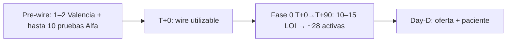

# Calendario y dashboard semanal

> **Para qué sirve:** cuándo ocurre cada fase y qué medir por carril.  
> **No es:** menú Alfa/Beta ni escenarios de pricing.  
> Fuente histórica: monolito v1.0 §8 y §11.

## Dos relojes que no se mezclan



- **Reloj pre-wire:** demo, mom-test, 1–2 evidencias para raise y hasta 10 pruebas controladas de app. Prueba no significa waiver ni WTP.
- **Reloj financiado:** después de T+0, Fase 0 construye oferta y operación hasta ~28 activas / ~35 firmadas al Day-D conforme a [`PLAN_LANZAMIENTO_COMERCIAL.md`](../../Lanzamiento/PLAN_LANZAMIENTO_COMERCIAL.md).
- Beta puede comenzar tras uso real, pero la cohorte S1 de máximo 10 no se convierte en tope comercial permanente.

### Antes del wire

- cerrar demo y evidencia de early adopters;
- completar P0 de due diligence;
- construir pipeline inversor;
- hacer discovery farmacia sin presentar hipótesis como tracción;
- identificar partner delivery;
- preparar scorecards de roles.

No contratar el equipo completo ni ejecutar gasto Fase 0 como si el ask estuviera en caja.

### T+0

Firma del SAFE o depósito bloqueado en escrow **no** activan por sí solos T+0. T+0 existe cuando se cumplen las condiciones suspensivas —incluida PIIA— y hay caja utilizable liberada para el tramo aprobado. Un cierre parcial solo activa Fase 0 si el founder aprueba una reproyección que demuestre suficiencia del tramo; no se ejecuta el presupuesto completo con caja incompleta.

### T+0–T+30

- carril A: confirmación, reporting de 30 días;
- carril B: pipeline e interés cualificado;
- carril C: shortlist y negociación partner;
- carril D: selección/onboarding equipo;
- legal/empresa/HQ/tech según Fase 0.

### T+30–T+60

- carril B: LOI, contratos, catálogo y capacitación;
- carril C: LOI/contrato, KYC y prueba;
- carril D: customer development;
- producto: smoke y preparación Day-D.

### T+60–T+90

- activar farmacias y catálogo;
- probar delivery;
- cerrar gates de pricing, operación y compliance;
- reportar evidencia, no vanity metrics.

### M1+

- medir órdenes, GMV, ingreso, margen, soporte y retención;
- convertir waiver a pago;
- evaluar —no lanzar automáticamente— el escenario de prepago anual;
- escalar demanda paciente solo con oferta operativa.

## Dashboard semanal

| Carril | Métricas leading | Métrica de resultado |
|---|---|---|
| A Inversión | cualificados, respuestas, reuniones, DD | SAFE firmado / condiciones cerradas / wire liberado |
| B Farmacias | entrevistas, demos, LOI, contratos, onboarding | activas + orden + pago + retención |
| C Partners | candidatos, LOI, KYC, pruebas | SLA operativo y entregas |
| D Operación | candidatos, referencias, trials, contratos | hitos 30/60/90 |

Cada número debe guardar fecha, fuente y dueño. No sumar stages incompatibles.

### Fuentes de verdad del pipeline

| Carril | Fuente operativa |
|---|---|
| A Inversión | [`../../Inversionistas/`](../../Inversionistas/) + CRM comparativo |
| B Farmacias | [`VOLCADO_RESPUESTAS_CUESTIONARIO.md`](../../Lanzamiento/VOLCADO_RESPUESTAS_CUESTIONARIO.md) §6 / CRM Sales |
| C Delivery | mismo VOLCADO §7 + REGISTRO P1-10 |
| D Equipo/advisors | mismo VOLCADO §5 |

Cada registro debe tener:

```text
id | contraparte | carril | etapa | dueño | próxima acción
fecha límite | evidencia/enlace | fecha última actualización | estado
```

Regla de unicidad: una contraparte puede aparecer en dos carriles solo con dos registros e instrumentos explícitos. Las métricas de etapa usan conteo de contrapartes únicas dentro de una ventana semanal; no se suman acumulados históricos como pipeline activo.

## North Star (definiciones)

Usar estas fórmulas en el dashboard. Hasta tener cohortes reales, cifras proyectadas = `ASSUMPTION` (ver [`06_DECISIONES_ABIERTAS.md`](06_DECISIONES_ABIERTAS.md) § taxonomía).

| Categoría | Métrica | Fórmula / definición |
|---|---|---|
| Adquisición | Qualified Pharmacy Leads | Prospectos que cumplen ICP |
| Activación | Activation Rate | Farmacias que completan onboarding / farmacias objetivo |
| Uso | WAU Pharmacy | Farmacias activas semanalmente |
| Transacción | GMV | Valor bruto de órdenes procesadas por la plataforma |
| Revenue | MRR | Ingresos recurrentes mensuales **reconocidos** |
| Monetización | Take Rate | Revenue transaccional / GMV |
| Retención | Logo churn | Farmacias perdidas / base inicial (ventana definida) |
| Ventas | CAC | Gasto comercial atribuible / nuevas farmacias **pagadoras** |
| Payback | CAC Payback | CAC / margen de contribución mensual por farmacia |
| Operación | Time-to-value | Tiempo desde onboarding hasta primer valor medible |

### Horizontes 180 y 365 (post–Day-D)

No son un segundo reloj de fundraising. Tras Day-D (~T+90):

- **~180 días (M1+):** repetibilidad — CAC, payback, retención; playbook comercial.  
- **~365 días:** escala controlada + forecast; preparación Seed / data room Seed.

Hitos que compra el ask: [`07_QUE_COMPRA_EL_ASK.md`](07_QUE_COMPRA_EL_ASK.md).

## Unit economics (fórmulas cortas)

Sin inventar LTV alto. Hasta cohortes reales, cualquier número proyectado = `ASSUMPTION`.

| Concepto | Fórmula |
|---|---|
| ARPF (aprox.) | Cuota fija mensual reconocida + (take rate × GMV atribuible a la farmacia) |
| Margen contribución / farmacia / mes | ARPF − costo variable atribuible (soporte, payment, delivery fee neto si aplica) |
| CAC | Gasto comercial atribuible / nuevas farmacias **pagadoras** |
| CAC payback (meses) | CAC / margen de contribución mensual por farmacia |
| Logo churn | Farmacias perdidas / base inicial (ventana definida) |

**No uses** lifetime de Café/Kleo ni LTV de terceros como benchmark Zonix. Puente ask → hitos: [`07_QUE_COMPRA_EL_ASK.md`](07_QUE_COMPRA_EL_ASK.md). Embudo inversor: [`PLAN_SAFE_GABRIEL.md`](../metodo_safe_gabriel/PLAN_SAFE_GABRIEL.md) §5.1.

## Ver también

- Carriles: [`02_CARRILES.md`](02_CARRILES.md)  
- Qué compra el ask: [`07_QUE_COMPRA_EL_ASK.md`](07_QUE_COMPRA_EL_ASK.md)  
- Investor Case: [`09_INVESTOR_CASE.md`](09_INVESTOR_CASE.md)  
- Riesgos: [`10_RIESGOS_Y_CONTROLES.md`](10_RIESGOS_Y_CONTROLES.md)  
- Índice: [`../README.md`](../README.md)
