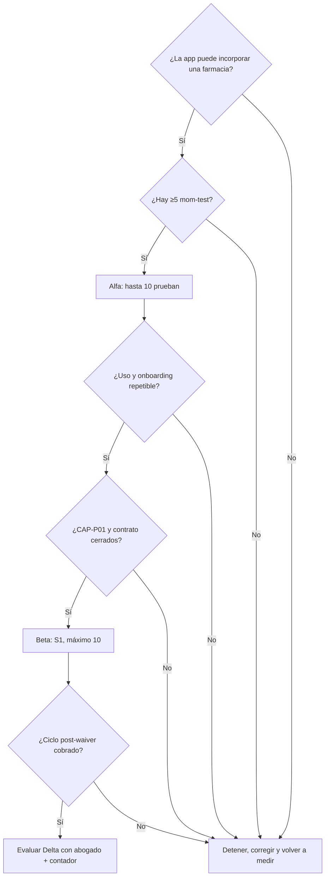

# Decisión Alfa / Beta / Gamma / Delta

> **Prefacio (léeme primero)**  
> **Para quién:** tú, cuando quieres **aprender con hasta 10 farmacias** antes de cobrar fuerte o antes de que entre el capital del inversor.  
> **No es para:** cerrar el SAFE ni vender cupos Semilla/Fundadora a ciegas (ver CrowdPharma).  
> **En una frase de calle:** “Primero prueban la app (Alfa); las que sí usan firman contrato con 2 meses de cuota fija en cero (Beta). Lo raro (Gamma) no se hace.”  
> **Antes de seguir:** [`GLOSARIO`](../_comun/GLOSARIO.md) · [`Comparativa`](../_comun/04_COMPARATIVA_TRES_METODOS.md) · [`Qué hacer ahora`](../_comun/00_QUE_HACER_AHORA.md)

> **Estado:** `[PROPUESTA OPERATIVA — NO AUTORIZA CONTACTO]`  
> **Versión:** 1.1 — 27 agosto 2026 (paridad playbook: controles + KPI + FAQ + checklist)  
> **Para qué sirve:** menú del experimento Café + Kleo y cuál elegir / cómo ejecutarlo.  
> **No es:** forense de videos (eso está en [`evidencia/`](evidencia/)).  
> **Canon intacto:** ask SAFE **USD 237.412** (no recaudado) · cap **USD 1.582.747** · equity ref. **~15%** · pricing **45/60/70 + 8/7/5% GMV**.  
> **Sin contacto** hasta `CAP-P09` + OK explícito.  
> **Evidencia:** [`EXT_CAFE.md`](evidencia/EXT_CAFE.md) · [`EXT_KLEO.md`](evidencia/EXT_KLEO.md)  
> **Decisión recomendada:** Alfa ahora → Beta después del uso. Delta = hipótesis post-cobro. Gamma cerrado.  
> **Playbook comercial (cupos):** [`PLAN_CROWDPHARMA.md`](../metodo_crowdpharma/PLAN_CROWDPHARMA.md) — no reemplaza esta matriz.  
> **Capital:** [`PLAN_SAFE_GABRIEL.md`](../metodo_safe_gabriel/PLAN_SAFE_GABRIEL.md) — instrumento aparte.

## Vista rápida

| Plan | ¿Elegible ahora? | Qué es |
|---|---|---|
| **Alfa** | **Sí** | Hasta 10 prueban la app (pre-wire) |
| **Beta** | Después del uso | S1: contrato + waiver, máx. 10 |
| **Gamma** | **No** | Lifetime / cap 800k / exclusividad / sprint 4 semanas |
| **Delta** | **No** | S2 prepago anual tras cobro real |

### Tres controles críticos (blindaje)

| # | Riesgo | Control |
|---|---|---|
| 1 | **Alfa confundido con cobro o equity** | Alfa = aprendizaje de producto. **No** depósito Semilla, **no** waiver, **no** SAFE. Probar ≠ WTP. |
| 2 | **Beta prematuro** | Beta solo tras **uso real** (catálogo + pedido) y `CAP-P01` cerrado (`%GMV` sin ambigüedad). Si falta → seguir en Alfa o solo discovery. |
| 3 | **Roles mezclados** (farmacia también “quiere invertir”) | Misma persona = **dos instrumentos**. Prueba/contrato → este método o CrowdPharma. Capital → SAFE. Nunca “prueba gratis → socio del SAFE”. |

---

## Plan Alfa — prueba de producto pre-wire

**Encaje:** fases 1–2 de Kleo + membresía de consumo del caso Café + las 10 farmacias como **prueba de app**, no como contrato ni waiver.

**Pasos**

1. Ejecutar ≥5 mom-test reales antes de publicar contenido de «problemas de farmacia».
2. Usar una CTA inbound: «evaluación / prueba de la app», con formulario fuera de Flutter/Laravel.
3. Cualificar decisor, sede Valencia, catálogo y farmacéutico antes de contar un lead.
4. Permitir que hasta 10 farmacias prueben catálogo, flujo Rx y pedido controlado.
5. Registrar incidencias por farmacia y no ampliar mientras se repitan fallos críticos.
6. Convertir a Beta solo las que usen de verdad; probar no demuestra WTP.
7. Usar evidencia E3–E5 en carril A; no usar un formulario público de ronda.
8. Probar un `delivery_company` con SLA no exclusivo.

**Criterios de parada**

- el formulario atrae pacientes/curiosos, no decisores B2B;
- el abandono del formulario exige simplificarlo;
- el contenido genera atención pero cero interés cualificado;
- los **mismos fallos críticos** (catálogo, Rx, pedidos) se repiten en **>2 farmacias** sin fix de fondo;
- no hay **`CAP-P09` + OK founder** para outreach outbound o scripts;
- el producto todavía no puede incorporar una farmacia con seguridad.

**Código:** ninguno. `SubscriberController` es una lista de email web/paciente y no se amplía para este flujo.

## Plan Beta — Fundadoras S1 después del uso

**Encaje:** fases 3–4 recortadas de Kleo + cohorte Café limitada por capacidad, sin retorno. En CrowdPharma = paquete **Fundadora**.

**Pasos**

1. Un subconjunto de Alfa que ya usó la app firma contrato marco.
2. Aplicar el waiver canónico: cuota fija USD 0 durante meses 1–2, máximo 10; `%GMV` sujeto a `CAP-P01`.
3. Ofrecer white-glove acotado: visitas, capacitación, minutas y canal de feedback; no soporte 24/7.
4. Medir catálogo activo, primera orden, GMV, soporte, conversión a pago y retención.
5. No ampliar S1 por encima de 10; la expansión hacia ~28 pertenece al reloj post-wire.
6. Mantener S2/lifetime fuera. Si una farmacia invierte, firma un SAFE separado.

**Criterios de parada**

- no comunicar el waiver mientras `%GMV` siga ambiguo (`CAP-P01` abierto);
- onboarding no repetible;
- presentar S1 como capital levantado;
- usar FOMO como «quedan tres cupos»;
- prometer lock indefinido, analytics inexistente o posicionamiento preferente;
- sin **`CAP-P09`** (o sin plantilla contractual `CAP-P05`) si el outreach es outbound de venta.

Detalle S1: [`03_ESCENARIOS_S0_S1_S2.md`](../_comun/03_ESCENARIOS_S0_S1_S2.md).

### Puente Alfa → Semilla vs Beta / Fundadora

Tras uso real en Alfa, elige **un** camino comercial (no ambos en el mismo pitch):

| Situación | Siguiente paso | Dónde |
|---|---|---|
| Quiere compromiso económico acotado **antes** de waiver S1 | CrowdPharma **Semilla** (fee/depósito con promesa entregable) | [`PLAN_CROWDPHARMA`](../metodo_crowdpharma/PLAN_CROWDPHARMA.md) |
| Ya usó de verdad y acepta contrato + waiver 0×2 | **Beta** = CrowdPharma **Fundadora** | Este plan + CrowdPharma §5.1 |
| Quiere poner capital | **SAFE** (otra reunión) | [`PLAN_SAFE_GABRIEL`](../metodo_safe_gabriel/PLAN_SAFE_GABRIEL.md) |

## Plan Gamma — control negativo, no elegir

| Propuesta | Por qué se rechaza |
|---|---|
| USD 45 de por vida | Lock indefinido; contradice waiver 0×2 |
| Segunda cohorte a USD 60 por «subida» | 60 ya es Pro; un video no cambia el menú |
| Rolling SAFE cap 1.582.747→800k | Otro instrumento; el ask vigente no está recaudado |
| Exclusividad logística | Viola guardrail del piloto |
| 10 firmas = fondear SAFE | Cliente ≠ inversor; T+0 exige wire |
| Posts/DM automáticos en cuatro semanas | Viola regla de no contacto automático |
| White-glove 24/7 | No existe capacidad financiada |

Un «sí» genérico no rehabilita Gamma. Cualquier outreach requiere un plan nuevo, pipeline real (`CAP-P06`) y OK explícito (`CAP-P09`).

## Plan Delta — S2 prepago anual futuro

Delta es el escenario S2: membresía de consumo cobrada por adelantado y asignada a servicios reales. **No es opción ahora.**

Solo se reabre después de Beta cuando existan: uso real, ciclo post-waiver cobrado, margen observado, política de refund, contador, abogado y reproyección founder. No diluye el cap SAFE ni convierte clientes en inversionistas.

## Matriz de elección

| Criterio | Alfa | Beta | Gamma | Delta |
|---|---|---|---|---|
| Encaje con canon | Alto | Alto si cierra `CAP-P01` | Nulo | Alto después de gates |
| Encaje con «10 prueban» | Alto | Es contrato, no prueba | Mezcla SAFE | Nulo ahora |
| Prueba WTP | No | Parcial: waiver ≠ cobro | No | Sí, con cobro |
| Exige wire | No | No para las 10 S1 | Finge T+0 | No |
| Riesgo legal | Bajo si inbound | Medio por copy contractual | Alto | Alto sin asesoría |
| Código app | No | No | No | No |
| ¿Elegible ahora? | **Sí** | **Después de uso** | **No** | **No** |

---

## KPI semanales del experimento (`ASSUMPTION`)

Metas de **aprendizaje**, no de raise. Dashboard: [`05_CALENDARIO_Y_DASHBOARD.md`](../_comun/05_CALENDARIO_Y_DASHBOARD.md). Números de meta = `ASSUMPTION` hasta cohorte `FACT`.

| Indicador | Qué cuenta | Señal de salud |
|---|---|---|
| Mom-tests documentados | ≥5 antes de contenido outbound | Sin esto → no Alfa masivo |
| Leads cualificados | Decisor + Valencia + catálogo + farmacéutico | Formulario no es waitlist paciente |
| Farmacias en Alfa | Cupos 1–10 activos en prueba | Capacidad de soporte |
| Incidencias críticas abiertas | Fallos catálogo/Rx/pedido sin fix | Si >2 farmacias mismo fallo → **parada** |
| Conversión a Beta | Subconjunto con uso real + contrato | Probar ≠ WTP |
| E4 (primera orden real) | Pedido medible | Evidencia para carril A / CrowdPharma |

---

## FAQ corto

**¿Esto es inversión?**  
No. Alfa es prueba de app; Beta es contrato de servicio con waiver. Capital = SAFE en otra conversación.

**¿Por qué gratis / cuota 0?**  
Alfa no cobra. Beta: waiver **USD 0** meses 1–2 (máx. 10) para aprender con uso real; `%GMV` = `CAP-P01`. No es lifetime.

**¿Cuándo cobro Semilla vs cuándo Beta?**  
Semilla = compromiso acotado vía CrowdPharma sin exigir waiver S1. Beta/Fundadora = post-uso + contrato + waiver. Un camino por pitch.

**¿Por qué solo 10?**  
Capacidad de onboarding white-glove / soporte, no FOMO de marketing.

**¿Qué mide el éxito de Alfa?**  
Onboarding repetible + uso (idealmente E4) + log de incidencias cerrado — **no** “firmamos 10” ni “ya recaudamos”.

**¿Por qué no Gamma?**  
Lifetime, exclusividad, SAFE por firmas de farmacia y sprints de DM automático rompen canon y `CAP-P09`.

---

## Calendario corto pre-wire (condicionado a CAP-P09)

| Ventana | Acciones | No hacer |
|---|---|---|
| Días 1–14 | ≥5 mom-test; demo usable; formulario inbound; ficha “prueba app” | Outreach masivo; vender Semilla/Fundadora a ciegas |
| Días 15–45 | Hasta 10 en Alfa; log de incidencias; 0–N Semilla solo si hay entrega (CrowdPharma) | Gamma; formulario de ronda SAFE; Beta sin uso |
| Tras uso real | Decidir Semilla **o** Beta/Fundadora; armar E3–E5 | Mezclar cupo + SAFE en la misma hoja |

---

## Checklist del founder (imprimible)

**Antes**

- [ ] `CAP-P09` autorizado (o solo materiales, sin contacto).  
- [ ] Demo OK + ≥5 mom-test.  
- [ ] Controles críticos verificados (Alfa ≠ cobro/equity; Beta post-uso + `CAP-P01`; SAFE aparte).  
- [ ] Formulario inbound = prueba/evaluación B2B (no waitlist paciente).  
- [ ] Cupos Alfa 1–10 en hoja.

**Cada semana** (KPI)

- [ ] Leads cualificados / # en Alfa / incidencias / ¿parada?  
- [ ] ¿Alguna conversión a Beta o Semilla justificada?  
- [ ] Copy: ¿se filtró “inversión / retorno / socios”? Corregir.

**Puente a otros métodos**

- [ ] CrowdPharma solo con promesa entregable (`CAP-P05` si hay cobro).  
- [ ] SAFE solo con evidencia E3+ y reunión separada.

---

## Ver también

- Qué hacer ahora: [`00_QUE_HACER_AHORA.md`](../_comun/00_QUE_HACER_AHORA.md)  
- CrowdPharma (Semilla/Fundadora): [`PLAN_CROWDPHARMA.md`](../metodo_crowdpharma/PLAN_CROWDPHARMA.md)  
- SAFE (capital): [`PLAN_SAFE_GABRIEL.md`](../metodo_safe_gabriel/PLAN_SAFE_GABRIEL.md)  
- S0/S1/S2: [`03_ESCENARIOS_S0_S1_S2.md`](../_comun/03_ESCENARIOS_S0_S1_S2.md)  
- Evidencia videos: [`evidencia/`](evidencia/)  
- Decisiones (`CAP-P09`): [`06_DECISIONES_ABIERTAS.md`](../_comun/06_DECISIONES_ABIERTAS.md)
