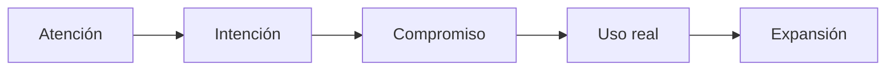

# Evidencia — video Kleo / método pre-lanzamiento (EXT-004)

> **Para qué sirve:** respaldo del reel Instagram y qué se adopta en Zonix.  
> **No es plan de acción.** Decisión: problema → señal → cohorte chica → uso → expansión.  
> ID: EXT-004 + Anexo B del monolito v1.0.

## Identificación

| Campo | Valor |
|---|---|
| Reel | [Instagram DYHjRnHPZLB](https://www.instagram.com/reels/DYHjRnHPZLB/) |
| Autor de la pieza | @nivedan.ai; no Rob Hoffman |
| Naturaleza | Anuncio Miro / lead magnet (`#ad`, `#MiroPartner`) |
| Duración | ~1:26 |
| Método narrado | Cuatro fases de waitlist/cohorte |
| B-roll | Tablero con seis playbooks; no es el contenido literal del audio |

Fuente visual + MP4 local + ASR faster-whisper. Es un anuncio corto; **no** es una auditoría de ingresos de Kleo.

## Método útil (sin cifras ajenas)

| Fase | Mecanismo | Adaptación Zonix |
|---|---|---|
| 1 | Contenido de problema, no pitch | Hablar de quiebres B2B confirmados por mom-test |
| 2 | Señal de interés identificable | Formulario inbound de evaluación/prueba, no waitlist paciente |
| 3 | Cohorte chica que se pueda atender | Alfa: hasta 10 prueban la app; Beta: solo después del uso |
| 4 | Segunda tanda tras aprender | Escalar post-wire si el onboarding es repetible |

## Claims y reconciliación

| Claim | Corrección / límite |
|---|---|
| 61k MRR / 53 días | Claim del founder; otras fuentes dicen 62k / 3 meses |
| 12k waitlist | Fuentes del equipo varían 10–20k+ |
| 500 × USD 59 | 29,5k; compatible con «~30k en 4 días» |
| segunda tanda 500 × USD 79 | 39,5k; total teórico **69.000**, no 61k |
| USD 59 lifetime | Fuentes cercanas describen USD 59 **por mes** con precio bloqueado |
| «antes de existir» | Kleo 1.0 ya reportaba ~60–70k usuarios |
| crecimiento orgánico desde cero | Jake ~180k y Lara ~300k seguidores; distribución previa |

El dashboard visual muestra USD 61.910; es un claim del caso, no un estado financiero auditado. Un snapshot con ~400 en la segunda tanda podría aproximar 61,1k: la discrepancia no demuestra fraude, pero **impide usar 61k como benchmark**.

Waitlist 10–20k+, rebuild ~4 semanas y 53 días/3 meses son relojes de fuentes distintas; **no** se trasladan a la Fase 0 T+90.

## Seis playbooks ≠ cuatro fases del reel

El podcast Rob Hoffman + Greg Isenberg trata seis estrategias distintas (Waitlist, Wave Surfer, Language, AI Search, Signal, High-ticket Ads). Para captación piloto Zonix solo se conserva el orden de señales del primero; los otros cinco **no** se implementan como método.

## Clasificación

**MANTENER**

- problema → señal cualificada → cohorte atendible → aprendizaje → expansión;
- unidad de aprendizaje = farmacia, no usuario SaaS;
- contenido B2B + mom-test + formulario inbound fuera de la app;
- log de incidencias y gate de no ampliar mientras se repitan fallos críticos;
- evidencia E3–E5 para el pitch, sin convertir farmacias en inversionistas.

**CORREGIR**

- escasez → capacidad real, no FOMO;
- «segunda tanda más cara» → menú 45/60/70 vigente, sin cambios por el video;
- 50+ llamadas SaaS → visitas/minutas proporcionales a un beachhead de hasta 10;
- pre-launch → acceso limitado con uso real, no «producto inexistente».

**DESCARTAR**

- 61k, 12k, 500, 59/79/99 como metas Zonix;
- lifetime, CTA «comenta LAUNCH», tablero Miro como prueba y waitlist masiva de pacientes;
- Rolling SAFE, cap 800k, exclusividad logística y calendario de cuatro semanas;
- feature waitlist en Flutter/Laravel o reutilizar `SubscriberController` para farmacias.

## Fuentes y límites

- Reel/ASR: fuente de las cuatro fases; no de los seis playbooks.
- Podcast Rob Hoffman + Greg Isenberg (`youtu.be/rO3dIBMXD2g`): claims del equipo; no auditoría.
- Indie Hackers / Cam Trew: audiencia previa, Kleo 1.0, USD 59/mes; URL exacta pendiente.
- Modash: métricas del reel; no demuestra eficacia.
- Goal Group, HeyCatch, HN repost y Justia Ley de Medicamentos: no usar como prueba externa del método.

## Decisión Zonix

**Adoptado:** problema B2B → señal cualificada → hasta 10 pruebas → uso medido → Beta si es repetible.  
**No adoptado:** waitlist paciente, FOMO, lifetime, subida automática de precios, 61k, seis playbooks, ads high-ticket, formulario público de SAFE y cualquier feature waitlist.

Volver: [`README.md`](../README.md) · decisión: [`../PLAN_ALFA_BETA.md`](../PLAN_ALFA_BETA.md)
