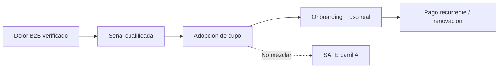

# Método CrowdPharma — Adopción de Farmacia / Socio Fundador

> **Prefacio (léeme primero)**  
> **Para quién:** tú, cuando quieres que una farmacia o partner **pague o se comprometa** por usar la plataforma (ingreso B2B).  
> **No es para:** pedir capital a un inversor (eso es SAFE) ni solo “probar la app gratis” (eso es Alfa).  
> **En una frase de calle:** “Reserva un cupo de farmacia → te damos onboarding y capacidad; pagas por servicio, no por acciones.”  
> **Antes de seguir:** [`GLOSARIO`](../_comun/GLOSARIO.md) · [`Comparativa`](../_comun/04_COMPARATIVA_TRES_METODOS.md) · [`Qué hacer ahora`](../_comun/00_QUE_HACER_AHORA.md)

> **Estado:** `[PROPUESTA OPERATIVA — NO AUTORIZA CONTACTO]`  
> **Versión:** 1.1 — 27 agosto 2026 (controles críticos + criterios de parada + KPI comerciales; destilado DOCX plan-operativo)  
> **Para qué sirve:** plan detallado y fácil de ejecutar para conseguir **compromiso económico B2B** (farmacias y socios) inspirado en crowdfarming, **sin** mezclarlo con inversión.  
> **Canon intacto:** ask SAFE **USD 237.412** (no recaudado) · cap **USD 1.582.747** · equity ref. **~15%** · pricing **45/60/70 + 8/7/5% GMV**.  
> **Evidencia:** [`evidencia/EXT_CROWDFARMING.md`](evidencia/EXT_CROWDFARMING.md)  
> **No es dictamen legal/contable.** Abogado y contador cierran contratos, refunds y reconocimiento.  
> **Alfa/Beta:** detalle en [`PLAN_ALFA_BETA.md`](../metodo_cafe_kleo/PLAN_ALFA_BETA.md) — este MD no fusiona el experimento.

---

## 1. En una frase

En CrowdFarming “adopta un árbol → recibes fruta”.  
En Zonix **CrowdPharma**: “adopta un **cupo de farmacia/socio fundador** → recibes **plataforma, onboarding y capacidad garantizada**”.  
El dinero que entra es **prepago / piloto / contrato** (ingreso B2B), **no** capital SAFE.



---

## 2. Qué es / qué no es

| Sí es | No es |
|---|---|
| Customer-funded B2B (demanda anticipada) | Crowdfunding de equity / valores |
| Coordinación oferta–demanda del piloto | Método oficial de CrowdFarming.com |
| Camino comercial hacia S1 (y S2 solo tras gates) | Sustituto del ask SAFE 237.412 |
| Oferta lucrativa por **valor operativo** | Promesa de TIR, dividendos o “recuperas lo pagado” |
| Cupos limitados por **capacidad de soporte** | FOMO / escasez falsa de marketing |

| Quién aporta dinero | Instrumento | Recibe | No recibe |
|---|---|---|---|
| Farmacia | Piloto / contrato / (futuro) prepago | Servicio, cupo, white-glove, métricas | Equity, profit share |
| Socio delivery | Fee activación / LOI+SLA | Flujo de órdenes, prueba, prioridad piloto | Equity por volumen |
| Inversor | **SAFE** (carril A) | Derechos del SAFE | Beneficios de cliente “por invertir” |

Misma persona en dos roles = **dos instrumentos** ([`02_CARRILES.md`](../_comun/02_CARRILES.md)).

---

## 3. Reglas no negociables (CrowdPharma)

Además de [`01_REGLAS_Y_CANON.md`](../_comun/01_REGLAS_Y_CANON.md):

1. **Copy de consumo, no de inversión.** Prohibido: “invierte”, “socio capitalista”, “retorno”, “rentabilidad garantizada”, “recuperas tu cuota”.  
2. **Promesa entregable.** No cobrar sin definir qué se entrega, cuándo y qué pasa si falla.  
3. **Reserva de cumplimiento.** No gastar el 100% del dinero anticipado; separar pasivo de servicio.  
4. **Máximo 10 fundadoras** en cohorte S1; el límite es capacidad, no hype.  
5. **Sin crowdfarming de pacientes** ni waitlist masiva en la app.  
6. **Sin contacto** hasta `CAP-P09` + OK explícito.  
7. **S2 / paquete Anual** permanece no aprobado hasta gates + `CAP-P03`/`CAP-P04`.  
8. **No cambia** 45/60/70 ni el SAFE sin decisión founder versionada.

### 3.1 Tres controles críticos (blindaje)

Destilado del plan operativo B2B 27 ago. Sin estos, no hay cobro limpio.

| # | Riesgo | Control |
|---|---|---|
| 1 | **Roles mezclados** (farmacia/partner también “quiere invertir”) | Misma persona = **dos instrumentos** y dos conversaciones. Cupo → este método. Capital → SAFE ([`PLAN_SAFE_GABRIEL`](../metodo_safe_gabriel/PLAN_SAFE_GABRIEL.md)). Nunca descuento de cuota “por aportar capital”. |
| 2 | **Cobro sin promesa** | Cero depósito/fee/prepago sin definir entrega, plazos y **path de refund** (`CAP-P05`). Si falta → solo Alfa (prueba sin cobro). |
| 3 | **Ledger mezclado con SAFE** | Caja B2B (Semilla/Fundadora) **separada** del ask SAFE. Nunca presentar N×P ni anticipos como “capital levantado” / “ya recaudamos 237k”. |

---

## 4. Qué necesitamos antes de vender una adopción

| Requisito | Por qué | Estado típico |
|---|---|---|
| Demo 3–5 min usable | Sin entrega no hay CrowdPharma | Gate producto |
| ≥5 mom-test B2B documentados | Dolor real, no pitch inventado | Gate discovery |
| Capacidad onboarding ≤10 | Cupo creíble | Operación |
| Formulario inbound fuera de la app | Señal cualificada (Kleo) | Proceso |
| `CAP-P01` cerrado si se menciona waiver | No ambigüedad %GMV | Contrato |
| Plantilla LOI/contrato `[PENDIENTE abogado]` | Obligación clara | Legal |
| Política refund / cancelación | Confianza + IFRS 15 | Legal/contador |
| Ledger B2B separado del SAFE | Tres universos de dinero | Finanzas |
| Script de visita sin palabras de “inversión” | AppSec/copy | Founder |

Si falta algo de la tabla → **NO-GO** de cobro anticipado; solo Alfa (prueba sin waiver) según [`PLAN_ALFA_BETA.md`](../metodo_cafe_kleo/PLAN_ALFA_BETA.md).

---

## 5. La oferta (qué se vende) — atractiva y lucrativa en valor operativo

### 5.1 Paquetes

| Paquete | Quién | Qué paga / compromete | Qué recibe | Estado |
|---|---|---|---|---|
| **Semilla** | Farmacia en prueba | Depósito parcial o mes 1 con descuento operativo acotado; o piloto 30–60 días con fee de activación bajo | Acceso app, onboarding básico, 1 visita/capacitación, canal soporte | Elegible tras demo + mom-test |
| **Fundadora** | Farmacia cohorte | Contrato marco + waiver canónico (cuota fija **USD 0** meses 1–2, máx. **10**; `%GMV` = `CAP-P01`) | White-glove, prioridad de agenda, co-diseño, reporte del piloto, case study con consentimiento, acceso Day-D del programa | Tras **uso real** (Alfa→Beta) |
| **Anual anticipado** | Farmacia post-validación | Prepago anual asignado a prestaciones (onboarding, panel, soporte) | Misma lógica S2: servicio por adelantado + reserva | **`[NO APROBADO]`** hasta gates S2 |
| **Socio Ruta** | `delivery_company` | Fee de activación / depósito de prueba o LOI+SLA | Integración al flujo, prueba operativa, prioridad de volumen del piloto, dashboard | Paralelo a farmacias; sin exclusividad |

**Precios de referencia (canon):** Basic **45 + 8%**, Pro **60 + 7%**, Enterprise **70 + 5%**. CrowdPharma no inventa un menú paralelo.

### 5.2 Por qué es “lucrativo” para quien entra (sin rentismo)

Se vende **retorno operativo**, no financiero. Ejemplos de argumentos (siempre con supuestos y “no garantizado”):

| Dolor típico farmacia VE | Qué gana con el cupo | Cómo se mide |
|---|---|---|
| Pedidos desordenados / WhatsApp caótico | Flujo digital + trazabilidad | Órdenes completadas / semana |
| Rx y validación lentas | Flujo Rx en plataforma | Tiempo a despacho |
| Poca visibilidad de demanda | Catálogo online + pacientes del piloto | GMV / primeras órdenes |
| Capacitación cara | White-glove fundadora incluido en cohorte | Horas de soporte vs errores |
| Riesgo de pagar SaaS sin probar | Waiver 0×2 (Fundadora) o Semilla acotada | Conversión a pago post-mes 2 |

**Frase permitida:** “Entras para **usar y medir**; si no aporta, sales según contrato.”  
**Frase prohibida:** “Entras para **ganar dinero** con Zonix / recuperar la cuota.”

### 5.3 Beneficios permitidos vs prohibidos

**Permitidos:** prioridad de agenda; capacitación; canal founder; co-diseño; métricas del piloto; case study con OK; cupo por capacidad.

**Prohibidos:** equity; dividendos; profit share; TIR; exclusividad territorial indefinida; analytics inexistente; posicionamiento preferente no construido; FOMO (“quedan 3”); analogías Flyfish / “inversión en cafetería”.

---

## 6. Cómo convencer (persuasión B2B)

### 6.1 Guion de 6 pasos (visita o llamada)

1. **Problema:** “¿Qué se rompe hoy al vender con delivery / Rx / stock?” (mom-test; callar y anotar).  
2. **Prueba:** demo 3–5 min con un pedido controlado.  
3. **Cupo:** “Solo podemos incorporar bien hasta 10 en esta cohorte; el límite es soporte, no marketing.”  
4. **Oferta:** Semilla o Fundadora según si ya usó la app.  
5. **Transparencia de precio:** mostrar 45/60/70 + %GMV; si Fundadora, explicar waiver **sin** ambigüedad (`CAP-P01`).  
6. **Cierre blando:** LOI o fecha de onboarding; nunca “invierte hoy”.

### 6.2 Objeciones frecuentes

| Objeción | Respuesta |
|---|---|
| “¿Esto es inversión?” | “No. Es contrato de servicio de plataforma. Si quieres capital, es otro instrumento (SAFE) y otra conversación.” |
| “¿Recupero lo que pago?” | “No. Pagas por uso y soporte. Mides si te conviene con órdenes y tiempo.” |
| “¿Por qué solo 10?” | “Porque el onboarding white-glove no escala en el piloto; si abrimos más, baja la calidad.” |
| “¿Exclusividad en mi zona?” | “No en piloto. Puedes ser case study; no bloqueamos el mapa.” |
| “¿Y si no funciona?” | “Contrato con salida/refund según plantilla legal; no pedimos fe ciega.” |
| “Pásame un % de las ganancias” | “No. Cliente ≠ accionista. Canon cerrado.” |

### 6.3 Embudo CrowdPharma (carril B)

1. Prospecto Valencia (censo / referidos).  
2. Mom-test.  
3. Demo.  
4. Reacción a pricing documentada.  
5. **Adopción Semilla** o compromiso LOI.  
6. Uso real (catálogo + pedido).  
7. **Adopción Fundadora** (Beta/S1) si gates OK.  
8. Factura pagada / retención.  
9. (Futuro) evaluar Anual solo post-cobro.

Señal mínima para contar un lead: decisor + sede Valencia + catálogo + farmacéutico colegiado disponible.

### 6.4 Script WhatsApp (borrador, tono pharma)

> Hola [Nombre], soy [Founder] de **Zonix Pharma**. Estamos armando una cohorte chica de farmacias en Valencia para probar pedidos + Rx en app (máx. 10, por capacidad de soporte).  
> No es inversión ni sociedad: es **prueba de plataforma** con acompañamiento.  
> ¿Te sirve una demo de 10 minutos esta semana?

---

## 7. Pasos operativos (checklist de ejecución)

Estilo CrowdFarming § mecánica, adaptado:

| # | Paso | Dueño | Evidencia |
|---|---|---|---|
| 1 | Definir “unidad productiva” = 1 farmacia o 1 partner delivery | Founder | Ficha ICP |
| 2 | Crear ficha pública interna (problema, qué incluye, precio, límites, refund) | Founder + UX writer | 1 página |
| 3 | Abrir CTA inbound “evaluación / adopción de cupo” (fuera de Flutter) | Ops | Formulario |
| 4 | Cualificar leads (decisor, sede, catálogo, farmacéutico) | Sales/founder | CRM §6 VOLCADO |
| 5 | Asignar cupo (1…10) y fecha de onboarding | Ops | Ledger cupos |
| 6 | Firmar LOI/contrato según paquete | Legal/founder | PDF firmado |
| 7 | Cobrar depósito/fee **solo** si hay promesa entregable | Finanzas | Recibo + pasivo |
| 8 | Onboarding: catálogo, usuarios, Rx smoke | CS/tech | Checklist |
| 9 | Primera orden real | Farmacia + delivery | E4 |
| 10 | Reporte semanal a la farmacia | CS | PDF/minuta |
| 11 | Conversión a pago post-waiver / renovación | Finanzas | Factura |
| 12 | Decidir ampliar o parar (gates) | Founder | GO/NO-GO |

**Código app:** no hace falta feature “crowdfarming” ni waitlist. `SubscriberController` no se reutiliza para farmacias.

---

## 8. Economía para Zonix (sin sustituir el SAFE)

CrowdPharma mejora **caja operativa y evidencia de mercado**; el raise sigue siendo SAFE.

```text
N  = farmacias/socios con adopción pagada o contractual en ventana
P  = ticket del paquete (fee, depósito neto, o cuota reconocible)
cash_collected     = suma cobrada
contract_liability = parte aún no prestada
reserve_required   = refunds + cumplimiento + contingencia
cash_usable        = cash_collected − reserve_required − impuestos aplicables
```

**Reglas:**

- Umbral mínimo antes de gastar en marketing outbound: p. ej. **≥3 adopciones Semilla con uso** o **≥1 Fundadora con E4**; ajustar con founder (no inventar P10/P50/P90).  
- Interés verbal ≠ cash.  
- Nunca presentar N×P como “capital levantado”.  
- Evidencia E3–E5 alimenta carril A ([`02_CARRILES.md`](../_comun/02_CARRILES.md) escalera).

Detalle S0/S1/S2: [`03_ESCENARIOS_S0_S1_S2.md`](../_comun/03_ESCENARIOS_S0_S1_S2.md).

### 8.1 KPI comerciales semanales (no auditoría IIA)

Metas de **pipeline B2B**, no de compliance corporativo. Dashboard: [`05_CALENDARIO_Y_DASHBOARD.md`](../_comun/05_CALENDARIO_Y_DASHBOARD.md). Números de meta = `ASSUMPTION` hasta que haya cohorte `FACT`.

| Indicador | Qué cuenta | Señal de salud |
|---|---|---|
| Leads cualificados | Decisor + Valencia + catálogo + farmacéutico disponible | Embudo §6.3 vivo |
| Demos hechas | Demo 3–5 min con reacción a pricing documentada | Sin demo → no Semilla |
| Adopciones Semilla | Depósito/fee/piloto con promesa entregable | ≥1 con uso antes de outbound fuerte (`ASSUMPTION`) |
| Fundadoras (Beta) | Contrato + waiver + uso real | Solo post-Alfa; máx. 10 |
| E4 (primera orden real) | Pedido medible en plataforma | Evidencia para carril A |
| Cash vs pasivo vs reserva | Cobrado − servicio pendiente − reserva | `cash_usable` > 0 antes de gastar anticipos |

**No uses** KPIs de “auditorías ejecutadas / ROI de control / madurez COBIT” en este método: son otra capa.

---

## 9. Gates de decisión (GO / NO-GO)

| Gate | Pregunta | Si falla |
|---|---|---|
| G0 Problema | ¿Hay ≥1 dolor urgente verificado? | Solo discovery |
| G1 ICP | ¿Farmacia independiente/mediana Valencia? | No contar lead |
| G2 Demanda | ¿Señal cualificada (formulario/demo)? | No cobrar |
| G3 Dinero | ¿Depósito/piloto/contrato firmado? | No construir extras |
| G4 Build | ¿Umbral económico/uso definido superado? | Congelar scope |
| G5 MVP valor | ¿Catálogo + pedido medible? | Corregir onboarding |
| G6 Retención | ¿Sigue usando tras la novedad? | No ampliar cupos |
| G7 Scale | ¿Unit economics y soporte OK? | No ir a ~28 sin reloj post-wire |

**Gates S2 (Anual)** — heredar [`03_ESCENARIOS_S0_S1_S2.md`](../_comun/03_ESCENARIOS_S0_S1_S2.md): mom-test, WTP, ciclo post-waiver cobrado, margen, refund, contador, abogado, reproyección founder.

### 9.1 Criterios de parada (detener onboarding)

Si ocurre cualquiera → **parar** incorporación / cobro hasta corregir (no seguir “para no perder el cupo”):

1. El formulario inbound atrae **pacientes / waitlist** en lugar de **decisores B2B** farmacia o partner.  
2. Los **mismos fallos críticos** (catálogo, Rx, pedidos) se repiten en **>2 farmacias** sin fix de fondo.  
3. No hay **`CAP-P09` + OK founder** para outreach o scripts.  
4. El **`%GMV` / waiver** sigue ambiguo (`CAP-P01` abierto) y se pretende firmar Fundadora.

Detalle del experimento Alfa/Beta (parada de producto): [`PLAN_ALFA_BETA.md`](../metodo_cafe_kleo/PLAN_ALFA_BETA.md).

---

## 10. Riesgos

| Riesgo | Mitigación |
|---|---|
| Copy suena a valor/security (Howey / SUNAVAL) | Plantilla revisada por abogado; vocabulario de servicio |
| Prepago = pasivo no provisionado | Reserva + IFRS 15 (`CAP-P04`) |
| Prometer analytics/exclusividad inexistente | Solo beneficios de §5.3 permitidos |
| Mezclar farmacia-inversora | Dos contratos; sin descuento por capital |
| Gastar anticipos en burn | `cash_usable` y umbral G3/G4 |
| Pacientes como “adoptantes” | Prohibido en piloto |
| Contacto sin OK | `CAP-P09` |

---

## 11. Calendario 90 días (condicionado a CAP-P09)

| Ventana | Acciones CrowdPharma | No hacer |
|---|---|---|
| Días 1–14 | Cerrar demo, mom-test ≥5, ficha oferta Semilla, formulario | Outreach masivo |
| Días 15–45 | Hasta 10 pruebas Alfa; 0–3 Semilla si hay entrega | Vender Anual/S2 |
| Días 46–75 | Convertir uso real → Fundadora (Beta) solo con `CAP-P01` | FOMO / exclusividad |
| Días 76–90 | Medir E4/E5, soporte, conversión a pago; armar evidencia para SAFE | Decir “ya recaudamos” |

Relojes pre-wire / post-wire: [`05_CALENDARIO_Y_DASHBOARD.md`](../_comun/05_CALENDARIO_Y_DASHBOARD.md).

---

## 12. Checklist del founder (imprimible)

**Antes (cierre operativo — priorizar)**

- [ ] `CAP-P09` autorizado (o explícitamente solo materiales, sin contacto).  
- [ ] **`CAP-P05`:** plantillas LOI/contrato de adhesión + **política de refund** formalizadas (o camino legal claro). **Sin esto → no abrir CTA Semilla** aunque haya demos.  
- [ ] Demo OK + ≥5 mom-test.  
- [ ] Ficha Semilla/Fundadora sin palabras de inversión (§3.1).  
- [ ] Cupos 1–10 en hoja.  
- [ ] Controles §3.1 verificados (roles / promesa / ledger).

**Cada semana** (KPI §8.1)

- [ ] Leads cualificados / demos / Semilla / Fundadora / E4.  
- [ ] Incidencias de onboarding (¿activan parada §9.1?).  
- [ ] Caja cobrada vs pasivo vs reserva.  
- [ ] ¿Algún copy se desvió a “retorno”? Corregir.

**Para el raise (carril A)**

- [ ] Usar solo evidencia E3+ con disclosure.  
- [ ] SAFE separado; no vender SAFE en la misma hoja que Fundadora.

---

## 13. Relación con Alfa / Beta / S0–S2

| Pieza | Relación con CrowdPharma |
|---|---|
| Alfa | Prueba de app; puede preceder Semilla |
| Beta / S1 | = paquete **Fundadora** |
| S0 | Precio base del menú |
| S2 / Delta | = paquete **Anual**; sigue no aprobado |
| Gamma | Sigue rechazado |
| Café | Misma lección: consumo ≠ inversión |
| Kleo | Misma lección: señal → cohorte chica → uso |

---

## 14. Decisiones nuevas

| ID | Ítem | Estado |
|---|---|---|
| CAP-D11 | CrowdPharma = customer-funded B2B; no equity crowdfunding ni crowdfarming de pacientes | `DECIDIDO` (este documento) |
| CAP-P10 | Revalidar URLs de EXT-005 antes de citar fuera; abogado revisa copy de adopción | `PENDIENTE` |
| CAP-P11 | Aprobar ejecución comercial de paquetes Semilla/Fundadora (post `CAP-P09` y plantillas) | `PENDIENTE founder` |

---

## Ver también

- Resumen diario: [`00_QUE_HACER_AHORA.md`](../_comun/00_QUE_HACER_AHORA.md)  
- Reglas: [`01_REGLAS_Y_CANON.md`](../_comun/01_REGLAS_Y_CANON.md)  
- Carriles: [`02_CARRILES.md`](../_comun/02_CARRILES.md)  
- S0/S1/S2: [`03_ESCENARIOS_S0_S1_S2.md`](../_comun/03_ESCENARIOS_S0_S1_S2.md)  
- Alfa/Beta (experimento): [`../metodo_cafe_kleo/PLAN_ALFA_BETA.md`](../metodo_cafe_kleo/PLAN_ALFA_BETA.md)  
- Evidencia: [`evidencia/EXT_CROWDFARMING.md`](evidencia/EXT_CROWDFARMING.md)
