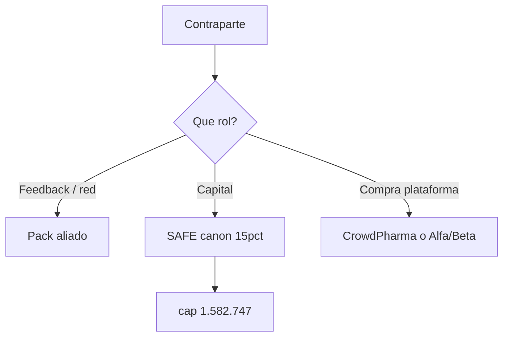

# Método 3 — SAFE Gabriel (Term Sheet mejorado)

> **Prefacio (léeme primero)**  
> **Para quién:** tú, cuando hablas con alguien que pone los **USD 237.412** (inversor).  
> **No es para:** farmacias que pagan cupo ni aliados que solo dan intros (pack Morr ≠ SAFE).  
> **En una frase de calle:** “Pedimos capital con un SAFE post-money: techo **USD 1.582.747** → cerca de **15%** si aplica el cap.”  
> **Antes de seguir:** [`GLOSARIO`](../_comun/GLOSARIO.md) · [`Comparativa`](../_comun/04_COMPARATIVA_TRES_METODOS.md) · [`Qué hacer ahora`](../_comun/00_QUE_HACER_AHORA.md)

> **Estado:** [PROPUESTA OPERATIVA — NO AUTORIZA CONTACTO]  
> **Versión:** 1.3 — 27 agosto 2026 (controles críticos + VE/OFAC + puente mercado; destilado DOCX 27 ago)  
> **Para qué sirve:** ejecutar el **carril A** (inversor) con el término vigente del pack.  
> **Canon vigente:** ask SAFE **USD 237.412** (no recaudado) · cap **USD 1.582.747** · equity ref. **~15%** · pricing **45/60/70 + 8/7/5% GMV**.  
> **Evidencia:** [`evidencia/EXT_TERM_SHEET_SAFE_15PCT.md`](evidencia/EXT_TERM_SHEET_SAFE_15PCT.md)  
> **No es dictamen legal.** Abogado cierra entidad, SAFE definitivo y side letters.  
> **Excel:** si el modelo no coincide, **rigen estos MD** (15% @ 1.582.747) hasta CAP FP&A.

## 1. En una frase

Zonix pide **USD 237.412** vía SAFE post-money con valuation cap **USD 1.582.747** (~**15%** si el cap aplica) (`CAP-P12`).

### 1.1 Por qué SAFE ahora (contexto mercado — `CLAIM-3P`)

No es tracción de Zonix. Ancla de mercado en [`evidencia/EXT_CARTA_PRESEED_Q2_2026.md`](evidencia/EXT_CARTA_PRESEED_Q2_2026.md) (`CAP-P14` = revalidar URLs antes de data room externo):

| Señal de mercado (reportada) | Uso interno |
|---|---|
| SAFE dominante en pre-seed; post-money + cap frecuentes | Justifica instrumento canónico, no el % exacto |
| Ask Lean **237.412** vs avg ~**276k** (Carta Q2 2026, EE. UU.) | Solo `INFERENCE` de tamaño plausible — **no** prueba de cierre en VE |
| LatAm más selectivo (LAVCA / Cuantico) | Refuerza: pitch con piloto/`FACT`, no proyecciones vacías |

**Prohibido en pitch:** citar % de Carta/LAVCA como si fueran obligación legal o “garantía” de raise.

## 2. Separación de roles (Gabriel y cualquiera)

| Rol | Instrumento | Carpeta / pack |
|---|---|---|
| Aliado / consultor (feedback, intros) | Ninguno de equity; NDAs si aplica | [`Pack_Aliado_Gabriel_Barrios/`](../../Pack_Aliado_Gabriel_Barrios/) |
| Inversor financiero | **SAFE** (este método) | Carril A en [`02_CARRILES.md`](../_comun/02_CARRILES.md) |
| Farmacia / partner | Contrato B2B / SLA | CrowdPharma o Café+Kleo — **no** este PDF |

Misma persona en dos roles = **dos instrumentos** y dos conversaciones. No ofrecer SAFE “por ayudar con intros”.

## 3. Canon vigente

| Campo | Valor |
|---|---|
| Purchase Amount | USD **237.412** |
| Post-money cap | USD **1.582.747** |
| Equity ref. si aplica cap | **~15%** |
| Founders post-SAFE (aprox.) | **~85%** |
| Estado | **Vigente** (`CAP-P12` DECIDIDO 26 ago 2026) |

Ejemplo: `237.412 / 1.582.747 ≈ 15%`.

### Sensibilidad interna (no ofertable sin nueva CAP)

| Escenario | Cap post-money (aprox.) | Ownership ≈ ask/cap | Uso |
|---|---:|---:|---|
| **Canon** | 1.582.747 | ~15% | Pitch / pack |
| C (interno) | 1.200.000 | ~19,78% | Walk-away |
| D (interno) | 2.000.000 | ~11,87% | Walk-away |

**Walk-away (operativo):**

- Oferta pública = **solo Canon** (~15%). C y D son **internos**, no pitch.  
- **No ofertar** por debajo del Escenario C (cap ~1,2M / ~19,78% implícito) sin nueva CAP founder.  
- Si el inversor pide “más protección”: priorizar **pro-rata razonable** (side letter) y **reporting** antes de ceder equity adicional.  
- Siempre: no mezclar cliente/inversor; no wire sin PIIA/entidad; no presentar el cap como valuación de mercado (“Zonix vale 1,58M” = **prohibido**).

### 3.1 Tres controles críticos (blindaje)

Destilado del plan fundraising SAFE 27 ago. Sin estos, no hay cierre limpio.

| # | Riesgo | Control |
|---|---|---|
| 1 | **Roles mezclados** (Gabriel u otro: intros vs capital) | Misma persona = **dos instrumentos** y dos conversaciones. Intros → pack aliado / NDA. Capital → **este SAFE**. Nunca “SAFE por ayudarme con farmacias”. |
| 2 | **IP / PIIA vacío** al wire | Condición suspensiva: **cero desembolso** sin PIIA + cesión IP de fundadores a favor de la C.A. emisora. |
| 3 | **Stack multi-SAFE** descontrolado | SAFEs post-money **no se diluyen entre sí**; el % agregado es la **suma**. Ledger central + **MFN** + mismos términos bajo el mismo cap. |

Detalle forense: [`evidencia/EXT_TERM_SHEET_SAFE_15PCT.md`](evidencia/EXT_TERM_SHEET_SAFE_15PCT.md). Riesgos pack: [`../_comun/10_RIESGOS_Y_CONTROLES.md`](../_comun/10_RIESGOS_Y_CONTROLES.md).

## 4. Term sheet interno (checklist)

| # | Término | Canon / default | ¿Negociable? |
|---|---|---|---|
| 1 | Instrumento | SAFE post-money | No (salvo abogado) |
| 2 | Purchase Amount | USD 237.412 | Solo con CAP financiera versionada |
| 3 | Cap | **1.582.747** | Solo con nueva CAP founder |
| 4 | Economía objetivo | **~15%** antes de ronda priced | Ligado al cap |
| 5 | Discount / interés / vencimiento | 0% / 0% / sin vencimiento | Sí |
| 6 | MFN | Sí | Sí |
| 7 | Pro rata / ROFR | Por defecto no | Side letter |
| 8 | Voto / board / veto | Ninguno antes de convertir | Sí |
| 9 | Reporting | Trimestral high-level | Sí |
| 10 | Uso de fondos | Lean 50.260 / 172.152 / 15.000; ver [`07_QUE_COMPRA_EL_ASK`](../_comun/07_QUE_COMPRA_EL_ASK.md) | No covenant rígido salvo pacto |
| 11 | Condición suspensiva wire | PIIA + IP a favor de la C.A. | **Obligatorio** |
| 12 | Company Capitalization | Definir en SAFE definitivo | Abogado |
| 13 | Multi-SAFE | Ledger + MFN; % agregado bajo mismo cap | Sí |
| 14 | Liquidity / dissolution | Texto YC adaptado a jurisdicción | Abogado |
| 15 | Entidad / ley aplicable | Antes de firma | `[PENDIENTE]` |
| 16 | Transferencia | Restricciones del instrumento | Sí |

**Qué nunca va en el term sheet:** retorno garantizado, valuación certificada, exclusividad comercial por invertir, equity a farmacias “por ser fundadoras”.

### 4.2 Negociación (cómo abrir)

1. **No abrir con el %.** Abrir con beachhead, hitos que compra el ask ([`07_QUE_COMPRA_EL_ASK`](../_comun/07_QUE_COMPRA_EL_ASK.md)) y evidencia de uso (`FACT`).  
2. **Cap ≠ valuación de mercado.** El techo **1.582.747** fija dilución implícita (~15%); no digas “Zonix vale 1,58M”.  
3. **Límite interno de dilución = ~15%.** Escenarios C/D de la tabla de sensibilidad son walk-away interno — no oferta.  
4. Si piden más protección: priorizar **información / reporting** y **pro-rata razonable** (side letter) antes de ceder equity adicional.  
5. No modificar el SAFE estándar unilateralmente; términos especiales → abogado + side letter.  
6. Tesis e historia: [`09_INVESTOR_CASE.md`](../_comun/09_INVESTOR_CASE.md).

## 5. Gates antes de outreach (carril A)

| Gate | Criterio | Owner |
|---|---|---|
| G0 | `CAP-P09` OK (contacto autorizado) | Founder |
| G1 | Oferta = canon 15% @ 1.582.747 (única oferta) | Founder |
| G2 | Demo 3–5 min + data room mínimo coherente | Founder |
| G3 | Candidato en CRM con tesis de encaje | Founder / Sales |
| G4 | Checklist legal: entidad, IP, PIIA path, plantilla SAFE + path **OFAC/compliance** del candidato | Abogado + Founder |
| G5 | Un solo PDF/term sheet del escenario vigente | Founder |

Sin G0: **no enviar** el term sheet a terceros.

### 5.1 Embudo de pipeline (metas = `ASSUMPTION`)

Metas de **pipeline interno**, no tasas de conversión de mercado. Ajustar tras las primeras ~20 conversaciones. **Sin `CAP-P09` no hay outreach.**

| Etapa | Definición | Meta sugerida (`ASSUMPTION`) |
|---|---|---:|
| Target | Encaje etapa / sector / geo | 50 |
| Warm intro / contacto | Vía real de presentación | 30 |
| First meeting | Reunión hecha | 15 |
| Deep dive | Pide data room o 2.ª reunión | 8 |
| Term discussion | Habla de cap / términos | 3 |
| Commitment | Intención de invertir | 1–2 |
| Closed | SAFE firmado + wire | 1 |

Dashboard: [`05_CALENDARIO_Y_DASHBOARD.md`](../_comun/05_CALENDARIO_Y_DASHBOARD.md). Riesgos: [`10_RIESGOS_Y_CONTROLES.md`](../_comun/10_RIESGOS_Y_CONTROLES.md).

### 5.2 Cumplimiento VE / OFAC (`LEGAL-REVIEW`)

Pointer: [`evidencia/EXT_IE_VE_UNCTAD.md`](evidencia/EXT_IE_VE_UNCTAD.md). Pack: [`../../Lanzamiento/ESTRUCTURA_LEGAL_Y_EQUITY.md`](../../Lanzamiento/ESTRUCTURA_LEGAL_Y_EQUITY.md).

- Un SAFE de **USD 237.412** **no** cae “automáticamente” bajo un régimen concreto de IE VE. Antes de firma/wire: entidad receptora, domicilio, residencia del inversor, flujo del dinero, naturaleza del instrumento.  
- **Screening OFAC / compliance** del inversor: **obligatorio antes del wire** (no improvisar en la reunión).  
- **Prohibido en pitch:** afirmar remesas, exenciones o umbrales fiscales sin memorando de abogado.

## 6. Pasos de ejecución

1. Confirmar rol de la contraparte (aliado vs inversor) — control §3.1 #1.  
2. Usar solo el canon 15% @ 1.582.747.  
3. Preparar one-pager: ask + use of funds + “cap ≠ valuación”.  
4. Negociar solo puntos abiertos (pro rata, reporting, side letter); respetar walk-away §3.  
5. Abogado emite SAFE definitivo; completar path OFAC/compliance (§5.2).  
6. Cierre: **PIIA + IP** firmados → wire → ledger SAFE + cap table interno.  
7. Post-wire: reporting acordado; no reclamar “recaudado” antes del wire liberado.

## 7. Persuasión y frases prohibidas

**Formulación correcta:**  
«El ask Lean es USD 237.412 con cap post-money USD 1.582.747 (~15% si aplica el cap). El cap no es una valuación de mercado.»

**Nunca decir**

- «Ya recaudamos 237k.»  
- «Zonix vale 1,58 millones.» (el cap no es appraisal)  
- «El 15% está garantizado para siempre.» (dilución en rondas futuras)  
- «Si me das intros, te doy el SAFE / equity.»  
- «Las farmacias fundadoras también son socias del SAFE.»

## 8. FAQ corto

**¿Por qué ~15%?**  
Decisión founder (`CAP-P12`, 26 ago 2026): equilibra incentivo pre-seed con ~85% founders antes de priced round; el ask Lean no cambia.

**¿Qué recibe el inversor al firmar?**  
SAFE post-money con MFN (y términos del sheet). **No** recibe: acciones ordinarias inmediatas, board, retorno garantizado, ni rol de cliente farmacia.

**¿El pack aliado incluye este SAFE?**  
No. El pack aliado no es solicitud de inversión por defecto.

**¿Varios inversores?**  
Sí, bajo términos equivalentes; el % agregado bajo el mismo cap es la suma. Usar ledger + MFN (§3.1 #3).

**¿Y si el Excel no coincide?**  
Rigen estos MD (1.582.747 / ~15%); FP&A re-linkea el libro.

## 8.1 Preguntas difíciles (respuesta estratégica)

| Pregunta | Respuesta (sin inventar tracción) |
|---|---|
| ¿Por qué Venezuela? | Beachhead: workflow denso (piloto Valencia / Rx) antes de expandir el playbook. |
| ¿Y si VE es demasiado pequeña? | El software + playbook deben ser exportables. |
| ¿Por qué no lo copia una cadena? | Distribución, datos operativos, workflow Rx e integraciones. |
| ¿Cómo sabes que pagarán? | Solo con cohortes Beta, contratos y **pagos** cuando existan como `FACT` — no encuestas ni “ya firmamos” si no es verdad. |
| ¿Por qué 237.412? | Lean: Fase 0 50.260 + burn 172.152 + reserva 15.000 → [`07_QUE_COMPRA_EL_ASK`](../_comun/07_QUE_COMPRA_EL_ASK.md). |
| ¿El cap 1.582.747 es la valuación? | **No.** Es techo contractual de conversión; no appraisal de mercado. |
| ¿Si no alcanzas hitos? | Gate de no escalar: pausar burn, revisar producto/GTM. |
| ¿Próximo round? | Seed condicionado a repetibilidad del piloto, no a una fecha arbitraria. |
| ¿Qué NO recibe el inversor? | Acciones inmediatas, board, retorno garantizado, ni rol de cliente farmacia. |

## 9. Relación con otros métodos

| Método | Carril | Relación |
|---|---|---|
| Este (`metodo_safe_gabriel`) | A | Capital |
| CrowdPharma | B/C | Ingreso / adopción — no diluye SAFE |
| Café+Kleo Alfa/Beta | B | Uso y contrato — si alguien invierte, SAFE **aparte** |

## 10. Ver también

- Investor Case: [`../_comun/09_INVESTOR_CASE.md`](../_comun/09_INVESTOR_CASE.md)  
- Riesgos: [`../_comun/10_RIESGOS_Y_CONTROLES.md`](../_comun/10_RIESGOS_Y_CONTROLES.md)  
- Reglas: [`../_comun/01_REGLAS_Y_CANON.md`](../_comun/01_REGLAS_Y_CANON.md)  
- Carril A: [`../_comun/02_CARRILES.md`](../_comun/02_CARRILES.md)  
- Qué compra el ask: [`../_comun/07_QUE_COMPRA_EL_ASK.md`](../_comun/07_QUE_COMPRA_EL_ASK.md)  
- Data room: [`../_comun/08_MAPA_DATA_ROOM.md`](../_comun/08_MAPA_DATA_ROOM.md)  
- CAP: [`../_comun/06_DECISIONES_ABIERTAS.md`](../_comun/06_DECISIONES_ABIERTAS.md)  
- Legal pack: [`../../Lanzamiento/ESTRUCTURA_LEGAL_Y_EQUITY.md`](../../Lanzamiento/ESTRUCTURA_LEGAL_Y_EQUITY.md)  
- Aliado (no inversión): [`../../Lanzamiento/RESUMEN_ALIADO_GABRIEL_BARRIOS.md`](../../Lanzamiento/RESUMEN_ALIADO_GABRIEL_BARRIOS.md)  
- Research 2026 (`CLAIM-3P`): [`evidencia/EXT_CARTA_PRESEED_Q2_2026.md`](evidencia/EXT_CARTA_PRESEED_Q2_2026.md) · IE VE: [`evidencia/EXT_IE_VE_UNCTAD.md`](evidencia/EXT_IE_VE_UNCTAD.md)
