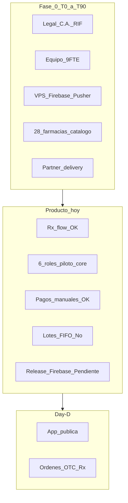

# Alineación plan de Lanzamiento vs producto (software)

> **Canon financiero (26 jul 2026 / esc.1):** Fase 0 **50.260** / SAFE **237.412** / cash M12 **246.231**. Fuente: [BRIEF_UNA_PAGINA.md](BRIEF_UNA_PAGINA.md) · [MODELO_FINANCIERO_ZONIX_PHARMA.md](MODELO_FINANCIERO_ZONIX_PHARMA.md).

> **Fecha:** 22 junio 2026 (refresh post-auditoría forense v2; anclas financieras actualizadas 30 jul 2026).  
> **Estado del pack:** **WIP** — documentos en mejora continua; este informe no es dictamen final ni cierre de data room.  
> **Base técnica:** [../audits/README.md](../audits/README.md) + código / AGENTS (repos Backend + Frontend).  
> **Plan operativo canónico:** [PLAN_LANZAMIENTO_COMERCIAL.md](PLAN_LANZAMIENTO_COMERCIAL.md).  
> **Pendientes humanos (inversor):** [REGISTRO_PENDIENTES_PACK.md](REGISTRO_PENDIENTES_PACK.md) — capa separada.

---

## 1. Qué está ocurriendo (resumen del lanzamiento)

Zonix Pharma planea un **piloto en Valencia metro (Carabobo)** como marketplace farmacéutico digital: pacientes compran OTC y medicamentos con receta (Rx); las farmacias afiliadas despachan; un **farmacéutico colegiado de cada farmacia** valida recetas en la app; la **última milla** la hace una **empresa partner** (`delivery_company` + `delivery_agent`), **sin flota propia** de Zonix.

### 1.1 Línea de tiempo (convención del pack)

| Hito | Significado | Gasto / modelo |
|------|-------------|----------------|
| **T+0** | Wire del capital (**USD 237.412** Lean) | Inicio Fase 0 |
| **T+0 → T+90** | **Fase 0:** legal, equipo, HQ, tech, onboarding farmacias, catálogo, partner logístico | **USD 50.260** (one-shots **~22.365** + operativa) |
| **Day-D = T+90** | Lanzamiento **público** en app = **M1** del modelo financiero | Caja Day-D **187.152** |
| **M1–M12** | Escala comercial, Meta Ads, soporte; equilibrio FCF mensual desde **M5** (FCF M1–M4 negativo; cash Day-D **187.152**) | Caja M12 **246.231** |

### 1.2 Qué hace el equipo en cada fase

**Fase 0 (antes de que el público use la app)**

- Constituir **C.A.**, RIF, banco; contratar **Co-CEO**, **4× Sales** (Lean), CS+CM, **Dev junior**; Marketing vía Meta/CM.
- Montar **HQ** tipo casa (~USD 500/mes), **4 PCs**, stack IA (Cursor/Claude).
- Desplegar **VPS + dominio + SSL**; **Firebase OTP**; Pusher/FCM; tests E2E internos.
- Prospección: meta **~35 firmas** y **~28 farmacias activas** con catálogo antes de Day-D.
- Cerrar **partner logístico** (contrato marco / concesión) y onboarding de agentes.

**Day-D y después**

- App en tiendas (plan: Play Store / App Store); Meta Ads + valla; primeras órdenes reales.
- Soporte intensivo 10 días; reportes semanales/mensuales al inversor.
- **Definition of Done piloto (M6 post-Day-D):** ≥97 farmacias activas, ≥1.500 pedidos, Rx ≤60 min, NPS, cash ≥~**180.403** (esc.1 — ver [PLAN_LANZAMIENTO_COMERCIAL.md](PLAN_LANZAMIENTO_COMERCIAL.md) §5).

### 1.3 Decisiones de negocio que atan producto y docs

Fuente: [CONTEXTO_PITCH_Y_DECISIONES.md](CONTEXTO_PITCH_Y_DECISIONES.md), [README.md](README.md) §3.

| Decisión | Implicación en software |
|----------|-------------------------|
| Piloto **completo** Buyer + Pharmacy + Pharmacist + delivery company/agent | Los 7 roles deben funcionar en producción; **no** priorizar solo OTC sin Rx |
| **Sin** `delivery` autónomo en piloto (README) | Solo **`delivery_company`** + **`delivery_agent`** bajo partner; rol `delivery` autónomo **fuera de alcance** MVP (I-04 corregido en PLAN) |
| Pagos **manuales VE** (pago móvil, transferencia, Zelle, Binance) | No Stripe; comprobante + validación farmacia |
| Modelo B2B **híbrido** 45/60/70 + % GMV | Facturación/agregación RIF es **operación/comercial**; panel commerce no sustituye contabilidad |
| Zona **Valencia metro** | Catálogo y zonas de entrega por farmacia/partner |

---

## 2. Mapa hito del plan → capacidad en código

Leyenda: **OK** listo para piloto con smoke | **Parcial** existe con gaps | **No** no implementado | **Ops** fuera del repo (legal, Meta, tiendas).

| Fase / hito (PLAN_LANZAMIENTO) | Qué pide el plan | Producto (código) | Estado |
|------------------------------|-----------------|-------------------|--------|
| T+0–7 Deploy VPS, dominio, SSL | Producción Pharma | Infra no en repo; deploy **`main.yml`** → pharma.aiblockweb.com; CI **`ci.yml`** (Pint + PHPUnit) | **Ops** + **OK** pipeline Pharma |
| T+7–12 Firebase Phone Auth OTP | Registro paciente SMS | Integración prevista; **google-services.json** pendiente ([TECH_DEBT](../ops/TECH_DEBT.md)) | **Parcial** |
| T+10–15 Pusher + FCM prod | Tiempo real órdenes/Rx | Implementado en código; requiere credenciales prod | **Parcial** |
| T+25–30 Tests E2E producción | Flujo completo | **443** BE + **~241** FE tests; smoke manual: [../SMOKE_RX_E2E.md](../qa/SMOKE_RX_E2E.md) | **Parcial** |
| T+30 Equipo + HQ | — | — | **Ops** |
| T+30–55 Onboarding farmacias + **carga catálogo** | Panel commerce productos Rx/OTC | `commerce_product_form_page`, API products | **OK** |
| T+35–55 Capacitación **farmacéutico** | Onboarding MPPS, validar Rx | `pharmacist_onboarding`, `PrescriptionController` | **OK** |
| T+30–50 Partner logístico + agentes | `delivery_company`, `delivery_agent` | Paneles delivery company + delivery agent | **OK** |
| T+30–55 KYC repartidores | Documentos perfil | `Profile`, documents API | **Parcial** (validar proceso ops) |
| T+50–60 Test entrega real | Orden → asignación → tracking | `DeliveryAssignmentService`, tracking, OSRM | **OK** (smoke requerido) |
| T+55–60 Órdenes de prueba internas | OTC + Rx + cold chain | Flujo Rx E2E en tests Feature | **OK** en test; **Parcial** en prod |
| T+60 ≥20 farmacias catálogo | Inventario operativo | Catálogo por producto; **sin lotes FIFO en UI** | **Parcial** |
| T+60–85 Soft launch, bug fixing | Estabilidad | Deuda API/UI legacy Eats en nombres | **Parcial** |
| **Day-D** App tiendas + órdenes públicas | Release móvil | Build release + Firebase pendiente | **Parcial** |
| Day-D Rx ≤60 min (DoD M6) | SLA validación | TTL 60 min + `ExpirePendingPrescriptionsCommand` | **OK** |
| Day-D pago comprobante | VE manual | `payment-proof`, commerce validación | **OK** |
| M6 ≥97 activas, métricas DoD | Analytics operativos | Dashboards admin/commerce parciales vs KPIs plan | **Parcial** |
| Post-M6 expansión geográfica | Escala | Mismo stack; sin multi-ciudad específico en código | **OK** arquitectura |

---

## 3. Qué falta en el **producto** para cumplir el plan tal como está escrito

Prioridad para el founder técnico (no sustituye backlog de negocio).

| Prioridad | Gap producto | Impacto en lanzamiento | Referencia técnica |
|-----------|--------------|------------------------|-------------------|
| **P0** | **Release móvil:** Firebase proyecto Pharma, keystore, APNs | Day-D sin app instalable confiable | [TECH_DEBT](../ops/TECH_DEBT.md) |
| **P0** | **Smoke E2E manual** documentado (OTC, Rx, cold chain, pago) | PLAN_MODULO §18; PLAN_LANZAMIENTO T+25–30 | audits README / código §10 |
| **P1** | **Deploy/CI Pharma** | Pipeline alineado a Pharma (`ci.yml` + `main.yml`); pendiente credenciales prod Firebase/APNs | Workflows GitHub |
| **P1** | **`medicine_lots`:** sin API commerce, sin UI, sin FIFO en despacho | Esquema BD + seeder; **UI/despacho FIFO post-Day-D o M3+** (I-02 corregido en CONTEXTO y PLAN_MODULO) | audits README / código §4.3 |
| **P2** | Envelope API / `getMessage()` en controllers | Estabilidad prod, soporte | Patrones API BE |
| **P2** | Descarga archivo receta en app buyer/pharmacist | Operación farmacia | FE `PrescriptionService` |
| **P2** | Badges controlados uniformes en listado buyer | Copy regulatorio UX | UI Pharma Front |
| **P3** | Sunset nombres `restaurant` / `food_methods` | Confusión onboarding farmacia | MIGRACION_EATS_PHARMA |

**Readiness técnico Day-D (síntesis):** **3/5** — viable piloto **OTC + Rx común** con farmacéutico real, partner logístico y smoke; **no** prometer inventario por lotes ni “producción enterprise” sin cerrar P0.

---

## 4. Qué ajustar en los **documentos** (mientras los mejoráis)

> **Estado 22 junio 2026:** correcciones **I-01 a I-15** aplicadas en pack; refresh CI Pharma + smoke Rx documentado. Tabla §4.1 = mejoras ya hechas + pendientes menores.

### 4.1 Documentación adelantada (suavizar o acotar)

| Doc | Estado | Nota |
|-----|--------|------|
| [CONTEXTO_PITCH_Y_DECISIONES.md](CONTEXTO_PITCH_Y_DECISIONES.md) §1 | **Hecho (I-02)** | FIFO: esquema BD + seeder; UI/despacho post-Day-D o M3+ |
| [BRIEF_UNA_PAGINA.md](BRIEF_UNA_PAGINA.md) | **Hecho (I-05, SF-03)** | Staging/VPS + go-live T+7–12; sin «stack probado» ambiguo |
| [README.md](README.md) §3 | **Hecho (I-04)** | Solo partner + agentes; sin `delivery` autónomo |
| Varios | **Hecho (I-03)** | «Flujos core» desde Day-D; FIFO/controlados masivos fase 2 |
| [PLAN_LANZAMIENTO_COMERCIAL.md](PLAN_LANZAMIENTO_COMERCIAL.md) §4.2 | **Pendiente menor** | Vincular checklist release (Firebase, keystore, tiendas) en §4.2 |

### 4.2 Documentación incompleta (añadir al plan)

| Tema en código | Dónde documentar | Qué añadir |
|----------------|------------------|------------|
| Comandos scheduler Rx/pagos | PLAN_MODULO o PLAN_RX | `zonix:expire-pending-prescriptions`, expire `pending_payment`, purge datos receta |
| Política `block_rx_without_prescription` default false | PLAN_MODULO §Rx | Comportamiento MVP: orden puede crearse sin receta previa; subida después |
| Retención 90 días adjuntos receta | ESTRUCTURA_LEGAL §4.4 + PLAN_MODULO §14 | Ya parcial; enlazar a comando purge |
| Readiness checklist pre-Day-D | PLAN_LANZAMIENTO §4.2 o PLAN_MODULO §18 | Tabla: smoke OTC/Rx ([SMOKE_RX_E2E.md](../qa/SMOKE_RX_E2E.md)), Pusher, FCM, 1 orden pago real staging; SAFE cap Lean **600k** citado en pitch |
| Deuda nombres Eats en UI | Nota en BRIEF o CONTEXTO | “restaurants” = farmacias (legacy); no es vertical Eats |

### 4.3 Documentación coherente (reforzar, no reescribir)

| Tema | Docs alineados | Nota |
|------|----------------|------|
| Flujo Rx farmacéutico colegiado | PLAN_MODULO, PLAN_RX_VALIDATION, PROPUESTA_VALOR_USUARIO_FINAL, código | Mantener como diferenciador central |
| T+90 = Day-D = M1 | PLAN_LANZAMIENTO, PROYECCION §0, README | Crítico para no confundir burn |
| 7 roles / sin flota Zonix | README, PROPUESTA_TERCER_LADO, TERCER_LADO | OK con código |
| Pagos manuales VE | PLAN_METODOS_PAGO, zonix-payments | OK con código |
| 443 tests | BRIEF, VOLCADO §1.2, README | Re-ejecutar y actualizar commit antes de reunión |

### 4.4 Datos humanos vacíos (solo founder / equipo)

Ver [REGISTRO_PENDIENTES_PACK.md](REGISTRO_PENDIENTES_PACK.md). El plan de lanzamiento **no puede ejecutarse** sin: fechas T+0, HQ/valla cotizadas, pipeline farmacias, nombres equipo, partner logístico firmado.

### 4.5 WIP editorial (contradicciones menores)

| # | Observación | Acción |
|---|-------------|--------|
| W1 | ARPF **~52** en finanzas vs modelo híbrido 45/60/70 + % GMV | Ya aclarado en PROYECCION; repetir una línea en BRIEF “hasta GMV piloto” |
| W2 | VOLCADO §1.2 fecha tests 20 mayo | Actualizar al cerrar P0-06 |
| W3 | Ask único Lean **237.412** vs tablas M1–M12 | Correcto: no mezclar escenarios; canon = esc.1 |
| W4 | DoD “validación Rx ≤60 min” vs TTL config 60 min | Coherente; documentar que es objetivo operativo + TTL automático |

---

## 5. Orden de trabajo sugerido (founder + equipo)

Coherente con Fase 0 del [PLAN_LANZAMIENTO_COMERCIAL.md](PLAN_LANZAMIENTO_COMERCIAL.md):

1. **Producto (paralelo a legal/equipo):** cerrar P0 TECH_DEBT → smoke E2E → staging estable.  
2. **Docs:** aplicar §4.1–4.2 en CONTEXTO, PLAN_LANZAMIENTO, BRIEF (1–2 párrafos cada uno).  
3. **Operación:** llenar VOLCADO §3–9 según REGISTRO P1.  
4. **Pre-Day-D:** checklist §18 PLAN_MODULO + matriz §2 de este doc en verde.  
5. **Inversor (cuando toque):** REGISTRO P0 + [CHECKLIST_PRE_INVERSOR.md](CHECKLIST_PRE_INVERSOR.md).

---

## 6. Documentos del pack por rol en el lanzamiento

| Si necesitas… | Lee primero |
|---------------|-------------|
| Calendario día a día | [PLAN_LANZAMIENTO_COMERCIAL.md](PLAN_LANZAMIENTO_COMERCIAL.md) |
| Por qué se decidió así | [CONTEXTO_PITCH_Y_DECISIONES.md](CONTEXTO_PITCH_Y_DECISIONES.md) |
| Cuánto cuesta / KPIs | [PRESUPUESTO_12_MESES_REFERENCIA.md](PRESUPUESTO_12_MESES_REFERENCIA.md), [PROYECCION_FINANCIERA_12M.md](PROYECCION_FINANCIERA_12M.md) |
| Pitch farmacia / paciente / delivery | PROPUESTA_VALOR_* |
| Operación Rx y soporte | [PLAN_MODULO_OPERATIVO_CLAVE.md](PLAN_MODULO_OPERATIVO_CLAVE.md) |
| Qué hace el código | [../audits/README.md](../audits/README.md) + código / AGENTS |
| Qué falta llenar a mano | [REGISTRO_PENDIENTES_PACK.md](REGISTRO_PENDIENTES_PACK.md) |
| Checklist inversor | [CHECKLIST_PRE_INVERSOR.md](CHECKLIST_PRE_INVERSOR.md) |

---

## 7. Veredicto de alineación (26 mayo 2026)

| Pregunta | Respuesta |
|----------|----------|
| ¿El plan de lanzamiento describe una historia coherente? | **Sí** — Fase 0 → Day-D → M6 está bien articulado en PLAN_LANZAMIENTO + PROYECCION. |
| ¿El software permite ejecutar el **núcleo** del plan? | **Sí**, con reservas: Rx, roles, pagos, delivery partner; **no** lotes FIFO ni release stores sin trabajo P0. |
| ¿Los docs reflejan la realidad del código hoy? | **Mayormente**, con **sobrepromesa** en lotes FIFO y “producción” y **subpromesa** en checklist release/scheduler. |
| ¿Listo para ejecutar lanzamiento sin tocar código? | **No** — cerrar P0 producto + smoke + edits §4.1–4.2 en docs. |
| ¿Listo para seguir mejorando el pack con contexto claro? | **Sí** — este documento es la referencia cruzada pack ↔ producto. |

---

*Generado en implementación del plan “Contexto Lanzamiento vs producto”. Revisar tras cada hito T+30 / T+60 / Day-D o cambio mayor en código.*
