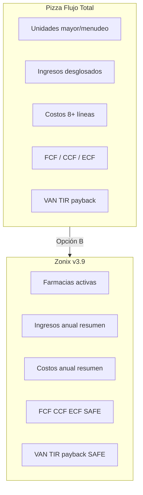
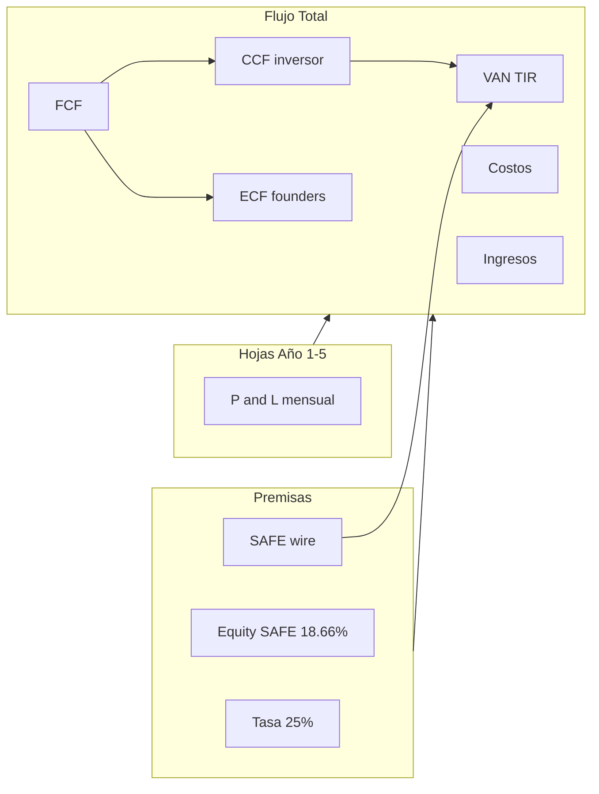

# Especificación layout Pizza QLQ → Zonix Pharma (opción B)

> **Nota 26 jul 2026:** anclas regresión **111.988 / 33.835 / 18,66%** = legado. Canon pitch = **210.760 / 50.260 / ~35,13%**. Layout QLQ sigue útil como spec de presentación.


> **Última actualización:** 23 junio 2026  
> **Estado:** Spec de referencia — **no implementada** en el `.xlsx` generado.  
> **Implementado hoy (opción A):** piel visual QLQ en [`MODELO_FINANCIERO_ZONIX_PHARMA.xlsx`](MODELO_FINANCIERO_ZONIX_PHARMA.xlsx) **v3.9.0** — ver [`MODELO_FINANCIERO_ZONIX_PHARMA.md`](MODELO_FINANCIERO_ZONIX_PHARMA.md) §S0.  
> **Template fuente:** `Propuesta_Pizza QLQ.xlsx` (formato inversor QLQ — pizzas congeladas, reparto 70/30).

---

## 1. Propósito

| Capa | Qué es | Dónde vive | Cuándo usar en reunión |
|------|--------|------------|------------------------|
| **A — Piel visual** | Colores, fuentes, merges, anchos, zoom tipo Pizza | Excel **v3.9.0** + `pizza_visual_theme.py` | Due diligence con inversores acostumbrados al formato QLQ |
| **B — Layout estructural** | Misma **forma** de filas/columnas que Pizza (desglose línea a línea, cols C:G, IRR col K, etc.) | **Este documento** | Solo si se decide una **v4.0** clon estructural; implica rehacer Flujo Total y verify |

**Regla:** el pack Zonix **no** adopta economía 70/30 ni copy «pizzas». La opción B describe **geometría Excel**, no negocio Pizza.

---

## 2. Inventario 12 hojas — Pizza vs Zonix v3.9 vs delta B

| Hoja | Pizza QLQ (estructura) | Zonix v3.9 (estructura) | Delta B (si se implementa v4) |
|------|------------------------|-------------------------|--------------------------------|
| **Detallado** | ~67 merges C:D; rubros producción física | Rubros SaaS/marketplace; merges C:D en ítems (piel A) | Igualar densidad merges (~67) por bloque; columnas D ancha 85 |
| **Hoja3** | Resumen % + MO/legal/materia | Sección A 100% SAFE + Sección B espejo Detallado | Reordenar Sección B fila-a-fila como Pizza E12+ |
| **Hoja1** | 8 bloques equipos/MO/alquiler | 8 bloques Zonix espejo Detallado | Mismas filas merge A:B por bloque que Pizza |
| **Hoja2** | Tramos mensuales mínimos | Meta/valla refs | Sin cambio |
| **ESTA SI VALE** | Simulador utilidad pizza + burn | Simulador marketplace + unit panel col M | Unificar panel unit economics dentro de merges Pizza U10:X28 |
| **Año 1–5** | Premisas pizza (costo, mayor/menudeo, ratios) | Premisas farmacia (ARPF, tiers, SAFE) | Mantener premisas Zonix; opcional filas espaciado idéntico Pizza |
| **Flujo Total** | **C:G** años; **30+ filas** ing/cost; IRR **col K**; 70/30 CCF | **D:H** años; **5 filas** resumen; IRR **col J**; SAFE C6 | Ver §3 — cambio mayor |
| **Tasa Crecimiento** | Drivers ventas unidades pizza | Drivers revenue/farmacias Zonix | Alinear filas 1:1 con Pizza si se unifica Flujo |

---

## 3. Flujo Total — layout completo B

### 3.1 Columnas de años

| Aspecto | Pizza | Zonix v3.9 | B propuesto |
|---------|-------|------------|-------------|
| Premisas | C columna DATOS | C columna DATOS | Sin cambio |
| Años 1–5 | **C, D, E, F, G** | **D, E, F, G, H** | Migrar a **C:G** (+ TOTAL en H) |
| Columna TOTAL | **H** (col 8) | **I** (col 9) | **H** tras migración |

**Impacto:** reescribir todas las fórmulas `='Año n'!O…` y rangos NPV/IRR en `build_flujo_total`.

### 3.2 Filas de contenido (Pizza filas 18–39 vs Zonix 17–25)



| Bloque Pizza | Filas ~ | Equivalente Zonix B |
|--------------|---------|---------------------|
| Cantidad mayor/menudeo | 18–20 | Farmacias activas + desglose tier Basic/Pro/Ent (opcional) |
| Ingresos mayor/menudeo/total | 22–25 | Cuota fija + comisión GMV + ajuste billing |
| Costos (legal, transporte, MKT, MO, variable, alquiler, impuestos) | 27–35 | Enlace línea a línea a `Año n` filas costo ESTA |
| FCF | 37 | `=ingresos − costos` (por año) |
| CCF inversor | 38 | `=FCF × $C$6` (SAFE equity, **no** 70%) |
| ECF founders | 39 | `=FCF − CCF` |
| VAN / TIR | 41–47 | Mantener SAFE en C9; vector IRR ver §3.3 |

### 3.3 Vector IRR

| | Pizza | Zonix v3.9 | Decisión B |
|---|-------|------------|------------|
| Columna | **K** (K6:K11) | **J** (J28:J33) | Unificar en **K** solo si se clona Pizza; si no, documentar J como estándar Zonix |
| t=0 | Inversión inicial C14 | −SAFE C9 | Mantener ancla SAFE |

### 3.4 Premisas bloque superior

Pizza: costo pizza, precios mayor/menudeo, ratios 70/30, tasa descuento, inversión.

Zonix B propuesto (mismas **filas** Pizza, distinto **contenido**):

| Fila Pizza | Contenido Zonix B |
|------------|-------------------|
| Costo producción | ARPF placeholder / take-rate |
| Precio mayor | Cuota Basic B2B |
| Precio menudeo | Cuota Pro + Enterprise blend |
| Cantidad ventas mes | Farmacias activas ref. Año 4 |
| Ratio mayor/menudeo | Mix tier 60/30/10 |
| Participación inversor | **SAFE equity ~35,13%** Lean Excel (legado layout ~18,66%) — no 70% |
| Tasa descuento | 25% |
| Inversión inicial | −SAFE Lean wire |

---

## 4. Mapping rubros Pizza → Zonix (extensión S2.0)

| Rubro Pizza | Rubro Zonix | Hoja fuente |
|-------------|-------------|-------------|
| Equipos producción | Laptops, tablets demo, hosting | Detallado / Hoja1 |
| Adecuación local | HQ adecuación + depósito | Detallado |
| MO producción | Dev + Sales Fase 0 / operativa | Detallado / ESTA |
| Transporte | Visitas B2B + logística partners | Detallado |
| Alquiler | HQ arriendo | Detallado |
| Legal / registro | Constitución C.A. VE | Detallado |
| Marketing / MKT | Meta, valla, pre-lanzamiento | Detallado / ESTA |
| Materia prima | **SaaS ~154/mes** (footnote — no COGS físico) | ESTA |
| Costo variable pizzas | Comisiones % GMV + payment ops | Año 1 / ESTA |

---

## 5. Riesgos de implementar B (v4.0)

1. **Verify:** ~80+ guards asumen cols D:H, filas resumidas Flujo, IRR col J — reescritura masiva de `verify_modelo_financiero.py`.
2. **Payback SAFE:** fórmulas CCF acum referencian filas actuales; desglose largo mueve filas VAN/TIR.
3. **Disclaimer inversor:** layout 70/30 visual puede confundirse con term sheet SAFE — copy obligatorio en fila premisas.
4. **Esfuerzo:** estimado **400–600 líneas** en generador + 2–3 días QA Excel manual.
5. **Regresión anclas (legado UI):** SAFE 111.988 / Fase0 33.835 / Day-D 78.153 = snapshot layout; **canon pitch = 210.760 / 50.260 / 160.500**. No usar legado como ask.

---

## 6. Criterios de aceptación B (checklist v4.0)

- [ ] Flujo Total: años en **C:G**, TOTAL en **H**, premisas filas 5–14 alineadas a Pizza.
- [ ] Desglose **≥8 líneas** costos anuales enlazadas a hojas Año (no solo total).
- [ ] Desglose ingresos **≥3 líneas** (cuota, GMV, ajuste) en Flujo Total.
- [ ] CCF usa **`$C$6` SAFE**, no 0,7 fijo Pizza.
- [ ] Vector IRR documentado (J o K) + TIR(5)/TIR(3) con `PCT_FMT`.
- [ ] `verify_modelo_financiero.py` exit 0 tras regenerar.
- [ ] Anclas Lean unchanged (SAFE, Fase0, Day-D, FCF Y1, Cash M12).
- [ ] Reunión: disclaimer SAFE visible fila premisas + nota pie Flujo.
- [ ] Comparación visual lado a lado con `Propuesta_Pizza QLQ.xlsx` — misma **silueta** de filas.

---

## 7. Diagrama consolidado flujos



**Pizza:** CCF = FCF × 70%. **Zonix (A, B):** CCF = FCF × participación SAFE ilustrativa.

---

## 8. Herramientas de mantenimiento

| Artefacto | Ruta |
|-----------|------|
| Tema visual A | [`_tools/pizza_visual_theme.py`](_tools/pizza_visual_theme.py) |
| Spec JSON anchos/zoom | [`_tools/pizza_visual_spec.json`](_tools/pizza_visual_spec.json) |
| Extractor template | [`_tools/extract_pizza_visual_spec.py`](_tools/extract_pizza_visual_spec.py) |
| Generador | [`_tools/generate_modelo_financiero_v2.py`](_tools/generate_modelo_financiero_v2.py) |
| Verify | [`_tools/verify_modelo_financiero.py`](_tools/verify_modelo_financiero.py) |

Para refrescar spec tras cambio en template Pizza:

```bash
cd docs/Lanzamiento/_tools
python3 extract_pizza_visual_spec.py "/ruta/Propuesta_Pizza QLQ.xlsx"
python3 generate_modelo_financiero_v2.py
python3 verify_modelo_financiero.py
```

---

## 9. Cuándo NO implementar B

- Pitch pre-seed con SAFE ya acordado — **v3.9 resumen + piel QLQ** es suficiente.
- Plazo corto antes de reunión — riesgo alto de romper verify.
- Audiencia exige **solo** cifras ancla pack — el desglose Pizza añade ruido sin cambiar VAN Lean.

**Cuándo sí valorar B:** inversor pide explícitamente el mismo Excel «con todas las líneas» que el modelo Pizza de referencia, y el equipo dispone de sprint v4.0 dedicado.
