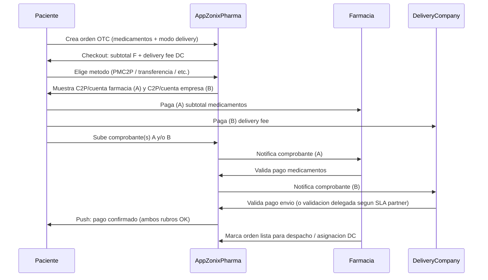
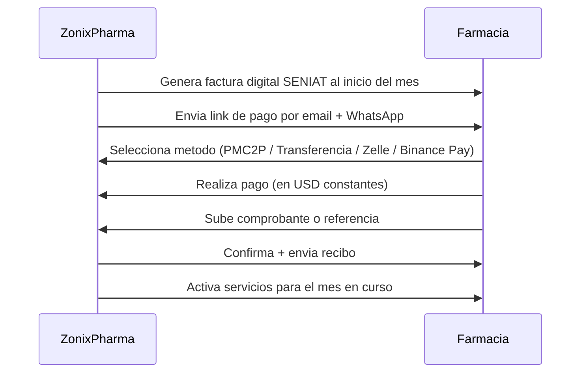
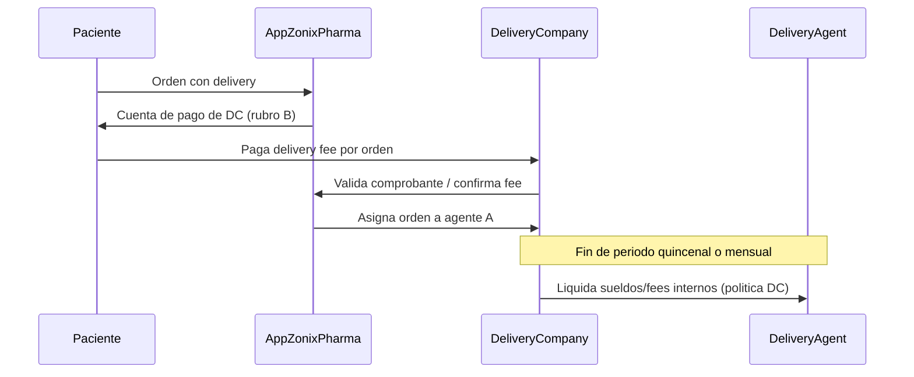

# Plan de métodos de pago

> **Última actualización:** 1 junio 2026.
> Documento que detalla cómo se cobra y se paga en **Zonix Pharma** (pack inversor / piloto).
>
> **One-pager inversor (3 min):** resumen ejecutivo abajo · §1 métodos · §2.1–2.2 flujos A/B · §10 Sudeban. Runbook (mora §2.3, Laravel §6, KPIs §8) = anexo operativo post-wire.
> Marco **Sudeban / no intermediación:** §10 de este documento; contexto farmacéutico amplio en [`../PLAN_REGULATORIO_PHARMA_VE.md`](../PLAN_REGULATORIO_PHARMA_VE.md) §8. No usar [`../REQUISITOS_OPERAR_VENEZUELA.md`](../REQUISITOS_OPERAR_VENEZUELA.md) (archivo histórico Zonix Eats).

**Resumen ejecutivo:** el **paciente** paga a la **farmacia** (medicamentos) y a la **empresa partner** (envío) por canales **manuales VE** (pago móvil, transferencia, Zelle, Binance, efectivo). **Zonix Pharma** no es PSP: cobra a la farmacia **cuota + % GMV** (B2B) y a la empresa logística **fee por envío** (§2.5). La farmacia **valida el comprobante** antes de despachar.

## 1. Métodos de pago soportados

Zonix Pharma opera con **pagos manuales VE nativos**, sin pasarelas internacionales (Stripe / PayPal) ni tarjetas de crédito.


| Método                       | Aplicable                                                       | Tiempo confirmación | Comisión bancaria |
| ---------------------------- | --------------------------------------------------------------- | ------------------- | ----------------- |
| **Pago Móvil C2P**           | Pago paciente → farmacia                                        | 1-5 minutos         | 0% (BCV)          |
| **Transferencia bancaria**   | Pago paciente → farmacia (medicamentos); paciente → `delivery_company` (envío) | 1-30 minutos        | 0%                |
| **Zelle** (USD desde EE.UU.) | Pago paciente → farmacia (paciente con cuenta US o familiar US) | 5-30 minutos        | 0% (Zelle)        |
| **Binance Pay USDT**         | Pago paciente → farmacia y/o `delivery_company` en USDT         | 1-3 minutos         | 0% (Binance Pay)  |
| **Efectivo**                 | Pago contra entrega                                             | Inmediato           | 0%                |
| **Punto de venta físico**    | Pago en farmacia (pickup)                                       | Inmediato           | 1-3%              |


**No soportados:**

- Tarjeta de crédito internacional → falta MerchantID empresarial VE costoso.
- PayPal → no operativo en VE para empresas locales.
- Stripe → no opera en VE.
- Petro / criptos exóticas → liquidez baja en VE 2026.

## 2. Flujos de pago detallados

### 2.1 Flujo paciente → farmacia (orden OTC)

**Pickup (sin delivery):** un solo pago del **subtotal medicamentos** a la farmacia (misma secuencia que abajo, sin línea delivery ni `delivery_company`).

**Delivery:** el checkout desglosa **(A) subtotal medicamentos → farmacia** y **(B) delivery fee → `delivery_company`** (cuentas precargadas en app — [PROPUESTA_VALOR_TERCER_LADO.md](PROPUESTA_VALOR_TERCER_LADO.md) §A.4). **No** se mezcla el envío en un único C2P solo a la farmacia en piloto.



**Tiempo total:** 5-15 minutos hasta ambos pagos validados (o uno si pickup solo A).

**GMV Zonix (cuota plataforma a farmacia):** entra el **subtotal medicamentos** completado en app; el **delivery fee** no forma parte del GMV de farmacia — ver §3.2 y B2B §5.5.

### 2.2 Flujo paciente → farmacia (orden Rx)

Igual al flujo OTC, **pero con paso adicional**: validación Rx por farmacéutico colegiado **antes** del pago. Es decir:

1. Paciente crea orden con receta cargada.
2. Estado orden: `pending_prescription_validation`.
3. Farmacéutico colegiado valida (≤ 60 min).
4. Estado orden: `pending_payment`.
5. Paciente paga (igual flujo 2.1).
6. Estado orden: `pending_dispatch`.
7. Despacha y entrega.

Detalle del flujo Rx en [PLAN_MODULO_OPERATIVO_CLAVE.md](PLAN_MODULO_OPERATIVO_CLAVE.md).

### 2.3 Flujo Zonix Pharma → farmacia (servicio plataforma — cuota mensual)




**Frecuencia:** mensual. Día 1 de cada mes para clientes recurrentes; día de firma para nuevos.

**Modelo de cobro:** híbrido — **parte fija** (suscripción / licencia de uso de la plataforma) + **parte variable** (fee sobre GMV del mes cerrado según nivel). Definición de GMV, bandas, alta parcial y reclamos en [PROPUESTA_VALOR_CLIENTE_B2B.md](PROPUESTA_VALOR_CLIENTE_B2B.md) §5.4–§5.8.

**Factura digital SENIAT (descripción operativa; forma exacta la cierra el contador VE):**

- Una misma factura puede llevar **dos líneas de concepto** (o texto equivalente): (1) suscripción / licencia mes ___ — parte fija; (2) fee variable por volumen transaccional sobre GMV del mes ___ — ingreso por **servicio de plataforma**, no por la venta del medicamento al paciente.
- IVA, retenciones, moneda de facturación (USD indexado vs Bs) y redacción legal definitiva según figura fiscal de **Zonix Pharma** (vehículo que facture el servicio de plataforma).

**Cambio de nivel por GMV:** ascenso solo si **dos meses calendario consecutivos** tienen GMV **cada uno** **mayor o igual (≥)** al umbral inferior del nivel destino (sin promedio); notificación al dueño tras cerrar el segundo mes. **Durante M y M+1** la farmacia **sigue pagando la tarifa del nivel vigente antes del cambio**; la **nueva tarifa** aplica en facturación **desde M+2**. Detalle en [PROPUESTA_VALOR_CLIENTE_B2B.md](PROPUESTA_VALOR_CLIENTE_B2B.md) §5.4.

**Disputas sobre cierre de GMV:** **3 días hábiles** desde publicación del cierre mensual. Alcance: solo corrección de **errores de plataforma** (orden mal clasificada, doble conteo); no renegociar nivel por desacuerdo comercial — [PROPUESTA_VALOR_CLIENTE_B2B.md](PROPUESTA_VALOR_CLIENTE_B2B.md) §5.8.

**Política de impago** (días **desde la emisión** de la factura del servicio de plataforma, salvo fecha distinta en contrato marco):

- **Día 1:** factura emitida (cuota fija + fee variable del mes anterior cerrado).
- **Día 3:** recordatorio automático (email + WhatsApp).
- **Día 4:** bloqueo **soft** (no acepta nuevas órdenes; catálogo sigue visible).
- **Día 10:** bloqueo **hard** (catálogo oculto).
- **Día 15:** cancelación de cuenta + lista negra interna.

**Mora y devengo:** la **suspensión por mora no extingue** las tarifas ya devengadas (cuota fija + fee variable de meses cerrados). El estado de cuenta conserva los montos impagos. Frase tipo para contrato marco: *La suspensión del servicio por mora no extingue las tarifas devengadas por períodos anteriores.*

**Reactivación tras mora o baja de servicio** (acuerdo por escrito con tesorería; quitar lista negra tras pago acordado):

| Antigüedad sin uso de la app | Fórmula de deuda reconocida al reactivar | Contrato |
| ---------------------------- | ---------------------------------------- | -------- |
| **≤ 6 meses** sin uso | Ver **Fórmula A** abajo | Mismo contrato marco (addendum de regularización) |
| **> 6 meses** sin uso | Solo **Σ (% × GMV_m) indexado** (ver actualización por devaluación); sin cuotas fijas de meses sin uso | **Contrato nuevo** (re-alta; T&C y condiciones vigentes al firmar) |

**Fórmula A** (válida si la farmacia lleva **6 meses o menos** sin usar la app):

```text
Deuda_reconocida = Σ ((%_nivel × GMV_m) × F_m)     mes impago m con GMV cerrado
                 + Σ (Cuota_fija_nivel × F_m)       cada mes calendario sin uso de la app
                 + (Cuota_fija_mes_re-alta × F_re-alta)   mes de reactivación (F_re-alta = 1 si pago el mismo día de re-alta)
```

- **Mes impago con GMV:** mes en que existió factura impaga y el dashboard registró GMV > 0; entra solo el componente **variable** (% del nivel vigente en ese mes — [PROPUESTA_VALOR_CLIENTE_B2B.md](PROPUESTA_VALOR_CLIENTE_B2B.md) §5).
- **Mes sin uso:** mes calendario en que la cuenta estuvo suspendida/cancelada y **no** hubo operación en app; entra **una cuota fija** por mes (nivel vigente al cierre de cada mes o al acordar reactivación — documentar en addendum).
- **Mes de re-alta:** al encender servicio, cobrar **cuota fija** del mes de reactivación (prorrateada días activos si es mes parcial — §5.6); el **% sobre GMV** del mes de re-alta aplica en la **factura del mes siguiente**, igual que operación normal.

**Actualización por devaluación (componente variable y, si aplica, fijas de meses sin uso):** cada monto en USD devengado en el mes *m* se multiplica por **`F_m = BCV_reactivación / BCV_promedio_m`**, donde **`BCV_reactivación`** es el tipo BCV oficial del día del pago o re-alta y **`BCV_promedio_m`** el promedio BCV del mes *m* (misma fuente que §3.3). El pago en bolívares se calcula con **`BCV_reactivación`**. Si el pago es en USD (Zelle/USDT), se exige el **equivalente USD actualizado** (`monto_USD × F_m` agregado). Válido en **Fórmula A** (≤ 6 meses); en **> 6 meses** aplica solo a **`Σ (% × GMV_m)` indexado** + contrato nuevo.

**Ejemplo (≤ 6 meses sin uso, ilustrativo):** impago **enero** (GMV USD 2.000, Basic 0,60% → USD 12 variable); **feb–abr** sin app (3 × USD 25 fija); reactivación **mayo** con `F_enero = 1,50`, `F_feb = F_mar = F_abr = 1,40`, `F_mayo = 1`:

`Deuda ≈ (12 × 1,50) + (25 × 1,40 + 25 × 1,40 + 25 × 1,40) + (25 × 1) = 18 + 105 + 25 = 148 USD` (+ IVA/retenciones; validar BCV y GMV en dashboard).

**> 6 meses sin uso:** no se suman las **fijas** de meses sin uso; solo **`Σ ((% × GMV_m) × F_m)`** de meses impagos con GMV histórico + firma de **contrato nuevo** y política de impago §2.3 desde cero. Opcional: plan de pagos escrito para el saldo variable indexado.

**Alta en mes parcial:** primer mes desde incorporación puede facturarse solo **parte fija prorrateada** sin % sobre GMV (ver [PROPUESTA_VALOR_CLIENTE_B2B.md](PROPUESTA_VALOR_CLIENTE_B2B.md) §5.6).

### 2.4 Flujo `delivery_company` (cobro del envío y liquidación interna)

**Alcance:** flujo **del partner logístico** (`delivery_company` + sus `delivery_agent`). **Zonix Pharma no paga al repartidor** ni liquida nómina de campo; solo provee la app (asignación, tracking). La facturación de Zonix a la empresa está en **§2.5**.

**Por orden (paciente → empresa):** complementa §2.1 rubro **(B)** — el paciente paga el **delivery fee** (USD 1,50–3,50) a las cuentas de la **`delivery_company`**; la empresa valida el comprobante en su panel (o delegación acordada en SLA).

**Liquidación interna (empresa → `delivery_agent`):** la **`delivery_company`** acumula los fees cobrados en el período y paga a sus repartidores en ciclo **quincenal o mensual** (política interna del partner; **fuera** del contrato Zonix–agente). Default piloto: **mensual**; partners con alto volumen pueden pactar **quincenal** en addendum.



- Rol `delivery` autónomo **no** está en producto piloto.
- **`delivery_agent`:** no cobra del paciente en la app; cobra de su **empresa** en el cierre quincenal/mensual ([PROPUESTA_VALOR_TERCER_LADO.md](PROPUESTA_VALOR_TERCER_LADO.md) §A.5–A.7).

**Variante alternativa (no piloto):** paciente paga todo a la farmacia y la farmacia remite el fee a DC — solo con addendum. **Agregador Zonix** (recauda y reparte) requiere due diligence Sudeban (§10).

### 2.5 Flujo Zonix Pharma ↔ `delivery_company` (cobro plataforma — cierre mensual)

Relación **B2B Zonix ↔ empresa partner** (independiente de la liquidación quincenal/mensual DC → agentes del §2.4).

**Fórmula de ingresos Zonix (mensual, por `delivery_company`):**

```text
Cobro_mes = (8% × Σ delivery_fee validado en el mes) + (USD 0,30 × N envíos completados en el mes)
```

- **`Σ delivery_fee`:** suma de rubros **(B)** cobrados al paciente y **validados** en órdenes con delivery **entregadas** (`delivered`) en ese mes calendario (dashboard DC).
- **`N`:** conteo de esos **mismos envíos** completados (una unidad por orden entregada con fee B reconocido).
- **No aplica** al GMV farmacia ni al ingreso de la empresa fuera de órdenes Zonix.

**Ejemplo:** 80 envíos en el mes, fee promedio USD 2,50 → fee acumulado USD 200 →  
`Cobro Zonix = (0,08 × 200) + (0,30 × 80) = 16 + 24 = USD 40` (+ IVA/retenciones según SENIAT).

- **Cadencia:** cierre y factura **mensual** (días 1–5 del mes siguiente, salvo contrato marco).
- **Conciliación:** empresa aporta extracto; Zonix cruza órdenes `delivered`, comprobantes B y conteo **N**.
- **Disputas delivery:** Customer Support + SLA partner ([PROPUESTA_VALOR_TERCER_LADO.md](PROPUESTA_VALOR_TERCER_LADO.md) §A).

## 3. Conciliación contable

### 3.1 Para Zonix Pharma (revenue farmacias + partners delivery)

- **Farmacias:** cuota fija + % sobre GMV medicamentos (§2.3).
- **`delivery_company`:** **`Cobro_mes = 8% × Σ fee B + USD 0,30 × N envíos`** (§2.5).
- 60-70% por Pago Móvil C2P.
- 20-25% por transferencia.
- 10-15% por Zelle / Binance Pay USDT (cadenas con flujo USD).
- Conciliación manual los días 5 y 15 de cada mes con contador externo.

### 3.2 Para la farmacia y la empresa de delivery (orden de venta)

- Cada orden **con delivery** tiene dos rubros: **(A) subtotal medicamentos** y **(B) delivery fee**.
- **(A)** lo paga el paciente a la **farmacia**; la farmacia valida comprobante A; entra al **GMV** para cuota Zonix (B2B §5.5).
- **(B)** lo paga el paciente a la **`delivery_company`** (§2.1 / §2.4); **no** pasa por caja de la farmacia en piloto.
- La farmacia **no** liquida al `delivery_agent` en el modelo estándar; la **empresa** paga a sus agentes según política interna.

### 3.3 Política FX / Treasury (USD ↔ Bs)

- **Regla operativa:** gastos locales en Bs se cubren convirtiendo USD→Bs con tipo **BCV oficial** (referencia diaria); **no** usar paralelo para libros sin dictamen contable.
- **Cadencia:** al menos **2 veces por mes** (días 5 y 20) convertir ingresos USD liquidados a Bs para cubrir nómina local, servicios, alquiler HQ — o cuando la brecha de TC supere umbral definido con contador (ej. **> 5%** vs. última conversión).
- **Conciliación:** mismo tipo de cambio que usará **SENIAT / libros** (BCV promedio mensual vs. diario — **cerrar con contador**).
- **Stress:** si devaluación **> 15%** en 30 días vs. plan, revisión extraordinaria de política (ver [PROYECCION_FINANCIERA_12M.md](PROYECCION_FINANCIERA_12M.md) §5).

### 3.4 Libros, retenciones y cobranza (contador)

- **Retención ISLR / honorarios:** pagos a profesionales independientes en VE pueden estar sujetos a **retención** (orden típico **3-5%** según naturaleza y RIF — **validar** con contador en cada contrato).
- **Tipo de cambio en registros:** usar criterio único declarado (ej. **BCV día del pago** o **promedio mensual BCV**) para USD/Bs; **no mezclar** métodos en el mismo ejercicio sin asiento de ajuste.
- **Plantillas email mora** (coherentes con §2.3 — días desde emisión de factura):

**Nivel 1 — día 3 (recordatorio)**  
*Asunto:* Zonix Pharma — Factura [mes] pendiente  
*Cuerpo:* Estimados, les recordamos que la factura del servicio de plataforma [mes] está pendiente. Total USD ___ / Bs ___ según factura digital. Cualquier duda respondan este hilo.

**Nivel 2 — día 4 (aviso bloqueo soft)**  
*Asunto:* Suspendemos nuevas órdenes por mora — acción requerida  
*Cuerpo:* No registramos pago de la factura [mes]. Activamos **bloqueo soft** (sin nuevas órdenes; catálogo visible). El estado de cuenta y tarifas devengadas siguen vigentes (ver política contrato).

**Nivel 3 — día 10 (bloqueo hard)**  
*Asunto:* Catálogo suspendido — regularización  
*Cuerpo:* Por mora continuada activamos **bloqueo hard** (catálogo no visible). Para reactivar: pago mínimo del período vencido o plan escrito con tesorería **Zonix Pharma**.

**Nivel 4 — día 15 (cancelación)**  
*Asunto:* Cuenta cancelada por mora  
*Cuerpo:* Sin regularización, la cuenta queda **cancelada** y en lista negra interna. Para reincorporación: contactar tesorería **Zonix Pharma** con propuesta por escrito (Fórmula A si ≤ 6 meses sin uso; si > 6 meses, contrato nuevo y solo % GMV de meses impagos — §2.3 reactivación).

### 3.5 Para `delivery_company` y `delivery_agent`

- **`delivery_company`:** recibe el **delivery fee (B)** del paciente **por orden**; acumula en el período; paga a sus **`delivery_agent`** en ciclo **quincenal o mensual** (§2.4). Paga a **Zonix Pharma** **`8% × Σ fee B + USD 0,30 × N envíos`** en cierre **mensual** (§2.5).
- **`delivery_agent`:** no cobra del paciente en la app; la **empresa** le liquida en su calendario interno (quincenal/mensual). Evidencia operativa: QR, fotos entrega en app.

## 4. Factura digital SENIAT

### 4.1 Habilitación

- Mes 1-2 del piloto: contratar proveedor autorizado SENIAT.
- Costo: USD 100-200 anuales.
- Proveedores recomendados: TheFactoryHKA, Edsa, Wisetax (autorizados SENIAT).

### 4.2 Emisión

- Cada período mensual genera **una factura digital** a la farmacia que puede incluir **dos conceptos** (fija + variable sobre GMV del mes — ver §2.3).
- Cada compra de paciente: la farmacia emite factura al paciente donde aplique (no **Zonix Pharma** en ese rol).
- **Zonix Pharma** solo factura a la farmacia el servicio de plataforma, no al paciente final por el medicamento.

### 4.3 Archivado

- Sello digital + firma digital + reporte mensual a SENIAT.
- Backup en S3 o equivalente con retención 10 años (legal).

## 5. Mitigación de riesgos de pago


| Riesgo                                             | Mitigación                                                                                                                                |
| -------------------------------------------------- | ----------------------------------------------------------------------------------------------------------------------------------------- |
| Paciente sube comprobante falso                    | Validación visual por la farmacia + Customer Support de **Zonix Pharma** puede mediar. Penalización: cuenta suspendida en 24h.                       |
| Farmacia no paga cuota **Zonix Pharma**                       | Política de bloqueo escalonado (§2.3); la deuda devengada subsiste hasta regularización o acuerdo escrito.                                |
| `delivery_company` no valida fee o agente sin pago interno | Customer Support + SLA partner. Penalización operativa al partner (asignaciones pausadas). La farmacia no es deudora del fee B en piloto. |
| Devaluación bolívar entre orden y pago             | Política: precio congelado por 30 minutos desde generación de orden. Si paciente excede, debe re-cotizar.                                 |
| Sudeban regula a **Zonix Pharma** como intermediario de pagos | Piloto opera sin **Zonix Pharma** recibir dinero del paciente directamente. Si requiere, **Zonix Pharma** obtiene licencia Sudeban (12-18 meses, post-Serie A). |
| Bloqueo cuentas Zelle por origen VE                | Política: no usar Zelle como único método; tener PMC2P + Binance Pay como respaldo.                                                       |


## 6. Implementación técnica (referencia)

El backend Laravel ya tiene módulos implementados:

- `app/Models/Order` con campos `payment_method`, `payment_proof_url`, `payment_status`, `payment_validated_at`.
- `app/Http/Controllers/PaymentController` para upload de comprobante + validación.
- `database/migrations` con tabla `payments` y `payment_methods`.
- Eventos broadcast (`PaymentValidated`, `PaymentRejected`) con Pusher.
- FCM push notifications a paciente y farmacia.

Detalle: `[../FLUJO_PAGO_ORDEN.md](../FLUJO_PAGO_ORDEN.md)` y `[../logica-pagos-por-rol.md](../logica-pagos-por-rol.md)`.

## 7. Política de reembolsos

### 7.1 Quién reembolsa

- **Si el problema es de la farmacia** (medicamento equivocado, vencido, mal estado): la farmacia reembolsa al paciente directamente. **Zonix Pharma** media.
- **Si el problema es del repartidor / partner** (pérdida, robo en ruta): según SLA con `delivery_company`; reembolso del **delivery fee (B)** lo gestiona la **empresa** (o mediación Zonix). La farmacia reembolsa solo el **subtotal medicamentos (A)** si aplica.
- **Si el problema es de Zonix Pharma** (bug en la app, validación errónea): **Zonix Pharma** reembolsa al paciente (cargo a cuenta operativa, raro).

### 7.2 Tiempo de reembolso

- 24-48h después de mediación de Customer Support.
- Mismo método del pago original (PMC2P → PMC2P, etc.).

### 7.3 Disputa final

- Si paciente y farmacia no acuerdan: Customer Support de **Zonix Pharma** decide en base a evidencia (foto entrega, estado producto, comprobante).
- Decisión inapelable en piloto. Post-Serie A se evalúa órgano externo.

## 8. KPIs de pagos


| KPI                                        | Meta mes 6 | Meta mes 12 |
| ------------------------------------------ | ---------- | ----------- |
| % órdenes pagadas con PMC2P                | 65%        | 60%         |
| % órdenes pagadas con transferencia bancaria | 6%       | 5%          |
| % órdenes pagadas con Zelle                | 8%         | 12%         |
| % órdenes pagadas con Binance Pay          | 3%         | 8%          |
| % órdenes pagadas en efectivo (pickup)     | 18%        | 15%         |
| Tiempo promedio validación pago (farmacia) | 8 min      | 5 min       |
| Tasa de impago membresía                   | < 8%       | < 5%        |
| Tasa de comprobante falso detectado        | < 0,5%     | < 0,3%      |


## 10. Marco Sudeban y rol de Zonix Pharma

**Zonix Pharma es un marketplace de conexión**, no un proveedor de servicios de pago (PSP) ni una billetera. En el **piloto (mes 0–6)** el dinero de la orden **no pasa por cuentas de Zonix**: el paciente paga **(A) directo a la farmacia** y **(B) directo a `delivery_company`** (§2.1 / §2.4). Zonix cobra a la farmacia **cuota + % GMV** y a la empresa **`8% × Σ fee B + USD 0,30 × N envíos`** al cierre mensual (§2.5).

**Por qué no se requiere licencia Sudeban en piloto** (validar con abogado VE antes de go-live):

| Condición | Cumplimiento en piloto |
| --------- | ---------------------- |
| No crear billeteras ni saldos virtuales para terceros | Zonix no mantiene wallet de paciente ni de farmacia |
| No retener fondos del comprador | El comprobante se valida en la farmacia; Zonix no custodia el pago de la orden |
| No procesar el pago como intermediario (rubro A) | Pago Móvil / transferencia / Zelle / Binance del **medicamento** van **paciente → farmacia** |
| No procesar el pago como intermediario (rubro B) | **Delivery fee** va **paciente → `delivery_company`** (§2.1 / §2.4); Zonix no recauda envío en piloto |
| No centralizar la liquidación del medicamento ni del envío | Farmacia confirma (A); `delivery_company` confirma (B); sin wallet Zonix |

**Triggers para revisión formal (mes 6+)** — activar con abogado + especialista pagos VE antes de cambiar producto:

- Zonix **recibe** pagos del paciente y **reparte** a farmacia y/o delivery (modelo agregador — §2.4 variante alternativa).
- Volumen o estructura que Sudeban clasifique como **intermediación** o **emisión** de medios de pago.
- Integración de **gateway cripto** donde Zonix sea contraparte (no solo QR de la farmacia).

**Si aplica licencia:** horizonte típico **12–18 meses** y costo de compliance post-Serie A (tabla de riesgos §5). Hasta entonces: mantener flujo documentado en §2.1–2.5 y [ESTRUCTURA_LEGAL_Y_EQUITY.md](ESTRUCTURA_LEGAL_Y_EQUITY.md) §4.6.

**Referencia histórica (solo Eats):** [`../REQUISITOS_OPERAR_VENEZUELA.md`](../REQUISITOS_OPERAR_VENEZUELA.md) § Sudeban — mismo principio de no intermediación, redactado para comida rápida; **no sustituye** este §10 para Pharma.

## 11. Documentos hermanos

- [PROPUESTA_VALOR_USUARIO_FINAL.md](PROPUESTA_VALOR_USUARIO_FINAL.md): cómo el paciente paga.
- [PROPUESTA_VALOR_CLIENTE_B2B.md](PROPUESTA_VALOR_CLIENTE_B2B.md): cómo la farmacia recibe.
- [PROPUESTA_VALOR_TERCER_LADO.md](PROPUESTA_VALOR_TERCER_LADO.md): partner logístico; fórmula Zonix §2.5 (`8% + USD 0,30/envío`).
- [PLAN_MODULO_OPERATIVO_CLAVE.md](PLAN_MODULO_OPERATIVO_CLAVE.md): validación Rx antes del pago.
- [`../FLUJO_PAGO_ORDEN.md`](../FLUJO_PAGO_ORDEN.md): implementación técnica (checkout y comprobante).
- [`../logica-pagos-por-rol.md`](../logica-pagos-por-rol.md): roles y métodos cargados por entidad.
- [`../PLAN_REGULATORIO_PHARMA_VE.md`](../PLAN_REGULATORIO_PHARMA_VE.md): MPPS, INHRR, datos de salud, §8 no intermediación de pago.
- [ESTRUCTURA_LEGAL_Y_EQUITY.md](ESTRUCTURA_LEGAL_Y_EQUITY.md) §4.6: KYC/AML y triggers agregador.

