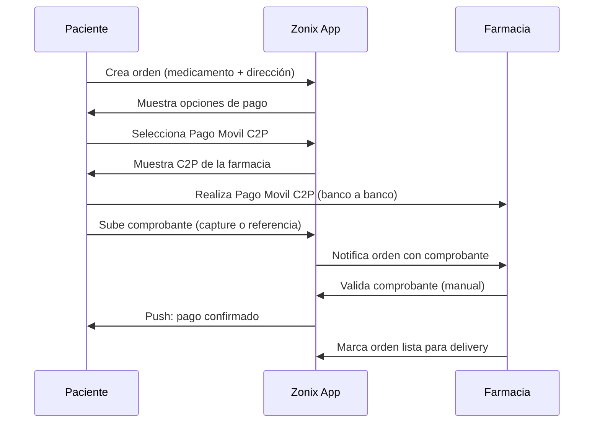
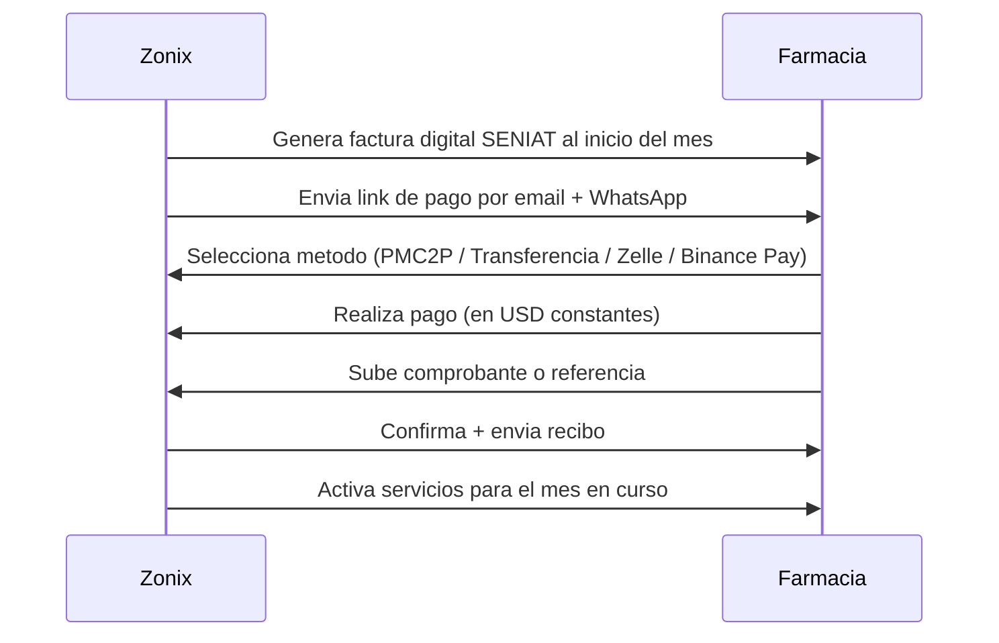

# Plan de métodos de pago

> **Última actualización:** 10 mayo 2026.
> Documento que detalla cómo se cobra y se paga en Zonix Pharma. Reusa lógica ya implementada en la plataforma del ecosistema Zonix y documentada en `[../logica-pagos-por-rol.md](../logica-pagos-por-rol.md)` y `[../FLUJO_PAGO_ORDEN.md](../FLUJO_PAGO_ORDEN.md)`.
> Para marco regulatorio (Sudeban) ver `[../REQUISITOS_OPERAR_VENEZUELA.md](../REQUISITOS_OPERAR_VENEZUELA.md)` sección "Sudeban / pagos".

## 1. Métodos de pago soportados

Zonix Pharma opera con **pagos manuales VE nativos**, sin pasarelas internacionales (Stripe / PayPal) ni tarjetas de crédito.


| Método                       | Aplicable                                                       | Tiempo confirmación | Comisión bancaria |
| ---------------------------- | --------------------------------------------------------------- | ------------------- | ----------------- |
| **Pago Móvil C2P**           | Pago paciente → farmacia                                        | 1-5 minutos         | 0% (BCV)          |
| **Transferencia bancaria**   | Pago paciente → farmacia, paciente → repartidor                 | 1-30 minutos        | 0%                |
| **Zelle** (USD desde EE.UU.) | Pago paciente → farmacia (paciente con cuenta US o familiar US) | 5-30 minutos        | 0% (Zelle)        |
| **Binance Pay USDT**         | Pago paciente → farmacia, repartidor en USDT                    | 1-3 minutos         | 0% (Binance Pay)  |
| **Efectivo**                 | Pago contra entrega                                             | Inmediato           | 0%                |
| **Punto de venta físico**    | Pago en farmacia (pickup)                                       | Inmediato           | 1-3%              |


**No soportados:**

- Tarjeta de crédito internacional → falta MerchantID empresarial VE costoso.
- PayPal → no operativo en VE para empresas locales.
- Stripe → no opera en VE.
- Petro / criptos exóticas → liquidez baja en VE 2026.

## 2. Flujos de pago detallados

### 2.1 Flujo paciente → farmacia (orden OTC)




**Tiempo total:** 5-15 minutos desde orden hasta pago confirmado.

### 2.2 Flujo paciente → farmacia (orden Rx)

Igual al flujo OTC, **pero con paso adicional**: validación Rx por farmacéutico colegiado **antes** del pago. Es decir:

1. Paciente crea orden con receta cargada.
2. Estado orden: `pending_prescription_validation`.
3. Farmacéutico colegiado valida (≤ 60 min).
4. Estado orden: `pending_payment`.
5. Paciente paga (igual flujo 2.1).
6. Estado orden: `pending_dispatch`.
7. Despacha y entrega.

Detalle del flujo Rx en [PLAN_MODULO_OPERATIVO_CLAVE.md](PLAN_MODULO_OPERATIVO_CLAVE.md).

### 2.3 Flujo Zonix → farmacia (servicio plataforma — cuota mensual)




**Frecuencia:** mensual. Día 1 de cada mes para clientes recurrentes; día de firma para nuevos.

**Modelo de cobro:** híbrido — **parte fija** (suscripción / licencia de uso de la plataforma) + **parte variable** (fee sobre GMV del mes cerrado según nivel). Definición de GMV, bandas, alta parcial y reclamos en [PROPUESTA_VALOR_CLIENTE_B2B.md](PROPUESTA_VALOR_CLIENTE_B2B.md) §5.4–§5.8.

**Factura digital SENIAT (descripción operativa; forma exacta la cierra el contador VE):**

- Una misma factura puede llevar **dos líneas de concepto** (o texto equivalente): (1) suscripción / licencia mes ___ — parte fija; (2) fee variable por volumen transaccional sobre GMV del mes ___ — ingreso por **servicio de plataforma**, no por la venta del medicamento al paciente.
- IVA, retenciones, moneda de facturación (USD indexado vs Bs) y redacción legal definitiva según figura fiscal de Zonix.

**Cambio de nivel por GMV:** ascenso solo si **dos meses calendario consecutivos** tienen GMV **cada uno** **mayor o igual (≥)** al umbral inferior del nivel destino (sin promedio); notificación al dueño tras cerrar el segundo mes; **nueva tarifa desde M+2**. Detalle en [PROPUESTA_VALOR_CLIENTE_B2B.md](PROPUESTA_VALOR_CLIENTE_B2B.md) §5.4.

**Disputas sobre cierre de GMV:** **7 días hábiles** desde publicación del cierre mensual; alcance según §5.8 del mismo documento.

**Política de impago:**

- Día 1: factura emitida (fija + variable del mes anterior cerrado).
- Día 5: recordatorio automático.
- Día 8: bloqueo soft (no acepta nuevas órdenes pero mantiene catálogo visible).
- Día 12: bloqueo hard (catálogo oculto).
- Día 15: cancelación cuenta + lista negra interna.

**Mora y devengo:** la **suspensión por mora no extingue** las tarifas ya devengadas (cuota fija + fee variable de meses cerrados). El estado de cuenta conserva los montos impagos. **Reactivación:** regularizar como mínimo el mes vencido u otro acuerdo por escrito (plan de pagos). Frase tipo para contrato marco: *La suspensión del servicio por mora no extingue las tarifas devengadas por períodos anteriores.*

**Alta en mes parcial:** primer mes desde incorporación puede facturarse solo **parte fija prorrateada** sin % sobre GMV (ver [PROPUESTA_VALOR_CLIENTE_B2B.md](PROPUESTA_VALOR_CLIENTE_B2B.md) §5.6).

### 2.4 Flujo Zonix → repartidor (delivery fee)

```mermaid
sequenceDiagram
    participant P as Paciente
    participant F as Farmacia
    participant Z as Zonix
    participant R as Repartidor
    P->>F: Paga orden completa (incluye delivery fee)
    F->>Z: Confirma recepcion total
    Z->>F: Calcula split: farmacia + delivery fee
    F->>R: Transferencia diaria delivery fee acumulado (PMC2P o Binance Pay)
    F->>Z: Sube comprobante de pago a repartidor
    Z->>R: Registra pago + fee fijo USD 0,30 por orden (procesamiento; sin % sobre delivery fee)
```

**Repartidor autónomo (`delivery`):** **0%** de comisión Zonix sobre el delivery fee; solo **USD 0,30 por orden completada** (alineado a [PROPUESTA_VALOR_TERCER_LADO.md](PROPUESTA_VALOR_TERCER_LADO.md) §A.4). El **8% sobre delivery fee** aplica **solo** a **empresa de delivery** (`delivery_company` + agentes) — §2.5 y mismo doc §B.4.

**Variante alternativa:** Zonix actúa como agregador y paga directo al repartidor (mes 6+ con asesoría Sudeban). En piloto NO; la farmacia paga al repartidor para evitar caer bajo regulación de "intermediario de pagos" Sudeban.

### 2.5 Flujo Zonix → empresa de delivery

Similar a 2.4, pero pago semanal a la empresa (no al agente individual) y consolidado. **Comisión Zonix:** **8%** del delivery fee (asignación, tracking, disputas) — [PROPUESTA_VALOR_TERCER_LADO.md](PROPUESTA_VALOR_TERCER_LADO.md) §B.4.

## 3. Conciliación contable

### 3.1 Para Zonix (revenue farmacias: cuota fija + fee sobre GMV)

- Los totales agregados dependen del mix de farmacias por banda GMV; las proyecciones del pack deben actualizarse cuando haya datos piloto (antes referían solo membresía fija).
- 60-70% por Pago Móvil C2P.
- 20-25% por transferencia.
- 10-15% por Zelle / Binance Pay USDT (cadenas con flujo USD).
- Conciliación manual los días 5 y 15 de cada mes con contador externo.

### 3.2 Para la farmacia (orden de venta)

- Cada orden tiene: monto medicamento + delivery fee.
- Farmacia recibe el monto del medicamento al instante (validación comprobante).
- Farmacia recibe el delivery fee y lo paga al repartidor (manual diario).

### 3.3 Política FX / Treasury (USD ↔ Bs)

- **Regla operativa:** gastos locales en Bs se cubren convirtiendo USD→Bs con tipo **BCV oficial** (referencia diaria); **no** usar paralelo para libros sin dictamen contable.
- **Cadencia:** al menos **2 veces por mes** (días 5 y 20) convertir ingresos USD liquidados a Bs para cubrir nómina local, servicios, coworking — o cuando la brecha de TC supere umbral definido con contador (ej. **> 5%** vs. última conversión).
- **Conciliación:** mismo tipo de cambio que usará **SENIAT / libros** (BCV promedio mensual vs. diario — **cerrar con contador**).
- **Stress:** si devaluación **> 15%** en 30 días vs. plan, revisión extraordinaria de política (ver [PROYECCION_FINANCIERA_12M.md](PROYECCION_FINANCIERA_12M.md) §5).

### 3.4 Libros, retenciones y cobranza (contador)

- **Retención ISLR / honorarios:** pagos a profesionales independientes en VE pueden estar sujetos a **retención** (orden típico **3-5%** según naturaleza y RIF — **validar** con contador en cada contrato).
- **Tipo de cambio en registros:** usar criterio único declarado (ej. **BCV día del pago** o **promedio mensual BCV**) para USD/Bs; **no mezclar** métodos en el mismo ejercicio sin asiento de ajuste.
- **Plantillas email mora** (coherentes con §2.3):

**Nivel 1 — día ~5 (recordatorio)**  
*Asunto:* Zonix Pharma — Factura [mes] pendiente  
*Cuerpo:* Estimados, les recordamos que la factura del servicio de plataforma [mes] vence. Total USD ___ / Bs ___ según factura digital. Cualquier duda respondan este hilo.

**Nivel 2 — día ~8 (aviso suspensión)**  
*Asunto:* Suspendemos nuevas órdenes por mora — acción requerida  
*Cuerpo:* No registramos pago de la factura [mes]. A partir de mañana activamos **bloqueo soft** (sin nuevas órdenes). El estado de cuenta y tarifas devengadas siguen vigentes (ver política contrato).

**Nivel 3 — día ~10+ (bloqueo hard)**  
*Asunto:* Catálogo suspendido — regularización  
*Cuerpo:* Por mora continuada activamos **bloqueo hard** (catálogo no visible). Para reactivar: pago mínimo del período vencido o plan escrito con tesorería Zonix.

### 3.5 Para el repartidor

- Recibe pago diario o semanal (según preferencia).
- Foundamentación: WhatsApp con foto del comprobante.

## 4. Factura digital SENIAT

### 4.1 Habilitación

- Mes 1-2 del piloto: contratar proveedor autorizado SENIAT.
- Costo: USD 100-200 anuales.
- Proveedores recomendados: TheFactoryHKA, Edsa, Wisetax (autorizados SENIAT).

### 4.2 Emisión

- Cada período mensual genera **una factura digital** a la farmacia que puede incluir **dos conceptos** (fija + variable sobre GMV del mes — ver §2.3).
- Cada compra de paciente: la farmacia emite factura al paciente donde aplique (no Zonix).
- Zonix solo factura a la farmacia el servicio de plataforma, no al paciente final por el medicamento.

### 4.3 Archivado

- Sello digital + firma digital + reporte mensual a SENIAT.
- Backup en S3 o equivalente con retención 10 años (legal).

## 5. Mitigación de riesgos de pago


| Riesgo                                             | Mitigación                                                                                                                                |
| -------------------------------------------------- | ----------------------------------------------------------------------------------------------------------------------------------------- |
| Paciente sube comprobante falso                    | Validación visual por la farmacia + Customer Support de Zonix puede mediar. Penalización: cuenta suspendida en 24h.                       |
| Farmacia no paga cuota Zonix                       | Política de bloqueo escalonado (§2.3); la deuda devengada subsiste hasta regularización o acuerdo escrito.                                |
| Repartidor no recibe pago de farmacia              | Customer Support media. Penalización a la farmacia: bloqueo de delivery fee adicional hasta resolver.                                     |
| Devaluación bolívar entre orden y pago             | Política: precio congelado por 30 minutos desde generación de orden. Si paciente excede, debe re-cotizar.                                 |
| Sudeban regula a Zonix como intermediario de pagos | Piloto opera sin Zonix recibir dinero del paciente directamente. Si requiere, Zonix obtiene licencia Sudeban (12-18 meses, post-Serie A). |
| Bloqueo cuentas Zelle por origen VE                | Política: no usar Zelle como único método; tener PMC2P + Binance Pay como respaldo.                                                       |


## 6. Implementación técnica (referencia)

El backend Laravel ya tiene módulos implementados:

- `app/Models/Order` con campos `payment_method`, `payment_proof_url`, `payment_status`, `payment_validated_at`.
- `app/Http/Controllers/PaymentController` para upload de comprobante + validación.
- `database/migrations` con tabla `payments` y `payment_methods`.
- Eventos broadcast (`PaymentValidated`, `PaymentRejected`) con Pusher.
- FCM push notifications a paciente y farmacia.

Detalle: `[../FLUJO_PAGO_ORDEN.md](../FLUJO_PAGO_ORDEN.md)` y `[../logica-pagos-por-rol.md](../logica-pagos-por-rol.md)`.

## 7. Política de reembolsos

### 7.1 Quién reembolsa

- **Si el problema es de la farmacia** (medicamento equivocado, vencido, mal estado): la farmacia reembolsa al paciente directamente. Zonix media.
- **Si el problema es del repartidor** (pérdida, robo durante la entrega): el repartidor pierde el delivery fee. La farmacia reembolsa al paciente y no paga al repartidor.
- **Si el problema es de Zonix** (bug en la app, validación errónea): Zonix reembolsa al paciente (cargo a cuenta operativa, raro).

### 7.2 Tiempo de reembolso

- 24-48h después de mediación de Customer Support.
- Mismo método del pago original (PMC2P → PMC2P, etc.).

### 7.3 Disputa final

- Si paciente y farmacia no acuerdan: Customer Support de Zonix decide en base a evidencia (foto entrega, estado producto, comprobante).
- Decisión inapelable en piloto. Post-Serie A se evalúa órgano externo.

## 8. KPIs de pagos


| KPI                                        | Meta mes 6 | Meta mes 12 |
| ------------------------------------------ | ---------- | ----------- |
| % órdenes pagadas con PMC2P                | 65%        | 60%         |
| % órdenes pagadas con Zelle                | 8%         | 12%         |
| % órdenes pagadas con Binance Pay          | 3%         | 8%          |
| % órdenes pagadas en efectivo (pickup)     | 18%        | 15%         |
| Tiempo promedio validación pago (farmacia) | 8 min      | 5 min       |
| Tasa de impago membresía                   | < 8%       | < 5%        |
| Tasa de comprobante falso detectado        | < 0,5%     | < 0,3%      |


## 9. Documentos hermanos

- [PROPUESTA_VALOR_USUARIO_FINAL.md](PROPUESTA_VALOR_USUARIO_FINAL.md): cómo el paciente paga.
- [PROPUESTA_VALOR_CLIENTE_B2B.md](PROPUESTA_VALOR_CLIENTE_B2B.md): cómo la farmacia recibe.
- [PROPUESTA_VALOR_TERCER_LADO.md](PROPUESTA_VALOR_TERCER_LADO.md): cómo el repartidor cobra.
- [PLAN_MODULO_OPERATIVO_CLAVE.md](PLAN_MODULO_OPERATIVO_CLAVE.md): validación Rx antes del pago.
- `[../FLUJO_PAGO_ORDEN.md](../FLUJO_PAGO_ORDEN.md)`: implementación técnica detallada.
- `[../logica-pagos-por-rol.md](../logica-pagos-por-rol.md)`: roles en el flujo de pagos.
- `[../REQUISITOS_OPERAR_VENEZUELA.md](../REQUISITOS_OPERAR_VENEZUELA.md)`: marco regulatorio Sudeban.

