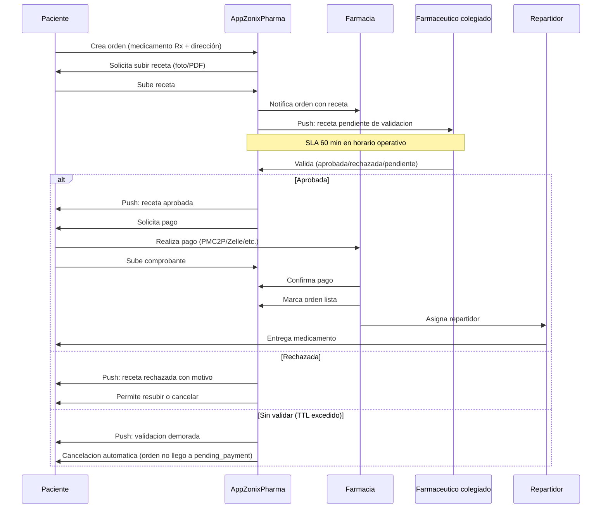

# Plan del módulo operativo clave: validación Rx por farmacéutico colegiado

> **Última actualización:** 11 junio 2026.
> Documento que detalla el flujo central diferenciador de Zonix Pharma: la **validación de receta médica (Rx) por farmacéutico colegiado** dentro de la app.
>
> **One-pager inversor (3 min):** §1 diferenciador · §4 diagrama flujo · §6 SLA · §10 cadena frío resumen. Runbook completo (onboarding, §14 seguridad, §16–18 QA) = anexo operativo post-wire.
> **Flujo Rx (upload → validación farmacéutico → TTL):** operativo en backend y tests; ver [`../PLAN_RX_VALIDATION.md`](../PLAN_RX_VALIDATION.md). **Inventario por lotes FIFO** en panel farmacia: esquema BD listo; **UI y despacho FIFO** post-Day-D o M3+ ([ALINEACION_LANZAMIENTO_VS_PRODUCTO_2026-05.md](ALINEACION_LANZAMIENTO_VS_PRODUCTO_2026-05.md)).

## 1. Por qué este módulo es crítico

1. **Es el diferenciador legal:** Rappi y PedidosYa NO validan recetas digitalmente en VE. Farmatodo y Locatel hacen validación física en sucursal.
2. **Alineado al marco regulatorio:** la Ley del Ejercicio de la Farmacia VE exige validación por farmacéutico colegiado *[dictamen formal abogado + farmacéutico asesor antes de Day-D]*.
3. **Genera trazabilidad:** quién validó, cuándo, qué medicamento, qué receta, qué paciente. Fundamental ante MPPS.
4. **Habilita el segmento Rx (48,3% del mercado farmacéutico VE):** sin esto, **Zonix Pharma** solo opera OTC + cuidado personal.
5. **Reduce riesgo de mal uso:** Rx retenida, sustancias controladas, dosis verificada.

### 1.1 Última milla — concesión a operador especializado

**Zonix Pharma no opera flota propia de reparto.** La **ejecución física** del delivery (conductores, vehículos, rutina de campo, seguros y procedimientos del operador logístico) corresponde a **empresa(s) de delivery especializada(s)** con las que se suscriba **contrato marco o concesión**. La plataforma mantiene roles **`delivery_company`** y **`delivery_agent`** (sin rol **`delivery`** autónomo en producto piloto) para **asignación, tracking y reglas comerciales**; el **Coordinador de Partners Logísticos** articula **SLA, cobertura e incidencias** con el **partner**, sin sustituir al ejecutor de última milla.

Disputas que involucren entrega (incl. cadena de frío en ruta) se **median** según playbook del documento (p. ej. §16), distinguendo responsabilidades **farmacia / partner / paciente** frente a lo que **Zonix** controla en producto y datos.

## 2. Roles involucrados

| Rol | Acción |
|---|---|
| Paciente (`users`) | Sube foto/PDF de receta + crea orden |
| Farmacéutico colegiado (`pharmacist`) | Valida o rechaza receta digital |
| Farmacia (`commerce`) | Despacha medicamento |
| Repartidor (`delivery_agent` del partner) | Entrega en domicilio o pickup en sucursal |
| Customer Support de **Zonix Pharma** | Media en disputas y casos límite |

## 3. Tipos de receta soportados

### 3.1 Receta común (mayoría de Rx)

- Medicamento genérico o de marca, no controlado, no retenido.
- Validación digital por farmacéutico colegiado de la farmacia despachadora.
- Despacho normal: a domicilio o pickup.

### 3.2 Receta retenida

- Categoría según legislación: psicotrópicos clase II-IV, opiáceos, otros con orden de retención.
- **Obligatorio:** retención física de la receta original en la farmacia.
- Despacho **solo pickup en sucursal**, no a domicilio.
- El paciente debe presentar la receta original al recoger.

### 3.3 Receta especial (sustancias controladas)

- Categoría según legislación: estupefacientes y psicotrópicos clase I.
- **Obligatorio:** retención física + libro de control de la farmacia.
- Despacho **solo pickup en sucursal con identificación del paciente**.
- Validación digital + revisión de identidad obligatoria.
- En piloto: opcional. Activar en mes 4-6 con asesoría regulatoria.

**Referencia normativa:** clasificación exacta **común / retenida / especial** y listados de sustancias deben alinearse a **resoluciones MPPS / normativa vigente** — **[PENDIENTE]** adjuntar número de resolución y fecha en data room tras dictamen **farmacéutico asesor + abogado** (no inventar cita). Marco de trabajo y anexos previstos: [`../PLAN_REGULATORIO_PHARMA_VE.md`](../PLAN_REGULATORIO_PHARMA_VE.md) (no sustituye cita formal en comunicación al paciente o a autoridad).

## 4. Flujo operativo paso a paso

## 5. Estados de la orden Rx

| Estado | Descripción |
|---|---|
| `pending_prescription_validation` | Receta subida, esperando validación. |
| `prescription_approved` | Validada. Pasa a `pending_payment`. |
| `prescription_rejected` | Rechazada. Paciente puede resubir o cancelar. |
| `prescription_expired` | TTL de validación excedido (configurable — default **60 min** en horario operativo). Cancelación automática **antes** de `pending_payment`. |
| `pending_payment` | Lista para pagar. |
| `pending_dispatch` | Pagada, en preparación. |
| `dispatched` | Salió de la farmacia. |
| `in_transit` | En ruta del repartidor. |
| `delivered` | Entregada. |
| `cancelled` | Cancelada por cualquier motivo. |
| `returned` | Devuelta (medicamento equivocado, vencido, etc.). |

Detalle técnico de transiciones en backend: ver [../PLAN_RX_VALIDATION.md](../PLAN_RX_VALIDATION.md) y la documentación de ciclo de vida de órdenes en el repositorio.

## 6. SLA de validación

> **TTL configurable** en backend (`prescription_validation_ttl_minutes`; default **60**). Los plazos siguientes son **SLA operativo** para farmacéutico y CS, no sustituyen normativa MPPS.

| Horario | SLA Validación |
|---|---|
| Horario operativo (8:00 - 20:00) | ≤ **60 minutos** (default TTL) |
| Fuera de horario operativo | Pendiente al siguiente horario operativo + notificación al paciente |

**Si excede el TTL configurado (default 60 min en horario operativo):**
- Push al paciente: "Validación demorada. Reintentando..."
- Push al farmacéutico colegiado: "Receta vence pronto, validar urgente."

**Si excede 120 min desde subida (domingos/feriados — operación reducida, §15.1):**
- Cancelación automática de la orden en `pending_prescription_validation`.
- Notificación al paciente.
- **Sin reembolso** en flujo estándar Rx: el pago ocurre **después** de validación (`pending_payment`). Si en el futuro hubiera pago anticipado, aplicar política en [PLAN_METODOS_PAGO.md](PLAN_METODOS_PAGO.md) §4.
- Métrica negativa para la farmacia (cuenta como SLA missed).

## 7. Onboarding del farmacéutico colegiado

### 7.1 Pasos

| Paso | Tiempo |
|---|---|
| Farmacia añade pharmacist a su cuenta | 5 min |
| KYC del pharmacist: cédula + foto + número MPPS + registro INHRR | 10 min (paciente) + 24-48h (verificación **Zonix Pharma**) |
| Customer Support verifica número MPPS (ver **§7.4**) | Async, 1-2 días hábiles |
| Capacitación: video tutorial 20 min + manual PDF | 30 min |
| Test operativo: validar 3 recetas de prueba | 30 min |
| Activación cuenta | Inmediato post-test |

### 7.2 Materiales de capacitación

- **Video tutorial:** screencast de 15-20 min con flujo completo.
- **Manual PDF:** 8-12 páginas con casos comunes y casos límite.
- **FAQ:** 30+ preguntas comunes con respuestas.
- **Soporte directo:** WhatsApp del Customer Support de **Zonix Pharma** para dudas.

### 7.3 Compromisos del pharmacist

- Cumplir SLA de 60 min en horario operativo.
- Actualizar estado de la receta en máximo 24h fuera de horario operativo.
- Reportar inmediatamente cualquier sospecha de receta falsificada.
- Mantener su número MPPS vigente.
- Responder ante MPPS si se requiere auditoría (**Zonix Pharma** entrega historial / export según procedimiento acordado con abogado).

### 7.4 Verificación del número MPPS (fuente y contingencia)

| Paso | Acción |
|---|---|
| 1 | Customer Support introduce número MPPS del pharmacist en flujo interno. |
| 2 | **Contraste con fuente oficial** disponible al momento del onboarding: portal o consulta del **MPPS** y/o **colegio farmacéutico regional**, según acceso vigente (los portales cambian; mantener URL de referencia actualizada en runbook interno). |
| 3 | Si la consulta en línea **falla** o no devuelve match | Verificación **manual** en 48-72h hábiles; cuenta pharmacist en estado **pendiente** sin validar recetas reales hasta aprobación. |
| 4 | Evidencia | Captura o registro de consulta archivado (audit trail) asociado al `pharmacist_id`. |

## 8. Auditoría y trazabilidad

### 8.1 Audit log

Cada validación queda registrada en backend con:

- `prescription_id`
- `pharmacist_id` y `pharmacist_mpps_number`
- `pharmacy_id`
- `order_id`
- `patient_id`
- `validation_result` (`approved` / `rejected` / `expired`)
- `rejection_reason` (si aplica)
- `validation_timestamp`
- `validator_ip` y `user_agent`
- `prescription_url` (storage S3 con tiempo de retención según ley)
- `digital_signature` (hash SHA256 de la validación)

### 8.2 Retención

- **Recetas comunes:** 10 años (estándar farmacéutico).
- **Recetas retenidas / controladas:** 10 años + retención física en la farmacia.

### 8.2.1 Sustento normativo y responsabilidad (revisión profesional)

- Los plazos de **conservación digital** en la plataforma (p. ej. 10 años para trazabilidad de receta validada) **alinean con práctica de expediente y fiscalización** del sector; la **custodia física** de recetas **retenidas / controladas** y los **libros de control** son **obligación de la farmacia** como establecimiento farmacéutico.
- **Antes del lanzamiento público (Day-D):** dictamen escrito de **abogado en farmacia y datos de salud VE** + revisión de **farmacéutico asesor** que cite **normativa aplicable** (Ley del Ejercicio de la Farmacia, resoluciones MPPS/INHRR vigentes, instructivos sobre psicotrópicos/estupefacientes) y ajuste, si hace falta, plazos y textos en T&C y política de privacidad.
- Cualquier cifra de años en este pack es **hipótesis operativa** hasta esa validación.

### 8.3 Exportación / pack de trazabilidad (due diligence y autoridades)

- Botón en dashboard del pharmacist: "Exportar mis validaciones del mes" (objetivo de producto; priorizar con CTO).
- Genera **PDF u otro formato exportable** con audit log filtrado (campos mínimos bajo minimización — §14).
- **Uso ante MPPS u otra autoridad:** el **contenido, soporte y plazos** del entregable se ajustan al requerimiento específico y al dictamen **farmacéutico asesor + abogado**; no se declara formato «oficial MPPS» hasta anexarlo al data room. Marco previo: [`../PLAN_REGULATORIO_PHARMA_VE.md`](../PLAN_REGULATORIO_PHARMA_VE.md).

## 9. Manejo de casos límite

### 9.1 Receta no legible

- Pharmacist marca como "rechazada — receta ilegible".
- Paciente recibe push con motivo + opción de resubir.

### 9.2 Receta vencida

- TTL receta médica VE: depende del tipo; **referencia habitual** muchas recetas comunes **30 días** desde emisión — **confirmar** con normativa aplicable y criterio del farmacéutico colegiado (**[PENDIENTE]** cita MPPS/COFV si se usa en comunicación al paciente). Contexto regulatorio del repo: [`../PLAN_REGULATORIO_PHARMA_VE.md`](../PLAN_REGULATORIO_PHARMA_VE.md) (no sustituye cita en T&C hasta dictamen).
- Si la receta tiene fecha > umbral válido: pharmacist rechaza con motivo.

### 9.3 Receta de medicamento sin INHRR

- Sistema detecta automáticamente: medicamento solicitado no está en catálogo INHRR vigente.
- Farmacia y pharmacist rechazan.

### 9.4 Receta para sustancia controlada

- Sistema detecta: medicamento controlado.
- Sistema obliga modo pickup (no delivery).
- Pharmacist verifica adicionalmente identidad del paciente al despachar.

### 9.5 Receta sospechosa de falsificación

- Pharmacist marca como "rechazada — sospecha falsificación".
- Sistema notifica a Customer Support de **Zonix Pharma**.
- Customer Support contacta al paciente para investigar.
- Si confirma: cuenta del paciente suspendida 90 días o permanente según gravedad.
- Audit log / export se entrega a MPPS u autoridad competente **si lo solicitan**, en la forma acordada con **abogado** (sin prometer formato preaprobado).

### 9.6 Sustancias controladas y nomenclatura legal (disclaimer)

Las etiquetas de producto en la app (**`common` / `retained` / `special`**, controlados, cadena de frío) deben **mapearse** a listados y requisitos **vigentes en Venezuela** (estupefacientes, psicotrópicos, recetas oficiales, libros de control). **Mes 0-3 del piloto:** priorizar recetas **comunes** y flujo operativo estable; antes de escalar volumen en **controlados**, publicar **tabla de equivalencias** aprobada por **farmacéutico asesor + abogado** y ajustar UX (mensajes obligatorios, pickup, identificación). **Resolución(es) MPPS de referencia:** **[PENDIENTE]** anexar en data room (trabajo preparatorio: [`../PLAN_REGULATORIO_PHARMA_VE.md`](../PLAN_REGULATORIO_PHARMA_VE.md)).

## 10. Cadena de frío

### 10.1 Productos con `cold_chain = true`

- Insulinas, vacunas, biológicos, ciertos sueros.
- Sistema bloquea modos de delivery sin equipo de refrigeración.
- Solo se asigna a:
  - Pickup en sucursal con caja térmica entregada al paciente.
  - Repartidor con equipo de cadena de frío validado por la farmacia.

### 10.2 Verificación

- Repartidor sube foto del termómetro al recoger y al entregar.
- Si temperatura excede umbrales: alerta automática.
- Política de reembolso si se rompe cadena de frío.

## 11. Farmacovigilancia y eventos adversos (Chief Medical / regulatorio)

> **`[roadmap]` — producto:** el flujo descrito abajo es **operativo objetivo**; en código **jun 2026** no hay formulario in-app post-entrega ni integración INHRR automatizada. Hasta implementarlo: canal vía Customer Support + farmacia según §16.

**Objetivo:** canal formal para **eventos adversos (EA)** y sospechas de fallos de calidad asociados a medicamentos dispensados vía **Zonix Pharma**.

| Paso | Responsable | Acción |
|---|---|---|
| 1. Captura | Paciente (app) o farmacia | Formulario corto post-entrega: síntoma, medicamento, lote si existe |
| 2. Triaje | Customer Support **Zonix Pharma** | Prioridad; datos completos en ≤ 24 h hábiles |
| 3. Val clínico | Farmacéutico colegiado de la farmacia despachadora | Evaluación inicial; escalamiento médico si procede |
| 4. Reporte regulatorio | Farmacia / asesor regulatorio | Notificación a **INHRR** u autoridad que corresponda según normativa vigente — **plantillas y plazos [PENDIENTE]** con farmacéutico asesor + abogado; alinear con [`../PLAN_REGULATORIO_PHARMA_VE.md`](../PLAN_REGULATORIO_PHARMA_VE.md) |
| 5. Registro interno | **Zonix Pharma** | Audit log; sin datos clínicos innecesarios; retención según §14 |

**Disclaimer app:** reportar EA **no sustituye** atención médica urgente; en emergencia dirigir a servicio de salud.

## 12. Métricas operativas del módulo

| Métrica | Meta mes 6 | Meta mes 12 |
|---|---|---|
| Tiempo promedio validación Rx | 35 min | 25 min |
| Tasa de aprobación primera vez | 85% | 90% |
| Tasa de TTL excedido | < 5% | < 3% |
| Tasa de receta detectada falsa | < 0,5% | < 0,3% |
| Tasa de quejas de paciente sobre validación | < 4% | < 2% |
| Pharmacists activos | 8-15 | 35-45 |
| Recetas validadas mes | 200 | 1.500+ |
| **Eventos adversos (EA) reportados/mes** (farmacovigilancia) | **≤ 2** | **≤ 5** |
| **TTR triaje EA** (Customer Support → escalamiento farmacia) | **≤ 24 h** | **≤ 12 h** |

## 13. Riesgos del módulo

| Riesgo | Mitigación |
|---|---|
| Pharmacist se rehúsa a validar digital | Capacitación + soporte. La farmacia decide si lo capacita o cambia. |
| Pharmacist excede SLA frecuentemente | Alertas + escalamiento a la farmacia. Si crónico, suspender afiliación. |
| Receta falsa pasa la validación | Audit log + Customer Support **Zonix Pharma** investiga. Programa de fraud detection con ML en año 2. |
| MPPS audita y encuentra fallas | Trazabilidad completa + asesor regulatorio externo. |
| Paciente sube datos personales sensibles fuera de la receta | Política de privacidad + cifrado en reposo + audit log. |

## 14. Seguridad y privacidad de datos médicos

Datos de salud son categoría especial; **marco legal VE en actualización** — diseño orientado a consentimiento, minimización y seguridad descritos en [ESTRUCTURA_LEGAL_Y_EQUITY.md](ESTRUCTURA_LEGAL_Y_EQUITY.md) §4.4. *[PENDIENTE dictamen abogado + farmacéutico asesor antes de Day-D público]* — no afirmar «cumplimiento pleno» hasta dictamen.

### 14.1 Almacenamiento

- **Recetas (foto/PDF):** S3 cifrado en reposo (AES-256). Bucket privado, acceso solo vía signed URL con TTL ≤ 60 min.
- **Cédulas KYC del pharmacist y repartidor:** mismo S3 cifrado, política de retención 5 años o lo que exija ley aplicable.
- **Comprobantes de pago:** S3 cifrado, retención **hasta 10 años** *[PENDIENTE contador/abogado — plazo contable VE]*.
- **Datos médicos del paciente** (medicamento comprado, frecuencia, condición indirecta): MySQL cifrado en reposo. Acceso vía API solo con sesión autenticada del paciente o con sesión del pharmacist responsable de su orden.

### 14.2 Transmisión

- TLS 1.3 obligatorio en toda comunicación cliente-servidor.
- Sin endpoints HTTP no encriptados.
- Headers de seguridad (HSTS, CSP) configurados.

### 14.3 Acceso

- Audit log de todo acceso a datos sensibles.
- Principle of Least Privilege: el pharmacist solo ve recetas asignadas a SU farmacia.
- Customer Support de **Zonix Pharma** solo accede a datos sensibles vía herramienta auditada cuando hay disputa abierta.

### 14.4 Retención

- **Receta común (digital en plataforma):** **hasta 10 años** como hipótesis de trazabilidad y defensa ante disputas; **ajustar** tras dictamen legal/farmacéutico (ver §8.2.1). **Implementación código (jun 2026):** purge automático de adjuntos **90 días** tras estado terminal (`config/zonix.php` → `prescription_retention_days_after_terminal`, default **90**) — **desalineación doc↔código** pendiente de unificar con `[PENDIENTE abogado/asesor]`.
- **Receta retenida / controlada:** conservación digital coherente con lo anterior + **retención física y libros** en la farmacia (responsabilidad del establecimiento).
- **Datos personales paciente sin actividad:** anonimización después de 3 años de inactividad (política interna; validar plazo con abogado).
- **Comprobantes de pago:** 10 años (marco contable VE; validar con contador).

### 14.5 Consentimiento

- Onboarding del paciente requiere consentimiento explícito a la política de privacidad antes de subir receta.
- El paciente puede solicitar exportación de sus datos en cualquier momento (RGPD-like).
- El paciente puede solicitar eliminación de su cuenta y datos (con excepción de los retenidos por ley contable o farmacéutica).

### 14.6 Incidentes de seguridad

- Plan de respuesta documentado.
- Notificación al paciente afectado dentro de 72h si hay leak material.
- Notificación a autoridad VE de protección de datos.

## 15. Capacidad operativa fuera de horario y picos

### 15.1 Horario operativo estándar

- **Lunes-Sábado 08:00-20:00:** SLA validación Rx 60 min.
- **Domingos y feriados:** SLA validación Rx 120 min (operación reducida).

### 15.2 Capacidad de Customer Support

- **Mes 1-3:** 1 persona Customer Support 8h/día Lun-Sáb. Founder cubre fines de semana y emergencias.
- **Mes 4-6:** Customer Support extiende a 12h/día Lun-Sáb. Marketing Lead cubre 2-3h Domingo en horario pico.
- **Mes 7-12:** Si volumen lo justifica, contratar 2do Customer Support part-time (USD 150-200/mes adicional, no presupuestado en Base; Growth lo absorbe).

### 15.3 Plan ante picos (feriados, fines de semana, eventos)

- Notificación previa al equipo: programación de turnos.
- Comunicación previa a farmacias activas: capacidad reducida → mejorar SLA acuerdos.
- Buffer de Sales B2B y Coordinador de Partners Logísticos como respaldo de Customer Support si excede 50 tickets/día (raro).

### 15.4 Plan ante incidente técnico (servidor caído)

- **VPS Nameshared** (y demás proveedores cloud del stack) — SLA según contrato del proveedor de hosting.
- Si caída > 1h: notificación push a paciente + farmacia.
- Plan B operativo: pickup en sucursal con orden manual mientras se restaura.

### 15.5 Contingencia partner delivery (pre y post Day-D)

El partner #1 es dependencia crítica (alianza asimétrica — [PROPUESTA_VALOR_TERCER_LADO.md](PROPUESTA_VALOR_TERCER_LADO.md) §A.11). Plan B por escenario:

| Escenario | Acción inmediata | Acción estructural |
|-----------|------------------|--------------------|
| Partner #1 **no firma antes de T+60** | Day-D arranca en modo **pickup-first** (pedido + retiro en sucursal); delivery se activa al firmar | Acelerar pipeline **partner #2** (REGISTRO P1-10) |
| Partner **cae en operación** (huelga, quiebra, abandono) | Pickup forzado en app + notificación a pacientes con pedido en ruta | Plan de transición a partner #2 según preaviso contractual `[PENDIENTE contrato marco]` |
| Partner **degrada SLA** en picos (prioriza otros clientes) | Escalar a Coordinador Partners; limitar radio de delivery temporalmente | Mínimos de agentes/franja en contrato; revisión mensual de SLA |

Regla: **pickup siempre disponible** en producto — el delivery es upside operativo, no condición de existencia del pedido.
- Founder es el único responsable técnico. Si la indisponibilidad supera 1 semana, contratar consultor externo.

## 16. Playbook de incidencias operativas (COO / Customer Support)

Objetivo: **tiempo a resolución (TTR)** predecible y registro en ticket para aprendizaje y due diligence.

| Tipo | Síntoma | Escalamiento | TTR objetivo |
|---|---|---|---|
| P0 — Caída de API / app | Errores masivos, órdenes no creadas | Founder + proveedor nube | < 2 h |
| P1 — Rx atascada sin validar | SLA > 45 min | Push farmacia + teléfono a sucursal | < 90 min |
| P2 — Catálogo mal cargado | Precio o stock incorrecto | Customer Support → farmacia admin | < 24 h |
| P3 — Disputa pago | Comprobante no coincide | Customer Support → farmacia + paciente | < 48 h |
| P4 — Delivery frío roto | Foto termómetro fuera de rango | Customer Support → política de reembolso farmacia | < 72 h |
| P5 — Farmacia sin pharmacist de guardia | Cola de validaciones | Acuerdo previo con farmacia (suplente MPPS) | según contrato |

**Métricas Customer Support (objetivo mes 6):** primera respuesta **< 15 min** horario laboral; **> 85%** tickets cerrados sin reabrir; backlog **< 48 h** salvo P0.

## 17. Modelo de amenazas abreviado (AppSec / CTO)

| Amenaza | Superficie | Mitigación en producto |
|---|---|---|
| Robo de sesión / token | API móvil | Sanctum, rotación, rate limit, HTTPS only |
| IDOR en recetas u órdenes | IDs en URL/body | Autorización por rol + `pharmacy_id` scope en cada query |
| Upload malicioso (PDF/foto) | Receta | Tipo MIME, tamaño máx, antivirus server-side, almacenamiento privado |
| URL firmada filtrada | S3 signed URLs | TTL corto (≤ 60 min), sin listados públicos |
| Webhooks pagos / OTP | Integraciones | Firma HMAC secreto, replay window, IP allowlist si aplica |
| Insider Support | Herramientas internas | Acceso solo con ticket + audit log de cada vista |
| **Suplantación de pharmacist** | Login pharmacist | **2FA opcional (TOTP)** en cuentas críticas — **roadmap T+90** (hardening post-piloto) |

**DR / continuidad:** backups automáticos BD + snapshots configuración; prueba de restore **trimestral**; RPO objetivo **≤ 24 h**, RTO **≤ 4 h** para servicio core (ajustar con proveedor).

## 18. QA y definición de “listo para piloto” (SDET / CTO)

| Capa | Qué se exige antes de Day-D |
|---|---|
| Automatizado | `php artisan test` en verde en CI; smoke API auth + orden OTC |
| Manual | Flujo completo: registro buyer → carrito Rx → subida receta → validación pharmacist test → pago comprobante → dispatch |
| Seguridad | Revisión checklist §17; sin secretos en repo; headers TLS |
| Datos | Política de privacidad y consentimientos visibles en build de tienda |
| Legal | Contrato marco farmacia + avisos revisados por abogado (ver [ESTRUCTURA_LEGAL_Y_EQUITY.md](ESTRUCTURA_LEGAL_Y_EQUITY.md) §4.4.5) |

**Regresión:** antes de cada release a producción, ejecutar suite automatizada + smoke manual de 30 min (script en runbook interno).

## 19. Documentos hermanos

- [PROPUESTA_VALOR_TERCER_LADO.md](PROPUESTA_VALOR_TERCER_LADO.md): rol del farmacéutico colegiado.
- [PROPUESTA_VALOR_USUARIO_FINAL.md](PROPUESTA_VALOR_USUARIO_FINAL.md): cómo el paciente sube receta.
- [PROPUESTA_VALOR_CLIENTE_B2B.md](PROPUESTA_VALOR_CLIENTE_B2B.md): qué le ofrece a la farmacia.
- [PLAN_METODOS_PAGO.md](PLAN_METODOS_PAGO.md): pago después de la validación.
- [`../PLAN_RX_VALIDATION.md`](../PLAN_RX_VALIDATION.md): detalle técnico backend.
- [`../PLAN_REGULATORIO_PHARMA_VE.md`](../PLAN_REGULATORIO_PHARMA_VE.md): regulación VE detallada.
