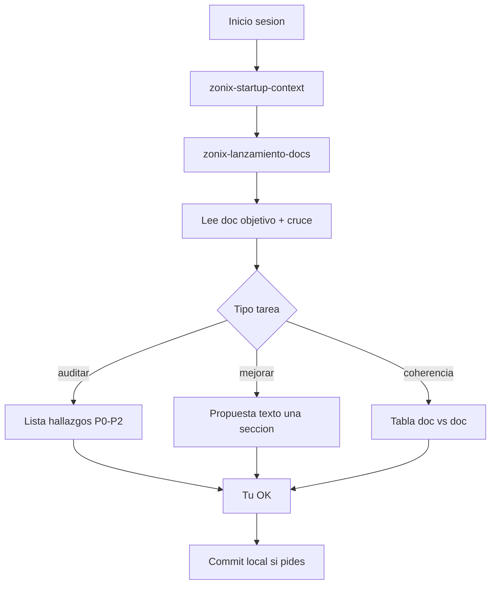

# Prompt pack — trabajar con `docs/Lanzamiento/` (Jarvis)

> **Última actualización:** 27 mayo 2026.  
> **Uso:** Copiar el **Prompt A** al iniciar cada chat con la IA en Cursor. Añadir **B–F** según la tarea.  
> **Skills:** [.agents/skills/zonix-lanzamiento-docs/SKILL.md](../../.agents/skills/zonix-lanzamiento-docs/SKILL.md) · [SKILLS_STARTUP_USAR_NO_USAR.md](../zonix/SKILLS_STARTUP_USAR_NO_USAR.md)

---

## Qué necesita la IA (obligatorio)

1. Repo **ZonixPharma-Backend**, rama `dev`.
2. **Objetivo** en una frase: auditar / mejorar sección / coherencia finanzas / reunión inversor.
3. **Un documento o sección por mensaje.**
4. Invocar: **`zonix-startup-context` + `zonix-lanzamiento-docs`** + skill del router (tabla en skill).

### Lectura automática (no pegar en el chat)

| Prioridad | Archivo |
|-----------|---------|
| 1 | `.agents/skills/zonix-startup-context/SKILL.md` |
| 2 | `.agents/skills/zonix-lanzamiento-docs/SKILL.md` |
| 3 | `docs/Lanzamiento/README.md` |
| 4 | El `.md` que indiques |
| 5 | Skill hija (ej. `zonix-financial-model` para PROYECCION) |

### Cruces según tarea

| Tarea | Leer también |
|-------|----------------|
| Cualquier doc | [INCOHERENCIAS_LANZAMIENTO_2026-05.md](INCOHERENCIAS_LANZAMIENTO_2026-05.md) |
| Producto / demo | [ALINEACION_LANZAMIENTO_VS_PRODUCTO_2026-05.md](ALINEACION_LANZAMIENTO_VS_PRODUCTO_2026-05.md) |
| Pendientes | [REGISTRO_PENDIENTES_PACK.md](REGISTRO_PENDIENTES_PACK.md) — la IA **no inventa** P0/P1 |
| Finanzas | PROYECCION §1.1 + UNIT + PRESUPUESTO |
| Pitch inversor | BRIEF + MENSAJE + CHECKLIST |
| Copy salud / Rx | `zonix-regulatory-ve` + [PLAN_REGULATORIO_PHARMA_VE.md](../PLAN_REGULATORIO_PHARMA_VE.md) |

### Lo que aportas tú (founder) — ver § Checklist datos humanos

- VOLCADO, REGISTRO P0, decisiones tier, waiver, fecha demo.
- OK explícito antes de que la IA edite archivos.

### La IA no hará sin tu orden

- Cambiar cifras fuera de README / PROYECCION / PRESUPUESTO / UNIT / ESTRUCTURA_LEGAL.
- `npx skills add` de repos GitHub externos.
- Rellenar `[PENDIENTE]` con datos inventados.
- Editar más de un archivo por respuesta (salvo coherencia cruzada que pidas).

### Flujo por sesión



---

## A) Prompt base (cada chat)

```text
Trabaja en ZonixPharma-Backend, carpeta docs/Lanzamiento/.

Invoca Jarvis: zonix-startup-context + zonix-lanzamiento-docs + la skill del router para el archivo indicado.

Reglas:
- Cifras solo desde README pack, PROYECCION §1.1, PRESUPUESTO, UNIT_ECONOMICS, ESTRUCTURA_LEGAL.
- No instalar skills externas de GitHub.
- No inventar datos en VOLCADO ni REGISTRO_PENDIENTES.
- Una sección por respuesta; proponer diff en markdown, no aplicar hasta mi OK.
- Copy salud: zonix-regulatory-ve; legal: marcar [PENDIENTE abogado/asesor].
- Producto: alinear con ALINEACION_LANZAMIENTO_VS_PRODUCTO_2026-05.md.

Mi objetivo hoy: [ESCRIBE AQUÍ: ej. auditoría forense Prompt B de ARCHIVO.md].
Archivo(s): [NOMBRE.md].
Sección (si aplica): documento completo.
```

---

## B) Auditoría (solo hallazgos)

```text
[Prompt A arriba]

Tarea: auditoría forense de [ARCHIVO.md].

Salida:
1. Resumen (3 bullets): fortalezas, gaps, riesgo inversor/operación.
2. Tabla: | Severidad P0-P2 | Ubicación | Problema | Corrección propuesta | Fuente pack |
3. ¿Contradice INCOHERENCIAS o ALINEACION? (sí/no + ID)
4. ¿Requiere dato humano? → listar en REGISTRO_PENDIENTES, no rellenar.

No reescribir el doc entero.
```

---

## C) Mejorar una sección (plantilla completa — un chat = un archivo + una sección)

**Regla:** no uses este prompt para `PROYECCION` / `PRESUPUESTO` (→ **Prompt D**). No rellenes celdas `[PENDIENTE]` de `VOLCADO` con la IA.

### Qué rellenar en cada hueco

| Hueco | Qué escribes | Ejemplo |
|-------|----------------|---------|
| `[SKILL_EXTRA]` | Skill del router (tabla Ronda C) | `zonix-fundraising-narrative` |
| `[ARCHIVO.md]` | Un solo `.md` | `BRIEF_UNA_PAGINA.md` |
| `[§X / título]` | Una sección | `## Qué es` |
| `Contexto` | Para quién / para qué | reunión inversor 30 min |
| `Hallazgo` | Auditoría ronda B (opcional) | AUDITORIA sesión 1 |
| `Marco` | **Un solo** marco | `obviously-awesome` |

```text
Trabaja en ZonixPharma-Backend, carpeta docs/Lanzamiento/.

Invoca Jarvis: zonix-startup-context + zonix-lanzamiento-docs + [SKILL_EXTRA].

Reglas:
- Cifras solo desde README, PROYECCION §1.1, PRESUPUESTO, UNIT_ECONOMICS, ESTRUCTURA_LEGAL.
- No instalar skills externas de GitHub.
- No inventar datos en VOLCADO ni REGISTRO_PENDIENTES.
- Una sección por respuesta; proponer texto en markdown, NO editar el archivo hasta mi OK.
- Copy salud: zonix-regulatory-ve; legal: [PENDIENTE abogado/asesor].
- Producto: ALINEACION_LANZAMIENTO_VS_PRODUCTO_2026-05.md.
- Baseline: INCOHERENCIAS I-01–I-16; AUDITORIA_PROMPT_B_RONDA_2026-05.md.
- Mercado existente: sin blue-ocean; early mover en independientes si aplica.

Mi objetivo hoy: mejorar redacción (Prompt C) de [ARCHIVO.md], sección [§X / título exacto].
Contexto: [preparar inversor / pitch farmacia / cerrar gap auditoría].
Hallazgo auditoría (si aplica): [ninguno / ver AUDITORIA sesión N].

Marco Jarvis: [UN solo: SPIN | StoryBrand | Bullseye | Cialdini | obviously-awesome | WTP | four-steps | competitor-matrix].

Tarea:
1. Lee la sección actual.
2. Entregable: texto propuesto (español) + párrafo «por qué» + checklist (cifras con fuente; sin claims terapéuticos; sin prometer FIFO/tiendas fuera de ALINEACION).
3. Si está bien: «no cambiar» y sugerir otra sección.

Espera mi OK antes de editar el archivo.
```

### Ronda C — qué rellenar por archivo (19 sesiones)

| # | ARCHIVO.md | § / título | SKILL_EXTRA | Marco |
|---|------------|------------|-------------|-------|
| 1 | BRIEF_UNA_PAGINA.md | `## Qué es` | zonix-fundraising-narrative | obviously-awesome |
| 2 | CONTEXTO_PITCH_Y_DECISIONES.md | `§2.9` o `§2.1` | zonix-fundraising-narrative | obviously-awesome |
| 3 | PERFIL_MERCADO_PILOTO.md | `§3` competencia | zonix-investor-materials | competitor-matrix |
| 4 | UNIT_ECONOMICS.md | `§2.1` WTP | zonix-financial-model | WTP |
| 5–6 | PROYECCION / PRESUPUESTO | — | — | **Prompt D** |
| 7 | ESTRUCTURA_LEGAL_Y_EQUITY.md | SAFE / cap table | zonix-empresa-ve | — |
| 8 | MENSAJE_ENVIO…md | `§1.1` email | zonix-fundraising-narrative | Cialdini |
| 9 | CHECKLIST_PRE_INVERSOR.md | `§7` FAQ | zonix-investor-materials | data-room |
| 10 | PROPUESTA_VALOR_CLIENTE_B2B.md | `§8` SPIN | zonix-b2b-sales | SPIN |
| 11 | PROPUESTA_VALOR_USUARIO_FINAL.md | `§2.2` BrandScript | zonix-regulatory-ve | StoryBrand |
| 12 | PROPUESTA_VALOR_TERCER_LADO.md | cabecera partner | zonix-launch-piloto | — |
| 13 | PLAN_LANZAMIENTO_COMERCIAL.md | `§4.0` pre-Day-D | zonix-launch-piloto | four-steps |
| 14 | PLAN_MODULO_OPERATIVO_CLAVE.md | `§1` Rx | zonix-prescriptions | — |
| 15 | PLAN_METODOS_PAGO.md | resumen VE | zonix-payments | — |
| 16 | SUPUESTO_MARKETING_OFFLINE.md | `§1.2` Bullseye | zonix-lanzamiento-docs | Bullseye |
| 17 | MONTOS_REFERENCIA_INTERNET.md | intro fuentes | zonix-financial-model | — |
| 18 | CUESTIONARIO_EQUIPO_PILOTO.md | intro | — | mom-test |
| 19 | VOLCADO…md | solo instrucciones | — | **humano** |

Salida ronda C aplicada: [MEJORAS_PROMPT_C_RONDA_2026-05.md](MEJORAS_PROMPT_C_RONDA_2026-05.md).

---

## D) Coherencia numérica (finanzas)

```text
[Prompt A + zonix-financial-model]

Tarea: auditar coherencia entre PROYECCION §1.1, UNIT_ECONOMICS, PRESUPUESTO_12_MESES_REFERENCIA, BRIEF (si cita cifras).

Salida: tabla | archivo | línea aprox | valor A | valor B | severidad | corrección mínima.
No regenerar tabla M1–M12.
Salida ronda D pasada 1 (27 mayo 2026): [MEJORAS_PROMPT_C_RONDA_2026-05.md](MEJORAS_PROMPT_C_RONDA_2026-05.md) § Prompt D — resumen 12 anclas.
Salida ronda D pasada 2 formal (20 mayo 2026): [AUDITORIA_PROMPT_D_RONDA_2026-05.md](AUDITORIA_PROMPT_D_RONDA_2026-05.md) — **verde**, 44 filas forenses, 0 correcciones P0–P1.
```

---

## E) Pre-reunión inversor

```text
[Prompt A + zonix-investor-materials + zonix-fundraising-narrative]

Tarea: gap analysis reunión inversor 30 min.
Leer: CHECKLIST_PRE_INVERSOR, REGISTRO_PENDIENTES (P0), BRIEF, MENSAJE_ENVIO.

Salida:
1. P0 abiertos (solo del REGISTRO).
2. Top 5 preguntas inversor + respuesta anclada (doc fuente).
3. Orden data room sugerido.
4. Riesgos si enviamos hoy sin cerrar P0.
Salida ronda E pasada 1 (27 mayo 2026): [CHECKLIST_PRE_INVERSOR.md](CHECKLIST_PRE_INVERSOR.md) §0 + [MEJORAS_PROMPT_C_RONDA_2026-05.md](MEJORAS_PROMPT_C_RONDA_2026-05.md) § Prompt E.
Salida ronda E pasada 2 formal (20 mayo 2026): [AUDITORIA_PROMPT_E_RONDA_2026-05.md](AUDITORIA_PROMPT_E_RONDA_2026-05.md) — **amarillo**, 8 P0 humanos; finanzas OK (Prompt D).
```

---

## F) No sé por dónde empezar (diagnose)

```text
[Prompt A]

Objetivo: [preparar inversor / pitch farmacia / plan Day-D].

Router diagnose (zonix-lanzamiento-docs):
- Clasifica el problema.
- 1 archivo + 1 sección para la próxima sesión.
- Orden de 3 sesiones siguientes (un archivo por sesión).
Salida ronda F pasada 1 (27 mayo 2026): [MEJORAS_PROMPT_C_RONDA_2026-05.md](MEJORAS_PROMPT_C_RONDA_2026-05.md) § Prompt F + [REGISTRO_PENDIENTES_PACK.md](REGISTRO_PENDIENTES_PACK.md) § Próximas 3 sesiones.
Salida ronda F pasada 2 formal (20 mayo 2026): [AUDITORIA_PROMPT_F_RONDA_2026-05.md](AUDITORIA_PROMPT_F_RONDA_2026-05.md) — **acción founder**; rutas inversor / farmacia / Day-D.
Re-verificado pasada 3 (20 mayo 2026): P0-06 snapshot **d2d1b75** — 399 tests OK @ HEAD.
```

---

## Ronda B — auditoría archivo por archivo (mayo 2026)

| # | Archivo | Estado informe |
|---|---------|----------------|
| 1–19 | Contenido (BRIEF → VOLCADO) | [AUDITORIA_PROMPT_B_RONDA_2026-05.md](AUDITORIA_PROMPT_B_RONDA_2026-05.md) § Sesiones 1–19 |
| 20 | Meta delta | Mismo informe § Sesión 20 |
| I-11+ | Consolidación | [INCOHERENCIAS_LANZAMIENTO_2026-05.md](INCOHERENCIAS_LANZAMIENTO_2026-05.md) |

**Regla:** un chat = un archivo; copiar plantilla § A + § B; no editar fuente hasta OK.

---

## Orden sugerido de sesiones (pack desde cero)

| # | Archivo | Motivo |
|---|---------|--------|
| 1 | BRIEF_UNA_PAGINA | Ancla narrativa |
| 2 | PROYECCION §1.1 + UNIT | Números centrales |
| 3 | MENSAJE_ENVIO + CHECKLIST §7 | Salida inversor |
| 4 | PROPUESTA_VALOR_CLIENTE_B2B §8–9 | Comercial |
| 5 | PLAN_LANZAMIENTO §4.0 | Pre-Day-D |
| 6 | REGISTRO + VOLCADO | **Tú** cierras P0 |

---

## Ejemplo listo para pegar

```text
Trabaja en ZonixPharma-Backend, docs/Lanzamiento/.

Invoca: zonix-startup-context + zonix-lanzamiento-docs + zonix-fundraising-narrative.

Audita BRIEF_UNA_PAGINA.md: coherencia con README, CONTEXTO §2.9, ALINEACION (producto).

Salida: tabla P0–P2; propuesta solo para el párrafo más débil. No editar hasta mi OK.
```

---

## Checklist datos humanos (founder — no la IA)

Completar antes de enviar pack a inversor institucional. Detalle en [REGISTRO_PENDIENTES_PACK.md](REGISTRO_PENDIENTES_PACK.md) y [VOLCADO_RESPUESTAS_CUESTIONARIO.md](VOLCADO_RESPUESTAS_CUESTIONARIO.md).

| ID | Dato | Dónde guardar |
|----|------|----------------|
| P0-01 | URL GitHub u org + NDA repo | VOLCADO §1 |
| P0-02 | % dedicación Zonix vs otros proyectos | VOLCADO §1; CHECKLIST |
| P0-03 | 2–3 referencias con contacto | VOLCADO §1.2 |
| P0-05 | Fecha demo en vivo | VOLCADO §1.2 |
| P0-06 | `php artisan test` + commit short actual | VOLCADO §1.2 |
| P0-04 | Aprobación explícita del pack | README / nota interna |

La IA puede **proponer** redacción; **tú** validas e insertas datos reales.

**Siguiente paso (founder):** abrir [VOLCADO_RESPUESTAS_CUESTIONARIO.md](VOLCADO_RESPUESTAS_CUESTIONARIO.md) §1 y §1.2; marcar filas P0 en [REGISTRO_PENDIENTES_PACK.md](REGISTRO_PENDIENTES_PACK.md) cuando estén cerradas.

---

## Referencias

- [README.md](README.md) — índice pack
- [../zonix/SKILLS_STARTUP_USAR_NO_USAR.md](../zonix/SKILLS_STARTUP_USAR_NO_USAR.md)
- [../zonix/ANALISIS_FORENSE_BUSQUEDA_GITHUB_LANZAMIENTO_2026-05.md](../zonix/ANALISIS_FORENSE_BUSQUEDA_GITHUB_LANZAMIENTO_2026-05.md)
