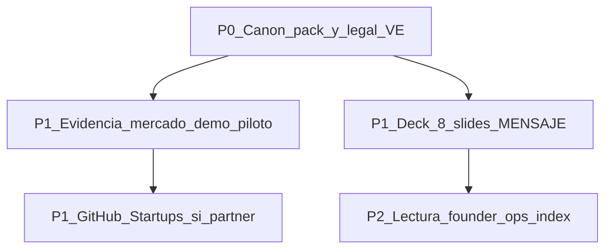

# Roadmap mejora founder — desde forense GitHub Startups (ago 2026)

> Lectura CEO. Español claro. Cifras solo pack Excel v4 (SAFE **237.412**).  
> Forense técnico: [../audits/FORENSIC_GITHUB_STARTUP_RESOURCES_2026-08-09.md](../audits/FORENSIC_GITHUB_STARTUP_RESOURCES_2026-08-09.md).  
> Skills: [../zonix/SKILLS_STARTUP_USAR_NO_USAR.md](../zonix/SKILLS_STARTUP_USAR_NO_USAR.md).

---

## 1. Qué aprendimos

El Word «Recursos GitHub para Startups» es un **glosario US/YC** (skills IA, awesome lists, créditos GitHub, SAFE/NVCA, pitch). Útil para vocabulario; **no** es el playbook de Zonix.

| Hallazgo | Implicación |
|----------|-------------|
| Pack Lanzamiento ya es el canon | Ask, deck 8 slides, C.A./SAFE VE viven aquí |
| Skills `zonix-*` ya destilaron shawnpang / founder-playbook | No instalar repos externos (`npx skills add`) |
| KPIs del Word (LTV/CAC/NRR) salieron **rotos** | Ignorar; usar UNIT / PROYECCION / BRIEF |
| NVCA / Delaware ≠ cierre VE | Abogado + `ESTRUCTURA_LEGAL_*` |
| GitHub for Startups **USD 10k** es real | Solo con partner o funding ≤ Series B |
| Pitch externo | Router `joelparkerhenderson`; no Carta×Kauffman (eso es fondo→LP) |

---

## 2. Qué ya tienes en Zonix (skills)

| Skill | Para qué |
|-------|----------|
| `zonix-startup-context` | Cifras y Market Type — **primero** |
| `zonix-lanzamiento-docs` | Editar pack sin romper anti-patrones |
| `zonix-fundraising-narrative` | Pitch / email / Q&A + router forma externa |
| `zonix-investor-materials` | Data room / checklist |
| `zonix-financial-model` | PROYECCION / UNIT |
| `zonix-launch-piloto` | Calendario T+0 → Day-D |
| `zonix-lean-canvas` | Hipótesis piloto bilateral |
| `zonix-b2b-sales` | Farmacias Valencia |
| `zonix-empresa-ve` / `zonix-legal-contracts-ve` | C.A., SAFE, contratos (checklist) |
| `zonix-founder-ops-index` | Lectura CEO/CTO + eferrares TRIM + GitHub Startups |

---

## 3. Roadmap por fases

### P0 — ahora (disciplina)

1. Cifras solo pack: SAFE **237.412**, Day-D **187.152**, %GMV **8/7/5**, equity **~39,57%**.
2. Legal: C.A. VE + SAFE adaptado + abogado — **no** NVCA como cierre.
3. No usar el Word como fuente de KPIs ni briefing inversor.

### P1 — producto y raise (mejora real del proyecto)

1. **Evidencia de mercado:** demo 3–5 min + 1–2 farmacias Valencia — [BARRA_CREDIBILIDAD_PLAN_A.md](BARRA_CREDIBILIDAD_PLAN_A.md), playbooks en `../Inversionistas/500-latam/`, [APRENDIZAJE_500_EVIDENCIA_MERCADO.md](APRENDIZAJE_500_EVIDENCIA_MERCADO.md).
2. **Deck:** ejecutar los **8 slides** de [MENSAJE_ENVIO_Y_BULLETS_INVERSIONISTA.md](MENSAJE_ENVIO_Y_BULLETS_INVERSIONISTA.md); forma vía `joelparkerhenderson/pitch-deck` (skill `zonix-fundraising-narrative`).
3. **GitHub for Startups:** aplicar **solo** si hay partner (p. ej. 500 Global) o funding documentado; asumir tarjeta + cliff billing.

### P2 — aprendizaje continuo (sin frenar el raise)

1. Lectura founder: `zonix-founder-ops-index` (kuchin awesome-ceo/cto).
2. eferrares: solo learning/fundraising filtrado.
3. Eleken / Awesome-Decks: inspiración visual puntual.

---

## 4. Qué no hacer (SKIP)

- Instalar `shawnpang` / VoltAgent / topic `startup-toolkit` como skills del repo.
- Tratar ahmadnassri (2017) o NVCA como documentos de cierre VE.
- Usar Carta × Kauffman SlideShare como plantilla de deck Zonix.
- Inventar P10/P90 cash o tracción Play Store inexistente.
- Mezclar KPIs SaaS US del Word con GMV/farmacias del piloto Valencia.

---

## 5. Enlaces

| Doc | Rol |
|-----|-----|
| [FORENSIC_GITHUB_STARTUP_RESOURCES_2026-08-09.md](../audits/FORENSIC_GITHUB_STARTUP_RESOURCES_2026-08-09.md) | Forense multi-LLM |
| [SKILLS_STARTUP_USAR_NO_USAR.md](../zonix/SKILLS_STARTUP_USAR_NO_USAR.md) | Router skills |
| [BRIEF_UNA_PAGINA.md](BRIEF_UNA_PAGINA.md) | One-pager ask |
| [PLAN_LANZAMIENTO_COMERCIAL.md](PLAN_LANZAMIENTO_COMERCIAL.md) | Calendario piloto |
