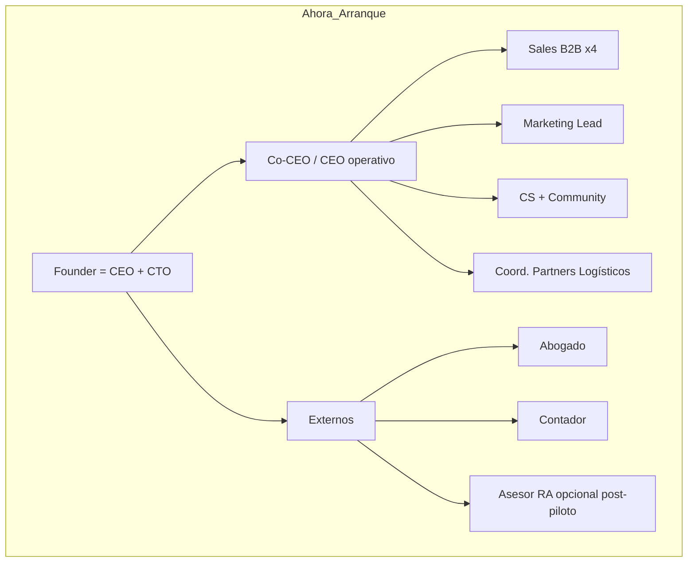
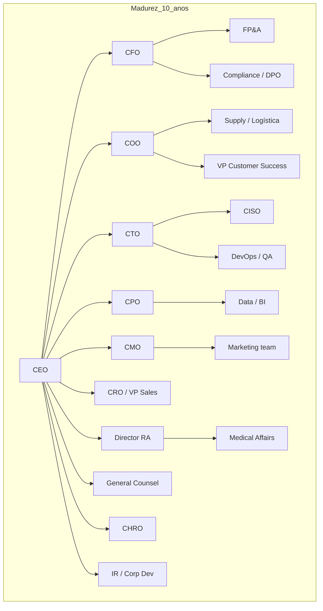

# Roles, skills y panel JARVIS — Zonix Pharma

> **Última actualización:** 23 julio 2026 (árboles Ahora vs +10 años).
> Matriz de **competencias por rol** (síntesis job descriptions 2025–2026 + pack Lanzamiento) mapeada a tres usos: **documentos**, **empresa (VE)** y **sistema** (Laravel + Flutter).
> **No sustituye** dictamen de abogado, contador ni farmacéutico asesor.

---

## Organigrama — jerarquía piloto vs madurez

**Respuesta directa:** no hace falta un C-suite completo el día 1. En arranque: **pocos cargos con varios sombreros**. El organigrama grande es para **+10 años** / post-PMF.

Gobernanza: [ESTRUCTURA_LEGAL_Y_EQUITY.md](ESTRUCTURA_LEGAL_Y_EQUITY.md) — Co-CEO es **rótulo operativo**, no implica dos representantes legales.

### Principio clave

| Concepto | Qué significa |
|----------|----------------|
| **Rótulo operativo** | Co-CEO / CEO operativo = dirección comercial y día a día |
| **Gobernanza legal** | Representante legal, junta, contratos: lo define **abogado + partes** |
| **Sombreros** | Una persona cubre varios cargos hasta que el burn lo justifique |

---

### Árbol A — Ahora (startup arrancando)

Estructura Lean: ~**9 FTE + 2 freelance** — [BRIEF_UNA_PAGINA.md](BRIEF_UNA_PAGINA.md), [CUESTIONARIO_EQUIPO_PILOTO.md](CUESTIONARIO_EQUIPO_PILOTO.md).

**Árbol (texto) — cargo → función**

- **Founder (CEO + CTO)** → Visión, producto, stack Laravel/Flutter, fundraising, seguridad.
  - **Co-CEO / CEO operativo** → Ops diarias, KPIs, contratación, dirección comercial (no producto técnico).
    - **Sales B2B ×4** → Prospección y cierre de farmacias; discovery en campo.
    - **Marketing Lead** → Ads, creativos salud (sin claims clínicos), comunicación interna.
    - **Customer Support + CM** → Triaje órdenes/Rx/entregas, NPS; macros sin consejo médico.
    - **Coord. Partners Logísticos** → SLA última milla y cadena de frío con partners (sin flota propia).
  - **Externos**
    - **Abogado** → C.A., SAFE, laboral, T&C, privacidad.
    - **Contador** → SENIAT, facturación, burn/runway.
    - **Asesor RA** (opcional post-piloto) → MPPS/INHRR, Rx, copy salud.

**Qué no contratar ahora:** CFO full-time, CHRO, CISO dedicado, VP Sales, General Counsel interno, flota propia, farmacéutico liaison interno.

---

### Árbol B — Empresa +10 años (madurez)

**Árbol (texto) — cargo → función**

- **CEO** → Estrategia, junta, cultura, M&A.
  - **CFO** → FP&A, tesorería, auditoría, data room.
    - **FP&A** → Presupuesto, forecast, coherencia modelo financiero.
    - **Compliance / DPO** → AML/KYC, datos personales, políticas.
  - **COO** → Ops nacional, procesos, SLAs.
    - **Supply / Logística** → Partners, cold chain nacional.
    - **VP Customer Success** → Retención B2B, expansión sucursales.
  - **CTO** → Plataforma, equipos eng, AppSec.
    - **CISO** → Seguridad datos salud/Rx, incidentes.
    - **DevOps / QA** → CI/CD, fiabilidad, E2E.
  - **CPO** → Roadmap producto, liquidez marketplace, pricing.
    - **Data / BI** → Dashboards, cohortes, métricas reales.
  - **CMO** → Marca, performance, CRM.
    - **Marketing team** → Campañas, creativos, canales.
  - **CRO / VP Sales** → Revenue farmacias, pricing B2B.
  - **Director RA** → Envíos regulatorios, etiquetado, auditorías.
    - **Medical Affairs** → Claims clínicos, gremios.
  - **General Counsel** → Corp, IP, litigios, healthcare.
  - **CHRO** → Nómina formal VE, cultura, talent.
  - **IR / Corp Dev** → Inversores, SAFE/Serie, M&A.

En arranque, estos cargos se cubren con sombreros (Founder, Co-CEO, Sales×4, Marketing, CS, Coord. Partners, externos). Matriz skills: [Madurez (~10 años) — dirección](#madurez-10-años--dirección).

---

### Roles de plataforma (no son empleados Zonix)

Actores del marketplace, no cargos de nómina: paciente (`users`), farmacia (`commerce`), farmacéutico colegiado (`pharmacist`), empresa/agente delivery (`delivery_company` / `delivery_agent`), admin (`admin`). Tabla: [Plataforma — roles en app](#plataforma--roles-en-app-no-payroll-zonix).

### Reglas de oro (startup tech regulada)

1. **Un solo CEO legal** al inicio; Co-CEO es **operativo**, documentado en contratos.
2. **Founder técnico** puede ser CEO+CTO hasta PMF; mitigación = Co-CEO + plan de hire CTO post-capital.
3. **Regulación (pharma)** exige abogado + RA externos pronto; no sustituirlos con un “CMO” de marketing.
4. **Sales antes que VPs:** el cuello de botella es onboarding de farmacias, no organigrama.
5. **Equity pool** (~10% pre Serie A) para hires clave y advisors (RA, retail), no para freelances del piloto — [ESTRUCTURA_LEGAL_Y_EQUITY.md](ESTRUCTURA_LEGAL_Y_EQUITY.md) §5.

### Evolución recomendada

1. **Ahora:** Árbol A (Founder CEO+CTO + Co-CEO + Sales×4 + Marketing + CS + Coord. logística + externos).
2. **Post-PMF / Serie A:** separar CEO y CTO; Co-CEO → COO; CFO part-time o full.
3. **+10 años / escala nacional:** Árbol B completo (RA, Compliance/DPO, VP Sales, CS B2B, Data/BI, etc.).

---

## Cómo leer esta matriz

| Columna | Significado |
|---------|-------------|
| **Skills** | Competencias típicas del rol (contratación o lente de auditoría). |
| **Docs** | Redacción/auditoría del pack inversor y materiales comerciales. |
| **Empresa** | Constitución C.A., SENIAT, SAFE, laboral, gobierno corporativo. |
| **Sistema** | Producto, API, app, Rx, delivery, seguridad, datos de salud. |
| **Skill agente** | Skill en `.agents/skills/` (Backend o Front) a invocar con JARVIS/Cursor. |
| **Prioridad piloto** | Alta / Media / Baja para año 1 (Lean **210.760**). |

Escala de impacto: **Alta** · **Media** · **Baja** · **Máxima**.

---

## Piloto — empleados y contratados Zonix

### Founder / CEO / CTO

| Skills | Docs | Empresa | Sistema | Skill agente (prioridad) |
|--------|------|---------|---------|--------------------------|
| Visión y narrativa inversor; fundraising y SAFE | Alta | Media | Máxima | `architecture-patterns`, `laravel-specialist`, `flutter-expert` (Front), `documentar-avances`, `zonix-founder-ops-index`, `zonix-jarvis-subagents-map` |
| Arquitectura Laravel/Flutter/MySQL; deuda técnica y seguridad | | | | `zonix-api-patterns`, `security` |
| Producto marketplace multi-sided; priorización MVP Rx/OTC | | | | `zonix-prescriptions`, `zonix-order-lifecycle` |

**Prioridad piloto:** cubre **Sistema** (máxima) y narrativa **Docs**.

---

### Co-CEO / CEO operativo

| Skills | Docs | Empresa | Sistema | Skill agente |
|--------|------|---------|---------|--------------|
| Operaciones día a día; procesos, KPIs, cash y proveedores | Alta | Alta | Media | `zonix-launch-piloto`, `zonix-empresa-ve` (post-wire) |
| Contratación; playbooks comerciales y SLA partners | | | | `zonix-delivery-system`, `zonix-launch-piloto` |
| Reporting a inversor; escalado de equipo | | | | `zonix-investor-materials`, `documentar-avances` |

**Prioridad piloto:** **Empresa** y **Docs** operativos.

---

### Sales B2B (×4)

| Skills | Docs | Empresa | Sistema | Skill agente |
|--------|------|---------|---------|--------------|
| Prospección farmacias VE; objeciones MPPS/datos | Media | Baja | Baja | `zonix-b2b-sales`, `PROPUESTA_VALOR_CLIENTE_B2B` |
| Contrato marco; onboarding panel commerce | | | | `zonix-launch-piloto`, `zonix-medicine-catalog` |
| CRM/territorio; cumplimiento promocional B2B (sin claims clínicos) | | | | |

**Prioridad piloto:** validación de objeciones en campo; no bloquea código.

---

### Customer Support + Community Manager

| Skills | Docs | Empresa | Sistema | Skill agente |
|--------|------|---------|---------|--------------|
| Soporte omnicanal; triaje Rx, disputas, entregas | Media | Baja | Media | `zonix-disputes-and-refunds`, `zonix-order-lifecycle` |
| Onboarding paciente/farmacia; NPS y retención | | | | `zonix-onboarding` (Front) |
| Moderación comunidad; macros (sin consejo médico) | | | | |

**Prioridad piloto:** playbooks operativos → [PLAN_MODULO_OPERATIVO_CLAVE.md](PLAN_MODULO_OPERATIVO_CLAVE.md) §16.

---

### Marketing Lead

| Skills | Docs | Empresa | Sistema | Skill agente |
|--------|------|---------|---------|--------------|
| Meta Ads B2B/B2C; CPL, CAPI, embudo | Alta | Baja | Baja | — |
| Creativos salud (Do/Don't); branding | | | | [../BRAND_ZONIX_PHARMA.md](../BRAND_ZONIX_PHARMA.md), `zonix-ui-design` (Front) |
| Offline valla; A/B testing | | | | [SUPUESTO_MARKETING_OFFLINE.md](SUPUESTO_MARKETING_OFFLINE.md) |

**Prioridad piloto:** **Docs** (MENSAJE, marketing offline).

---

### Coordinador de Partners Logísticos

| Skills | Docs | Empresa | Sistema | Skill agente |
|--------|------|---------|---------|--------------|
| Negociación SLA última milla; KPI entrega y cadena de frío | Media | Media | Media | `zonix-delivery-system` |
| Incidencias partner vs Zonix; cobertura geográfica | | | | [PROPUESTA_VALOR_TERCER_LADO.md](PROPUESTA_VALOR_TERCER_LADO.md) |
| Contratos marco logística (con abogado) | | | | |

**Prioridad piloto:** Zonix **no** opera flota propia.

---

### Externos

| Rol | Skills clave | Docs | Empresa | Sistema | Skill agente |
|-----|--------------|------|---------|---------|--------------|
| **Contador externo** | IVA/ISLR SENIAT; factura digital; honorarios; runway y burn | Máxima | Máxima | Baja | — (humano obligatorio) |
| **Abogado externo** | C.A., SAFE, laboral VE, contratos B2B, T&C, privacidad, SAPI, roadmap Sudeban | Máxima | Máxima | Media | **`zonix-legal-contracts-ve`**, `zonix-empresa-ve`, `zonix-regulatory-ve`, `security-requirement-extraction` (lente; no dictamen) |
| **Asesor regulatorio farmacéutico** | MPPS, INHRR, Rx común/retenida/controlada, farmacovigilancia, copy salud | Alta | Media | Alta | `zonix-regulatory-ve`, `zonix-prescriptions`, [../PLAN_REGULATORIO_PHARMA_VE.md](../PLAN_REGULATORIO_PHARMA_VE.md) |

**Prioridad piloto:** contador + abogado Lean antes de Day-D público; asesor RA **no bloquea** Day-D (opcional post-piloto / freelance).

---

## Plataforma — roles en app (no payroll Zonix)

| Rol app | Skills de dominio | Impacto Docs | Impacto Sistema | Skill agente |
|---------|-------------------|--------------|-----------------|--------------|
| **Paciente** (`users`) | UX salud; accesibilidad; subida receta; pagos manuales VE | [PROPUESTA_VALOR_USUARIO_FINAL.md](PROPUESTA_VALOR_USUARIO_FINAL.md) | Buyer API, OTP Firebase | `zonix-onboarding`, `zonix-order-tracking-ui` (Front) |
| **Farmacia** (`commerce`) | Inventario/lotes FIFO; facturación RIF; panel commerce | [PROPUESTA_VALOR_CLIENTE_B2B.md](PROPUESTA_VALOR_CLIENTE_B2B.md) | Commerce API | `zonix-medicine-catalog` |
| **Farmacéutico colegiado** (`pharmacist`) | Validación Rx; MPPS; retención física; controlados | [PLAN_MODULO_OPERATIVO_CLAVE.md](PLAN_MODULO_OPERATIVO_CLAVE.md) | Pharmacist API | `zonix-prescriptions`, [../PLAN_RX_VALIDATION.md](../PLAN_RX_VALIDATION.md) |
| **Empresa delivery** (`delivery_company`) | Flota/contrato; cadena de frío; asignación | [PROPUESTA_VALOR_TERCER_LADO.md](PROPUESTA_VALOR_TERCER_LADO.md) | Delivery company API | `zonix-delivery-system` |
| **Agente delivery** (`delivery_agent`) | Última milla; geocodificación; POD | Mismo doc. | Delivery API | `zonix-delivery-system` |
| **Admin** (`admin`) | Métricas; KYC farmacias; moderación | — | Admin API | `zonix-analytics`, `zonix-api-patterns` |

---

## Madurez (~10 años) — dirección

| Rol | Skills (síntesis industria) | Quién cubre hoy (piloto) | Skill agente |
|-----|----------------------------|---------------------------|--------------|
| **CEO** | Estrategia, M&A, junta, cultura | Founder | `zonix-startup-context`, `zonix-fundraising-narrative` |
| **CFO** | FP&A, tesorería, auditoría, data room | Contador + [PROYECCION_FINANCIERA_12M.md](PROYECCION_FINANCIERA_12M.md) | `zonix-financial-model`, `zonix-startup-context`, `zonix-investor-materials` |
| **COO** | Ops nacional, SLAs, escala procesos | Co-CEO | `zonix-delivery-system` |
| **CTO** | Plataforma, seguridad, equipos eng | Founder → hire post-Serie A | `laravel-specialist`, `architecture-patterns` |
| **CPO** | Marketplace liquidity, roadmap, pricing | Founder + pack | `zonix-order-lifecycle`, `zonix-analytics` |
| **CMO Medical Affairs** | Claims clínicos, gremios | Asesor regulatorio | `zonix-prescriptions` |
| **Director RA** | Envíos regulatorios, etiquetado, auditorías | Asesor (escala) | `zonix-regulatory-ve`, [../PLAN_REGULATORIO_PHARMA_VE.md](../PLAN_REGULATORIO_PHARMA_VE.md) |
| **QA / Farmacovigilancia** | EA, señales, MedDRA | Asesor + PLAN_MODULO §11 | — |
| **Compliance** | AML/KYC, fraude, políticas | Abogado + [ESTRUCTURA_LEGAL_Y_EQUITY.md](ESTRUCTURA_LEGAL_Y_EQUITY.md) §4.6 | `security` |
| **DPO** | ART, DPIA, subencargados, derechos titular | Abogado + ESTRUCTURA §4.4 | `security-requirement-extraction` |
| **General Counsel** | Corp, IP, litigios, healthcare | Abogado externo | — |
| **CISO** | Cifrado recetas, incidentes, SOC2 roadmap | Founder + PLAN_MODULO §14 | `security` |
| **CRO / VP Sales** | Revenue farmacias, pricing B2B | 4× Sales + [UNIT_ECONOMICS.md](UNIT_ECONOMICS.md) | — |
| **CMO (marketing)** | Marca, performance, CRM | Marketing Lead | — |
| **CHRO** | Nómina formal VE, cultura | Post-Serie A | — |
| **CRO (riesgos)** | Seguros, continuidad, macro VE | CFO lens + contingencia pack | — |
| **Auditoría interna** | GMV vs facturación, controles | Año 2+ | `zonix-analytics` |
| **IR / Corp Dev** | SAFE, Serie A, data room | [MENSAJE_ENVIO_Y_BULLETS_INVERSIONISTA.md](MENSAJE_ENVIO_Y_BULLETS_INVERSIONISTA.md), ESTRUCTURA | `zonix-investor-materials`, `zonix-fundraising-narrative` |
| **Supply / Logística** | Partners, cold chain nacional | Coordinador Partners | `zonix-delivery-system` |
| **VP Customer Success** | Retención B2B, expansión sucursales | CS+CM | — |
| **Data / BI** | Dashboards, cohortes, ARPF real | PROYECCION placeholder | `zonix-analytics` |

---

## Roles complementarios (no estaban en la lista inicial)

| Rol / competencia | Para qué en Zonix | Docs | Empresa | Sistema | Skill agente |
|-------------------|-------------------|------|---------|---------|--------------|
| **UX Writer / microcopy salud** | T&C, avisos app, valla, Meta sin claims terapéuticos | Alta | Media | Media | `zonix-ui-design`, BRAND |
| **Technical Writer** | README API, runbooks, data room técnico | Media | Baja | Alta | `documentar-avances`, `api-design-principles` |
| **FP&A / Business Analyst** | Coherencia PROYECCION ↔ PRESUPUESTO ↔ UNIT | Alta | Media | Baja | `zonix-financial-model`, `zonix-startup-context` |
| **DevOps / SRE** | CI/CD, VPS Nameshared, backups, Firebase | Baja | Baja | Alta | `github-actions-templates` |
| **QA / SDET** | E2E Rx, órdenes, pagos | Baja | Baja | Alta | `qa-testing-playwright`, `e2e-testing-patterns`, `test-driven-development` |
| **Product Designer** | UI Pharma, accesibilidad (post-PMF en pack) | Media | Baja | Alta | `zonix-ui-design`, `ui-ux-pro-max` (Front si existe) |
| **Especialista pagos VE** | Pago móvil, Zelle, USDT, Sudeban | Media | Media | Alta | `zonix-payments` (si existe en repo) |
| **Traductor jurídico ES-EN** | SAFE YC + versión local | Media | Alta | Baja | — |

---

## Skills de agente por uso (repos Zonix)

### Sistema — Backend (`ZonixPharma-Backend/.agents/skills/`)

| Dominio | Skills |
|---------|--------|
| API y arquitectura | `laravel-specialist`, `api-design-principles`, `architecture-patterns`, `zonix-api-patterns`, `clean-code-principles` |
| Rx y farmacia | `zonix-prescriptions`, `zonix-medicine-catalog` |
| Órdenes y disputas | `zonix-order-lifecycle`, `zonix-disputes-and-refunds` |
| Delivery | `zonix-delivery-system` |
| Tiempo real | `zonix-realtime-events` |
| Analytics | `zonix-analytics` |
| Seguridad / BD | `security`, `security-requirement-extraction`, `mysql-best-practices` |
| Calidad | `test-driven-development`, `systematic-debugging`, `qa-testing-playwright`, `e2e-testing-patterns` |
| CI | `github-actions-templates` |
| Documentación sesión | `documentar-avances`, `context-updater` |
| Lanzamiento / roles | **`zonix-lanzamiento-roles`** |
| Inversor / contexto | **`zonix-startup-context`**, **`zonix-investor-materials`**, **`zonix-fundraising-narrative`** |
| Finanzas pack | **`zonix-financial-model`** |
| Regulatorio VE (docs) | **`zonix-regulatory-ve`** |

### Sistema — Frontend (`ZonixPharma-Front/.agents/skills/`)

| Dominio | Skills |
|---------|--------|
| Flutter | `flutter-expert`, `clean-architecture`, `responsive-design`, `mobile-developer` |
| UI Pharma | `zonix-ui-design`, `zonix-onboarding`, `zonix-order-tracking-ui`, `zonix-admin-analytics-ui` |
| Calidad | `test-driven-development`, `qa-testing-playwright`, `systematic-debugging` |

### Documentos (pack Lanzamiento)

Las skills de código **no** reemplazan revisión humana legal/regulatoria. Para **Docs**, combinar:

- Contenido canónico: [README.md](README.md), [BRIEF_UNA_PAGINA.md](BRIEF_UNA_PAGINA.md), [ANALISIS_FORENSE.md](ANALISIS_FORENSE.md).
- Lente por tarea: **`zonix-lanzamiento-roles`** + skills inversor (`zonix-startup-context`, `zonix-financial-model`, `zonix-investor-materials`, `zonix-fundraising-narrative`, `zonix-regulatory-ve`).
- Enlaces research: [../zonix/research_links.md](../zonix/research_links.md) · routing JSON: [../zonix/roles_matrix.json](../zonix/roles_matrix.json).

---

## Cinco metas founder → skills

| Meta | Orden skills JARVIS | Docs pack obligatorios |
|------|---------------------|------------------------|
| **Empresa VE** | `zonix-startup-context` → `zonix-empresa-ve` → `zonix-lanzamiento-roles` | ESTRUCTURA_LEGAL, PLAN_LANZAMIENTO §2.1 |
| **Documentos** | `zonix-startup-context` → skill por documento → `zonix-investor-materials` | Índice README (22 archivos) |
| **Inversores** | `zonix-startup-context` → `zonix-fundraising-narrative` → `zonix-investor-materials` | MENSAJE_ENVIO, CHECKLIST_PRE_INVERSOR |
| **Ejecutar lanzamiento** | `zonix-launch-piloto` → `zonix-lanzamiento-roles` | PLAN_LANZAMIENTO, BRIEF |
| **Desarrollo producto** | Skills módulo según sprint | PLAN_RX, PLAN_MODULO, BRAND |

Tabla skill por documento: [ANALISIS_FORENSE_SKILLS.md](../zonix/ANALISIS_FORENSE_SKILLS.md) §0 ter.

---

## Qué activar en JARVIS por tarea

| Tarea | Roles / lentes humanos | Skills agente a invocar |
|-------|------------------------|-------------------------|
| Redactar o auditar pack Lanzamiento | CFO + Legal + RA + CPO + UX Writer | `zonix-startup-context`, `zonix-lanzamiento-roles`, `zonix-investor-materials`, `documentar-avances` |
| Coherencia numérica PROYECCION / UNIT | CFO + FP&A + Contador | `zonix-startup-context`, `zonix-financial-model` |
| Envío inversor / pitch | IR + Founder + Legal | `zonix-fundraising-narrative`, `zonix-investor-materials` |
| Constitución empresa VE | Legal + Contador + Compliance | `zonix-startup-context`, **`zonix-empresa-ve`**, `zonix-financial-model` (SAFE/cap), `zonix-lanzamiento-roles` |
| **Ejecutar plan lanzamiento** (T+0 → Day-D) | Co-CEO + Sales + Marketing + CS | **`zonix-launch-piloto`**, `zonix-startup-context` |
| **Planificación operativa M1–M12** | Co-CEO + CFO lens | `zonix-launch-piloto`, `zonix-financial-model` |
| Copy salud / Rx en pack | RA + Asesor + UX Writer | `zonix-regulatory-ve`, `zonix-prescriptions` |
| Código Rx / órdenes / delivery | CTO | `zonix-prescriptions`, `zonix-order-lifecycle`, `zonix-delivery-system`, `laravel-specialist` |
| UI onboarding / comprador | CPO + UX Writer | `zonix-ui-design`, `flutter-expert`, `zonix-onboarding` |
| Seguridad y datos de receta | CISO + DPO + Abogado | `security`, `security-requirement-extraction` |
| Pagos manuales VE | Especialista pagos + Legal | `zonix-payments`, [PLAN_METODOS_PAGO.md](PLAN_METODOS_PAGO.md) |
| Revisar contrato marco farmacia (checklist) | Legal + Sales | **`zonix-legal-contracts-ve`**, `zonix-b2b-sales`, `zonix-regulatory-ve` |
| Orquestar tarea multi-rol JARVIS | Founder / CTO | **`zonix-jarvis-subagents-map`**, `zonix-lanzamiento-roles` |
| Lectura CEO/CTO/TPM (fundraising, due diligence) | Founder | **`zonix-founder-ops-index`**, `zonix-fundraising-narrative` |
| Tests E2E piloto | QA | `qa-testing-playwright`, `test-driven-development` |

---

## Prioridad absoluta (piloto — tres metas)

1. **Documentos:** Abogado + Contador + Asesor RA + Marketing + Founder/Co-CEO + FP&A (coherencia numérica).
2. **Empresa:** Abogado + Contador + Co-CEO (+ asesor laboral puntual pre-T+30).
3. **Sistema:** Founder/CTO + skills `zonix-*` + lente CISO en cambios Rx/datos + CS en operación real.

Los roles de madurez (CFO, DPO, CISO a tiempo completo, etc.) son objetivo **Serie A+**; en año 1 se cubren con externos, founder y skills de agente.

---

## Documentos hermanos

- [README.md](README.md) — índice del pack (decisión **Equipo** → enlace a § Organigrama).
- [BRIEF_UNA_PAGINA.md](BRIEF_UNA_PAGINA.md) — equipo contratado piloto.
- [ANALISIS_FORENSE.md](ANALISIS_FORENSE.md) — chequeo multi-rol §11 (pack inversor).
- [../zonix/ANALISIS_FORENSE_SKILLS.md](../zonix/ANALISIS_FORENSE_SKILLS.md) — auditoría forense **skills agente** (30 `zonix-*`, v3).
- [../zonix/roles_matrix.json](../zonix/roles_matrix.json) — routing JARVIS + inventario skills.
- [AGENTS.md](../../AGENTS.md) — skills técnicas Backend.
- [../BRAND_ZONIX_PHARMA.md](../BRAND_ZONIX_PHARMA.md) — identidad visual.
