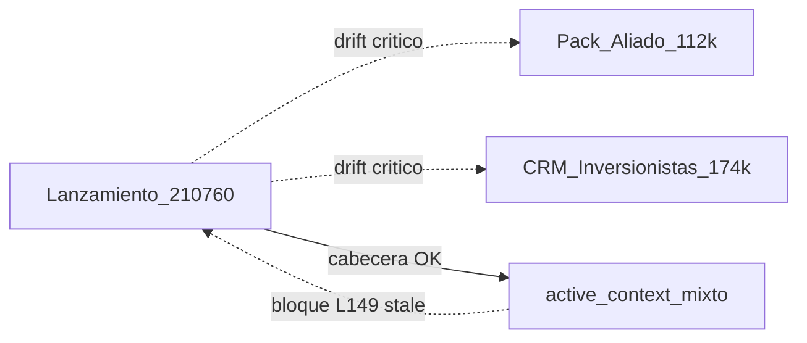

# Auditoría forense 360° — `docs/` Zonix Pharma Backend

> **HISTÓRICO / snapshot 5–7 ago 2026 — no es SoT vigente.** Canon pitch actual = Excel **v4** Lean **237.412** + forense **v7** ([`active_context.md`](active_context.md)). Cifras **112k / 25/40/55** aquí = estado auditado en esa fecha, no ask/pricing vigentes.  
> **Fecha:** 5 agosto 2026 (anclas **v4** 7-ago; **cierre forense v5** 7-ago; Cola B 7-ago)  
> **Alcance:** toda la carpeta [`docs/`](.)  
> **Patrón:** metodología v5 — 1 archivo × Composer+Grok → juez → writer; loops hasta DoD  
> **Entregable:** informe + remediación aplicada en v5. **Sin commit** hasta OK founder.  
> **Baseline:** canon vigente = Excel **v4** Lean **237.412**. Audits pack jun-2026 eliminados.

---

## Resumen ejecutivo

| Métrica | Valor |
|---------|--------|
| Semáforo global (post v5) | **VERDE** en md pitch/CRM/aliado SoT; **ÁMBAR** solo en Word Pack `docx/` y P10/P90 cash |
| Ask vigente | **237.412** |
| PDFs Lanzamiento regenerados | BARRA, INFORME_CEO_500_Y_SVS, INFORME_FACIL |
| Borrados v5 | `GTM_6_MESES.docx`, `MODELO_FINANCIERO_ZONIX_PHARMA.fods` |

**Conclusión (forense v5 7-ago):** núcleo Lanzamiento + Pack `md/` + FICHAs CRM + PDFs clave alineados a Lean **USD 237.412**. Residual: cash P10/P90 `[PENDIENTE FP&A]`; Pack `docx/` no regenerados en esta corrida.

---

## Anclas inmutables (canon Excel v4 — 7 ago 2026)

| Concepto | Valor |
|----------|--------|
| SAFE Lean | **USD 237.412** = Fase 0 **50.260** + burn M1–M12 **172.152** + reserva **15.000** |
| Cap SAFE | **600.000** → equity **~39,57%** |
| Caja Day-D (T+90) | **187.152** |
| Cash M12 / FCF Y1 (esc.1) | **246.231** / **+59.079** (BE FCF **M5**) |
| Pricing B2B esc.1 | **45 / 60 / 70** + % GMV |
| Asks **210.760 / 112k / 174k / 111.988** | **OBSOLETOS** como ask vigente |
| Deploy actual | `zonixpharma.com` / `pharma.aiblockweb.com` (FTP cPanel) |
| VPS Quasar | **Pendiente** compra IP (2× Quasar CorralX + Zonix) |

**Tooling:** `verify_modelo_financiero.py` **ya no existe**. En pack: `_tools/verify_inversor_pack.py` (OK) + `build_zip_inversor.py`. Xlsx canónico **sí** está en repo (`Lanzamiento/MODELO_FINANCIERO_ZONIX_PHARMA.xlsx`, v4).

---

## Semáforos por cluster

| ID | Cluster | Semáforo | Hallazgo dominante |
|----|---------|----------|-------------------|
| C1 | Lanzamiento | **ÁMBAR** | Núcleo 237.412 OK; RESUMEN aliado ~175k residual; `.fods` 111.988 |
| C2 | Inversionistas | **ÁMBAR** | CRM entero en **174k / ~29%**; PDFs/`RESUMENES-CEO/` rotos |
| C3 | Pack Aliado | **ROJO** | Congelado **~112k / 39,57%**; pricing **25/40/55** vs **45/60/70** |
| C4 | Producto/tech | **AMARILLO** | `product/FLUJO_PAGO_ORDEN.md` sin Rx; `ENV_VARIABLES` incompleto |
| C5 | Audits históricos | **ÁMBAR–ROJO** | AUDIT 23-jun ancla **111.988** + script verify inexistente |
| C6 | Deploy/ops | **AMARILLO** | Contradicción `.env` FTP §2 vs §6; `active_context` deploy stale |
| C7 | Meta JARVIS | **AMARILLO** | `docs/agents/` 6 roles Eats; bloques `active_context` 33.835 “vigente” |
| C8 | Legacy/ruido | **ÁMBAR** | Eats con banner OK; `ANALISIS_TECNICO` citado como canon con métricas mayo |

---

## Matriz cruzada (Lanzamiento ↔ Pack ↔ CRM ↔ memoria)

| Par | Estado | Acción |
|-----|--------|--------|
| Lanzamiento ↔ Pack Aliado | **Drift crítico** | Congelar pack con banner o resync v4 |
| Lanzamiento ↔ Inversionistas | **Drift crítico** | Recalibrar ask T y dilución a 237.412 / 39,57% |
| Lanzamiento ↔ RESUMEN_ALIADO | **Sync parcial** | Limpiar prosa ~175k / tabla % ~174k |
| Lanzamiento ↔ active_context | **Mixto** | Banner superseded en § “referencia vigente” L149 |
| Lanzamiento ↔ AUDIT 23-jun | **Histórico** | Banner `[HISTÓRICO pre-237.412]` |

---

## Día del juicio — consolidación

| Fuente | Veredicto |
|--------|-----------|
| Juez A (coherencia) | **ÁMBAR–ROJO** — síntesis ~85% acertada; rebajar RESUMEN ~175k a warning |
| Juez B (inversor/legal) | **ROJO pre-reunión** — triple ask/equity; wire vs escrow; PII |

### Real vs ruido (orquestador)

| Hallazgo | Real / Ruido | Severidad final |
|----------|--------------|-----------------|
| Pack Aliado 112k vs 237.412 | **REAL** | P0 critical |
| CRM 174k / dilución ~29% | **REAL** | P0 critical |
| FLUJO_PAGO_ORDEN sin Rx + lexico Eats | **REAL** | P0 critical |
| verify_modelo inexistente + AUDIT 23-jun como “canon” | **REAL** | P0 critical |
| active_context L149 “referencia vigente” con 33.835/78.153 | **REAL** (gap jueces) | P0 critical |
| Claims M1/cash 398k sin disclaimer uniforme vs `[PENDIENTE FP&A]` | **REAL** (Juez B) | P0 critical |
| RESUMEN_ALIADO ~175k residual | **REAL** (parcial) | **P1 warning** (no P0) |
| Wire cuenta personal vs escrow/tranche | **REAL** | P1 warning |
| `.fods` 111.988 en repo | **REAL** | P1 warning |
| DEPLOY `.env` §2 vs §6 | **REAL** | P1 warning |
| docs/agents 6 roles / sin pharmacist | **REAL** | P1 warning |
| skill `zonix-empresa-ve` → REQUISITOS Eats | **REAL** | P1 warning |
| ENV_VARIABLES sin `ZONIX_PHARMA_*` | **REAL** | P1 warning |
| Links rotos generate_modelo* / pizza / ANALISIS_FORENSE | **REAL** | P1 warning |
| PDFs / `RESUMENES-CEO/` / skill path CRM | **REAL** | P1 warning |
| Pack anexos/docx ausentes | **RUIDO** (Juez A) | Existen en disco |
| Lanzamiento xlsx ausente | **RUIDO** (Juez B) | Existe (`xlsx` jul 26) |
| AGENTS.md “Eats” como contaminación pitch | **RUIDO** | Migración documentada OK |
| Conteos tests 443 vs 422+ en CHECKLIST | **REAL** (menor) | P2 suggestion |

---

## Hallazgos P0 (acción antes de reunión / export)

| ID | Tipo | Path / área | Evidencia | Remedio propuesto |
|----|------|-------------|-----------|-------------------|
| **P0-01** | cifra_stale | `Pack_Aliado_Gabriel_Barrios/**` | Ask ~112k, equity ~39,57%, pricing 25/40/55, Excel anexo jun | Banner “consultoría jun-2026 — no SAFE” **o** resync a 237.412 + regenerar docx |
| **P0-02** | cifra_stale | `Inversionistas/**` | Ask 174.102, dilución ~29%, criterio T calibrado a 174k | Actualizar README + FICHAs a 237.412 / ~39,57%; recalcular “cubre Lean” |
| **P0-03** | contradiccion | `product/FLUJO_PAGO_ORDEN.md` | Orden → pending_payment; comercio revisa “ingredientes”; sin pharmacist/Rx | Bifurcar OTC vs Rx o redirigir a `PLAN_RX_VALIDATION.md` |
| **P0-04** | link_roto / cifra_stale | `AUDIT_FORENSE_PACK_*` + plantillas | Citan `verify_modelo_financiero.py` (ausente); ancla 111.988 | Banner histórico; actualizar plantillas a `verify_inversor_pack.py` / xlsx |
| **P0-05** | contradiccion | `active_context.md` ~L149 | Sección “referencia vigente” con Fase 0 33.835 / Day-D 78.153 | Marcar superseded; dejar solo cabecera 237.412 |
| **P0-06** | contradiccion | Pitch vs memoria FP&A | BRIEF/MENSAJE cash 246.231 / FCF +59.079 vs `[PENDIENTE FP&A]` en active_context | Disclaimer uniforme esc.1 + pendiente recalc **o** cerrar FP&A |

---

## Hallazgos P1

| ID | Tipo | Path | Remedio |
|----|------|------|---------|
| P1-01 | cifra_stale | `RESUMEN_ALIADO_GABRIEL_BARRIOS.md` L15/L77/L382 | Sustituir ~175k / % ~174k por 237.412 |
| P1-02 | cifra_stale | `MODELO_FINANCIERO_ZONIX_PHARMA.fods` | Regenerar desde xlsx v4 o etiquetar legacy / no incluir en zip |
| P1-03 | contradiccion | `PLAN_LANZAMIENTO` L25 vs `CHECKLIST` L217 | Unificar política wire (escrow/tranche vs cuenta personal) |
| P1-04 | contradiccion | `ops/deploy/DEPLOY_PHARMA_AIBLOCK.md` §2 vs §6 | Alinear texto `.env` con workflow (exclude + ENV_CONTENT) |
| P1-05 | cifra_stale | `active_context` bloque deploy jun | Actualizar: dominio comprado, secrets/checklist §8 DEPLOY |
| P1-06 | contradiccion | `docs/agents/*` | Actualizar a 7 roles + Rx + métricas tests actuales **o** archivar |
| P1-07 | legacy_eats | `zonix-empresa-ve` → `REQUISITOS_OPERAR_*` | Apuntar a `ESTRUCTURA_LEGAL` / `PLAN_REGULATORIO` |
| P1-08 | huérfano | `ops/ENV_VARIABLES.md` | Documentar bloque `ZONIX_PHARMA_*` + Redis/queue Quasar |
| P1-09 | link_roto | MODELO/PRESUPUESTO → `generate_modelo_financiero_v2.py`, `pizza_visual_theme.py` | Quitar links o restaurar scripts |
| P1-10 | link_roto | `Inversionistas/README` → `RESUMENES-CEO/`, PDFs, skill path | Generar PDFs / corregir rutas / quitar promesas |

---

## Hallazgos P2 / P3 (selección)

| ID | Sev | Área | Nota |
|----|-----|------|------|
| P2-01 | suggestion | Headers v3.8.2 en CONTEXTO/MENSAJE/CHECKLIST | Cosmético; cuerpo ya 237.412 |
| P2-02 | suggestion | `audits/ANALISIS_TECNICO_COMPLETO_2026-05.md` | Banner SNAPSHOT; no citar como canon en README Lanzamiento |
| P2-03 | suggestion | Archivar `GUIA_*EATS*` / `REQUISITOS_*` | Ya tienen banner + `.cursorignore` |
| P2-04 | suggestion | `Búsqueda de Habilidades…md` | Marcar superseded por `zonix/ANALISIS_FORENSE_BUSQUEDA_*` |
| P2-05 | suggestion | RUNBOOK_ORDER / CHECKOUT | Añadir `pending_prescription_validation` |
| P2-06 | suggestion | `manifest_inversor.yaml` fecha | Actualizar `updated` post 26 jul |
| P2-07 | pendiente_humano | REGISTRO P0 humanos | % dedicación founder, GitHub público, smoke UI Rx |
| P2-08 | pendiente_humano | Quasar IP | Compra + bootstrap (ya en runbook) |
| P3-01 | suggestion | PII founder en BRIEF/MENSAJE | Revisar capa NDA / zip |
| P3-02 | suggestion | `_intel/` emails/tel | Mantener fuera de cualquier zip inversor |

---

## Delta vs auditorías previas

| Fuente | Qué cambió desde entonces |
|--------|---------------------------|
| AUDIT pack 23-jun (v3) | Canon financiero pasó de **111.988** → **237.412** (26 jul); script verify retirado |
| Sync Lean Excel 26 jul | Pack Lanzamiento núcleo OK; **Pack Aliado y CRM no migraron** |
| Auditorías módulo 10 jun | Remediación código documentada en AGENTS; semáforos AUDIT_* siguen pre/post mezclados |
| Esta auditoría 5 ago | Primera pasada **360° docs/** (no solo Lanzamiento) + doble juez |

---

## Plan de remediación (sin aplicar)

### Lote A — Pre-reunión inversor (P0, ~1–2 h doc)

1. [ ] Banner en Pack Aliado README: “Modelo jun-2026 — no usar para SAFE ask” **o** excluir pack del export.
2. [ ] Actualizar `Inversionistas/README.md` + plantilla FICHA: ask **237.412**, dilución **~39,57%**; nota “cubre Lean” recalibrada.
3. [ ] Limpiar `RESUMEN_ALIADO` prosa ~175k / tabla % ~174k.
4. [ ] Banner `[HISTÓRICO pre-237.412]` en `AUDIT_FORENSE_PACK_LANZAMIENTO_2026-06-23.md` (+ hermanos).
5. [ ] `active_context.md` L149: marcar superseded; dejar solo anclas 237.412 en cabecera.
6. [ ] Disclaimer uniforme en pitch: esc.1 vs `[PENDIENTE FP&A]` cash M12/VAN.

### Lote B — Producto / ops docs (P0–P1)

7. [ ] Reescribir o bifurcar `product/FLUJO_PAGO_ORDEN.md` (OTC vs Rx) → enlazar `PLAN_RX_VALIDATION.md`.
8. [ ] Completar `ops/ENV_VARIABLES.md` con `ZONIX_PHARMA_*`.
9. [ ] Corregir `ops/deploy/DEPLOY_PHARMA_AIBLOCK.md` contradicción `.env`.
10. [ ] Extender runbooks con `pending_prescription_validation`.

### Lote C — Tooling / meta

11. [ ] Actualizar plantillas `PROMPT_AUDIT_FORENSE_PACK_*` / `PROMPT_MEJORAR_*`: quitar `verify_modelo_financiero.py`; usar `verify_inversor_pack.py`.
12. [ ] Quitar o restaurar links a `generate_modelo_*` / `pizza_visual_theme.py`.
13. [ ] Regenerar o etiquetar legacy `.fods`.
14. [ ] Actualizar o archivar `docs/agents/*` (7 roles + Rx).
15. [ ] Desenlazar `zonix-empresa-ve` de `REQUISITOS_OPERAR_*`.

### Lote D — Hygiene / legacy (P2)

16. [ ] Snapshot banner en `audits/ANALISIS_TECNICO_COMPLETO_2026-05.md`.
17. [ ] Archivar o README índice Eats; superseded en `Búsqueda…md`.
18. [ ] Fix CRM: skill path, PDFs opcionales, deadlines vencidos.
19. [ ] Unificar wire policy PLAN vs CHECKLIST (con OK legal).
20. [ ] Actualizar `active_context` deploy (dominio + checklist DEPLOY §8).

---

## Criterios de aceptación post-remediación

- [ ] Grep pack: cero asks **112k / 174k / 111.988** como vigentes en Lanzamiento + CRM + Pack (salvo histórico marcado).
- [ ] Zip inversor: solo lista `DOCUMENTOS_SOLO_INVERSOR.md`; sin Pack Aliado, sin `_intel`, sin `.fods` stale.
- [ ] `FLUJO_PAGO_ORDEN` describe Rx o apunta al canon Rx.
- [ ] Plantillas forenses no citan scripts inexistentes.
- [ ] `active_context` sin bloque “vigente” con cifras 112k-era.

---

## Apéndice — inventario

| Carpeta | `.md` (aprox.) |
|---------|----------------|
| root | 42 |
| Lanzamiento | 30 |
| Inversionistas | 39 |
| Pack_Aliado | 19 |
| agents | 10 |
| zonix | 7 (+ json) |
| plantillas | 4 |
| **Total** | **~151** |

---

## Metadatos de ejecución

| Campo | Valor |
|-------|--------|
| Roles | delivery + technical writer + PM inversor |
| Skills | jarvis-core → fan-out-synthesize-ops → parallel-judge-ops |
| Workers | C1–C8 (explore) |
| Jueces | A coherencia · B inversor/legal |
| Writer | sesión principal (este archivo únicamente) |
| Autofix | **No** — gate humano |

_Generado por JARVIS — auditoría forense 360° docs Zonix Pharma. 5 ago 2026._
