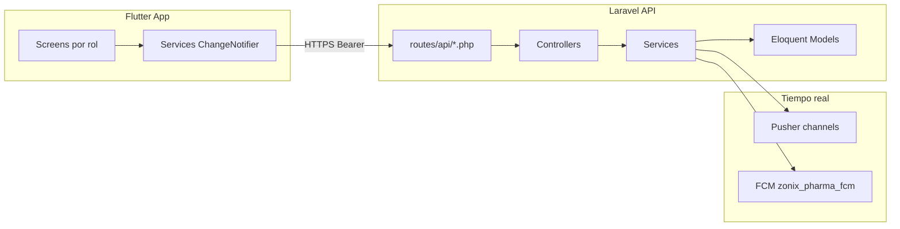
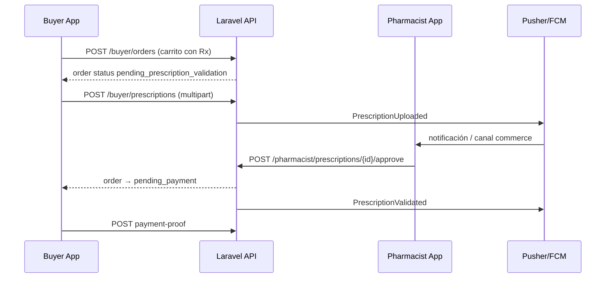

# Análisis técnico completo — Zonix Pharma (Backend + Frontend)

**Fecha:** 26 mayo 2026  
**Alcance:** Repositorios `ZonixPharma-Backend` (Laravel 10) y `ZonixPharma-Front` (Flutter ≥3.5).  
**Metodología:** Lectura de código, documentación Jarvis, auditorías previas (`AUDIT_API_PATTERNS_2026-05-01`, `AUDIT_UI_PHARMA`), ejecución local de quality gates.  
**No incluye:** dictamen legal/regulatorio, auditoría financiera del pack `docs/Lanzamiento/`, validación en producción de Pusher/FCM/Firebase sin credenciales.

---

## 1. Resumen ejecutivo

| Capa | Madurez (1–5) | Veredicto |
|------|---------------|-----------|
| **Backend — dominio Pharma (Rx)** | 4 | Flujo receta end-to-end implementado con tests Feature; `PrescriptionService` con transacciones e idempotencia de subida. |
| **Backend — API / consistencia** | 2 | Deuda sistémica documentada mayo 2026: ~33% respuestas con envelope estándar; ~30 controladores aún devuelven `$e->getMessage()` en `catch` locales. |
| **Backend — lotes FIFO** | 1 | Tabla y modelo existen; **sin** endpoints ni lógica de despacho FIFO en servicios de orden. |
| **Frontend — Rx / pharmacist** | 4 | Pantallas, servicio HTTP y navegación nivel 5 operativos; alineación de rutas con backend. |
| **Frontend — marca / legacy Eats** | 2 | Carpetas `restaurants/`, `RestaurantService`; muchas pantallas con `Colors.*` (analyze en verde, deuda visual). |
| **Calidad automatizada** | 4 | **399** tests BE + **216** FE pasando; Pint con **1** issue de estilo; `flutter analyze` sin issues. |
| **Readiness piloto Day-D (técnico)** | 3 | **Apto para piloto OTC + Rx común** con farmacéutico real y smoke manual; **no** para inventario por lotes ni API “enterprise-grade” uniforme. |

**Conclusión:** El fork Eats → Pharma es **funcional en el núcleo marketplace + Rx**, con buena cobertura de tests en flujos críticos. Los riesgos principales para escalar son **consistencia de API**, **exposición residual de errores en controladores**, **ausencia de módulo de lotes en producto**, y **deuda operativa** (Firebase, deploy workflow legacy, smoke E2E).

---

## 2. Arquitectura

### 2.1 Stack y repos

| Componente | Tecnología | Notas |
|------------|------------|-------|
| API | Laravel 10.x, PHP 8.1+, Sanctum | Rutas modulares en `routes/api/*.php` |
| BD | MySQL | Migraciones consolidadas `create_*` (norma: no `add_*` sueltos) |
| Tiempo real | Pusher + FCM | **No** WebSocket legacy en producto Pharma |
| App móvil | Flutter, Provider | `AppConfig.apiUrl`, `AuthHelper` |
| CI activo | `.github/workflows/ci.yml` (ambos repos) | BE: Pint + `php artisan test --parallel`; FE: analyze + test |

### 2.2 Roles (7) y prefijos API

| Código BD | Nombre | Prefijo API principal | Nivel nav Flutter |
|-----------|--------|----------------------|-----------------|
| `users` | Buyer | `/api/buyer/*` | 0 |
| `commerce` | Pharmacy | `/api/commerce/*` | 1 |
| `delivery` / `delivery_agent` | Delivery | `/api/delivery/*` | 2 |
| `delivery_company` | Delivery Company | `/api/delivery-company/*` | 3 |
| `admin` | Admin | `/api/admin/*` | 4 |
| `pharmacist` | Pharmacist | `/api/pharmacist/*` | 5 |

### 2.3 Capas Backend

- **Entrada:** `routes/api.php` incluye 9 módulos (~359 definiciones `Route::`).
- **Controladores:** ~80 archivos; dominio Pharma en `Buyer/PharmacyController`, `Buyer/PrescriptionController`, `Pharmacist/*`.
- **Servicios de negocio (20):** `PrescriptionService`, `OrderStateMachineService`, `OrderService`, `PharmacyService`, `DeliveryAssignmentService`, etc.
- **Eventos Rx:** `PrescriptionUploaded`, `PrescriptionValidated`, `PrescriptionRejected`.
- **Jobs/commands:** `ExpirePendingPrescriptionsCommand`, `PurgeStalePrescriptionPersonalDataCommand` (retención datos salud).

### 2.4 Capas Frontend

- **Navegación:** `MainRouter` + `bottom_nav_persistence.dart` (nivel 5 = pharmacist).
- **~89 pantallas** en `lib/features/screens/` agrupadas por rol.
- **35 services** HTTP; `PrescriptionService` registrado en `MultiProvider` (`main.dart`).
- **Modelos Pharma:** `Product`, `Prescription`, `MedicineLot`, `CartItem`, `Order`.

---

## 3. Matriz Backend ↔ Frontend (features Pharma)

| Feature | Backend | Frontend | Alineación |
|---------|---------|----------|------------|
| Listado farmacias | `GET /api/buyer/pharmacies` (+ alias `/restaurants`) | `restaurants_page` + `restaurant_service` | OK (nombres legacy) |
| Catálogo medicamentos | `Buyer/ProductController`, flags Rx en Product | `products_page`, `product_detail_page` | OK |
| Carrito uni-farmacia | `Buyer/CartController` | `cart_service`, `cart_page` | OK |
| Checkout Rx | `Buyer/OrderController@store` → `pending_prescription_validation` | `checkout_page` banners + navegación upload | OK |
| Subir receta | `POST /api/buyer/prescriptions` | `prescription_upload_page`, `PrescriptionService.uploadPrescription` | OK |
| Mis recetas | `GET /api/buyer/prescriptions` | `my_prescriptions_page` | OK |
| Validar receta | `POST .../approve`, `.../reject` | `validation_detail_page`, `PrescriptionService` | OK |
| Pendientes farmacéutico | `GET /api/pharmacist/prescriptions/pending` | `pending_validations_page` | OK |
| Onboarding farmacéutico | `GET/POST /api/pharmacist/onboarding` | `pharmacist_onboarding_page` | OK |
| Descarga archivo receta | `GET .../prescriptions/{id}/file` (throttle) | **No expuesto** en `PrescriptionService` | **Gap P2** |
| Lotes FIFO | Modelo `MedicineLot`, relación en `Product` | Modelo `medicine_lot.dart` **sin UI** | **Gap P1** |
| Pago manual VE | `payment-info` + `payment-proof` en Order | `checkout_page`, `current_order_detail_page` | OK (post-Rx) |
| Pusher Rx | Canal `commerce.{id}` + pharmacist | `pending_validations_page`, `orders_page` | OK |

---

## 4. Dominio farmacéutico

### 4.1 Flujo Rx (end-to-end)

**Políticas** (`config/zonix.php` → `pharma`):

| Clave | Default | Efecto |
|-------|---------|--------|
| `block_rx_without_prescription` | `false` | MVP permisivo: orden Rx sin receta previa; checkout no bloquea por flag estricto. |
| `prescription_validation_ttl_minutes` | `60` | Caducidad receta pendiente; comando `zonix:expire-pending-prescriptions`. |
| `disallow_promotions_on_rx` | `true` | Cupones no aplican a líneas Rx. |
| `require_cold_chain_handling` | `true` | Restricción modos delivery en backend. |
| `prescription_retention_days_after_terminal` | `90` | Purga adjuntos post-pedido terminal. |

**Implementación destacada:** `App\Services\PrescriptionService` usa `DB::transaction`, `lockForUpdate`, `ConflictHttpException` (409) si ya hay receta activa, y `OrderStateMachineService` en approve/reject.

**Tests:** `tests/Feature/PrescriptionFlowTest.php` cubre upload → approve → `pending_payment` y camino reject.

### 4.2 Cadena de frío y controlados

- **Backend:** flags en `products` y `orders`; validación en `Buyer/OrderController@store`.
- **Frontend:** banners en `cart_page` / `checkout_page`; chip Rx en líneas; restricción delivery si `coldChainRequired` (checkout).
- **Gap:** badge **sustancia controlada** en cards del listado buyer no uniforme (parcial en detalle/commerce form).

### 4.3 Lotes (`medicine_lots`) — gap estructural

| Capa | Estado |
|------|--------|
| Migración / modelo | Existe; relación `Product::medicineLots()` ordenada por `expiry_date` |
| Seeder demo | `ZonixDemoSeeder` crea lotes |
| Tests | `MedicineLotModelTest` (unit); **no** `MedicineLotFifoTest` |
| API commerce | **Ausente** — sin controller/rutas CRUD lotes |
| Despacho FIFO en orden | **No implementado** en `OrderService` / commerce |
| Flutter | Modelo + test unitario; **sin pantalla ni servicio** |

**Hallazgo P1:** El catálogo documenta FIFO como requisito de negocio; el código solo prepara el esquema de datos.

### 4.4 Pagos Venezuela (manuales)

- Zonix **no es PSP**; flujo: métodos por farmacia → comprobante → validación commerce.
- Payload legacy `food_methods` en `Buyer/OrderController` (alias “subtotal farmacia”, no comida).
- Sunset documentado en `config/zonix.php` → `legacy_payments`.
- Rx: pago debe ocurir **después** de `pending_payment` (post-validación receta).

---

## 5. Contratos API y deuda de patrones

### 5.1 Alineación `PrescriptionService` (Flutter)

Rutas documentadas en el servicio coinciden con `routes/api/pharmacist.php` y `buyer.php`. El cliente espera envelope `{ success, data, message }` en respuestas 200 — coherente con controladores Pharma recientes.

**Desalineación menor:** endpoints `GET .../file` (descarga PDF/imagen cifrada) existen en backend con throttle `prescription-download`; el cliente Flutter **no** implementa descarga/visualización segura del archivo en historial (solo metadatos en listados).

### 5.2 Auditoría API (mayo 2026) — estado actual

Fuente: [AUDIT_API_PATTERNS_2026-05-01.md](AUDIT_API_PATTERNS_2026-05-01.md).

| Métrica | Valor (auditoría) | Re-validación 26 may |
|---------|-------------------|----------------------|
| Controladores auditados | 63 | Sin re-auditoría exhaustiva línea a línea |
| Envelope `success` | ~33% | Sin cambio masivo detectado |
| Form Requests | 9/63 | +4 Pharma (`StorePrescriptionRequest`, etc.) |
| `getMessage()` en controllers | 15+ P0 citados | **~30 archivos** aún contienen `getMessage()` en `catch` |
| Remediaciones aplicadas | — | `Handler::handleApiException` endurecido; `CommerceDataController` 403; controllers muertos eliminados |

**Handler global** (`app/Exceptions/Handler.php`): en producción no expone stack en 500; en `debug` sí devuelve detalle. Los `catch` locales que hacen `return response()->json(['message' => $e->getMessage()])` **bypassean** este endurecimiento.

**Trait `ApiResponse`:** existe pero solo lo usan **2** controladores de perfiles — oportunidad de quick win masivo.

### 5.3 Shims legacy Eats (API)

| Elemento | Estado | Recomendación |
|----------|--------|---------------|
| `Buyer/RestaurantController` | Extiende `PharmacyController` | Mantener hasta sunset; documentado |
| `/api/buyer/restaurants` | Alias de `/pharmacies` | OK para QR antiguos |
| `RestaurantService` | Shim de `PharmacyService` | Retirar con métricas de uso |
| `food_methods` en JSON orden | Alias subtotal farmacia | Renombrar en v2 API |
| `WebSocketTest`, `RestaurantControllerTest` | Tests del shim | OK como regresión |

---

## 6. Seguridad y datos de salud

### 6.1 Autenticación y roles

- Sanctum + middleware `role:*` en rutas por prefijo.
- Tests de roles: `RoleAuthenticationTest`, `WorkingRoleTest`, `CompleteRoleTest`.

### 6.2 Ownership y autorización

| Área | Estado |
|------|--------|
| Recetas buyer | `Buyer/PrescriptionController` — solo pedidos en `pending_prescription_validation` para upload |
| Recetas pharmacist | `Pharmacist/PrescriptionController` — farmacia donde `pharmacist_in_charge_profile_id` coincide |
| Canal Pusher `commerce.{id}` | Autoriza `commerce` y `pharmacist` responsable (`routes/channels.php`) |
| `CommerceDataController` | Remediado: 403 si `commerce_id` no pertenece al perfil (sin fallback silencioso) |
| `Buyer/ReviewController::reportReview` | Remediado: reseña ligada a orden del buyer |
| Pagos / idempotencia | Parcial — ver backlog P0 de auditoría (`Payment.processPayment`) |

### 6.3 Datos sensibles (recetas y perfil)

- Adjuntos de receta: almacenamiento vía `PrescriptionFileStorageService` (cifrado según implementación en servicio).
- `profiles`: campos opcionales `allergies`, `medical_notes`, consentimiento — **UI buyer pendiente** para gestión completa.
- Retención: `prescription_retention_days_after_terminal` + comando purge.
- **Pendiente operativo:** DPO, procedimiento incidentes Ley Datos VE (documentado en `PLAN_REGULATORIO`, no en código).

---

## 7. Calidad, tests y CI

### 7.1 Ejecución 26 mayo 2026

| Comando | Resultado |
|---------|-----------|
| `php artisan test` | **399 passed** (1649 assertions), ~42s |
| `./vendor/bin/pint --test` | **FAIL** — 1 issue en `tests/Feature/PharmaPilotPaymentCatalogTest.php` (`class_attributes_separation`) |
| `flutter analyze --no-fatal-infos` | **No issues found** |
| `flutter test` | **216 passed**, **1 skipped** |

### 7.2 Cobertura por dominio

**Backend (61 archivos test):**

- Fuerte: órdenes, pagos, delivery, roles, `PrescriptionFlowTest`, `PharmacyControllerTest`.
- Débil/ausente: FIFO lotes, catálogo INHRR masivo, integración cold chain E2E dedicada.

**Frontend (~47 archivos test):**

- Modelos Pharma, `bottom_nav_persistence` (pharmacist level 5), `order_flow_navigation_test` (`pending_prescription_validation`).
- **Ausente:** widget/integration tests para `lib/features/screens/pharmacist/*`, `prescriptions/*`, `PrescriptionService` mock HTTP.

### 7.3 CI vs deploy

| Workflow | Repo | Estado |
|----------|------|--------|
| `ci.yml` | BE + FE | Activo en `main`, `develop`, `dev` |
| `main.yml` Zonix Pharma | BE | **Resuelto jun 2026** — FTP a `pharma.aiblockweb.com`, PHP 8.3, tests pre-deploy — ver [`ops/deploy/DEPLOY_PHARMA_AIBLOCK.md`](DEPLOY_PHARMA_AIBLOCK.md) |

---

## 8. Frontend — UI, marca y legacy

### 8.1 Reconciliación con `AUDIT_UI_PHARMA.md` (1 may 2026)

| Hallazgo auditoría | Estado código 26 may |
|--------------------|----------------------|
| Sin banners Rx en checkout | **Resuelto** — `checkout_page`, `cart_page` |
| Copy “restaurante” | **Parcial** — carpetas `restaurants/`, strings en varias pantallas |
| `Colors.*` / `Color(0x)` en screens | **Persiste** en ~80 archivos bajo `lib/features/screens/`; `flutter analyze` no falla (no hay custom_lint anti-colores) |
| Rol pharmacist en router | **Resuelto** — nivel 5 |

### 8.2 Legacy Eats en Flutter (conteo aproximado)

- Referencias `restaurant` / `Restaurant` en **~25** archivos `lib/` (servicios, modelos, pantallas).
- `restaurant_service.dart` (~70 referencias internas) sigue siendo el cliente HTTP del listado de farmacias.

### 8.3 Gaps UX Pharma

| ID | Descripción | Severidad |
|----|-------------|-----------|
| FE-01 | Tab historial pharmacist reutiliza `PendingValidationsPage` (sin historial cerrado) | P2 |
| FE-02 | Sin UI gestión lotes inventario | P1 |
| FE-03 | Sin tests widget pharmacist/prescriptions | P2 |
| FE-04 | `README.md` Front desactualizado (167 tests, sin pharmacist) | P3 |
| FE-05 | Visualización archivo receta (download `/file`) | P2 |

---

## 9. Hallazgos consolidados (P0 / P1 / P2)

### P0 — Abordar antes de escala o exposición pública amplia

| ID | Área | Descripción | Evidencia / acción |
|----|------|-------------|-------------------|
| P0-API-01 | Seguridad API | `$e->getMessage()` devuelto al cliente en `catch` de ~30 controladores | Barrer en CI; migrar a `Handler` o mensajes genéricos + `Log::error` |
| P0-API-02 | Pagos | Idempotencia / ownership `Payment.processPayment` (auditoría) | Revisar `Buyer/PaymentController`, tests dedicados |
| P0-OPS-01 | Deploy | ~~`main.yml` despliega Zonix-EatsX~~ | **Resuelto jun 2026** — pipeline Pharma → `pharma.aiblockweb.com` |
| P0-OPS-02 | Mobile | Firebase `google-services.json` / proyecto `zonix-pharma` pendiente | [TECH_DEBT.md](TECH_DEBT.md) |

### P1 — Pre-piloto Day-D o primeras semanas

| ID | Área | Descripción |
|----|------|-------------|
| P1-PH-01 | Inventario | API + UI + lógica FIFO `medicine_lots` |
| P1-API-01 | API | Adoptar `ApiResponse` trait en controladores nuevos/refactor |
| P1-API-02 | API | Sweep paginación (`->get()` sin límite en listados) |
| P1-FE-01 | QA | Smoke E2E manual: OTC, Rx completo, cold chain pickup |
| P1-RX-01 | Producto | Definir si piloto activa `block_rx_without_prescription=true` |
| P1-FE-02 | Marca | Plan P0 copy/colores según `AUDIT_UI_PHARMA` en pantallas buyer/commerce |

### P2 — Backlog post-piloto

| ID | Descripción |
|----|-------------|
| P2-LEG-01 | Sunset alias `/restaurants`, `RestaurantService`, renombrar `food_methods` |
| P2-FE-01 | Historial validaciones pharmacist |
| P2-FE-02 | Tests widget Rx/pharmacist |
| P2-FE-03 | Descarga/visualización segura de archivo receta |
| P2-DOC-01 | Actualizar `README.md` Front y `active_context` (métricas tests) |
| P2-CI-01 | Corregir Pint en `PharmaPilotPaymentCatalogTest.php` |

---

## 10. Readiness piloto (checklist técnico)

| Criterio | Listo | Notas |
|----------|-------|-------|
| Auth 7 roles | Sí | Tests passing |
| Catálogo OTC + Rx flags | Sí | |
| Carrito uni-farmacia | Sí | |
| Orden → validación receta → pago | Sí | `PrescriptionFlowTest` + UI |
| Farmacéutico colegiado en app | Sí | Requiere verificación admin MPPS |
| Notificaciones tiempo real | Parcial | Depende config Pusher/FCM en entorno |
| Inventario por lotes / FIFO | No | |
| API homogénea para partners | No | Deuda envelope |
| Build release Android/iOS | Parcial | Keystore, Firebase, APNs pendientes |
| Smoke E2E documentado | No | [TECH_DEBT.md](TECH_DEBT.md) |

---

## 11. Backlog priorizado (roadmap sugerido)

### Ola 1 — Quick wins (1–2 semanas)

1. Corregir Pint en test Pharma pilot.
2. Bloquear nuevos `getMessage()` en respuestas JSON (regla PR + grep CI).
3. ~~Desactivar o renombrar workflow `main.yml` Eats.~~ Hecho — deploy Pharma en `main.yml`.
4. Actualizar README Front y métricas en `active_context.md`.
5. Ejecutar y documentar smoke manual OTC + Rx (plantilla en `ops/TECH_DEBT.md`).

### Ola 2 — Piloto seguro (3–6 semanas)

1. Refactor ola 1 controladores críticos buyer/commerce/payment con `ApiResponse`.
2. Tests FE widget para `PrescriptionUploadPage` y `ValidationDetailPage`.
3. Copy/marca P0 en `restaurants_page`, `checkout_page`, `sign_in_screen`.
4. Configurar Firebase Pharma + build release debuggable en staging.

### Ola 3 — Operación farmacia completa (post Day-D)

1. Módulo `medicine_lots` (API commerce + UI + FIFO en despacho).
2. Sunset API legacy (`food_methods`, `/restaurants`).
3. Cobertura E2E automatizada (Playwright o integración Flutter driver).

---

## 12. Discrepancias documentación vs código

| Documento | Dice | Código real (26 may) |
|-----------|------|----------------------|
| `active_context.md` | 397 tests BE | **399** tests |
| `active_context.md` | Banners Rx “pendiente UI” (entrada abr) | **Implementados** en cart/checkout |
| `AUDIT_UI_PHARMA.md` | Sin banners Rx | **Obsoleto** en ese punto |
| `MIGRACION_EATS_PHARMA.md` | Tests `MedicineLotFifoTest` pendientes | Siguen **ausentes** |
| `README.md` (Front) | 167 tests, 6 roles | **216** tests, 7 roles |
| `AGENTS.md` | Referencia `ROLES_SKILLS_ZONIX.md` en Lanzamiento | Archivo **eliminado** en git status reciente — actualizar índice |

---

## 13. Referencias

- [MIGRACION_EATS_PHARMA.md](MIGRACION_EATS_PHARMA.md)
- [PLAN_RX_VALIDATION.md](PLAN_RX_VALIDATION.md)
- [AUDIT_API_PATTERNS_2026-05-01.md](AUDIT_API_PATTERNS_2026-05-01.md)
- [TECH_DEBT.md](TECH_DEBT.md)
- [active_context.md](active_context.md)
- Frontend: [../ZonixPharma-Front/docs/AUDIT_UI_PHARMA.md](../ZonixPharma-Front/docs/AUDIT_UI_PHARMA.md)
- Skills: `.agents/skills/zonix-api-patterns`, `zonix-prescriptions`, `zonix-order-lifecycle`, `zonix-medicine-catalog`

---

**Próximo paso recomendado:** Revisar contigo si convierte hallazgos P0 en issues GitHub o si priorizamos Ola 1 del backlog antes del piloto Valencia.

*Generado por análisis Jarvis — sesión 26 mayo 2026.*
