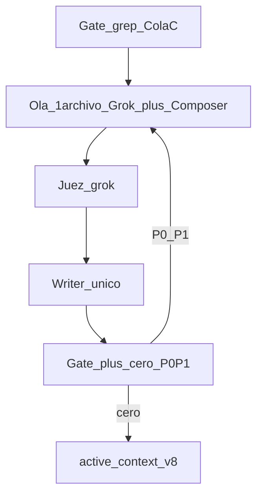

# Prompt meta — Auditoría forense pack Lanzamiento (metodología v8)

> **Versión:** 8.0 — 7 agosto 2026  
> **Repo:** `ZonixPharma-Backend`  
> **Alcance:** **Cola C** — Lanzamiento no-top + Pack md 08/12/14/16/18 + CRM Plan A + skills si gate hit  
> **Uso:** dual **Grok + Composer** por archivo → juez **grok** (heredado v7) → writer único. Hasta **3 loops** por archivo. Baseline v7 + Cola B aplicados. **No** reabrir Cola A PASS salvo gate fail.

**Relacionado:** mejora incremental → [PROMPT_MEJORAR_PACK_LANZAMIENTO.md](PROMPT_MEJORAR_PACK_LANZAMIENTO.md). Canon → [../Lanzamiento/MODELO_FINANCIERO_ZONIX_PHARMA.xlsx](../Lanzamiento/MODELO_FINANCIERO_ZONIX_PHARMA.xlsx) + skill `zonix-startup-context`.

**Patrón JARVIS:** `fan-out-synthesize-ops` + `parallel-judge-ops`. **No** Spec Kit. **No** GPT/Gemini/Kimi. **No** GLM (api_limit hasta cuota).

---

## §A — Misión

Auditoría forense **v8 / Cola C** alineada al Excel **v4**. Preferir **editar**; **borrar** solo docs obsoletos; **no inventar cifras**. Histórico (`AUDIT_*`, `docs/zonix/ANALISIS_*`): solo verificar banner; no reescribir cuerpo.



---

## §B — CANON_V4 (pegar íntegro a cada subagente)

| Ancla | Valor |
|-------|-------|
| SAFE Lean | **237.412** = Fase 0 **50.260** + burn **172.152** + reserva **15.000** |
| Caja Day-D | **187.152** |
| Equity @ cap 600k | **~39,57%** |
| Esc.1 Rev / Costos / FCF Y1 / cash M12 | **228.796 / 169.717 / +59.079 / 246.231** |
| BE FCF mensual | **M5** (FCF M1–M4 negativo; **no** profitable M1) |
| Activas M12 | **159** |
| Revenue M12 (esc.1) | **29.892** |
| Pricing B2B | cuota **45/60/70** + %GMV **8/7/5** |
| ARPF placeholder | **~52** (≠ Revenue÷activas; P&L = híbrido Excel) |
| CAC / LTV / LTV/CAC | **139** / **1.040** (52×20) / **~7,5x** |

**Prohibido como ask vigente:** 210.760 · 160.500 · 145.500 · 35,13% · 111.988 · 174.102 · 112k · 7.950 como M12 · 25/40/55 · 14/12/11 como esc.1 · profitable M1 · ARPF ~50 vigente · LTV 1.000 sin etiqueta legado · burn ~7.980 · Casi M12 · desgloses inventados.

Si falta dato → `[PENDIENTE FP&A]` + REGISTRO. **No inventar.**

---

## §C — Dual por archivo (workers)

| Rol | Modelo Task | Foco |
|-----|-------------|------|
| A | `cursor-grok-4.5-high` | Claims + tablas |
| B | `inherit` (Composer) | Narrativa cruzada / stale |
| C | omitido | GLM fuera por api_limit |

Si un modelo falla API → `{"error":"api_limit"}`; fusionar con JSON válidos (mín. 1 → orquestador self-audita).

```
> Roles: FP&A + fundraising / GTM + DD
> Skills: zonix-startup-context → zonix-financial-model (readonly)

CANON_V4: [pegar §B]

Archivo (único): <RUTA_ABSOLUTA>
Lee el archivo completo. No edites.
Si empieza con "Espejo Pack Aliado", marca hallazgos ya sync como stale:true.
Si es AUDIT_* / ANALISIS_FORENSE histórico: solo banner HISTÓRICO; no reescribir cuerpo.

Checklist:
1. Ask / Day-D / equity / Esc.1 / BE / M12 revenue 29.892 / ARPF / LTV / %GMV 8/7/5
2. Pipes rotos; texto truncado
3. “revenue = ARPF × activas” falso
4. Asks históricos sin marcar
5. Nómina Lean (CS 500; Contador+Abogado 330 incl. asesor; sin doble-cuenta)
6. Claims sin fuente

Salida SOLO JSON:
{
  "file": "...",
  "modelo": "grok|composer",
  "veredicto": "PASS|FAIL",
  "hallazgos": [
    {"sev":"P0|P1|P2","claim":"...","evidencia_linea":"...","fix_concreto":"...","stale":false}
  ],
  "borrar_si": null
}
```

Olas: **1 archivo** en paralelo (= 2 workers).

**Cola C:** INFORME_*, BARRA_*, APRENDIZAJE_500_*, DOCUMENTOS_SOLO_INVERSOR, MONTOS_*, GUIA_*, PROPUESTA_* restantes, SUPUESTO_*, CENSO_*, Pack md 08/12/14/16/18, CRM Plan A (Epakon/Casa212/ALGEN + ranking). Skills ancla solo si gate hit.

**No Cola C (skip salvo gate fail):** BRIEF, PROYECCION, UNIT, RESUMEN, Pack hot 01–07/09–11/13/15/17 ya remediados v7/B.

---

## §D — Juez fusión (grok)

Readonly. Recibe JSON A+B del mismo archivo. `juez_activo` = **grok**.

```json
{
  "juez_activo": "grok",
  "ranking_workers": [{"modelo":"...","score":0,"nota":"..."}],
  "veredicto": "PASS|FAIL",
  "hallazgos": [
    {"sev":"P0|P1","claim":"...","fix_concreto":"...","fuente_modelo":"..."}
  ]
}
```

Descarta stale/ruido/P2. Si ambos workers coinciden en P0 → prioridad alta. `[PENDIENTE FP&A]` consciente ≠ P0.

---

## §E — Writer único

- Aplicar solo P0/P1.
- Re-espejar Pack si cambia SoT.
- No inventar P10/P90 cash; no regenerar Pack `docx/` en v8.
- **Sin commit/push** sin OK founder.
- Máx. **3 loops** por archivo; tras loop 3 con P0 → listar bloqueo humano.

---

## §F — DoD

1. Grep Cola C limpio (salvo histórico etiquetado / `[PENDIENTE FP&A]` consciente).  
2. Cero P0/P1 abiertos del juez en archivos Cola C post-loops.  
3. `active_context` bloque **Forense v8 / Cola C**.  
4. Lista edit al founder.

---

## §G — Skills orquestador

```
> Roles: delivery + FP&A + technical writer
> Skills: jarvis-core → fan-out-synthesize-ops → zonix-startup-context → zonix-financial-model → parallel-judge-ops
```

---

## §H — Pega en Cursor

1. Adjuntar Excel v4 + este prompt + Cola C paths.  
2. Gate → olas Grok+Composer (1 archivo) → juez grok → writer → DoD.  
3. No contactar fondos. No inventar cifras. No reabrir Cola A PASS.
