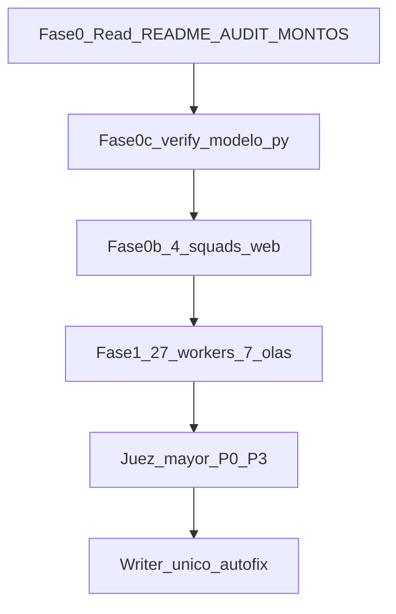
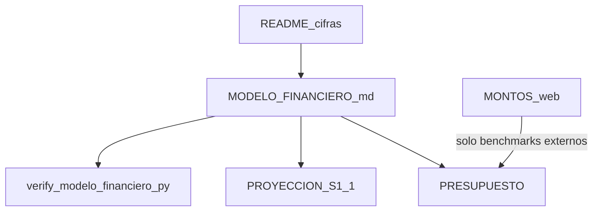

# Prompt meta — Auditoría forense pack Lanzamiento (27×1 + verify Excel + research web + juez mayor)

> **Versión:** 2.0 — junio 2026  
> **Repo:** `ZonixPharma-Backend`  
> **Destino:** `docs/Lanzamiento/` (+ `MONTOS_REFERENCIA_INTERNET.md`, informe `docs/AUDIT_FORENSE_PACK_LANZAMIENTO_*.md`)  
> **Uso:** copiar la sección **«Pega en Cursor»** (§J) en un chat nuevo. Adjuntar con `@` los archivos de §I.

**Relacionado:**

- Mejora incremental (sin fan-out masivo) → [PROMPT_MEJORAR_PACK_LANZAMIENTO.md](PROMPT_MEJORAR_PACK_LANZAMIENTO.md)
- Creación desde cero → [PROMPT_PACK_LANZAMIENTO_INVERSOR.md](PROMPT_PACK_LANZAMIENTO_INVERSOR.md)
- Pack vigente → [../Lanzamiento/README.md](../Lanzamiento/README.md)
- Modelo FP&A canon → [../Lanzamiento/MODELO_FINANCIERO_ZONIX_PHARMA.md](../Lanzamiento/MODELO_FINANCIERO_ZONIX_PHARMA.md) + `verify_modelo_financiero.py`
- Baseline auditoría → [../AUDIT_FORENSE_PACK_LANZAMIENTO_2026-06-22.md](../AUDIT_FORENSE_PACK_LANZAMIENTO_2026-06-22.md)
- Citas web canónicas → [../Lanzamiento/MONTOS_REFERENCIA_INTERNET.md](../Lanzamiento/MONTOS_REFERENCIA_INTERNET.md)

**Patrón JARVIS:** `fan-out-synthesize-ops` (olas + barrera + writer único) + `parallel-judge-ops` (juez mayor) + research web 2026 + verify Excel v3.8.2.

---

## §A — Misión

**Misión:** Auditoría forense **v3** del pack inversor Zonix Pharma en `docs/Lanzamiento/` (**27 archivos `.md`** en raíz).

| Fase | Qué hace | Quién |
|------|----------|--------|
| **0** | Leer README § cifras, AUDIT v2, MONTOS; bloquear anclas §C | Orquestador |
| **0c** | Ejecutar `verify_modelo_financiero.py` → `model_verify_json` | Orquestador (shell readonly) |
| **0b** | 4 squads research web (datos **2025–2026**) → `research_json` | 4× `generalPurpose` (sin editar repo) |
| **1** | 27 doc workers (1 archivo cada uno) cruzando `research_json` + `model_verify_json` | 27× `explore` readonly, **7 olas × máx. 4** |
| **2** | Juez mayor: fusionar, deduplicar, P0–P3, informe v3 | Orquestador |
| **3** | Autofix **full** (pack + MONTOS + REGISTRO), diff por archivo | **Un solo writer** (orquestador) |

**No** commit/push sin orden explícita del usuario.



---

## §B — Skills obligatorias (orquestador)

Declarar al inicio:

```
> Roles: delivery + PM inversor + technical writer
> Skills: jarvis-core → fan-out-synthesize-ops → zonix-lanzamiento-docs → zonix-startup-context → zonix-regulatory-ve + zonix-financial-model + zonix-empresa-ve → parallel-judge-ops (local)
```

Leer cada `SKILL.md` antes de lanzar workers.

**No usar Spec Kit** (`speckit-*`) para este pack — usar `zonix-lanzamiento-docs`.

**Nota:** si `zonix-startup-context` cita tiers **101k/118k/135k**, tratar como **stale** — priorizar README + MODELO (§C bis).

---

## §C — Anclas inmutables (no negociables)

Tomar de [README.md](../Lanzamiento/README.md) / [BRIEF](../Lanzamiento/BRIEF_UNA_PAGINA.md) / Excel **v3.9.3** [`MODELO_FINANCIERO_ZONIX_PHARMA.xlsx`](../Lanzamiento/MODELO_FINANCIERO_ZONIX_PHARMA.xlsx). Asks **~112k / ~174k** = `[OBSOLETO]`.

| Concepto | Lean (Excel) | Base | Growth |
|----------|--------------|------|--------|
| Capital pedido (TOTAL SAFE) | **USD 210.760** *(≈211k)* | **~USD 157.268** *(≈157k hist.)* | **~USD 187.478** *(≈187k hist.)* |
| SAFE cap post-money | **600.000** | **~912.814** | **~1.205.345** |
| Equity ref. | **~35,13%** | **~17,23%** | **~15,55%** |
| Burn prom. mensual | **~12.125** | **~10.898** *(hist.)* | **~12.698** *(hist.)* |
| Burn M1–M12 | **145.500** | — | — |
| Reserva | **15.000** | — | — |
| Fase 0 outflow | **50.260** | (ver PRESUPUESTO) | (ver PRESUPUESTO) |
| Caja Day-D (T+90) | **160.500** | — | — |
| Cash M12 P50 | **`[PENDIENTE FP&A]`** | — | — |
| ARPF ref. | **~50 USD** | idem | idem |
| Farmacias M12 ref. | **~159** *(curva legado)* | idem | idem |
| Tests backend | **443+** (jun 2026) — verificar con `php artisan test`, no inventar | | |

| Regla transversal | Valor |
|-------------------|-------|
| Producto pitch | **solo Zonix Pharma**; Corral X solo en CV/VOLCADO |
| Marcadores | `[PENDIENTE]`, `[VERIFICAR]`, `[PENDIENTE abogado]` = válidos; no borrar sin evidencia |
| Blitz tier | **~185k** capital — no confundir con Growth (~187k) |

**Research web:** puede actualizar **MONTOS** y notas en **PRESUPUESTO**; **no** altera PROYECCION §1.1 ni tiers sin OK usuario (ver §M).

---

## §C bis — Jerarquía de verdad numérica

Orden obligatorio para orquestador y workers financieros:

| Prioridad | Fuente | Uso |
|-----------|--------|-----|
| 1 | `README.md` § cifras | Anclas pitch inversor |
| 2 | `MODELO_FINANCIERO_ZONIX_PHARMA.md` + salida `verify_modelo_financiero.py` | Canon FP&A v3.8.2 |
| 3 | `PROYECCION_FINANCIERA_12M.md` §1.1 | Debe cuadrar con modelo |
| 4 | `MONTOS_REFERENCIA_INTERNET.md` | Citas web; **no** recalcula tiers |
| Deprecado | `zonix-startup-context` si dice 101/118/135 | Reportar P1 «skill stale» |



**Cascada autofix** si cambia una ancla (solo con OK usuario): README → BRIEF → MENSAJE → CHECKLIST → UNIT → PROYECCION → PRESUPUESTO → MODELO.md.

---

## §C.0c — Fase verify Excel (antes de olas doc)

**No** auditar `.xlsx` con worker `explore`. Usar script de verificación:

```bash
cd docs/Lanzamiento/_tools
.venv/bin/python3 verify_modelo_financiero.py
```

El orquestador captura stdout y construye `model_verify_json` compartido con workers financieros y README/CHECKLIST/BRIEF/MENSAJE:

```json
{
  "model_version": "v3.8.2",
  "verified_at": "2026-06-XX",
  "anchors": {
    "safe_lean": 111988,
    "fase0_lean": 33835,
    "day_d_lean": 78153,
    "burn_y1_lean": 97290,
    "cash_m12_p50": 40831,
    "burn_avg_lean": 8108
  },
  "verify_exit_code": 0,
  "checks_passed": ["ESTA layout compacto", "..."],
  "notes": "Resumen de líneas OK/fail del script"
}
```

**Workers que reciben `model_verify_json`:** README, BRIEF, MENSAJE, CHECKLIST, PROYECCION, PRESUPUESTO, UNIT_ECONOMICS, MODELO_FINANCIERO_ZONIX_PHARMA.md.

---

## §D — Inventario 27 archivos + skill + squad research + olas

Validado con `glob` en `docs/Lanzamiento/*.md` (jun 2026).

| # | Archivo | Skill worker | Squad | Ola |
|---|---------|--------------|-------|-----|
| 1 | README.md | zonix-lanzamiento-docs | R3 + verify | 1 |
| 2 | BRIEF_UNA_PAGINA.md | zonix-fundraising-narrative | R3 + verify | 1 |
| 3 | PROYECCION_FINANCIERA_12M.md | zonix-financial-model | R1+R2+verify | 1 |
| 4 | UNIT_ECONOMICS.md | zonix-financial-model | R1+R3 | 1 |
| 5 | PRESUPUESTO_12_MESES_REFERENCIA.md | zonix-financial-model | R1+R2+verify | 2 |
| 6 | MONTOS_REFERENCIA_INTERNET.md | zonix-financial-model | R1+R2+R3+R4 | 2 |
| 7 | MODELO_FINANCIERO_ZONIX_PHARMA.md | zonix-financial-model | R1+R2+verify | 2 |
| 8 | CHECKLIST_PRE_INVERSOR.md | zonix-investor-materials | R4 + verify | 2 |
| 9 | MENSAJE_ENVIO_Y_BULLETS_INVERSIONISTA.md | zonix-fundraising-narrative | R3 + verify | 3 |
| 10 | VOLCADO_RESPUESTAS_CUESTIONARIO.md | zonix-lanzamiento-docs | — | 3 |
| 11 | REGISTRO_PENDIENTES_PACK.md | zonix-investor-materials | todos | 3 |
| 12 | PERFIL_MERCADO_PILOTO.md | zonix-launch-piloto | R3 | 3 |
| 13 | PLAN_LANZAMIENTO_COMERCIAL.md | zonix-launch-piloto | R1+R3 | 4 |
| 14 | GUIA_DISCOVERY_CALLE_FASE0.md | zonix-b2b-sales | R1 | 4 |
| 15 | SUPUESTO_MARKETING_OFFLINE.md | zonix-lanzamiento-docs | R1+R3 | 4 |
| 16 | PLAN_METODOS_PAGO.md | zonix-payments | R1+R4 | 4 |
| 17 | PLAN_MODULO_OPERATIVO_CLAVE.md | zonix-lanzamiento-docs | R2+R4 | 5 |
| 18 | ESTRUCTURA_LEGAL_Y_EQUITY.md | zonix-empresa-ve | R4 | 5 |
| 19 | ALINEACION_LANZAMIENTO_VS_PRODUCTO_2026-05.md | zonix-lanzamiento-docs | R2 | 5 |
| 20 | CONTEXTO_PITCH_Y_DECISIONES.md | zonix-startup-context | R3 | 5 |
| 21 | PROPUESTA_VALOR_USUARIO_FINAL.md | zonix-lanzamiento-docs + zonix-regulatory-ve | R3 | 6 |
| 22 | PROPUESTA_VALOR_CLIENTE_B2B.md | zonix-b2b-sales | R3 | 6 |
| 23 | PROPUESTA_VALOR_TERCER_LADO.md | zonix-lanzamiento-docs | R3 | 6 |
| 24 | BANCO_PROBLEMAS_NECESIDADES_FARMACIA.md | zonix-b2b-sales | R3 | 6 |
| 25 | CUESTIONARIO_EQUIPO_PILOTO.md | zonix-lanzamiento-docs | R1 | 7 |
| 26 | CENSO_FARMACIAS_CARABOBO_FASE0.md | zonix-b2b-sales + zonix-launch-piloto | R3 | 7 |
| 27 | RESUMEN_ALIADO_GABRIEL_BARRIOS.md | zonix-lanzamiento-docs | — | 7 |

**Reglas de olas:**

- Máximo **4** workers `Task` por mensaje (barrera entre olas).
- Ola 7 = archivos 25–27 + **slot reserva** re-run workers con JSON inválido.
- Subagentes `explore` = **readonly**, **sin internet**.
- Worker **#27:** verificar que README no lo cuente como canónico obligatorio del zip inversor (anexo outreach).

**Resumen olas:**

| Ola | Archivos (#) |
|-----|----------------|
| 1 | 1–4 |
| 2 | 5–8 |
| 3 | 9–12 |
| 4 | 13–16 |
| 5 | 17–20 |
| 6 | 21–24 |
| 7 | 25–27 + re-run |

---

## §E — Plantilla prompt por doc worker

Sustituir `{FILE}`, `{SKILL}`, `{SQUAD}`, `{RESEARCH_JSON_SNIPPET}`, `{MODEL_VERIFY_SNIPPET}` (vacío si no aplica).

```markdown
Eres el auditor forense **exclusivo** de `docs/Lanzamiento/{FILE}`.

**Alcance:** Solo audita `{FILE}`. Puedes leer README.md y REGISTRO_PENDIENTES_PACK.md para contexto. NO audites otros docs.

**Skills:** {SKILL} + zonix-startup-context (contrastar anclas con README §C, no con skill si diverge).

**Input research (squad {SQUAD}):**
{RESEARCH_JSON_SNIPPET}

**Input modelo (si aplica):**
{MODEL_VERIFY_SNIPPET}

**Rúbrica (12 criterios, 0–2 cada uno → score_total 0–24):**
1. Exactitud numérica vs anclas README §C
2. Coherencia interna (fechas, nombres, roles)
3. Coherencia cross-ref (links, "ver doc X")
4. Completitud vs CHECKLIST / REGISTRO
5. Tono inversor (sin hype, sin claims médicos ilegales)
6. Regulatorio VE (MPPS/INHRR/Rx) — lens zonix-regulatory-ve
7. Anti-patrones Eats / CorralX mezclados en pitch de producto
8. Placeholders y [PENDIENTE] bien usados
9. Accionabilidad (¿founder sabe qué hacer?)
10. Delta vs AUDIT_FORENSE_PACK_LANZAMIENTO_2026-06-22 (regresión o nuevo)
11. Actualidad web 2026 — ¿fuentes/costos vigentes vs research_json? ¿falta fila en MONTOS?
12. Coherencia modelo v3.8.2 — vs model_verify_json + MODELO.md (docs financieros, README, BRIEF, MENSAJE, CHECKLIST)

**Salida OBLIGATORIA (JSON válido, sin markdown fence extra):**
{
  "file": "{FILE}",
  "score_total": 0,
  "findings": [
    {
      "id": "F1",
      "severity": "P0|P1|P2|P3",
      "type": "error|incoherence|gap|style|regression|web_stale|web_missing|model_conflict|tier_stale",
      "line_ref": "§ o línea aprox",
      "claim": "...",
      "evidence": "...",
      "fix_proposal": "texto sugerido o acción",
      "cross_docs": ["otro.md"]
    }
  ],
  "missing_sections": [],
  "web_gaps": [
    {
      "topic": "...",
      "suggested_source_query": "...",
      "pack_gap": "doc/sección que falta"
    }
  ],
  "model_conflicts": [
    {
      "field": "safe_lean|fase0|day_d|burn|cash_m12",
      "doc_value": "...",
      "canon_value": "111988",
      "source": "verify|README|MODELO.md"
    }
  ],
  "strengths": []
}

**Prohibido:** inventar cifras, marcar OK sin cita, editar archivos, sustituir PROYECCION §1.1 con datos web, usar tiers 101k/118k/135k como canon.
```

**Parámetros Task:** `subagent_type=explore`, `readonly=true`, `run_in_background=false`.

---

## §F — Juez mayor (orquestador, post-barrera olas 1–7)

1. Recibir **4× `research_json`** + **`model_verify_json`** + **27× JSON** doc workers.
2. **Fusionar** hallazgos web + doc + modelo; deduplicar (mismo costo en MONTOS + PRESUPUESTO + MODELO = 1 finding maestro con `cross_docs`).
3. **Resolver conflictos** (worker A OK vs worker B P0) → re-lectura puntual del orquestador.
4. **Matriz P0–P3:**
   - **P0:** cifra contradictoria vs §C, tiers viejos 101/118/135 en BRIEF/CHECKLIST/MENSAJE, claim falso, link roto crítico, dato legal inventado, fuente web obsoleta >12 meses sin `[VERIFICAR]`, verify script falló
   - **P1:** incoherencia cross-doc material, gap due diligence, costo operativo desactualizado vs mercado 2026, skill startup-context stale
   - **P2:** copy, formato, claridad, fila MONTOS sin fecha consulta
   - **P3:** nice-to-have
5. Comparar con [AUDIT_FORENSE_PACK_LANZAMIENTO_2026-06-22.md](../AUDIT_FORENSE_PACK_LANZAMIENTO_2026-06-22.md) **y** delta post-modelo v3.8.2: marcar **regresiones v3**.
6. Emitir `docs/AUDIT_FORENSE_PACK_LANZAMIENTO_2026-06-{fecha}.md`:
   - Resumen ejecutivo (5 bullets)
   - Tabla findings maestros (id, severity, files, fix)
   - Score por archivo (27 filas)
   - Lotes autofix (A=P0 … D=P3)
   - **Anexo Research 2026:** URL, fecha consulta, dato, acción
   - **Anexo Migración tiers:** docs que aún citen **101k / 112k / 174k** como vigente → flag `[OBSOLETO]` vs Excel **210.760**
7. Descartar datos web sin URL, sin fecha o de foros anónimos (`parallel-judge-ops`: real vs ruido).

---

## §G — Autofix full (writer único)

Tras informe juez y **antes de commit**:

1. Solo el **orquestador** edita archivos — no workers.
2. Aplicar fixes **P0 → P1 → P2 → P3**; respetar anclas §C y jerarquía §C bis.
3. Actualizar `REGISTRO_PENDIENTES_PACK.md` para fixes documentales; **no** cerrar pendientes humanos (RIF, abogado) sin evidencia.
4. Actualizar `MONTOS_REFERENCIA_INTERNET.md`: nuevas filas, `Última actualización` jun 2026, marcar filas stale. Si implica partida presupuestaria → nota en PRESUPUESTO **sin** alterar totales PROYECCION.
5. Gaps sin evidencia → fila REGISTRO `[VERIFICAR web 2026-Q2]`.
6. Mostrar **diff por archivo** al usuario.
7. **No** commit/push hasta OK explícito.
8. Si >10 edits o >5 filas MONTOS nuevas → segunda pasada juez (delta post-fix).

---

## §H — Verificación post-autofix

- Grep anti-regresión tiers viejos: `101.000`, `118.000`, `135.000`, `7.559`, `28.057`, `72.943`, `42.209` — **P0** si aparecen en BRIEF/CHECKLIST/MENSAJE/README sin contexto histórico explícito
- Grep legacy: `399` tests, `24 documento`, `25 archivos` (debe ser **27** `.md` o conteo README vigente)
- `php artisan test` — contar passed vs claim en pack
- `flutter test` si el pack cita Front
- Re-ejecutar `verify_modelo_financiero.py` si se tocó MODELO.md o generador
- Spot-check: 3 URLs de MONTOS con fetch (no rotas)
- Informe final: sección **Metodología v3** (0c verify, squads, 27 olas, autofix lotes)

---

## §L — Fase Research Web 2026 (4 squads, **después** de 0c, **antes** olas doc)

**Objetivo:** datos externos actuales (preferir **2025–2026**) para validar, completar o marcar obsoleto lo del pack.

| Squad | ID | Skills | Queries obligatorias (mínimo) | Docs impactados |
|-------|-----|--------|------------------------------|-----------------|
| Macro VE | R1 | zonix-financial-model, zonix-empresa-ve | BCV inflación 2026; salario Dev junior VE USD; alquiler comercial San Diego/Naguanagua; tipo cambio; **constitución C.A. Valencia 2026**; notaría/registro mercantil Carabobo | PRESUPUESTO, MONTOS §2–3–5–6, CUESTIONARIO, CENSO |
| SaaS / Infra | R2 | zonix-financial-model | Pusher pricing; Firebase Blaze + **Phone Auth SMS VE**; VPS Laravel; Workspace; GitHub Team; Maps — **pricing oficial** | MONTOS §4, PLAN_MODULO, ALINEACION, MODELO |
| Mercado / Competencia | R3 | zonix-launch-piloto, zonix-regulatory-ve | TAM pharma VE Cifar/IQVIA 2025–2026; **censo farmacias Carabobo** (validar CENSO doc); Farmatodo/Locatel digital; delivery Rx terceros; Meta Ads CPM VE | PERFIL_MERCADO, BRIEF, propuestas valor, BANCO_PROBLEMAS, **CENSO_FARMACIAS** |
| Regulatorio / Legal | R4 | zonix-regulatory-ve, zonix-legal-contracts-ve, zonix-empresa-ve | MPPS/INHRR **receta digital**; datos salud VE; **e-commerce farmacéutico**; **Pago Móvil comisiones BDV 2026**; SAFE LatAm 2026 (lente, no dictamen) | CHECKLIST, ESTRUCTURA_LEGAL, PLAN_METODOS_PAGO, PLAN_MODULO |

**Lanzamiento:** 4× `Task` en **un solo mensaje**, `subagent_type=generalPurpose`, instrucción **no editar repo**, usar `WebSearch` + `WebFetch`.

**Plantilla squad:**

```markdown
Investiga en web **solo** el dominio {SQUAD_ID} para Zonix Pharma (marketplace farmacéutico VE, piloto Valencia).

1. Lee `docs/Lanzamiento/MONTOS_REFERENCIA_INTERNET.md` (secciones relevantes) + docs impactados — solo lectura.
2. WebSearch/WebFetch: mínimo **5 fuentes** con URL (oficial > prensa sector > estimado etiquetado).
3. Contrasta pack vs web: ok | stale | missing | conflict.
4. **No** recalcular PROYECCION. Propón filas MONTOS o [VERIFICAR].

Salida research_json:
{
  "squad": "{SQUAD_ID}",
  "consulted_at": "2026-06-XX",
  "findings": [
    {
      "claim": "...",
      "value": "...",
      "unit": "USD|%|count",
      "source_url": "https://...",
      "source_date": "YYYY-MM",
      "confidence": "high|medium|low",
      "pack_status": "ok|stale|missing|conflict",
      "pack_files": ["MONTOS_REFERENCIA_INTERNET.md"],
      "action": "update_montos|add_registro|note_only"
    }
  ],
  "new_topics_not_in_pack": [
    {
      "topic": "...",
      "why_it_matters": "...",
      "suggested_doc": "MONTOS|REGISTRO|CHECKLIST|CENSO|new_section"
    }
  ]
}
```

**Prioridad fuentes:** BCV, MPPS, INHRR, Cifar, pricing oficial SaaS, Computrabajo/Indeed VE, Banca y Negocios / El Nacional (economía).

**Gaps típicos a buscar si no están en pack:**

- SMS Firebase / Phone Auth costo VE 2026
- Comisiones Pago Móvil / transferencia BDV 2026
- Competidores digitales pharma VE (Farmatodo app, Locatel online, terceros delivery Rx)
- Habilitación comercio electrónico farmacéutico VE → `[PENDIENTE abogado]`
- Seguro responsabilidad / errores dispensación marketplace
- Tarifas notaría / registro mercantil Carabobo 2026
- Densidad farmacias San Diego / Naguanagua vs hipótesis censo Fase 0

---

## §I — Referencias @ (adjuntar al chat)

```
@ZonixPharma-Backend/docs/Lanzamiento/
@ZonixPharma-Backend/docs/Lanzamiento/README.md
@ZonixPharma-Backend/docs/Lanzamiento/MODELO_FINANCIERO_ZONIX_PHARMA.md
@ZonixPharma-Backend/docs/Lanzamiento/MONTOS_REFERENCIA_INTERNET.md
@ZonixPharma-Backend/docs/Lanzamiento/CENSO_FARMACIAS_CARABOBO_FASE0.md
@ZonixPharma-Backend/docs/Lanzamiento/REGISTRO_PENDIENTES_PACK.md
@ZonixPharma-Backend/docs/Lanzamiento/_tools/verify_modelo_financiero.py
@ZonixPharma-Backend/docs/AUDIT_FORENSE_PACK_LANZAMIENTO_2026-06-22.md
@ZonixPharma-Backend/docs/PLAN_REGULATORIO_PHARMA_VE.md
@ZonixPharma-Backend/docs/plantillas/PROMPT_AUDIT_FORENSE_PACK_LANZAMIENTO.md
@ZonixPharma-Backend/.agents/skills/zonix-lanzamiento-docs/SKILL.md
@ZonixPharma-Backend/.agents/skills/zonix-startup-context/SKILL.md
@ZonixPharma-Backend/AGENTS.md
```

---

## §J — Pega en Cursor (one-liner + procedimiento)

Copia desde aquí:

---

**Auditoría forense v3 pack Lanzamiento Zonix Pharma**

Ejecuta [docs/plantillas/PROMPT_AUDIT_FORENSE_PACK_LANZAMIENTO.md](PROMPT_AUDIT_FORENSE_PACK_LANZAMIENTO.md) completo (§A–§M) — **versión 2.0**.

**Secuencia obligatoria:**

1. Fase 0 — Leer README § cifras, AUDIT 2026-06-22, MONTOS; declarar Roles + Skills §B.
2. Fase 0c — Ejecutar `verify_modelo_financiero.py` → `model_verify_json` §C.0c.
3. Fase 0b — 4 squads research web (R1–R4) en paralelo → 4× `research_json` §L.
4. Fase 1 — **27** doc workers §E en **7 olas** §D (máx. 4 Task/mensaje); pasar snippet research + model_verify donde aplique.
5. Fase 2 — Juez mayor §F → informe `AUDIT_FORENSE_PACK_LANZAMIENTO_2026-06-{hoy}.md`.
6. Fase 3 — Autofix full §G (pack + MONTOS + REGISTRO) → diff por archivo.
7. Verificación §H.

**One-liner:**

```
Auditoría forense pack Lanzamiento: PROMPT_AUDIT_FORENSE — verify Excel v3.9.3 + anclas Lean **210.760** / Fase 0 **50.260** / Day-D **160.500** / burn **145.500** / equity **~35,13%**. Base/Growth hist. ~157k/~187k. Cash M12 `[PENDIENTE FP&A]`. Sin commit.
```

**Reglas:**

- Anclas §C — Lean **210.760** / Base·Growth **hist.**; no inventar cash M12 ni regenerar §1.1 sin OK.
- Autofix full con diff; **sin commit/push**.
- Delta vs AUDIT 2026-07-26 + sync Excel; asks **112k / 174k** = `[OBSOLETO]`.
- Producto pitch = solo Zonix Pharma.

**Primera acción:** Fase 0c verify, luego Fase 0b — 4 squads research en un mensaje. Luego ola 1 doc workers.

---

## §K — Anti-patrones

- Un solo agente leyendo los 27 archivos (viola fan-out)
- 27 workers editando en paralelo (viola writer único)
- Recalcular PROYECCION §1.1 o tiers SAFE desde web
- Usar anclas **101/118/135** del prompt v1.0 o `zonix-startup-context` sin contrastar README
- Auditar `.xlsx` con worker explore (usar verify + MODELO.md)
- Ignorar `CENSO_FARMACIAS` o `MODELO_FINANCIERO` en conteo pack
- Usar Spec Kit para Lanzamiento
- Cerrar `[PENDIENTE abogado]` con paráfrasis web
- Dato web sin URL / sin fecha / blog anónimo
- Duplicar research en 27 doc workers (solo 4 squads centralizados)
- Subagente `explore` para research web (no tiene internet — usar `generalPurpose`)

---

## §M — Reglas research vs modelo financiero

| Permitido | Prohibido sin OK usuario |
|-----------|---------------------------|
| Actualizar fila MONTOS + URL + fecha consulta | Cambiar PROYECCION §1.1 Lean/Base/Growth |
| Nota "benchmark web 2026" en PRESUPUESTO | Cambiar tiers **210.760 / ~157k hist. / ~187k hist.** |
| `[VERIFICAR web 2026-Q2]` en REGISTRO | Cerrar pendiente legal con texto web |
| Nueva sección en MONTOS, CHECKLIST o CENSO | Dictamen MPPS/INHRR como verdad legal |
| `new_topics_not_in_pack` en informe juez | Inventar K-factor o tracción piloto |
| Citar salida verify como canon Excel | Regenerar xlsx sin OK usuario |

---

*Generado por JARVIS — plantilla auditoría forense v2.0 pack Lanzamiento Zonix Pharma (27 workers + verify v3.8.2).*
